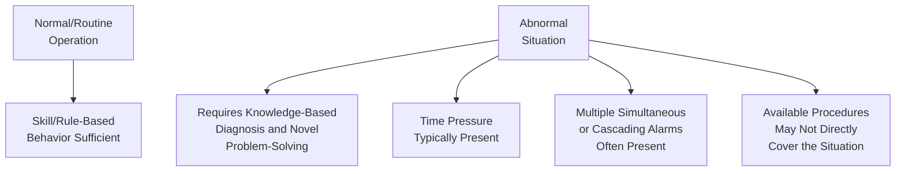
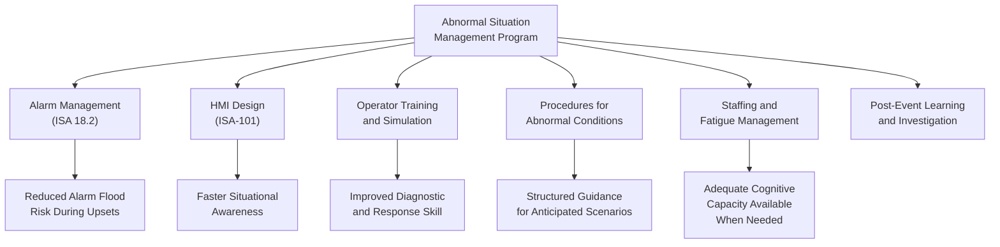
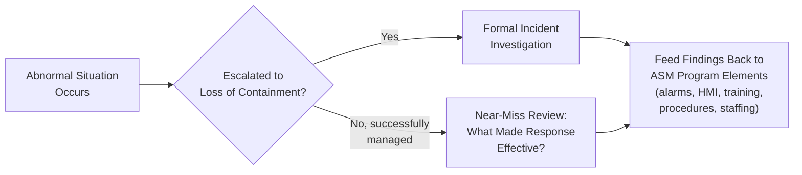
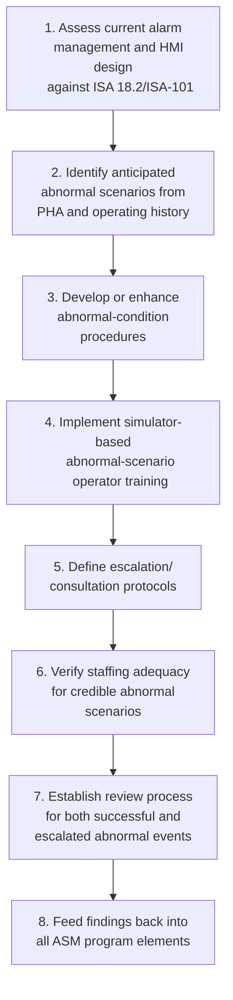

## Abnormal Situation Management

### Purpose and Scope

Abnormal Situation Management (ASM) addresses the specific challenge of supporting operators in detecting, diagnosing, and responding to process upsets that fall outside routine, well-rehearsed operating conditions — precisely the knowledge-based decision-making scenarios (see human error taxonomy) most vulnerable to human error and most consequential to major accident prevention. ASM synthesizes the human factors, alarm management, and HMI design topics addressed elsewhere in this chapter into a unified operational discipline, since an abnormal situation is where all of these performance-shaping factors converge simultaneously and interact.

**Key Points**

- An abnormal situation is defined not merely by equipment malfunction, but by any deviation from normal operation that requires operator diagnosis and intervention beyond routine procedure — including situations where equipment is functioning correctly but operating conditions have drifted outside expected parameters.
- ASM is a management discipline, not a single tool or technology; it draws together alarm management, HMI design, operator training, procedures, and staffing into a coordinated approach specifically targeting abnormal-condition performance.
- The ASM Consortium's published industry research has been foundational to much of the alarm management and HMI design guidance referenced elsewhere in this chapter (ISA 18.2, ISA-101), reflecting the close interdependence of these topics.

---

### Defining the Abnormal Situation

#### Characteristics Distinguishing Abnormal from Routine Operation

- **Not simply "equipment failure"**: an abnormal situation can arise from a genuine equipment malfunction, a process disturbance with no equipment failure, a human action producing an unintended process state, or an external disturbance (utility loss, weather event) — the common feature is that the situation is not addressed by the operator's routine, well-rehearsed rule-based responses.
- **Cognitive demand shift**: referencing the SRK framework (see human error taxonomy), abnormal situations characteristically push the operator from efficient skill/rule-based performance into more effortful, error-prone knowledge-based reasoning, often under time pressure and with incomplete information.
- **Escalation potential**: an abnormal situation not correctly diagnosed and addressed within available time can escalate toward loss of containment, making the quality of ASM support directly consequential to major accident prevention rather than merely an operational efficiency concern.

---

### The ASM Consortium and Its Core Findings

The Abnormal Situation Management Consortium, a long-running industry research collaborative, has substantially shaped process industry understanding of why abnormal situations are disproportionately associated with major incidents and what interventions improve operator performance during them.

#### Commonly Cited Foundational Findings (General Themes)

| Theme | General Finding |
| --- | --- |
| Alarm floods during upsets | Poorly rationalized alarm systems characteristically produce alarm floods precisely during the abnormal situations when clear guidance is most needed, overwhelming operator diagnostic capacity |
| HMI limitations | Traditional, data-dense, low-hierarchy HMI graphics were found to impede rather than support rapid situational awareness during developing abnormal conditions |
| Operator diagnostic burden | Operators are frequently expected to diagnose complex, multi-variable abnormal conditions with limited decision support, relying heavily on individual experience and pattern recognition |
| Time-criticality mismatch | The time available for correct diagnosis and response in many abnormal scenarios is short relative to the cognitive demands the situation places on the operator |

[Unverified] This reference presents general thematic findings commonly associated with ASM Consortium research; the Consortium has published extensive detailed research across many specific studies, and readers seeking specific statistics, study methodologies, or citations should consult ASM Consortium publications directly, as this reference does not reproduce specific figures or study-level findings.

---

### Integrated Elements of an ASM Program

ASM is best understood as the coordinated application of several distinct disciplines toward the shared goal of abnormal-condition performance, rather than a standalone technique.

#### Alarm Management Contribution

A well-rationalized alarm system with effective flood-reduction techniques (state-based alarming, consequential suppression, first-out indication — see alarm management lifecycle) directly reduces the diagnostic burden an abnormal situation places on the operator, allowing attention to focus on the root-cause alarm rather than an overwhelming cascade of consequential alarms.

#### HMI Design Contribution

High-performance HMI design (see control room and HMI design) supports rapid situational awareness specifically because its graphic hierarchy and color discipline are built around highlighting deviation from normal, which is exactly the information an operator needs first when an abnormal situation begins developing.

#### Operator Training and Simulation

- **Scenario-based simulator training**: because abnormal situations by definition fall outside routine operation, operators cannot develop diagnostic proficiency through normal operating experience alone; dynamic process simulators allowing practice with realistic abnormal scenarios (including rare, high-consequence scenarios an operator might otherwise never personally experience) are a widely used and recommended training approach.
- **Training on recognizing situation types not covered by procedure**: since not every abnormal situation can be anticipated by a written procedure, training should also address general diagnostic skills and escalation/consultation practices for situations the operator has not specifically encountered before.

#### Procedures for Abnormal Conditions

- **Distinguishing normal, abnormal, and emergency procedures**: a mature operating procedure system typically includes not only normal startup/shutdown/routine procedures, but also documented guidance for anticipated abnormal scenarios identified through PHA and operating experience, reducing reliance on pure knowledge-based improvisation for situations that have occurred before or were foreseen.
- **Procedure usability under stress**: procedures intended for use during an abnormal situation should be designed for rapid reference under time pressure (clear step sequencing, decision points, and escalation criteria), recognizing that a procedure difficult to navigate quickly provides limited practical value during an actual developing emergency.

#### Staffing and Fatigue Management Contribution

As addressed in fatigue, shift work, and staffing levels, adequate staffing and fatigue management ensure the cognitive capacity assumed necessary for effective abnormal situation response is actually available when an abnormal situation occurs, rather than being degraded by chronic understaffing-driven overtime or circadian-low-point night shift timing.

---

### Operator Decision Support During Abnormal Situations

#### Structured Diagnostic Approaches

Beyond individual experience-based pattern recognition, some organizations implement structured diagnostic aids intended to support more systematic abnormal-condition diagnosis:

| Approach | Description |
| --- | --- |
| Decision-support checklists | Pre-defined diagnostic question sequences for common categories of abnormal condition, helping structure the operator's diagnostic process |
| Model-based/advisory systems | Software tools that analyze current process data against expected models to suggest likely root causes or recommended actions |
| Escalation/consultation protocols | Clearly defined criteria and contacts for when an operator should escalate to a supervisor, engineer, or other resource rather than continuing to diagnose alone |

[Inference] The appropriate balance between structured decision-support tools and operator judgment/experience is an active area of ongoing human factors and control-systems engineering development; a decision-support tool that is itself poorly designed, produces excessive false guidance, or is not trusted by operators can add to rather than reduce diagnostic burden, so tool selection and design should be evaluated carefully against the specific process context rather than adopted as a generic solution.

---

### Post-Event Learning from Abnormal Situations

#### Near-Miss and Abnormal-Event Review as ASM Input

Every abnormal situation successfully managed without escalation to loss of containment represents a valuable learning opportunity, not merely a routine operational event to be logged and forgotten.

- **Learning from successful management, not only failures**: reviewing abnormal situations that were successfully managed (asking what made the response effective — clear alarms, effective HMI, adequate training, sufficient staffing) provides valuable positive reinforcement data for ASM program elements, complementing the failure-focused lens of formal incident investigation.
- **Feeding findings back into all ASM elements**: consistent with the loop-closure principle described for audits, incidents, and hazard analyses, findings from abnormal-situation review should be explicitly routed back into alarm rationalization, HMI design, training content, procedures, and staffing assessment, rather than remaining isolated observations.

---

### Common Pitfalls

- **Treating ASM as purely a technology purchase**: acquiring an advisory/decision-support software tool without also addressing alarm rationalization, HMI design, training, and staffing tends to produce limited improvement, since ASM effectiveness depends on the coordinated interaction of all these elements, not any single technology.
- **Training only on routine operation**: an operator training program focused primarily on normal startup/shutdown/routine tasks, without dedicated abnormal-scenario simulator practice, leaves diagnostic skill development to real, uncontrolled abnormal events — a foreseeably risky way to build this specific competency.
- **No structured escalation protocol**: leaving the decision to escalate or consult during a developing abnormal situation entirely to individual operator judgment, without defined criteria, can result in delayed escalation particularly under time pressure or when an operator is reluctant to request help.
- **Learning only from failures**: reviewing only abnormal situations that escalated to an actual incident, while ignoring successfully managed abnormal situations, forfeits valuable positive-outcome learning data about what ASM program elements are actually working well.
- **Procedures not designed for time-critical use**: an abnormal-condition procedure that is lengthy, poorly organized, or requires extensive interpretation provides limited practical support during an actual time-pressured situation, regardless of its technical completeness.
- **Ignoring the compounding interaction of ASM elements**: addressing alarm management, HMI design, and training as entirely separate initiatives, without recognizing how a weakness in one area (e.g., poor staffing) can undermine the benefit of strength in another (e.g., excellent HMI design), misses the integrated nature of effective ASM.

---

### Regulatory and Standards Context

- **No single regulatory element named "Abnormal Situation Management"**: OSHA PSM and EPA RMP do not contain a distinct regulatory element by this name; ASM is addressed indirectly through the combination of PHA, operating procedures, training, and the alarm/HMI-specific standards (ISA 18.2, ISA-101) referenced elsewhere in this chapter.
- **ASM Consortium**: the primary industry research body specifically focused on this topic; its publications inform much of the alarm management and HMI design guidance embedded in current consensus standards.
- **CCPS guidance**: addresses abnormal situation management principles within its broader human factors and operating procedures guidance, generally reinforcing the integrated, multi-element approach described here.
- [Unverified] Specific CSB or other incident investigation findings attributing a major incident specifically and primarily to inadequate abnormal situation management (as distinct from a specific contributing factor like alarm flood or fatigue) should be reviewed in the particular published investigation report rather than generalized, as most published findings address specific contributing factors rather than "ASM" as a single named causal category.

---

### Implementation Roadmap

**Next Steps**

- Assess current alarm management and HMI design maturity as foundational ASM inputs
- Identify anticipated abnormal scenarios from PHA findings and operating history to inform procedure and training development
- Implement or expand simulator-based training specifically targeting abnormal-scenario diagnosis and response
- Define clear escalation and consultation protocols for situations exceeding individual operator diagnostic capacity
- Establish a review mechanism capturing lessons from both successfully managed and escalated abnormal situations

**Related Topics**

- Alarm Management Lifecycle per ISA 18.2
- Alarm Rationalization and Alarm Philosophy Documents
- Control Room and Human-Machine Interface Design
- Human Error Taxonomy in Process Operations
- Fatigue, Shift Work, and Staffing Levels
- Closing the Loop Between Audits, Incidents, and Hazard Analyses
- Simulator-Based Operator Training for Abnormal Situations