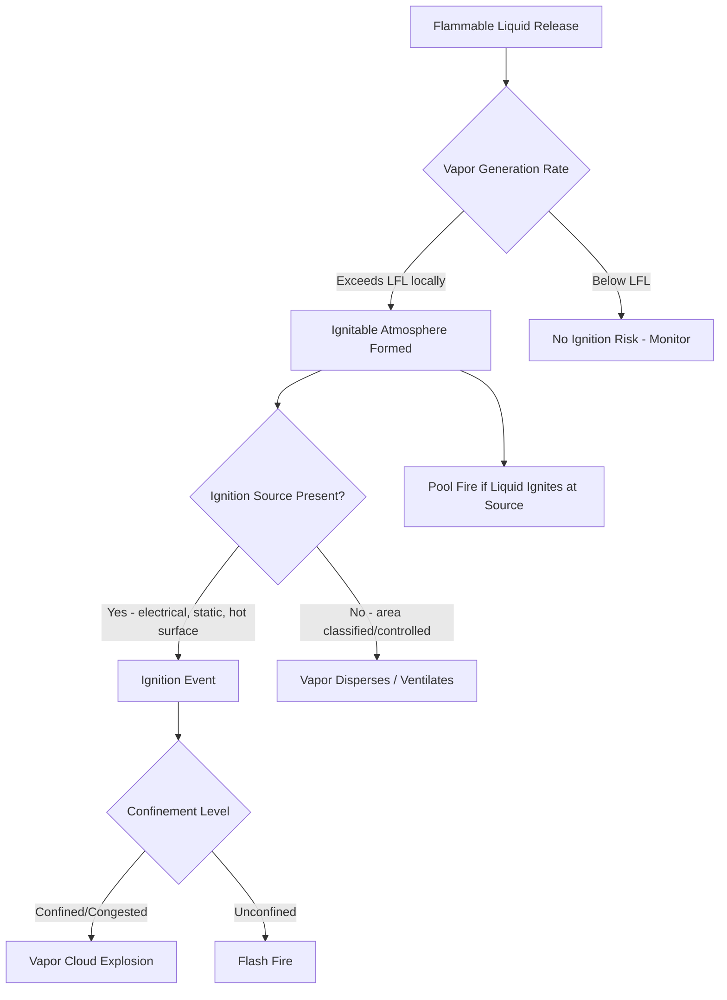

## Flammable and Combustible Liquid Hazards

### Definitions and Classification

**Flammable liquid**: a liquid with a flash point below $37.8°C$ (100°F) and a vapor pressure not exceeding 2068.6 mm Hg (40 psia) at $37.8°C$, per OSHA 29 CFR 1910.106 (legacy) and the current OSHA Hazard Communication-aligned scheme under 1910.1200 (GHS).

**Combustible liquid**: a liquid with a flash point at or above $37.8°C$ (100°F).

**NFPA 30 classification system** (the primary consensus standard referenced by PSM programs):

| Class | Category | Flash Point | Example |
| --- | --- | --- | --- |
| IA | Flammable | < $22.8°C$ and boiling point < $37.8°C$ | Ethylene oxide, pentane |
| IB | Flammable | < $22.8°C$ and boiling point ≥ $37.8°C$ | Gasoline, acetone |
| IC | Flammable | ≥ $22.8°C$ and < $37.8°C$ | Xylene, styrene |
| II | Combustible | ≥ $37.8°C$ and < $60°C$ | Diesel, kerosene |
| IIIA | Combustible | ≥ $60°C$ and < $93°C$ | Fuel oil |
| IIIB | Combustible | ≥ $93°C$ | Lubricating oils |

OSHA's HazCom 2012 (GHS) reclassifies these under Flammable Liquid Categories 1–4, which do not map one-to-one onto NFPA classes — Category 1 is more restrictive than old Class IA. [Inference: exact category boundary values should be cross-checked against the current 29 CFR 1910.1200 Appendix B text when used for regulatory determinations, since GHS revisions have shifted numeric thresholds across editions.]

### Key Physical and Chemical Properties Governing Hazard

**Flash point**: lowest temperature at which a liquid gives off enough vapor to form an ignitable mixture with air near its surface. Determined by closed-cup (ASTM D93, D56) or open-cup methods; closed-cup values are lower and are the regulatory standard because they exclude vapor loss to the surrounding atmosphere.

**Autoignition temperature (AIT)**: temperature at which a substance ignites spontaneously without an external ignition source, in the absence of spark or flame. AIT is unrelated to flash point in magnitude and must be evaluated separately, particularly for hot-surface ignition scenarios (steam lines, exhaust manifolds, heater elements).

**Flammable (explosive) range**: bounded by the Lower Flammable Limit (LFL) and Upper Flammable Limit (UFL), expressed in vol% in air. Below LFL: too lean to burn. Above UFL: too rich to burn. Between LFL and UFL: ignitable.

$$\text{LFL} < \text{Vapor Concentration} < \text{UFL} \implies \text{Ignitable Mixture}$$

**Vapor density**: relative to air (air = 1). Most flammable hydrocarbon vapors have vapor density > 1 and accumulate in low points — pits, trenches, sumps, basements — creating persistent ignitable atmospheres long after a release event.

**Vapor pressure**: higher vapor pressure at ambient temperature increases the rate of vapor generation and the likelihood that the liquid's surface concentration exceeds LFL.

**Boiling point**: influences flash behavior in pressurized/refrigerated storage — liquids stored above their atmospheric boiling point present flash-fire and BLEVE-adjacent concerns on containment loss.

### Ignition Sources Relevant to PSM

- Electrical equipment not rated for the applicable Area Classification (arcs, sparks)
- Static electricity accumulation and discharge (bonding/grounding failures during transfer operations)
- Hot surfaces (steam lines, exhaust, mechanical friction, bearing failures)
- Open flames (welding, cutting, pilot lights)
- Mechanical sparks (grinding, impact tools, tramp metal)
- Chemical reactions generating localized heat (self-heating, pyrophoric contamination)
- Lightning strikes on atmospheric storage tanks

### Area Classification (Hazardous Locations)

Governed by NFPA 70 (NEC) Article 500/505 and API RP 500/505 for petroleum facilities.

**Class I** locations: flammable gases or vapors may be present.

- **Division 1**: ignitable concentrations exist under normal operating conditions.
- **Division 2**: ignitable concentrations exist only under abnormal conditions (equipment failure, accidental release).

**Zone system** (IEC/API RP 505, increasingly harmonized with NEC):

- **Zone 0**: ignitable atmosphere present continuously or for long periods.
- **Zone 1**: likely to occur during normal operation.
- **Zone 2**: not likely, and if it occurs, only briefly.

Electrical equipment, instrumentation, and non-sparking tools within classified areas must carry ratings appropriate to the zone/division and the gas group (e.g., Group D for most petroleum vapors, Group C for higher-hazard materials such as ethylene).

### Storage and Handling Hazards

**Atmospheric storage tanks** (NFPA 30, API 650/620):

- Overfill during receipt operations — leading cause of major tank incidents (e.g., Buncefield 2005)
- Vapor space breathing losses through normal thermal cycling, releasing vapors near PV vents
- Internal floating roof seal degradation permitting vapor accumulation in the rim space
- Static discharge during high-velocity filling ("splash filling"), particularly with low-conductivity products

**Piping and transfer operations**:

- Loading/unloading of tank trucks and railcars — bonding and grounding required per NFPA 77
- Flange and valve packing leaks at low points
- Hose failures during tanker transfer

**Process equipment**:

- Pump seal failures (mechanical seal flashing, dry-running)
- Relief valve discharge to atmosphere without adequate dispersion modeling
- Heat exchanger tube failures introducing hot fluid into flammable service, or vice versa

**Drum and container storage**:

- Inadequate segregation from ignition sources and incompatible materials
- Improper bonding during drum-to-drum or drum-to-tank transfers

### Fire and Explosion Phenomena

**Pool fire**: sustained combustion over a liquid pool surface; radiant heat flux is the primary hazard to adjacent equipment and personnel, calculable via solid flame or point-source models.

**Flash fire**: rapid combustion of a vapor cloud without significant overpressure; short duration but high thermal exposure to anyone within the flammable envelope.

**Vapor Cloud Explosion (VCE)**: occurs when a flammable vapor cloud ignites within a congested or confined area, generating a flame front that accelerates enough to produce damaging overpressure. Congestion (piping racks, equipment, structural steel) is the dominant driver of overpressure severity — not just cloud size.

**BLEVE (Boiling Liquid Expanding Vapor Explosion)**: applicable to pressurized flammable liquids (e.g., LPG) where vessel failure under fire exposure causes near-instantaneous flash vaporization and fireball formation. Less directly relevant to atmospheric flammable liquids but a critical consideration where liquids are stored above their atmospheric boiling point.

**Boilover**: phenomenon in crude oil and heavy fuel tank fires where a water layer beneath the fuel superheats and violently ejects burning product; a key consideration in tank farm emergency response planning.

### Consequence Modeling Considerations

Typical PSM-driven consequence analyses for flammable liquids evaluate:

- Thermal radiation contours (kW/m²) for pool and flash fires
- Overpressure contours (psi) for VCE scenarios using TNT-equivalent, Multi-Energy, or Baker-Strehlow-Tang methods
- Vapor dispersion modeling (Gaussian, dense-gas models) to establish LFL and toxic endpoint distances

[Unverified: specific numeric threshold distances and consequence values are facility- and scenario-dependent and cannot be generalized without site-specific modeling inputs such as release rate, wind speed/stability class, and congestion factors.]

### Process Safety Management Controls

**Inherently Safer Design**:

- Substitution with higher flash point materials where process chemistry permits
- Minimization of flammable liquid inventory
- Moderation via dilution, refrigeration, or reduced storage temperature

**Engineering controls**:

- Grounding and bonding systems on all transfer connections
- Explosion-proof/intrinsically safe electrical equipment matched to area classification
- Inert gas blanketing (nitrogen padding) on tanks handling Class I liquids
- Vapor recovery units on loading racks
- Secondary containment (dikes, berms) sized per NFPA 30 volume requirements
- Fire and gas detection systems tied to emergency isolation

**Administrative controls**:

- Hot work permitting with combustible gas monitoring
- Static electricity control procedures for tank gauging and sampling
- Housekeeping standards to prevent flammable liquid accumulation
- Management of Change (MOC) review for any modification affecting flammable service

**Mechanical integrity**:

- Tank and piping inspection per API 653 (tanks) and API 570 (piping)
- Relief system design per API 520/521 to prevent overpressure release of flammable liquids

### Regulatory and Standards Framework

- **OSHA 29 CFR 1910.106**: Flammable liquids (legacy standard, largely superseded by HazCom alignment but still referenced for storage/handling requirements)
- **OSHA 29 CFR 1910.119**: Process Safety Management of Highly Hazardous Chemicals — applies when flammable liquids are held in a process above threshold quantities (10,000 lb for flammable liquids/gases as a Process, per Appendix A criteria)
- **NFPA 30**: Flammable and Combustible Liquids Code — the primary consensus design/storage standard
- **NFPA 77**: Recommended Practice on Static Electricity
- **API RP 2003**: Protection Against Ignitions Arising Out of Static, Lightning, and Stray Currents
- **API 650/620/653**: Atmospheric storage tank design, and in-service inspection

### Example: Hazard Scenario Walkthrough

A gasoline (Class IB) tank truck unloading operation without proper bonding: as product flows through the hose, charge separation generates static electricity on the liquid and truck shell. If the truck is not bonded to the receiving tank and grounded, potential difference builds until a spark discharges across the fill connection gap. Because the vapor space above a partially filled gasoline tank sits within the flammable range during most of the transfer, this spark provides sufficient ignition energy, resulting in a flash fire or explosion within the tank vapor space. NFPA 77-compliant bonding cable, connected before hose connection and disconnected only after hose removal, eliminates the potential difference that drives the discharge.

### Related Topics

- Static Electricity Hazards and Bonding/Grounding Design
- Vapor Cloud Explosion Consequence Modeling
- Hazardous Area Classification (NEC Article 500 vs. IEC Zone System)
- Atmospheric Storage Tank Design and Overfill Protection (API 650/2350)
- Relief System Design for Flammable Liquid Overpressure (API 520/521)
- Boilover Mechanisms in Crude and Heavy Fuel Storage
- Inherently Safer Design Principles for Flammable Inventories
- Hot Work Permitting and Combustible Gas Monitoring Programs