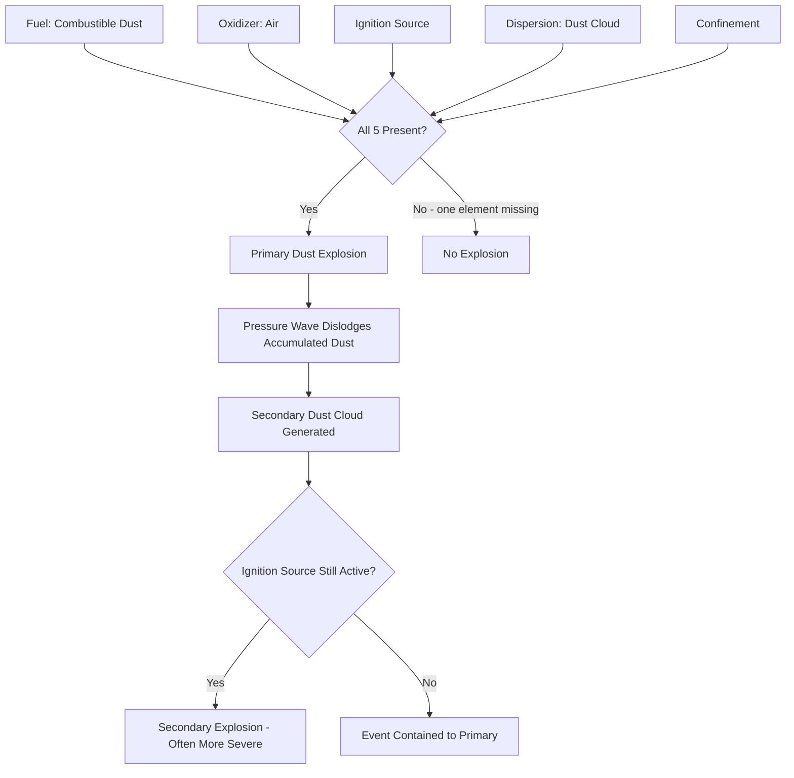

## Combustible Dust Explosion Hazards

### Definitions and Fundamental Concepts

**Combustible dust**: a finely divided combustible particulate solid that presents a flash-fire or explosion hazard when suspended in air (or another oxidizing medium) at appropriate concentration and particle size, per NFPA 652 (Standard on the Fundamentals of Combustible Dust).

**Combustible particulate solid**: NFPA 652's broader term encompassing dusts, fibers, flakes, and other finely divided solids capable of combustion, regardless of particle size — used to close gaps left by older, narrower "dust" definitions.

For an explosion to occur, all five elements of the **Dust Explosion Pentagon** must be present simultaneously:

1. Combustible dust (fuel)
2. Oxidizer (typically ambient air)
3. Ignition source
4. Dispersion of dust particles into a cloud at ignitable concentration
5. Confinement of the dust cloud

Removing any single element prevents explosion, though fire (requiring only the first three) remains possible. This distinguishes the pentagon from the simpler fire triangle and is foundational to dust hazard mitigation strategy.

### Primary vs. Secondary Explosions

**Primary explosion**: the initial, often localized, ignition of a dust cloud within process equipment (a mill, dust collector, silo, or conveying duct).

**Secondary explosion**: the pressure wave and turbulence from the primary event dislodges accumulated dust layers on floors, beams, ledges, and equipment surfaces throughout the facility, creating a much larger dust cloud in open building volumes. If ignition sources persist, the secondary explosion is frequently far more destructive than the primary event and is the dominant cause of fatalities in major dust explosion incidents. Housekeeping to prevent dust layer accumulation is therefore one of the single most effective controls against catastrophic escalation.

### Materials Prone to Combustible Dust Hazards

- Agricultural products: grain, sugar, flour, starch, feed
- Metals: aluminum, magnesium, titanium, zinc (many metal dusts also present explosion hazards in inert atmospheres or on contact with water/fire suppression agents)
- Coal and carbonaceous materials: coal dust, coke
- Plastics and resins: many thermoplastic and thermoset dusts
- Wood products: sawdust, wood flour
- Pharmaceuticals and chemicals: many organic intermediates and APIs in powder form
- Rubber and textile fibers/flock

[Inference: whether a specific material presents a combustible dust hazard is particle-size- and process-dependent — even materials not intuitively "flammable" in bulk form (e.g., many metals, some food products) can be explosible when reduced to fine particulate; hazard determination requires testing, not assumption from bulk material properties.]

### Key Parameters from Dust Testing

Dust explosibility characteristics are established via standardized testing (ASTM E1226, ASTM E1515, ASTM E2019) typically performed in a 20-liter or 1 m³ closed test vessel.

**$K_{St}$ (deflagration index)**: normalizes the maximum rate of pressure rise to a standard vessel volume, used to classify dust explosion severity into St classes:

$$K_{St} = \left(\frac{dP}{dt}\right)_{max} \cdot V^{1/3}$$

| Dust Class | $K_{St}$ (bar·m/s) | Severity |
| --- | --- | --- |
| St 0 | 0 | Non-explosible |
| St 1 | 1–200 | Weak to moderate |
| St 2 | 201–300 | Strong |
| St 3 | > 300 | Very strong |

**$P_{max}$**: maximum explosion pressure achieved in the closed test vessel, typically in the range of 7–10 bar(g) for most organic dusts, used for explosion vent and containment design.

**Minimum Explosible Concentration (MEC)**: lowest dust concentration (mass/volume) capable of propagating a deflagration, analogous to LFL for gases.

**Minimum Ignition Energy (MIE)**: lowest spark energy capable of igniting a dispersed dust cloud; many fine organic and metal dusts have MIE values low enough to be ignited by electrostatic discharge from an ungrounded person or poorly bonded equipment.

**Minimum Ignition Temperature (MIT)**: for both dust cloud (suspended) and dust layer (accumulated) conditions — layer MIT is typically lower than cloud MIT and governs hot-surface ignition risk from equipment such as bearings, motors, and heated dryer surfaces.

**Limiting Oxygen Concentration (LOC)**: oxygen level below which the atmosphere cannot support combustion, foundational to inerting system design.

### Ignition Sources Specific to Dust-Handling Processes

- Mechanical sparks from tramp metal entering size-reduction equipment (hammer mills, pulverizers)
- Friction and overheating in bearings, belts, and mechanical conveying equipment
- Static electricity discharge, particularly in pneumatic conveying systems and during bulk bag (FIBC) filling/emptying
- Smoldering "hot particles" or embers carried from upstream thermal processes (dryers, driers, thermal oxidizers)
- Self-heating and spontaneous combustion within dust accumulations or silos (relevant to materials prone to oxidative self-heating)
- Electrical equipment not rated for Class II (dust) hazardous locations
- Welding, cutting, and other hot work performed without adequate dust removal

### Hazardous Locations for Combustible Dust

Per NFPA 70 (NEC) Article 500/506:

**Class II** locations: combustible dust may be present.

- **Division 1**: combustible dust is present in the air under normal operating conditions in ignitable quantities, or dust layers exist that could become dangerous concentrations if disturbed
- **Division 2**: dust is not normally suspended in ignitable concentrations but may accumulate on/around equipment

Zone-based alternative under NEC Article 506: Zone 20/21/22, aligned with IEC 60079-10-2, increasingly used in facilities harmonizing with international dust classification practice.

### High-Hazard Equipment and Locations

- Dust collectors (baghouses, cartridge collectors) — among the most frequent explosion origin points due to concentrated dust clouds during normal filtration/cleaning cycles
- Bucket elevators — confined, vertically extended geometry promotes flame propagation
- Pneumatic conveying systems — high dust loading and velocity increase static generation
- Silos and storage bins — dust layer accumulation and potential for smoldering nests
- Size-reduction equipment (grinders, mills, pulverizers) — mechanical ignition source proximity to fuel
- Mixers, blenders, and dryers — thermal and mechanical energy input to dust-laden atmospheres
- Bag dump stations and bulk bag (FIBC) discharge points — manual material handling with dust generation

### Engineering Controls and Mitigation Strategies

**Prevention (avoiding ignition)**:

- Elimination or control of ignition sources (grounding/bonding, spark detection and extinguishing systems, magnetic/metal separation upstream of mills)
- Inerting (nitrogen or other inert gas) to maintain oxygen below LOC in enclosed process equipment
- Minimizing dust cloud formation through process design and local exhaust ventilation

**Protection (limiting consequences when ignition occurs)**:

- **Explosion venting** (NFPA 68): engineered vent panels sized to relieve deflagration pressure before vessel rupture, directing the vent discharge to a safe location
- **Explosion suppression** (NFPA 69): rapid detection and injection of suppressant to extinguish the developing flame front before damaging pressure develops
- **Explosion isolation**: chemical isolation, flap valves, or rotary valves preventing flame/pressure propagation between interconnected vessels via ducting
- **Containment**: designing equipment to withstand $P_{max}$ without venting, appropriate for small enclosed volumes

**Housekeeping (NFPA 652/654)**:

- Establishing and enforcing dust layer depth thresholds (commonly referenced guidance suggests action when accumulation exceeds approximately 1/32 inch over a significant area, though facility-specific Dust Hazard Analysis findings govern actual limits)
- Scheduled cleaning using methods that do not generate dust clouds (vacuum systems rated for combustible dust, rather than compressed air blow-down)
- Elimination of horizontal ledges, open equipment, and other dust-collecting surfaces in facility design

### Dust Hazard Analysis (DHA)

NFPA 652 mandates a facility-wide Dust Hazard Analysis for any facility handling combustible particulate solids, functionally analogous to a Process Hazard Analysis under OSHA PSM but scoped specifically to dust/fire/explosion hazards. A DHA must:

- Identify and characterize all combustible dust hazards throughout the facility, including areas outside the immediate process (dust collection, conveying, storage)
- Be based on dust testing data (or conservative default values where testing has not been performed)
- Be reviewed and updated on a defined cycle (NFPA 652 specifies a five-year revalidation cycle) or upon process change
- Document existing safeguards and identify gaps requiring additional mitigation

### Regulatory and Standards Framework

- **OSHA 29 CFR 1910.119 (PSM)**: applies where combustible dust processes meet Highly Hazardous Chemical process criteria, though OSHA has historically enforced combustible dust primarily via the General Duty Clause (Section 5(a)(1)) in the absence of a dedicated OSHA combustible dust standard
- **NFPA 652**: Standard on the Fundamentals of Combustible Dust — the overarching standard requiring DHA and referencing commodity-specific codes
- **NFPA 654**: Standard for the Prevention of Fire and Dust Explosions from Combustible Particulate Solids (general industry)
- **NFPA 61**: Agricultural and food processing facilities
- **NFPA 484**: Combustible metals
- **NFPA 664**: Wood processing and woodworking facilities
- **NFPA 68**: Explosion venting design
- **NFPA 69**: Explosion prevention systems (inerting, suppression, isolation)
- **NFPA 70**: National Electrical Code, Class II hazardous location requirements

[Unverified: OSHA has periodically pursued a dedicated Combustible Dust standard through rulemaking; current enforcement posture and rulemaking status should be verified against OSHA's current regulatory agenda rather than assumed static, as this area has shifted across different rulemaking cycles.]

### Illustrative SVG: Dust Explosion Pentagon

<svg xmlns="http://www.w3.org/2000/svg" viewBox="0 0 500 480">
<text x="250" y="30" font-size="18" font-weight="bold" text-anchor="middle" fill="#1a1a1a">Dust Explosion Pentagon (svg_diagram)</text>
<polygon points="250,60 393,163 340,330 160,330 107,163" fill="none" stroke="#b34700" stroke-width="3" />
<circle cx="250" cy="60" r="34" fill="#ffe0cc" stroke="#b34700" stroke-width="2" />
<text x="250" y="65" font-size="13" text-anchor="middle" fill="#1a1a1a">Fuel</text>
<circle cx="393" cy="163" r="34" fill="#ffe0cc" stroke="#b34700" stroke-width="2" />
<text x="393" y="160" font-size="12" text-anchor="middle" fill="#1a1a1a">Oxidizer</text>
<text x="393" y="174" font-size="12" text-anchor="middle" fill="#1a1a1a">(Air)</text>
<circle cx="340" cy="330" r="34" fill="#ffe0cc" stroke="#b34700" stroke-width="2" />
<text x="340" y="327" font-size="12" text-anchor="middle" fill="#1a1a1a">Ignition</text>
<text x="340" y="341" font-size="12" text-anchor="middle" fill="#1a1a1a">Source</text>
<circle cx="160" cy="330" r="34" fill="#ffe0cc" stroke="#b34700" stroke-width="2" />
<text x="160" y="327" font-size="12" text-anchor="middle" fill="#1a1a1a">Dispersion</text>
<text x="160" y="341" font-size="12" text-anchor="middle" fill="#1a1a1a">(Cloud)</text>
<circle cx="107" cy="163" r="34" fill="#ffe0cc" stroke="#b34700" stroke-width="2" />
<text x="107" y="160" font-size="12" text-anchor="middle" fill="#1a1a1a">Confine-</text>
<text x="107" y="174" font-size="12" text-anchor="middle" fill="#1a1a1a">ment</text>
<text x="250" y="420" font-size="13" text-anchor="middle" fill="#333333">All five elements required simultaneously for explosion.</text>
<text x="250" y="440" font-size="13" text-anchor="middle" fill="#333333">Removing any one element prevents propagation.</text>
</svg>

### Example: Incident Mechanism Walkthrough

A sugar processing facility's bucket elevator experiences a bearing failure, generating localized frictional heat sufficient to smolder accumulated sugar dust inside the enclosed elevator casing (fuel + ignition source + confinement already present). Normal operation continuously disperses fine sugar dust within the casing (dispersion + oxidizer). The smoldering nest flashes into a primary deflagration inside the elevator leg. The resulting pressure wave ruptures ducting connections and propagates into the adjoining processing building, dislodging years of accumulated dust layers on overhead beams and equipment (secondary fuel + dispersion). Because flame and burning particulate from the primary event remain present, this newly formed room-scale dust cloud ignites in a secondary explosion — consistent with the mechanism documented in major historical sugar refinery dust explosion investigations. This sequence underscores why NFPA 652/654 housekeeping and elevator-specific explosion protection (venting/isolation) are treated as core, non-negotiable safeguards rather than optional enhancements.

### Related Topics

- Dust Hazard Analysis (DHA) Methodology and Documentation
- Explosion Venting Design per NFPA 68
- Explosion Suppression and Chemical Isolation Systems (NFPA 69)
- Inerting System Design and Oxygen Monitoring
- Combustible Metal Dust Hazards (NFPA 484) and Water-Reactive Considerations
- Static Electricity Control in Pneumatic Conveying and FIBC Handling
- Housekeeping Program Design for Combustible Dust Facilities
- Bucket Elevator and Dust Collector Explosion Protection Design