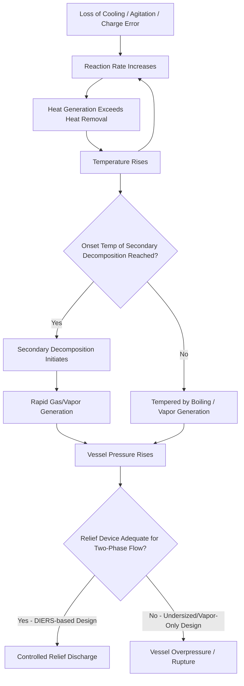

## Reactive Chemical and Runaway Reaction Hazards

### Definitions and Fundamental Concepts

**Reactive chemical hazard**: the potential for a chemical or mixture of chemicals to release energy or generate hazardous products through an unintended, uncontrolled, or unanticipated chemical reaction, including self-reaction, decomposition, polymerization, or reaction with another material, water, or air.

**Runaway reaction**: a condition in which the rate of heat generation from an exothermic reaction exceeds the rate of heat removal from the system, causing temperature and reaction rate to escalate in a positive feedback loop, potentially leading to vessel overpressure, relief device activation, or catastrophic vessel failure.

The core physical relationship driving runaway is the **Arrhenius dependence of reaction rate on temperature**:

$$k = A \cdot e^{-E_a/RT}$$

Because reaction rate increases exponentially with temperature while cooling capacity (typically governed by a fixed heat transfer area and coefficient) increases only linearly or not at all with temperature, any perturbation that outpaces the cooling system's capacity can self-accelerate. This exponential-vs-linear mismatch is the fundamental mechanism behind thermal runaway across nearly all exothermic reaction systems.

### Types of Reactive Hazards

**Desired reaction runaway**: the intended process reaction itself proceeds faster than designed due to loss of cooling, agitation failure, charge addition errors, or catalyst overcharge.

**Secondary/decomposition reactions**: once a runaway raises temperature sufficiently, the reaction mass may reach the onset temperature of an entirely separate, often more energetic, decomposition reaction pathway not part of the intended chemistry — frequently the dominant contributor to peak pressure and temperature in serious incidents.

**Incompatible material reactions**: unintended mixing of chemically incompatible substances (e.g., oxidizers with reducers, acids with cyanide-bearing materials releasing HCN gas, water with reactive metals or acid chlorides) due to contamination, mischarging, or cross-connection.

**Polymerization hazards**: uncontrolled exothermic polymerization of monomers (e.g., styrene, acrylates, vinyl acetate) due to inhibitor depletion, contamination, or loss of temperature control during storage or processing.

**Self-reactive/unstable materials**: substances that can decompose or react even without contact with another material, including organic peroxides, self-heating substances, and materials sensitive to shock, friction, or contamination (Class 4 hazard materials under UN/DOT classification).

**Pyrophoric materials**: substances that ignite spontaneously on contact with air, presenting reactive hazard concerns independent of an external heat source.

### Key Thermal Hazard Parameters

**Onset temperature ($T_{onset}$)**: the lowest temperature at which a detectable exothermic reaction begins, typically determined via calorimetric screening (DSC — Differential Scanning Calorimetry).

**Adiabatic temperature rise ($\Delta T_{ad}$)**: the temperature increase that would occur if all reaction heat were retained with no heat loss to surroundings — establishes the worst-case severity ceiling for a given reaction mass.

$$\Delta T_{ad} = \frac{-\Delta H_{rxn}}{C_p}$$

**Time to Maximum Rate (TMR)**: the time required, from a given starting temperature, for a self-heating reaction to reach its maximum rate under adiabatic conditions — critical for establishing safe storage/holding times and emergency response windows.

**$TMR_{ad}$ at 24 hours** is a commonly referenced criterion (from adiabatic calorimetry, e.g., Accelerating Rate Calorimetry/ARC) for establishing the maximum safe storage temperature ($T_{D24}$) of a self-reactive material — the temperature at which TMR equals 24 hours.

**Self-Accelerating Decomposition Temperature (SADT)**: the lowest ambient temperature at which a substance in its packaging as shipped will undergo self-accelerating decomposition, used extensively in the classification and transport of organic peroxides.

**Heat of reaction ($\Delta H_{rxn}$)**: total energy released per mole or unit mass of reactant; determines overall energy available to drive temperature and pressure escalation.

### Calorimetric Screening Techniques

| Technique | Scale | Primary Use |
| --- | --- | --- |
| DSC (Differential Scanning Calorimetry) | mg | Initial screening for exothermic onset and heat of reaction |
| ARC (Accelerating Rate Calorimetry) | g | Adiabatic self-heating rate, TMR determination, near-adiabatic pressure data |
| RC1 (Reaction Calorimetry) | 0.5–2 L | Process-scale heat flow measurement under controlled (non-adiabatic) conditions, mimics actual process conditions |
| VSP2 (Vent Sizing Package) | ~100 mL | Adiabatic testing designed specifically to generate data for emergency relief system sizing (DIERS methodology) |

[Inference: selection among these techniques in practice depends on the specific hazard question being answered — screening vs. relief sizing vs. process heat management — and a comprehensive reactive hazard evaluation typically layers multiple methods rather than relying on a single test.]

### DIERS Methodology and Two-Phase Flow

The **Design Institute for Emergency Relief Systems (DIERS)**, established following major runaway reaction incidents in the 1970s–80s, developed the standard methodology for sizing emergency relief systems on reactive systems. Key DIERS contributions include:

- Recognition that many runaway reactions produce **two-phase (vapor-liquid) flow** through the relief device rather than vapor-only flow, substantially affecting required relief vent area
- The **Leung method** and related analytical approaches for sizing relief devices based on tempered vs. gassy vs. hybrid reaction system behavior
- Distinguishing **tempered systems** (where vapor generation absorbs reaction heat, self-limiting temperature rise) from **gassy systems** (where non-condensable gas generation drives pressure independent of temperature) and **hybrid systems** exhibiting both behaviors

Relief sizing methodology is codified in **API 520/521** and **AIChE/CCPS/DIERS guidance**, and runaway-specific relief design without adiabatic calorimetry data (e.g., VSP2 testing) is widely regarded within the process safety community as a significant technical gap in relief system adequacy for reactive services.

### Common Root Causes in Reactive Incidents

- Charging errors: wrong material, wrong quantity, wrong sequence, or wrong rate of addition
- Loss of cooling: cooling water failure, jacket fouling, agitator failure preventing adequate heat transfer
- Loss of agitation: leading to localized hot spots and delayed heat release ("accumulation" hazard) followed by sudden bulk reaction
- Contamination: introduction of catalytic impurities, incompatible materials, or moisture
- Inhibitor depletion: in monomer storage, from inadequate inhibitor concentration, oxygen depletion (for oxygen-dependent inhibitors), or extended storage duration
- Scale-up deviations: reaction behavior characterized at lab scale not translating predictably to plant scale due to differences in surface-area-to-volume ratio and mixing time
- Deviation from established temperature or addition-rate procedures without reactive hazard re-evaluation

### The "Accumulation" Hazard

A particularly insidious scenario in semi-batch reactions: if agitation fails or heat removal is inadequate during reactant addition, unreacted material can **accumulate** in the vessel without immediately reacting (e.g., due to poor mixing or being below reaction temperature in a stratified layer). If agitation or heating is later restored, the accumulated unreacted charge can react essentially all at once, releasing energy far faster than the cooling system — sized for the intended steady incremental addition rate — can absorb. This mechanism has been identified as a contributing factor in numerous historical batch reactor incidents and is a specific focus area of reactive hazard evaluations for semi-batch processes.

### Reactive Hazard Evaluation Framework

A structured reactive chemicals review, consistent with CCPS (Center for Chemical Process Safety) guidance, typically proceeds through:

1. **Chemical inventory and interaction matrix**: systematic screening of all chemicals present (including raw materials, intermediates, products, cleaning agents, and potential contaminants) for binary and multi-component incompatibilities
2. **Literature and structure-based screening**: use of tools such as CHETAH (ASTM computer program for chemical thermodynamic and energy release evaluation) to flag structurally reactive functional groups
3. **Calorimetric testing**: DSC screening followed by ARC/RC1/VSP2 testing as warranted by screening results
4. **Process hazard analysis integration**: reactive hazard findings feed directly into PHA (HAZOP, What-If) deviation analysis, particularly for deviations such as "more temperature," "loss of cooling," and "wrong material charged"
5. **Relief system adequacy review**: verifying that emergency relief devices are sized using reaction-specific data (not generic vapor-only sizing) for any vessel handling potentially runaway-capable chemistry

### Engineering and Administrative Controls

**Prevention**:

- Redundant/independent cooling systems for high-hazard exothermic reactors
- Automated interlocks preventing continued reactant addition on loss of agitation or cooling
- Temperature and pressure high-high alarms independent of the basic process control system (BPCS), feeding a Safety Instrumented System (SIS) per IEC 61511/ISA 84
- Inhibitor monitoring and replenishment programs for monomer storage
- Rigorous material verification (positive material identification) prior to charging

**Mitigation**:

- Emergency relief systems sized per DIERS/API 520-521 methodology, accounting for two-phase flow where applicable
- Emergency quench or dump systems capable of rapidly adding inhibitor, diluent, or cooling to arrest a developing runaway
- Containment and scrubbing systems for relief discharge, sized for the worst-case two-phase/multiphase release composition

**Management systems**:

- Reactive chemicals hazard review as a defined element of Process Hazard Analysis programs (explicitly identified as a PSM/RMP focus area following incidents such as the 2008 T2 Laboratories runaway decomposition explosion)
- Management of Change review for any alteration to reaction chemistry, charge quantities, temperatures, or addition rates/sequences
- Operator training emphasizing recognition of early runaway indicators (unexpected temperature or pressure trends) and defined response procedures

### Regulatory and Standards Framework

- **OSHA 29 CFR 1910.119 (PSM)**: reactive hazards are addressed within Process Hazard Analysis requirements; OSHA has issued specific guidance emphasizing reactive chemical hazards following major incidents
- **EPA Risk Management Program (40 CFR 68)**: parallel reactive hazard consideration for covered processes
- **CCPS Guidelines for Chemical Reactivity Evaluation and Application to Process Design**: primary industry technical reference
- **CSB (U.S. Chemical Safety Board) investigations**: multiple major investigations (T2 Laboratories 2008, Bayer CropScience 2008, MFG Chemical 2004) have specifically driven industry and regulatory focus on reactive hazard evaluation gaps
- **API 520/521**: pressure relief system sizing, selection, and installation, including reactive system considerations
- **NFPA 400/430**: hazardous materials and organic peroxide storage code requirements

### Example: Runaway Scenario Walkthrough

A batch reactor is charged with monomer and initiator for an exothermic polymerization. Cooling water flow to the reactor jacket is interrupted due to an undetected valve failure, but the temperature control loop briefly masks the deviation by opening the control valve further, exhausting its control range. As jacket cooling capacity falls below the heat generation rate of the ongoing reaction, the reaction mass temperature begins to climb. Because reaction rate follows the Arrhenius relationship, the rate of heat generation accelerates faster than the now-fixed (and inadequate) cooling capacity can respond. Temperature crosses the onset threshold for a secondary exothermic decomposition of the polymer product, releasing additional heat and non-condensable gas. Reactor pressure rises rapidly; because the installed relief valve was sized assuming single-phase vapor relief rather than the two-phase vapor-liquid flow characteristic of this reaction system, the device is undersized for actual discharge conditions, and pressure continues to climb toward the vessel's mechanical failure point before the relief device can adequately depressurize the vessel. [Inference: this composite scenario illustrates well-documented failure mechanisms from historical batch reactor incident investigations; it is constructed for instructional purposes rather than describing a specific single incident.]

### Related Topics

- DIERS Methodology and Two-Phase Relief Sizing
- Emergency Relief System Design for Reactive Services (API 520/521)
- Calorimetric Testing Techniques (DSC, ARC, RC1, VSP2)
- Chemical Compatibility and Interaction Matrix Development
- Management of Change for Reactive Chemistry Processes
- Safety Instrumented Systems for Reactor Temperature/Pressure Protection (IEC 61511/ISA 84)
- Organic Peroxide and Self-Reactive Material Storage (NFPA 400)
- CSB Case Studies: T2 Laboratories and Bayer CropScience Incidents