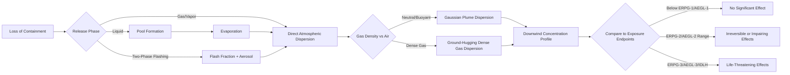

## Toxic Release and Exposure Hazards

### Overview

Toxic release and exposure hazards involve the unintended release of substances capable of causing adverse health effects — acute or chronic — through inhalation, dermal contact, ingestion, or ocular exposure. Within Process Safety Management (PSM), toxic release hazards are distinct from fire and explosion hazards because harm can occur without ignition, at concentrations far below flammable or explosive limits, and can extend well beyond the facility fence line to affect surrounding communities.

### Key Points

- Toxicity is dose- and route-dependent: severity depends on concentration, duration of exposure, and route of entry into the body
- Releases may be **continuous** (slow leaks, fugitive emissions) or **instantaneous/catastrophic** (vessel rupture, relief valve discharge, transfer hose failure)
- Consequence modeling for toxics uses different endpoints than flammables — concentration-based exposure limits rather than lower/upper flammability limits
- Highly Hazardous Chemicals (HHCs) subject to OSHA PSM (29 CFR 1910.119) are listed in Appendix A by threshold quantity (TQ)
- Toxic hazards drive Process Hazard Analysis (PHA) scenarios, Layer of Protection Analysis (LOPA), and offsite consequence analysis (OCA) under EPA's Risk Management Program (RMP)

### Sources of Toxic Release

**Equipment Failure**

- Pump seal failures, flange leaks, gasket degradation
- Relief valve lifting to atmosphere instead of to a scrubber/flare
- Pipe corrosion, erosion, or fatigue cracking
- Vessel or tank rupture from overpressure, overfilling, or material failure

**Process Deviations**

- Runaway reactions generating toxic byproducts (e.g., decomposition producing $NO_x$ or $HCN$)
- Loss of containment during charging, sampling, or draining operations
- Incompatible chemical mixing generating toxic gas (e.g., bleach + ammonia producing chloramine gases)

**Human Factors and Operational Activities**

- Improper valve lineups during maintenance or turnaround
- Opening equipment without verifying isolation, purging, or depressurization
- Inadequate personal protective equipment (PPE) during sampling or line-breaking

**Transportation and Transfer Operations**

- Loading/unloading of rail cars, tank trucks, or ships
- Hose or arm disconnection failures
- Failure of excess flow valves or emergency shutdown systems

### Common Highly Hazardous Chemicals (Toxic Category)

| Chemical | Common Hazard | Typical Use |
| --- | --- | --- |
| Chlorine ($Cl_2$) | Severe respiratory irritant, corrosive | Water treatment, bleaching |
| Anhydrous ammonia ($NH_3$) | Respiratory irritant, corrosive to eyes/skin | Refrigeration, fertilizer production |
| Hydrogen sulfide ($H_2S$) | Chemical asphyxiant, olfactory fatigue at high concentration | Oil/gas processing, wastewater treatment |
| Hydrogen fluoride ($HF$) | Severe systemic toxicity, deep tissue damage | Alkylation, glass etching |
| Phosgene ($COCl_2$) | Delayed-onset pulmonary edema | Chemical synthesis (isocyanates) |
| Carbon monoxide ($CO$) | Chemical asphyxiant, binds hemoglobin | Combustion byproduct, syngas processes |
| Sulfur dioxide ($SO_2$) | Respiratory irritant | Sulfuric acid production, refining |

[Inference] Facility-specific HHC inventories and applicable thresholds should always be verified against the current OSHA Appendix A and EPA RMP Table lists, as chemical listings and threshold quantities are periodically revised by regulation.

### Exposure Routes and Health Effects

**Inhalation** — most common industrial exposure route; affects respiratory tract and can lead to systemic absorption

**Dermal/Ocular Contact** — corrosive or absorptive chemicals damage skin/eyes directly or are absorbed into the bloodstream

**Ingestion** — typically secondary, via contaminated hands, food, or water

**Injection** — rare in process settings, but possible with high-pressure fluid injection injuries

**Effect classifications:**

- **Acute toxicity** — immediate effects from short-term high-concentration exposure (e.g., $H_2S$ knockdown, chlorine pulmonary edema)
- **Chronic toxicity** — effects from repeated low-level exposure over time (e.g., benzene-associated leukemia risk)
- **Asphyxiants** — simple (displace oxygen, e.g., nitrogen) vs. chemical (interfere with oxygen utilization, e.g., $CO$, $H_2S$, cyanides)
- **Sensitizers** — substances causing an immune response after repeated exposure (e.g., isocyanates triggering respiratory sensitization)
- **Carcinogens, mutagens, and reproductive toxins (CMRs)** — long-latency chronic hazards requiring exposure minimization programs

### Exposure Limits and Reference Values

| Term | Definition | Typical Source |
| --- | --- | --- |
| PEL (Permissible Exposure Limit) | Legal 8-hr TWA exposure limit | OSHA |
| TLV (Threshold Limit Value) | Recommended 8-hr TWA exposure guideline | ACGIH |
| STEL (Short-Term Exposure Limit) | 15-min exposure ceiling | ACGIH/OSHA |
| IDLH (Immediately Dangerous to Life or Health) | Concentration threatening life/health within 30 min | NIOSH |
| ERPG (Emergency Response Planning Guideline) | Community/emergency planning concentration tiers (1, 2, 3) | AIHA |
| AEGL (Acute Exposure Guideline Level) | Tiered public exposure guidance (1, 2, 3) for varying durations | EPA/NAC |

[Inference] Exact numeric values for PELs, TLVs, IDLH, and AEGLs are chemical- and revision-specific; current published tables from OSHA, ACGIH, NIOSH, and EPA should be consulted directly rather than relying on memorized figures, since these values are subject to periodic scientific review and regulatory update.

### Consequence Modeling for Toxic Releases

Toxic consequence analysis typically follows a source-term-to-dispersion sequence:

1. **Source term modeling** — determine release rate, phase (gas/liquid/two-phase), and duration
   - Liquid release: pool formation and evaporation rate
   - Gas/vapor release: choked or subsonic flow through the opening
   - Two-phase flashing release: common for pressurized liquefied gases (e.g., anhydrous ammonia)
2. **Dispersion modeling** — predicts downwind concentration as a function of distance
   - **Gaussian plume models** — suited to neutrally buoyant gases under steady wind
   - **Dense gas (heavy gas) models** — required for gases denser than air (e.g., chlorine, $HF$) that slump and spread near ground level
   - Common tools: ALOHA, PHAST, SLAB, DEGADIS
3. **Endpoint selection** — the dispersion model output is compared against ERPG-2/3, AEGL-2/3, or IDLH concentrations to define the hazard footprint (often called the "toxic corridor" or vulnerability zone)
4. **Consequence severity mapping** — distance-to-endpoint results are combined with population data (for offsite receptors) to assess community risk

$$C(x,y,z) = \frac{Q}{2\pi u \sigma_y \sigma_z} \exp\left(-\frac{y^2}{2\sigma_y^2}\right)\left[\exp\left(-\frac{(z-H)^2}{2\sigma_z^2}\right) + \exp\left(-\frac{(z+H)^2}{2\sigma_z^2}\right)\right]$$

Where $Q$ is the release rate, $u$ is wind speed, $\sigma_y$ and $\sigma_z$ are horizontal/vertical dispersion coefficients, and $H$ is effective release height. [Inference] This is the standard Gaussian plume equation used as a foundational reference model; actual regulatory or facility consequence assessments generally rely on validated software rather than manual calculation, since real dispersion behavior is influenced by terrain, buoyancy, and atmospheric stability factors the simplified equation does not capture.

### Diagram: Toxic Release Consequence Pathway (svg_diagram)

### Prevention and Mitigation Hierarchy

**Inherently Safer Design (Elimination/Substitution)**

- Substitute less toxic chemicals where feasible (e.g., replacing chlorine gas with sodium hypochlorite solution in water treatment)
- Minimize inventory of toxic materials on-site
- Moderate process conditions (lower pressure/temperature) to reduce release energy

**Engineering Controls**

- Closed-loop sampling systems to avoid operator exposure
- Double mechanical seals with barrier fluid on pumps handling toxics
- Scrubbers, flares, and vent gas treatment systems
- Excess flow valves and remotely operated emergency isolation valves (EIVs)
- Secondary containment (dikes, curbing) for liquid releases
- Continuous toxic gas detection systems with automatic alarm/shutdown interlocks

**Administrative Controls**

- Permit-to-work systems for line-breaking and confined space entry
- Management of Change (MOC) review for any modification affecting toxic release potential
- Preventive maintenance programs targeting seals, valves, and relief devices

**PPE (Last Line of Defense)**

- Respiratory protection matched to the specific hazard (air-purifying vs. supplied-air/SCBA depending on IDLH status)
- Chemical-resistant suits for corrosive or dermally-absorbed toxics

### Emergency Response Considerations

- **Detection and alarm** — fixed and portable gas detectors calibrated to the specific toxic substance, with alarm setpoints typically referenced to a fraction of PEL/STEL and escalating toward IDLH
- **Community notification** — coordination with Local Emergency Planning Committees (LEPCs) as required under EPCRA for facilities with RMP-covered chemicals
- **Shelter-in-place vs. evacuation decision-making** — dependent on release duration, wind conditions, and modeled toxic corridor
- **Decontamination protocols** — for personnel exposed to corrosive or absorbable toxics
- **Mutual aid agreements** — with local hazmat teams and fire departments for chemicals exceeding facility internal response capability

[Inference] Specific alarm setpoints, notification thresholds, and response protocols vary by facility risk management plan and local emergency planning requirements, and should be confirmed against the site's own Process Safety Information (PSI) and emergency response plan rather than generalized here.

### Regulatory Framework

- **OSHA PSM (29 CFR 1910.119)** — covers HHCs above threshold quantities; mandates PHA, PSI, MOC, and emergency planning
- **EPA RMP (40 CFR Part 68)** — requires offsite consequence analysis (worst-case and alternative release scenarios) for RMP-listed toxics
- **EPCRA (SARA Title III)** — community right-to-know reporting for extremely hazardous substances (EHS list)
- **DOT Hazardous Materials Regulations** — governs transport-related toxic release risk during loading/transit

### Example

A facility operating an anhydrous ammonia refrigeration system experiences a flange gasket failure on a liquid ammonia line at 150 psig. The two-phase flashing release generates a dense, cold vapor cloud that slumps toward grade due to being denser than ambient air at the point of release. Dense-gas dispersion modeling using a tool such as PHAST or ALOHA would be used to estimate the downwind distance to the ERPG-2 concentration threshold, which then defines the area requiring shelter-in-place notification. Mitigation may include installing an excess flow valve upstream of the flange, converting to welded connections in that service, and adding a fixed ammonia detector with automatic block-valve closure upon high-concentration alarm.

### Related Topics

- Highly Hazardous Chemical (HHC) inventory management and threshold quantities
- Offsite Consequence Analysis (OCA) and worst-case release scenarios
- Dense gas vs. neutrally buoyant dispersion modeling techniques
- Gas detection and alarm system design (fixed and portable)
- Emergency Planning and Community Right-to-Know Act (EPCRA) compliance
- Respiratory protection program requirements (29 CFR 1910.134)
- Relief system design and vent gas treatment (scrubbers, flares)
- Inherently Safer Design (ISD) principles applied to toxic material handling