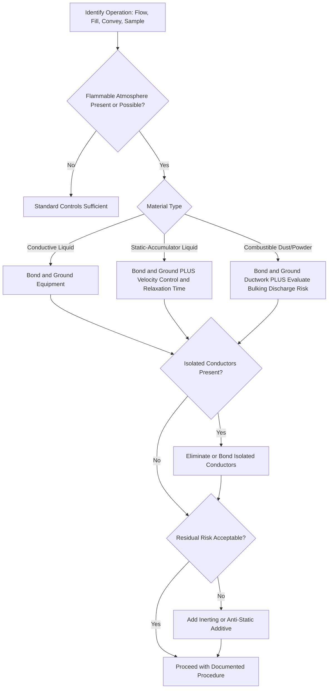

## Static Electricity and Ignition Source Control

### Overview

Static electricity generation is a common and often underestimated ignition source in process facilities handling flammable liquids, gases, dusts, and powders. Unlike mechanical or electrical sparks from equipment failure, static discharge arises from routine, normal process activities — fluid flow, pneumatic conveying, mixing, filtration — making it a hazard that must be actively controlled through design and procedure rather than eliminated through equipment inspection alone.

### Key Points

- Static charge generation is nearly unavoidable in many flow and handling operations; the control objective is to prevent charge accumulation and prevent discharge in the presence of a flammable atmosphere
- Ignition requires three conditions simultaneously: a flammable atmosphere, a discharge with sufficient energy, and a discharge occurring within that atmosphere
- Minimum Ignition Energy (MIE) of the material determines the required control rigor — many flammable vapors and combustible dusts have MIEs well below the energy readily generated by static discharges
- Bonding and grounding are the primary engineering controls but are not universally sufficient (isolated conductors and charged non-conductors require separate mitigation)
- Static hazards are addressed across NFPA 77, API RP 2003, and IEC 60079-32-1

### Mechanism of Static Charge Generation

Static charge arises from **triboelectric charging** — the separation of electrical charge that occurs when two dissimilar materials contact and then separate. In process operations, this occurs through:

- **Flow of liquids through pipes** — charge generation increases with flow velocity, pipe diameter reduction, and liquid conductivity
- **Splash filling** — liquid falling through air into a vessel generates charge at the liquid surface and via splashing/atomization
- **Filtration** — fine filters dramatically increase charge generation due to high surface-area contact (charge can persist for tens of seconds to minutes downstream, known as "relaxation time")
- **Pneumatic conveying of solids/powders** — particle-to-particle and particle-to-wall contact generates significant charge, especially with fine, dry powders
- **Mixing and agitation** — especially in non-conductive liquids
- **Personnel movement** — walking on insulating flooring while wearing insulating footwear
- **Belt conveyors** — friction between belt and pulleys/rollers

### Charge Relaxation and Liquid Conductivity

A key parameter in static hazard assessment is the **electrical conductivity** of the liquid, which determines how quickly generated charge dissipates (relaxes) versus how long it persists and can accumulate to a hazardous potential.

| Liquid Conductivity Class | Approximate Conductivity | Relaxation Behavior | Example |
| --- | --- | --- | --- |
| Conductive | > 10,000 pS/m | Charge dissipates rapidly through bonded/grounded metal | Water, alcohols, most acids |
| Semi-conductive | 50–10,000 pS/m | Moderate relaxation time | Some crude oils, ketones |
| Non-conductive (low conductivity) | < 50 pS/m | Charge persists, can accumulate to high potential | Toluene, xylene, refined petroleum distillates |

[Inference] Specific conductivity thresholds and classification bands vary slightly between industry guidance documents (e.g., API RP 2003 vs. IEC standards); site-specific static hazard assessments should reference the applicable standard's exact criteria rather than a single universal cutoff.

Low-conductivity ("static accumulator") liquids are of greatest concern because bonding and grounding the containing vessel does not dissipate charge already present within the bulk liquid — only surface charge on conductive equipment is addressed by bonding.

### Minimum Ignition Energy (MIE) Context

Static discharges typically release energy in the range of fractions of a millijoule (corona/brush discharge) up to tens or hundreds of millijoules (spark or propagating brush discharge). Many common flammable vapor-air mixtures have MIE values on the order of 0.2–0.5 mJ, meaning even weak static discharges can serve as an effective ignition source. Combustible dust clouds generally require higher ignition energy than vapors, but many organic dusts still fall within the range achievable by static discharge, particularly propagating brush discharge from insulating surfaces.

[Inference] Numeric MIE values are compound- and particle-size-specific for dusts; actual facility risk assessments should use tested MIE data (e.g., from ASTM E2019 or equivalent dust testing) for the specific material handled rather than generic literature values.

### Types of Electrostatic Discharge

**Spark Discharge**

- Occurs between two conductors at different potentials
- Highest energy transfer of the common discharge types; most easily controlled via bonding/grounding

**Brush Discharge**

- Occurs from a charged, non-conductive surface (or ungrounded conductor) to a grounded conductor
- Lower energy than spark discharge but can still ignite vapors with low MIE

**Propagating Brush Discharge**

- Occurs across a thin insulating layer backed by a grounded conductor (e.g., a coated or lined vessel wall) when opposite charges build on each face
- Can release very high energy — sufficient to ignite dust clouds as well as vapors — and is considered one of the most severe static discharge hazards

**Corona Discharge**

- Occurs at sharp points or edges of highly charged objects
- Generally low energy; rarely a primary ignition concern but indicates significant charge accumulation

**Cone/Bulking Discharge**

- Occurs within a bulking powder pile as it is filled into a silo or vessel, from charge accumulated in the bulk of the powder
- A significant concern in powder handling operations with fine, low-conductivity solids

### Diagram: Static Discharge Types by Energy and Source (svg_diagram)

<svg xmlns="http://www.w3.org/2000/svg" viewBox="0 0 760 380">
<text x="380" y="25" text-anchor="middle" font-size="16" font-weight="bold" fill="#1a1a1a">Static Discharge Types by Relative Energy (svg_diagram)</text>
<line x1="80" y1="330" x2="700" y2="330" stroke="#333" stroke-width="2" />
<line x1="80" y1="330" x2="80" y2="60" stroke="#333" stroke-width="2" />
<text x="40" y="200" font-size="12" fill="#333" transform="rotate(-90 40,200)">Discharge Energy</text>
<text x="390" y="360" text-anchor="middle" font-size="12" fill="#333">Discharge Type</text>
<rect x="120" y="300" width="80" height="30" fill="#8ecae6" />
<text x="160" y="345" text-anchor="middle" font-size="11">Corona</text>
<rect x="240" y="260" width="80" height="70" fill="#219ebc" />
<text x="280" y="345" text-anchor="middle" font-size="11">Brush</text>
<rect x="360" y="180" width="80" height="150" fill="#023047" />
<text x="400" y="345" text-anchor="middle" font-size="11">Spark</text>
<rect x="480" y="140" width="80" height="190" fill="#ffb703" />
<text x="520" y="345" text-anchor="middle" font-size="11">Bulking/Cone</text>
<rect x="600" y="80" width="80" height="250" fill="#fb8500" />
<text x="640" y="345" text-anchor="middle" font-size="11">Propagating Brush</text>

<text x="380" y="60" text-anchor="middle" font-size="11" fill="#555">Relative energy scale — actual values are material- and geometry-dependent</text>

</svg>

### Ignition Source Control Hierarchy

**1. Bonding and Grounding**

- Bonding: electrically connects two or more conductive objects to equalize potential between them
- Grounding: connects conductive objects to earth to provide a path for charge dissipation
- Required for all metallic process equipment, portable containers, drums, and transfer hoses during flammable liquid handling
- Verified via resistance testing (typically targeting less than 10 ohms to ground for grounding connections; bonding continuity checks between components)

**2. Flow Velocity Control**

- Reduce liquid velocity, particularly during initial fill ("switch loading") when a vessel previously containing a different product may have residual vapor or charge
- API RP 2003 provides guidance on velocity limits as a function of pipe diameter for static-accumulator liquids
- Avoid splash filling; use dip pipes/bottom loading to submerge the fill point and minimize surface turbulence

**3. Relaxation Time / Settling Time**

- Allow sufficient dwell time after high-charge-generating operations (e.g., filtration) before further transfer, sampling, or gauging, to permit charge to relax to a safe level
- Particularly critical before dipping a gauge tape or opening a manway on a static-accumulator liquid

**4. Inerting**

- Blanketing the vapor space with an inert gas (nitrogen) to eliminate the flammable atmosphere altogether, removing one leg of the ignition triangle regardless of discharge occurrence

**5. Anti-Static Additives**

- Additives that increase liquid conductivity (used in fuels such as aviation turbine fuel) to accelerate charge relaxation

**6. Humidity Control**

- Increasing relative humidity reduces surface resistivity of many materials and reduces static accumulation risk in some solids handling and personnel-charging scenarios (less effective for bulk liquid hydrocarbon charging)

**7. Personnel Grounding**

- Conductive or static-dissipative footwear and flooring in areas where personnel may become charged and could discharge near a flammable atmosphere
- Grounding straps for personnel entering vessels or handling ungrounded conductive items (e.g., portable containers)

**8. Equipment and Material Selection**

- Avoid isolated conductive components (e.g., an ungrounded metal fitting, an isolated flange with a gasket break) that can accumulate charge independently of the main bonded system
- Use conductive or static-dissipative hose and lining materials rather than fully insulating linings where propagating brush discharge risk exists
- Address non-conductive plastic components (scoops, buckets, sight glasses) in powder handling, which can charge and are not addressed by bonding

### Special Cases

**Switch Loading**

- Loading a static-accumulator product into a tank that previously held a different product creates elevated static hazard due to mist/splash and disturbed residual charge; requires reduced initial fill velocity per API RP 2003 guidance

**Tank Truck and Rail Car Loading**

- Bottom loading preferred over top splash loading
- Bonding cable connected before opening any hatch and before starting flow; grounding verified before transfer begins
- Vapor recovery and inerting used in combination with bonding on high-risk products

**Pneumatic Conveying of Powders**

- Conductive/grounded ductwork required; flexible non-conductive sections can become isolated charge accumulators if not bonded across couplings
- Bulking discharge risk inside silos cannot be eliminated by grounding the silo shell alone; inerting or reduced conveying velocity may be needed for highly explosible, low-MIE dusts

**Sampling and Gauging Operations**

- Manual dipping/gauging of static-accumulator liquids in open-top tanks is a recognized historical cause of static ignition incidents; procedures typically mandate a waiting period after filling before gauging and require use of grounded, conductive gauge equipment

### Diagram: Static Control Decision Logic

### Applicable Standards and References

- **NFPA 77** — Recommended Practice on Static Electricity
- **API RP 2003** — Protection Against Ignitions Arising Out of Static, Lightning, and Stray Currents
- **IEC 60079-32-1** — Explosive atmospheres — Electrostatic hazards, guidance
- **NFPA 654** — Standard for combustible particulate solids, addressing static ignition in dust handling
- **ASTM E2019** — Standard test method for minimum ignition energy of a dust cloud

### Example

A facility transfers xylene (a static-accumulator liquid) from a tank truck into a storage tank via top splash loading through an ungrounded flexible hose. During the fill, static charge accumulates on the liquid surface due to splashing and the low conductivity of xylene, while the flexible hose — connected to the truck and tank via unbonded quick-connect fittings — also accumulates charge as an isolated conductor. A brush discharge from the liquid surface, or a spark from the ungrounded hose fitting, could ignite vapors in the tank's flammable headspace. Corrective measures include installing a bottom-loading arrangement with a submerged fill pipe, bonding the hose fittings to both the truck and tank grounding system, verifying bonding/grounding continuity before each transfer, and enforcing a documented settling time before any subsequent gauging or sampling.

### Related Topics

- Area classification and hazardous location design (NFPA 70/IEC 60079 series)
- Combustible dust explosion hazards and NFPA 654/660 compliance
- Flammable liquid storage tank design and vapor space management
- Inert gas blanketing (nitrogen purging) system design
- Bonding and grounding verification procedures and testing frequency
- Electrical area classification vs. static ignition source overlap
- Lightning protection systems for atmospheric storage tanks