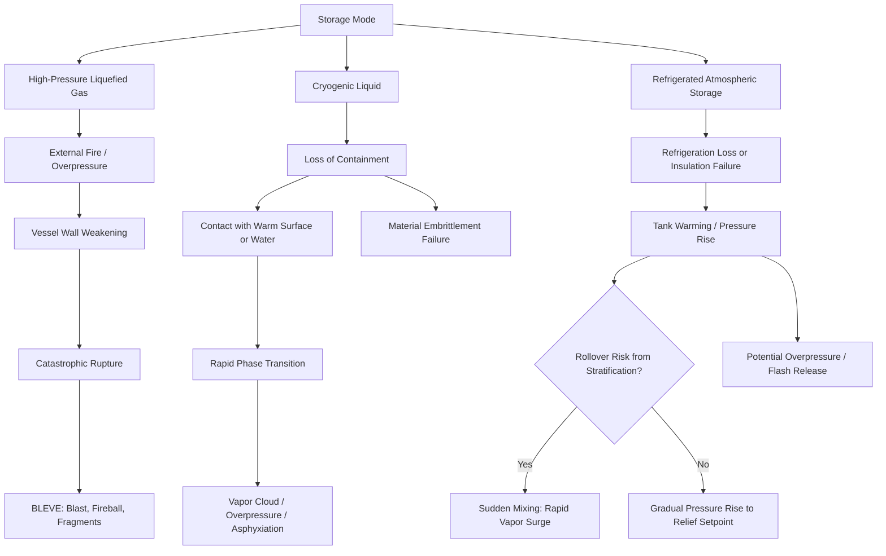

## High-Pressure, Cryogenic, and Refrigerated Storage Hazards

### Overview

High-pressure, cryogenic, and refrigerated storage systems each manage a distinct form of stored energy or thermal hazard, yet they are frequently grouped together because failure modes across all three can produce rapid, large-scale loss of containment with severe consequences — physical explosion, flash vaporization, brittle fracture, or extreme cold/thermal burns. Each storage mode requires design and operational controls tailored to its specific failure mechanisms.

### Key Points

- High-pressure storage hazards center on stored mechanical energy and physical explosion (BLEVE) risk
- Cryogenic storage hazards center on extreme low temperature effects — material embrittlement, rapid phase change, and asphyxiation/frostbite
- Refrigerated (atmospheric or low-pressure) storage hazards center on maintaining sub-ambient temperature integrity to prevent flash vaporization if pressure/temperature control is lost
- All three modes share common concerns: overpressure protection, loss-of-containment consequence severity, and the need for specialized materials of construction
- BLEVE (Boiling Liquid Expanding Vapor Explosion) is a cross-cutting catastrophic failure mode relevant to both high-pressure liquefied gas storage and, under fire exposure, refrigerated storage

### High-Pressure Storage Hazards

**Nature of the Hazard**

High-pressure storage vessels contain significant stored mechanical (and often chemical) energy. Sudden loss of containment releases this energy explosively, generating blast overpressure, fragment projection ("missile" hazard), and — if the contents are flammable or toxic — a secondary release hazard.

**Key Failure Mechanisms**

- Overpressure beyond design MAWP (Maximum Allowable Working Pressure) due to blocked-in thermal expansion, control failure, or external fire exposure
- Material degradation: fatigue cracking from cyclic pressure service, corrosion under insulation (CUI), hydrogen embrittlement in hydrogen service
- Relief system inadequacy: undersized or fouled pressure relief valves (PRVs), blocked relief paths
- External impact or mechanical damage compromising vessel integrity

**BLEVE Mechanism**

1. Vessel containing a liquefied gas under pressure is exposed to an external fire (often flame impingement on the vapor space, where liquid cooling of the wall is absent)
2. Vessel wall in the vapor space region weakens due to heat while pressure continues to rise
3. Wall failure occurs suddenly, causing catastrophic rupture
4. The superheated liquid instantaneously flashes to vapor, producing a massive volumetric expansion, blast wave, and (if flammable) a fireball

**High-Pressure Control Measures**

- Properly sized and maintained pressure relief devices (PRVs, rupture disks) sized per API 520/521
- Fireproofing/insulation of vessel supports and, where applicable, vapor space shell to delay BLEVE onset and extend time-to-failure for evacuation
- Water spray/deluge systems to cool vessel shells under fire exposure
- Adequate vessel spacing and blast-resistant siting to limit escalation
- Regular inspection for corrosion, fatigue cracking, and material degradation (RBI — Risk-Based Inspection programs)
- Excess flow and remotely operated isolation valves to limit inventory available to a release

### Cryogenic Storage Hazards

**Nature of the Hazard**

Cryogenic liquids are stored at extremely low temperatures (generally below −100°C / −150°F), including liquefied natural gas (LNG, ~−162°C), liquid nitrogen (~−196°C), liquid oxygen (~−183°C), and liquid hydrogen (~−253°C). Hazards arise from the extreme temperature itself and from the large liquid-to-vapor expansion ratio.

**Key Hazard Mechanisms**

- **Material embrittlement** — carbon steel and many common structural materials become brittle at cryogenic temperatures and can fracture without warning if not designed with cryogenic-rated materials (e.g., austenitic stainless steel, aluminum, or specially rated low-temperature carbon steel)
- **Rapid Phase Transition (RPT) / flash vaporization** — cryogenic liquid contacting a warmer surface or water can vaporize almost instantaneously, generating a large vapor cloud and potential overpressure
- **Extreme cold burns / frostbite** — direct skin contact with cryogenic liquid or cold surfaces causes severe tissue damage
- **Asphyxiation** — vaporized cryogens (especially nitrogen, argon) are odorless/colorless and can displace oxygen in confined or low-lying areas without warning
- **Vapor cloud dispersion** — LNG vapor is initially denser than air when cold, forming a ground-hugging flammable cloud before warming and becoming buoyant
- **Oxygen enrichment/depletion hazards** — liquid oxygen releases can enrich the local atmosphere, dramatically increasing fire risk (materials not normally flammable can ignite readily in an oxygen-enriched atmosphere)

**Cryogenic Control Measures**

- Use of cryogenic-rated materials of construction throughout the liquid-contact boundary, including piping, vessels, and valve trim
- Vacuum-jacketed or multi-layer insulated (MLI) piping and vessels to minimize heat ingress and boil-off
- Secondary containment (impoundment basins, dikes) sized for the full credible spill volume, designed to control pool spread and vaporization rate
- Continuous oxygen and/or specific gas monitoring in areas where asphyxiant accumulation is possible
- Personnel protective equipment: face shields, cryogenic-rated gloves, and protective clothing when handling
- Boil-off gas management systems (relief venting, recondensing, or flaring) to handle continuous vapor generation from ambient heat leak

### Refrigerated (Atmospheric/Low-Pressure) Storage Hazards

**Nature of the Hazard**

Refrigerated storage maintains a liquefied gas (commonly ammonia, propane, or LNG) near atmospheric pressure by mechanical refrigeration rather than by pressurization. The liquid is kept at or near its atmospheric boiling point.

**Key Hazard Mechanisms**

- Loss of refrigeration capacity allows tank contents to warm, increasing internal pressure toward the relief setpoint and eventually risking overpressure or flash release
- Insulation failure (moisture ingress, mechanical damage) increases heat leak, accelerating warming and boil-off
- Rollover phenomenon: stratified layers of differing density liquid (from varying composition or temperature) can suddenly mix, causing rapid, large-scale vapor generation and a pressure spike within the tank
- Structural failure of low-pressure tank walls, which are typically thinner than pressure-vessel-rated equivalents and less tolerant of overpressure
- Foundation or support failure from freeze-thaw cycling of surrounding soil, if not properly designed with heating elements beneath the foundation

**Refrigerated Storage Control Measures**

- Redundant refrigeration systems with automatic backup activation on primary system failure
- High-level and high-pressure alarms with automatic relief and, where warranted, emergency depressuring systems
- Density/temperature stratification monitoring to detect rollover-prone conditions before they develop
- Regular insulation inspection and moisture-ingress detection
- Secondary containment (full or partial containment dikes) rated for total tank inventory
- Foundation heating systems to prevent frost heave beneath refrigerated tank foundations

### Diagram: Comparative Hazard Pathways Across Storage Modes

### Comparative Summary

| Aspect | High-Pressure Storage | Cryogenic Storage | Refrigerated Storage |
| --- | --- | --- | --- |
| Primary energy form | Mechanical (pressure) | Thermal (extreme cold) + phase-change energy | Thermal (maintained sub-ambient) |
| Dominant failure mode | Vessel rupture / BLEVE | Embrittlement fracture, RPT | Rollover, refrigeration loss |
| Key material concern | Fatigue, corrosion, MAWP | Embrittlement of non-rated materials | Thin-wall low-pressure design limits |
| Typical relief approach | PRV/rupture disk per MAWP | Vacuum-jacket integrity, boil-off relief | High-pressure alarm + relief valve |
| Distinct consequence | Fragment/blast hazard | Frostbite, asphyxiation, oxygen enrichment | Large-inventory vapor release on failure |

### Common Cross-Cutting Controls

- **Risk-Based Inspection (RBI)** programs tailored to each storage mode's degradation mechanisms
- **Instrumented protective systems** — high/low pressure, high/low temperature, and level instrumentation tied to Safety Instrumented Functions (SIFs) per IEC 61511
- **Secondary containment** sized to the applicable regulatory/design standard (e.g., NFPA 59A for LNG, API 620/650 for low-pressure tanks)
- **Emergency isolation and depressuring systems** to reduce inventory rapidly in a developing incident
- **Siting and spacing** per API RP 752/753 principles to limit escalation and protect occupied buildings

### Applicable Standards and References

- **API 620** — Design and Construction of Large, Welded, Low-Pressure Storage Tanks
- **API 650** — Welded Tanks for Oil Storage (atmospheric)
- **NFPA 59A** — Standard for the Production, Storage, and Handling of Liquefied Natural Gas (LNG)
- **API 521/520** — Pressure-Relieving and Depressuring Systems / Sizing, Selection, and Installation of Pressure-Relieving Devices
- **CGA (Compressed Gas Association) publications** — cryogenic liquid handling guidance
- **29 CFR 1910.111** — Storage and handling of anhydrous ammonia (refrigerated storage relevance)

### Example

A refrigerated ammonia storage tank experiences a partial loss of refrigeration due to compressor failure. Over several hours, tank pressure rises as the liquid warms toward its bubble point at the elevated temperature. Because the tank was filled from two different ammonia sources at different times, density stratification exists between an upper and lower liquid layer. As pressure and temperature increase, the layers reach a density crossover point and mix suddenly (rollover), flashing a large volume of vapor almost instantaneously and challenging the tank's relief system capacity. Mitigation includes redundant refrigeration compressors with automatic changeover, continuous density-profile monitoring to detect stratification before it becomes hazardous, and relief system sizing that accounts for credible rollover vapor generation rates rather than steady-state boil-off alone.

### Related Topics

- BLEVE prevention: fireproofing, water deluge, and pressure relief sizing
- Facility siting and spacing per API RP 752/753
- Rollover phenomenon in refrigerated LNG/ammonia tanks
- Cryogenic material selection and low-temperature impact testing (Charpy V-notch)
- Oxygen-enriched atmosphere fire hazards
- Boil-off gas recovery and vapor handling system design
- Relief system design for two-phase and flashing releases (API 521)