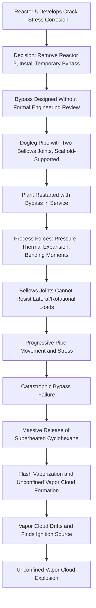

## Flixborough 1974 and Temporary Modification Failures

### Overview

The Flixborough disaster occurred on June 1, 1974, at the Nypro (UK) chemical plant in Flixborough, England, when a temporary bypass pipe installed to replace a leaking reactor in a cyclohexane oxidation train failed catastrophically. The resulting release of approximately 30-50 tonnes of cyclohexane formed a massive unconfined vapor cloud that ignited, producing a devastating vapor cloud explosion (VCE) that killed 28 people, injured dozens more, and destroyed the plant. Flixborough remains one of the most heavily studied incidents in process safety history because its root cause was not a novel or exotic failure mechanism, but a poorly engineered temporary modification pushed through without adequate review.

### Background and Process Context

The Nypro plant produced cyclohexanone (a precursor to caprolactam, used in nylon manufacture) via a six-reactor train performing partial oxidation of cyclohexane with air, operating at approximately 155°C and 8.8 bar. The reactors were connected in series, with cyclohexane and unreacted feed flowing from one reactor to the next through short connecting pipes.

Several weeks before the incident, Reactor 5 in the series was found to have developed a vertical crack, attributed to nitrate stress corrosion cracking of the stainless steel vessel. Rather than shutting down for an extended repair or replacing the reactor, plant management authorized removal of Reactor 5 from the train entirely and installation of a temporary bypass pipe to connect Reactor 4 directly to Reactor 6, allowing the plant to continue operating.

### Key Points

- The temporary bypass pipe was designed and installed without formal engineering calculations, stress analysis, or reference to a fixed engineering standard
- The bypass was supported only on temporary scaffolding, not a fixed structural support consistent with process piping requirements
- No hazard review, Management of Change (MOC) process, or safety case existed at the time to formally evaluate the temporary modification
- The bypass pipe used flexible bellows/dresser couplings at both ends, allowing significant unconstrained movement to the assembly under process forces
- The plant lacked a formal engineering department review step; the modification sketch was reportedly drawn on the workshop floor in chalk rather than through a design drawing

### Technical Failure Mechanism

The 20-inch temporary bypass pipe connected the 28-inch nozzles of Reactor 4 and Reactor 6 via a dogleg (offset) configuration, using two bellows expansion joints to accommodate the offset and thermal movement. This design created an inherently unstable arrangement:

1. The bypass pipe was not adequately supported against the twisting and bending moments generated by internal pressure and thermal expansion
2. The bellows joints, intended to absorb axial movement, could not resist the lateral/rotational forces imposed by the offset pipe geometry
3. Under normal operating pressure and temperature, the assembly experienced progressive movement and stress at the bellows connections
4. The bypass pipe eventually failed catastrophically, likely through bellows rupture or pipe displacement, releasing the full reactor train inventory of superheated, pressurized cyclohexane

The released cyclohexane, at temperature well above its atmospheric boiling point, flashed rapidly to form a large vapor cloud that drifted across the site before finding an ignition source (most likely a furnace or other heat source), resulting in an unconfined vapor cloud explosion with a yield later estimated in some analyses as equivalent to several tens of tonnes of TNT. [Inference] Precise ignition source identification and exact TNT-equivalent yield have varied across post-incident investigations and technical retrospectives, as definitive forensic confirmation was complicated by the scale of destruction.

### Diagram: Bypass Pipe Failure Sequence

### Root Causes and Contributing Factors

**Engineering Deficiencies**

- No stress analysis or engineering calculation performed for the bypass pipe design
- Use of unsuitable bellows joints for the imposed loading conditions (bellows are generally unsuitable for absorbing lateral loads without additional restraint)
- Inadequate structural support (temporary scaffolding rather than fixed, engineered supports)
- No consideration of the dogleg offset geometry's effect on pipe stress distribution

**Management and Organizational Deficiencies**

- Absence of a formal Management of Change process to evaluate temporary modifications with the same rigor as permanent design changes
- No requirement for a qualified mechanical/process engineer to review and approve the modification before installation
- Production continuity pressure prioritized over safety review — the plant needed to keep the reactor train operational
- No independent hazard review (PHA-equivalent) conducted on the modified configuration
- Absence of any documented design basis, drawings, or calculations for a modification handling large flammable inventory at elevated temperature and pressure

**Layout and Siting Deficiencies**

- Occupied control room and administrative buildings were located close to the process area, contributing to the high fatality count (most deaths occurred in the control room, which was not blast-resistant)
- Insufficient separation distance between the reactor train and occupied buildings

### Lessons Learned and Legacy

**Management of Change (MOC)**

Flixborough is widely credited as a foundational case driving the formalization of MOC programs in process safety management. The incident demonstrated that temporary modifications carry the same — or greater — risk as permanent design changes and must be subject to equivalent engineering review, hazard analysis, and authorization before implementation, regardless of intended duration.

**Temporary Modifications Require Full Engineering Rigor**

- "Temporary" must never mean "less engineered." Any modification handling hazardous inventory should receive engineering calculations, appropriate materials and supports, and a defined removal/permanent-fix timeline
- Time-limited authorizations for temporary repairs should include a hard expiration date and re-evaluation requirement

**Independent Design Review**

- Modifications should be reviewed by personnel independent of the immediate operational pressure to restart, with authority to reject an inadequate design
- Piping and structural modifications require competent engineering sign-off, not field improvisation

**Facility Siting**

- The incident contributed significantly to the later development of formal facility siting guidance (e.g., API RP 752) addressing occupied building placement relative to process hazards

**Regulatory Legacy**

- Flixborough was a direct contributor to the UK's development of the Control of Industrial Major Accident Hazards (CIMAH) Regulations (1984), a precursor to the modern COMAH regime and influential on the broader development of process safety regulation internationally, including conceptual underpinnings later reflected in the Seveso Directive framework in the EU

[Inference] The specific regulatory lineage connecting Flixborough to CIMAH and subsequent frameworks is well documented in UK regulatory history; however, exact causal weighting between Flixborough and other contemporaneous incidents (e.g., Seveso 1976) in shaping specific regulatory provisions is a matter of historical analysis rather than a single definitive causal chain.

### Relevance to Management of Change Programs Today

Modern MOC systems, as required under frameworks such as OSHA PSM (29 CFR 1910.119(l)), explicitly require that:

- All changes to process chemicals, technology, equipment, and procedures — including temporary changes — be reviewed prior to implementation
- The review address the technical basis for the change, impact on safety and health, modifications to operating procedures, necessary time period for the change, and authorization requirements
- Temporary changes have a defined time limit, after which the process must revert or the change must go through full permanent MOC review

The Flixborough case remains a standard teaching example in MOC training specifically because it illustrates the failure mode of treating a temporary change informally: no calculation, no drawing, no independent review, and no defined engineering standard governing the substitute equipment.

### Example Application in Modern MOC Review

Consider an analogous modern scenario: a corroded section of process piping is found during operation, and maintenance proposes a temporary spool piece to bridge the gap until a replacement can be fabricated. Applying lessons from Flixborough, a proper MOC review would require: stress analysis of the temporary spool under full operating pressure/temperature, use of components rated for the actual loading conditions rather than generic fittings, fixed engineered supports rather than temporary bracing, review and sign-off by a qualified piping/mechanical engineer, a documented and enforced expiration date for the temporary configuration, and inclusion of the modification in the facility's Process Hazard Analysis update if it materially changes risk.

### Related Topics

- Management of Change (MOC) program design and implementation (29 CFR 1910.119(l))
- Vapor Cloud Explosion (VCE) mechanisms and consequence modeling
- Facility siting and occupied building risk (API RP 752/753)
- Stress corrosion cracking mechanisms in process equipment
- CIMAH/COMAH and Seveso Directive regulatory history
- Bellows and expansion joint design limitations in process piping
- Temporary equipment and piping standards for hazardous service