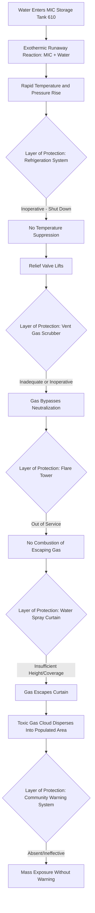

## Bhopal 1984 and Methyl Isocyanate Release

### Overview

The Bhopal disaster occurred on the night of December 2-3, 1984, at the Union Carbide India Limited (UCIL) pesticide manufacturing plant in Bhopal, India, when a runaway reaction in a methyl isocyanate (MIC) storage tank released approximately 30-40 tonnes of toxic MIC gas and reaction byproducts into the surrounding densely populated area. It remains the deadliest industrial disaster in history, with immediate deaths estimated at several thousand and long-term deaths and injuries from chronic exposure numbering in the tens of thousands over subsequent years. Bhopal fundamentally reshaped global process safety regulation, corporate accountability standards, and community right-to-know legislation.

### Background and Process Context

UCIL manufactured the pesticide carbaryl (marketed as Sevin) using methyl isocyanate as a key intermediate. MIC ($CH_3NCO$) is an extremely reactive, highly toxic, and volatile liquid (boiling point ~39°C) that reacts violently and exothermically with water. The plant stored MIC in bulk in partially filled underground/semi-buried storage tanks rather than producing it on a just-in-time basis, creating a large standing inventory of an extremely hazardous chemical.

On the night of the incident, water entered Tank 610, one of three MIC storage tanks, initiating an exothermic runaway reaction between water and MIC. The reaction generated heat and pressure far beyond the tank's design capacity, and multiple layers of safety systems intended to contain or mitigate such a release had been rendered non-functional or were inadequate for the scale of the event.

### Key Points

- The runaway reaction was triggered by water contamination of the MIC storage tank, most likely through inadequate isolation during a pipe-washing operation, combined with degraded valve/pipe integrity
- Multiple independent layers of protection had been disabled, undersized, or were out of service at the time of the incident: refrigeration system, vent gas scrubber, flare system, and water spray curtain
- The plant had experienced significant staffing reductions and reported deterioration of maintenance and safety culture in the period leading up to the incident
- No effective community emergency warning or evacuation system existed for the surrounding population, many of whom lived in informal settlements immediately adjacent to the plant boundary
- The disaster directly catalyzed the U.S. Emergency Planning and Community Right-to-Know Act (EPCRA) and significant international process safety regulatory reform

### Technical Failure Sequence

1. **Water ingress** — water entered Tank 610 through a connected pipe during a maintenance/washing operation; investigations differed on whether this occurred through operational error, inadequate isolation (missing or bypassed slip-blind), or possible deliberate introduction, but the technical consequence was the same regardless of entry mechanism
2. **Exothermic runaway reaction** — MIC reacted with water, catalyzed by iron contamination from corroding carbon steel piping/valves, generating heat and driving temperature and pressure in the tank far above design limits
3. **Refrigeration system inoperative** — the tank refrigeration system, intended to keep MIC at low temperature (reducing reaction rate and vapor pressure), had reportedly been shut down for cost reasons, removing a key layer of protection against exactly this type of thermal excursion
4. **Relief system activation** — as pressure rose, the tank's safety relief valve lifted, directing the reacting mixture toward the vent gas scrubber
5. **Vent gas scrubber inadequate/inoperative** — the scrubber, designed to neutralize escaping MIC with caustic soda, was either not operating, undersized for the volume and rate of gas released, or otherwise unable to process the massive uncontrolled release
6. **Flare system non-functional** — the flare tower intended to burn off any gas that bypassed the scrubber was out of service (reportedly awaiting a corroded pipe section)
7. **Water spray curtain insufficient** — a water curtain intended to knock down escaping vapor could not reach the height of the release from the vent stack
8. **Atmospheric release and dispersion** — the toxic gas cloud, denser than air, spread low across the ground into the densely populated neighborhoods immediately surrounding the plant

### Diagram: Bhopal Failure Sequence — Layers of Protection Defeated

### Toxicological and Consequence Characteristics

Methyl isocyanate is severely toxic via inhalation, causing pulmonary edema, chemical burns to the respiratory tract and eyes, and rapid incapacitation at high concentrations. [Inference] Exact exposure concentrations experienced by the population are difficult to establish precisely after the fact, since the release was uncontrolled, atmospheric conditions varied across the affected area, and contemporaneous monitoring data was limited — official casualty estimates have varied significantly across sources and remain a subject of ongoing study. The gas cloud, being denser than ambient air, hugged the ground as it dispersed, disproportionately affecting the immediately adjacent, low-lying, densely populated settlements.

Long-term health effects reported in the affected population have included chronic respiratory disease, ocular damage, and other systemic effects, with epidemiological studies continuing for decades after the incident. [Inference] The scope and causal attribution of long-term chronic health effects in the exposed population involve ongoing scientific and legal analysis, and different studies have reported varying findings; this summary reflects the general category of reported effects rather than a specific quantified outcome.

### Root Causes and Contributing Factors

**Process and Engineering Deficiencies**

- Bulk storage of large MIC inventory rather than minimizing on-site inventory of an extremely hazardous intermediate (a foundational Inherently Safer Design failure)
- Inadequate protection against water ingress into MIC storage (isolation valve/slip-blind practices)
- Refrigeration system taken out of service without a documented risk assessment of the consequence
- Vent gas scrubber and flare system undersized or unavailable for a release of this magnitude

**Management System Deficiencies**

- Reported reductions in plant staffing, training, and maintenance investment in the years preceding the incident
- Absence of a rigorous Management of Change process governing safety-critical equipment being taken out of service (refrigeration, flare)
- Inadequate mechanical integrity/preventive maintenance program allowing corrosion-related equipment degradation
- Lack of independent process hazard analysis addressing the consequence of multiple safety systems being simultaneously unavailable

**Emergency Preparedness and Community Deficiencies**

- No functioning community alarm/warning system to alert nearby residents to evacuate or shelter
- Absence of coordination between the plant and local emergency responders/authorities
- Land-use planning had allowed dense residential settlement immediately adjacent to a facility handling extremely hazardous chemicals, with inadequate buffer/separation distance

### Lessons Learned and Legacy

**Inherently Safer Design (Inventory Minimization)**

Bhopal is the foundational case for the Inherently Safer Design principle of minimizing on-site inventory of highly hazardous intermediates. Where feasible, hazardous intermediates should be produced and consumed on a just-in-time basis rather than stored in bulk, reducing the magnitude of any credible release.

**Layers of Protection Must Be Independent and Verified**

The incident is a canonical illustration of multiple, supposedly independent layers of protection (refrigeration, scrubber, flare, water curtain) all being simultaneously unavailable. Modern Layer of Protection Analysis (LOPA) methodology emphasizes that protective layers must be genuinely independent, regularly tested, and their availability actively managed — not assumed to exist simply because they were originally installed.

**Management of Change for Safety-Critical Equipment**

Taking safety-critical systems out of service (as occurred with the refrigeration unit and flare) requires formal risk assessment and management authorization, recognizing that removing a protective layer changes the facility's risk profile even without any change to the process itself.

**Community Emergency Planning and Right-to-Know**

Bhopal directly catalyzed the U.S. Emergency Planning and Community Right-to-Know Act (EPCRA) of 1986, which established requirements for hazardous chemical inventory reporting, Local Emergency Planning Committees (LEPCs), and community right-to-know provisions. It also strongly influenced the development of OSHA's Process Safety Management standard (29 CFR 1910.119) in 1992 and contributed to the conceptual basis for EPA's Risk Management Program (40 CFR Part 68).

**Facility Siting and Land-Use Planning**

The proximity of dense residential settlement to the plant boundary underscored the need for land-use planning and buffer zones around facilities handling highly hazardous chemicals — a principle later reflected in facility siting guidance globally.

**Corporate Accountability and Global Process Safety Culture**

Bhopal drove significant change in multinational corporate approaches to process safety oversight of overseas operations, contributing to industry initiatives such as the Responsible Care program adopted by chemical industry associations.

### Regulatory and Standards Legacy

| Development | Connection to Bhopal |
| --- | --- |
| EPCRA (1986) | Direct legislative response establishing chemical inventory reporting and community right-to-know |
| OSHA PSM (1992) | Incorporated lessons on process hazard analysis, MOC, and mechanical integrity |
| EPA RMP (1996) | Built on EPCRA framework, added offsite consequence analysis requirements |
| LOPA methodology development | Reinforced by the layered-protection-failure pattern seen at Bhopal |
| Responsible Care (chemical industry initiative) | Industry-driven safety culture and performance improvement response |

### Example Application in Modern Risk Management

Consider a modern facility storing a highly toxic, water-reactive intermediate in bulk for operational flexibility. Applying lessons from Bhopal, a rigorous risk management approach would require: an Inherently Safer Design review evaluating whether inventory can be reduced or the intermediate produced on-demand; independent, tested, and continuously available layers of protection (with any protective system taken out of service triggering a formal MOC and temporary compensating measures); mechanical integrity inspection programs specifically addressing corrosion in piping/valves that could compromise containment; and a community emergency response plan coordinated with local authorities, including a functioning public alarm system and pre-established evacuation/shelter-in-place protocols communicated to the surrounding population in advance.

### Related Topics

- Inherently Safer Design (ISD) — inventory minimization principles
- Layer of Protection Analysis (LOPA) and independent protection layer verification
- Emergency Planning and Community Right-to-Know Act (EPCRA) requirements
- EPA Risk Management Program (40 CFR Part 68) and offsite consequence analysis
- Mechanical integrity programs and corrosion management
- Toxic gas dispersion modeling for dense/heavier-than-air releases
- Facility siting and land-use buffer zones around hazardous facilities