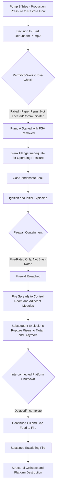

## Piper Alpha 1988 and Permit-to-Work Failures

### Overview

The Piper Alpha disaster occurred on July 6, 1988, aboard the Piper Alpha oil and gas production platform operated by Occidental Petroleum in the North Sea, United Kingdom sector. A series of explosions and escalating fires, triggered by a breakdown in permit-to-work (PTW) communication between shifts, destroyed the platform and killed 167 people, making it the deadliest offshore oil and gas disaster in history. The subsequent Cullen Inquiry produced a landmark report that fundamentally reshaped offshore safety regulation, permit-to-work systems, and the safety case regime used globally today.

### Background and Process Context

Piper Alpha was a large fixed platform performing both oil and gas production and processing, with multiple modules for separation, gas compression, and pumping tightly packed together on a single structure — a design characteristic that later proved critical to the disaster's escalation. Two condensate injection pumps (Pump A and Pump B) were used to move liquid condensate; on the day of the incident, Pump A had been taken out of service for maintenance, with its pressure safety valve removed for recalibration and the open pipe connection temporarily sealed only with a loosely fitted blank flange, not rated for full operating pressure.

### Key Points

- The root technical trigger was operation of Pump A (out of service, with a missing pressure safety valve) after Pump B failed, due to a breakdown in permit-to-work handover between the day and night shifts
- The permit-to-work system relied on paper-based records; the maintenance permit indicating Pump A's PSV removal was not physically located or cross-referenced by the night shift control room operator
- The initial gas leak and explosion breached firewalls that were designed for fire resistance but not blast/explosion resistance, defeating the platform's compartmentalization strategy
- Subsequent explosions ruptured risers connected to other platforms (Tartan and Claymore), which continued feeding the fire with gas and oil because production was not immediately shut down across the interconnected system
- The disaster led directly to the Cullen Inquiry (1990) and wholesale reform of UK offshore safety regulation, including the introduction of the Safety Case regime

### Technical Failure Sequence

1. **Pump B failure** — the operating condensate injection pump (Pump B) tripped and could not be restarted
2. **Decision to start Pump A** — the night shift, under production pressure, decided to bring the redundant Pump A online to maintain production
3. **Permit-to-work breakdown** — Pump A had been taken out of service earlier that day for maintenance on its pressure safety valve, which had been removed and not yet reinstalled; a permit documenting this was in the possession of the day-shift lead but not physically present or cross-checked in the control room, and the two shifts did not perform an adequate handover briefing
4. **Pump A started with missing PSV** — the blank flange temporarily covering the open PSV connection was not rated to contain full operating pressure and was not adequately secured
5. **Gas leak** — high-pressure condensate/gas escaped past the inadequate blank flange
6. **Initial explosion** — the escaping gas found an ignition source and exploded, causing structural damage and initiating fires
7. **Firewall failure to contain blast** — the platform's firewalls, designed primarily for fire resistance rather than blast overpressure resistance, were breached or displaced by the explosion, allowing fire and damage to spread into adjacent modules including the control room
8. **Escalation via riser rupture** — subsequent explosions ruptured oil and gas risers/pipelines connecting Piper Alpha to the nearby Tartan and Claymore platforms
9. **Continued fuel supply from interconnected platforms** — because Tartan and Claymore did not immediately shut down production and depressurize their risers (partly due to unclear protocols and delayed awareness of the severity of the Piper Alpha situation), oil and gas continued to feed the fire for an extended period
10. **Platform destruction** — the sustained, escalating fire ultimately caused structural collapse of major portions of the platform

### Diagram: Piper Alpha Escalation Sequence

### Permit-to-Work System Failure Analysis

The permit-to-work breakdown at the center of Piper Alpha illustrates several distinct failure modes relevant to any PTW system design:

**Shift Handover Failure**

- No formal, verified handover briefing occurred between the outgoing day shift (which knew Pump A's PSV was removed) and the incoming night shift (which decided to start Pump A)
- The physical permit document was not in a location where the night shift control room operator would readily see or cross-reference it before authorizing equipment operation

**Lack of Positive Verification**

- No system existed requiring positive confirmation that all permits related to a piece of equipment were closed out before that equipment could be returned to service
- The decision to start Pump A relied on the absence of information (not knowing about the open permit) rather than positive verification that the equipment was safe to operate

**Isolation and Tagging Deficiencies**

- The temporary blank flange used in place of the PSV was not treated with the same rigor as a permanent, pressure-rated closure
- No physical lock-out/tag-out or equivalent positive equipment status indication prevented operational personnel from attempting to start the pump

**Production Pressure vs. Safety Verification**

- The decision-making context prioritized restoring production capacity quickly over pausing to fully verify equipment status — a recurring theme across many major process safety incidents

### Root Causes and Contributing Factors

**Permit-to-Work and Procedural Deficiencies**

- Paper-based permit system without robust cross-referencing or centralized status tracking
- Absence of formal, mandatory shift handover procedures with verification steps for safety-critical equipment status

**Design Deficiencies**

- Firewalls designed to a fire-resistance standard without corresponding blast-resistance design, inadequate for a hydrocarbon explosion scenario
- Dense platform layout packing production, processing, and accommodation modules close together, limiting separation and increasing escalation potential
- Emergency Shutdown (ESD) and Emergency Support Vessel response systems inadequate for a scenario involving multiple interconnected platforms

**Organizational and System-Level Deficiencies**

- No formal, shared protocol requiring immediate coordinated shutdown/depressurization of interconnected platforms (Tartan, Claymore) upon a major incident on a linked platform
- Insufficient emergency response training for a full-platform catastrophic event of this scale
- [Inference] The Cullen Inquiry's findings regarding specific organizational and cultural deficiencies within Occidental's management systems are documented in the official report; broader characterizations of overall safety culture involve interpretation of that evidence rather than a single simple causal statement.

### Lessons Learned and Legacy

**Permit-to-Work System Redesign**

Piper Alpha is the foundational case for modern rigorous PTW system design, emphasizing: positive verification of equipment status before restart (not reliance on absence of contrary information), mandatory formal shift handover procedures for any open permits on safety-critical equipment, and centralized, auditable permit tracking (increasingly implemented via electronic PTW systems in modern facilities).

**Fire vs. Blast-Resistant Design**

The firewall failure demonstrated that fire-rated partitions are insufficient where an explosion (not just fire) is a credible scenario. This drove adoption of blast-resistant design standards for offshore and onshore facilities where flammable/explosive atmospheres are credible.

**Safety Case Regime**

The Cullen Inquiry recommended replacing prescriptive regulation with a "Safety Case" regime, requiring operators to demonstrate — through a comprehensive, facility-specific safety case — that major accident hazards have been identified and that risks are reduced to as low as reasonably practicable (ALARP). This became the foundation of the UK Offshore Installations (Safety Case) Regulations and has been highly influential internationally, including in aspects of API and IOGP guidance.

**Emergency Shutdown and Interconnected System Design**

The riser rupture and continued fuel feed from Tartan and Claymore highlighted the need for automatic or rapidly executable emergency shutdown and isolation systems spanning interconnected production systems, not just the platform experiencing the initial incident.

**Escape, Evacuation, and Rescue (EER)**

The high death toll, many of whom perished in the accommodation module, drove significant reform in offshore evacuation design, including temporary safe refuge requirements, escape route design independent of primary structural integrity, and emergency response vessel positioning standards.

### Regulatory and Standards Legacy

| Development | Connection to Piper Alpha |
| --- | --- |
| Cullen Inquiry Report (1990) | Official investigation producing 106 recommendations |
| UK Offshore Installations (Safety Case) Regulations (1992) | Directly implemented Cullen's safety case recommendation |
| Modern electronic Permit-to-Work systems | Industry response to the paper-based handover failure |
| Blast-resistant module/firewall design standards | Response to firewall breach during the initial explosion |
| Emergency Shutdown/ESD system design for interconnected platforms | Response to continued riser feed from Tartan/Claymore |

### Example Application in Modern Permit-to-Work Design

Consider a modern offshore or onshore facility where a redundant pump's pressure safety valve is removed for recalibration. Applying lessons from Piper Alpha, a robust PTW system would require: the permit for PSV removal to be logged in a centralized (ideally electronic) system that flags the equipment as unavailable and blocks any restart authorization until the permit is formally closed; a mandatory shift handover checklist requiring the outgoing shift to explicitly review all open permits on safety-critical equipment with the incoming shift, with signed acknowledgment; physical isolation/tagging on the equipment itself (not just paperwork) preventing inadvertent restart; and an interlock, where feasible, preventing pump start when an open maintenance permit exists on that equipment.

### Related Topics

- Permit-to-work (PTW) system design and electronic PTW systems
- Safety Case regime and ALARP demonstration
- Blast-resistant vs. fire-resistant design for offshore/onshore modules
- Shift handover procedures and communication protocols
- Emergency Shutdown (ESD) system design for interconnected process systems
- Escape, Evacuation, and Rescue (EER) design for offshore facilities
- Cullen Inquiry recommendations and their implementation history