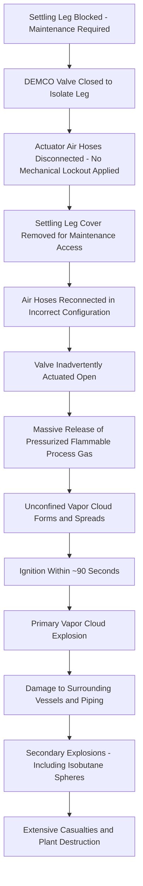

## Phillips Petroleum Pasadena 1989 and the Path to OSHA PSM

### Overview

The Phillips 66 Pasadena disaster occurred on October 23, 1989, at the Phillips Petroleum Company polyethylene plant in Pasadena, Texas, when a maintenance activity on a settling leg of a polyethylene reactor led to a massive release of flammable process gases, producing a vapor cloud explosion of extraordinary magnitude. The blast killed 23 workers and injured more than 130, and registered on seismographs as equivalent to a significant earthquake. Pasadena stands alongside Bhopal as one of the two most direct catalysts for the creation of OSHA's Process Safety Management standard (29 CFR 1910.119), issued in 1992.

### Background and Process Context

The Phillips plant produced high-density polyethylene using a slurry-phase process in large reactor loops. Reactors periodically required maintenance on "settling legs" — sections of piping with valves that allowed removal of settled polymer product. On the day of the incident, a maintenance crew was clearing a blocked settling leg on one of the reactors, a routine but hazardous procedure requiring the closure and lockout of a specific DEMCO (a brand of plug valve) valve to isolate the settling leg from the reactor's flammable, pressurized contents (a mixture including ethylene, isobutane, and hexane).

### Key Points

- The immediate trigger was the DEMCO valve being opened by contractor personnel while the associated air hoses (used to actuate the valve) had been reconnected in the wrong configuration, allowing the valve to be operated when it should have been physically locked out
- No lockout/tagout device was in place on the valve itself; the isolation of the settling leg relied entirely on the valve's actuator air supply remaining disconnected, which was defeated when the hoses were reconnected
- The plant's permit-to-work system did not require a physical lockout device be applied to the valve during the maintenance activity — reliance on hose disconnection alone was assessed by investigators as an inadequate isolation method
- The resulting release of highly flammable, pressurized process gas formed a massive vapor cloud that ignited within approximately 90 seconds, producing an explosion widely compared in magnitude to a small tactical detonation, followed by additional secondary explosions from other vessels
- OSHA's investigation identified sweeping deficiencies across process safety information, hazard analysis, and maintenance procedures, feeding directly into the rulemaking that became 29 CFR 1910.119

### Technical Failure Sequence

1. **Settling leg blockage** — a settling leg on a polyethylene reactor became blocked with polymer product, requiring maintenance to clear it
2. **Isolation via valve closure** — the DEMCO plug valve isolating the settling leg from the reactor was closed, and the valve's pneumatic actuator air hoses were disconnected as the means of preventing inadvertent reopening (no mechanical lockout device was applied to the valve itself)
3. **Contractor personnel access the area** — while maintenance work proceeded on the settling leg (with a cover removed to allow physical access), contractor personnel reconnected the air hoses to the valve actuator, reportedly in an incorrect configuration
4. **Inadvertent valve actuation** — with the hoses reconnected, the valve was able to be actuated (whether through operator action, an air control panel, or malfunction is addressed in various investigation accounts), reopening the flow path
5. **Massive release** — reactor contents — a highly pressurized mixture of ethylene, isobutane, and hexane vapor — released directly into the atmosphere through the open settling leg where the cover had been removed for maintenance
6. **Vapor cloud formation** — the released flammable gases rapidly formed a large, dense unconfined vapor cloud that spread across the process unit
7. **Ignition and primary explosion** — the vapor cloud found an ignition source within roughly 90 seconds to two minutes, resulting in a massive vapor cloud explosion (VCE)
8. **Secondary explosions and escalation** — the primary blast damaged surrounding equipment and piping, leading to additional releases and secondary explosions, including from isobutane storage spheres, significantly compounding the destruction and casualties

### Diagram: Pasadena Failure Sequence

### Isolation and Lockout/Tagout Failure Analysis

The Pasadena incident is a defining case study in inadequate energy isolation during maintenance, illustrating several distinct failure modes:

**Reliance on Non-Positive Isolation**

- Disconnecting actuator air hoses is a form of isolation, but it is not a positive, physically locked isolation method — hoses can be reconnected, whereas a proper lockout device (e.g., a physical lock and tag preventing valve operation) cannot be defeated by simply restoring a utility connection

**Absence of Formal Lockout/Tagout for the Valve**

- No lock was applied directly to the valve or its actuator to physically prevent operation regardless of air supply status
- Modern lockout/tagout (LOTO) principles, later reinforced by OSHA 29 CFR 1910.147 (finalized in 1989, the same year as the incident, though for general industry rather than process-specific application), require isolation devices that cannot be inadvertently restored without deliberate removal by authorized personnel

**Contractor Coordination Failures**

- Contractor personnel performing work adjacent to or on the isolated system were not adequately coordinated with the isolation status established by the maintenance crew, resulting in the hoses being reconnected without verification that the settling leg maintenance was complete or that reconnection was safe

**Permit-to-Work Scope Gaps**

- The permit system in place did not mandate the more rigorous positive isolation (physical lockout) that the hazard level of the operation warranted, reflecting a broader gap between administrative permit controls and physical engineering isolation

### Root Causes and Contributing Factors

**Isolation and Maintenance Procedure Deficiencies**

- Absence of mandatory mechanical lockout/tagout on valves isolating hazardous process inventory during maintenance
- Inadequate procedures governing coordination between multiple work crews (company and contractor) operating on interconnected equipment simultaneously

**Design and Layout Deficiencies**

- Close spacing between the reactor units and other hazardous inventory (including the isobutane storage spheres) contributed to escalation via secondary explosions
- [Inference] Specific findings regarding vessel spacing and design contributions to escalation are documented in the OSHA and other post-incident investigation reports; broader characterizations should be referenced to those specific findings rather than generalized further here.

**Organizational and Training Deficiencies**

- Investigations identified gaps in process hazard analysis coverage of the settling leg maintenance activity and its isolation requirements
- Contractor training and oversight regarding site-specific isolation procedures were found to be insufficient

### Lessons Learned and Legacy

**Positive Isolation Requirements**

Pasadena is a foundational case for the principle that isolation of hazardous process equipment during maintenance must use positive, physically verifiable methods (lockout devices, blinds/slip-plates, or equivalent) rather than relying on disconnected utilities or control signals alone, which can be inadvertently restored.

**Mechanical Integrity and Maintenance Procedures**

The incident directly informed the Mechanical Integrity element of OSHA PSM (29 CFR 1910.119(j)), which requires written procedures for maintaining the ongoing integrity of process equipment, including specific procedures for equipment isolation prior to maintenance.

**Contractor Safety Management**

The role of contractor personnel in the incident sequence contributed to OSHA PSM's explicit Contractor Safety element (29 CFR 1910.119(h)), requiring employers to evaluate and select contractors based on safety performance, inform contractors of known hazards, and ensure contract employees understand applicable safety procedures.

**Direct Catalyst for OSHA PSM Rulemaking**

Alongside Bhopal, Pasadena is one of the two incidents most frequently cited as directly precipitating OSHA's 1992 Process Safety Management standard. The scale of casualties from a U.S. domestic incident, combined with clear identification of procedural and isolation failures addressable through regulation, provided strong impetus for a comprehensive process safety standard covering highly hazardous chemicals in U.S. industry.

**Process Hazard Analysis Scope**

The incident reinforced that PHA must comprehensively address routine maintenance activities — not only normal operating scenarios — since maintenance-related energy isolation failures represent a recurring major accident hazard pattern across the process industries.

### Regulatory and Standards Legacy

| Development | Connection to Pasadena |
| --- | --- |
| OSHA PSM (29 CFR 1910.119), 1992 | Direct catalyst alongside Bhopal; informed Mechanical Integrity and Contractor Safety elements |
| OSHA LOTO (29 CFR 1910.147) | Reinforced need for positive lockout on process isolation valves |
| CCPS Guidelines on Safe Automation and Isolation Practices | Industry guidance response to non-positive isolation failure pattern |
| Enhanced PHA scope requirements for maintenance activities | Response to gap in hazard analysis coverage of settling leg maintenance |

### Example Application in Modern Isolation Procedures

Consider a modern facility performing maintenance on a valve isolating a reactor from a downstream line containing pressurized flammable material. Applying lessons from Pasadena, a robust isolation procedure would require: positive mechanical lockout (lock and tag) applied directly to the isolation valve itself, not reliance on disconnecting an actuator air supply or control signal alone; a documented isolation verification step confirming zero energy state before any cover, flange, or access point is opened; explicit coordination protocols when contractor and company personnel work on interconnected systems, including a shared, visible isolation status board or permit reference; and inclusion of the specific maintenance activity (settling leg clearing, in this case) within the facility's Process Hazard Analysis, addressing the consequence of inadvertent valve actuation during the procedure.

### Related Topics

- Lockout/Tagout (LOTO) program design (29 CFR 1910.147) and positive isolation methods
- Mechanical Integrity element of OSHA PSM (29 CFR 1910.119(j))
- Contractor Safety Management under OSHA PSM (29 CFR 1910.119(h))
- Vapor Cloud Explosion (VCE) consequence modeling and blast overpressure estimation
- Process Hazard Analysis scope for maintenance and non-routine operations
- History and structure of OSHA 29 CFR 1910.119 rulemaking
- Facility siting and vessel spacing to limit escalation from secondary explosions