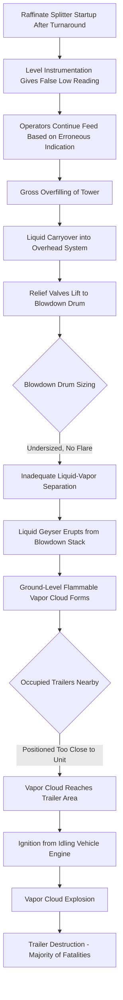
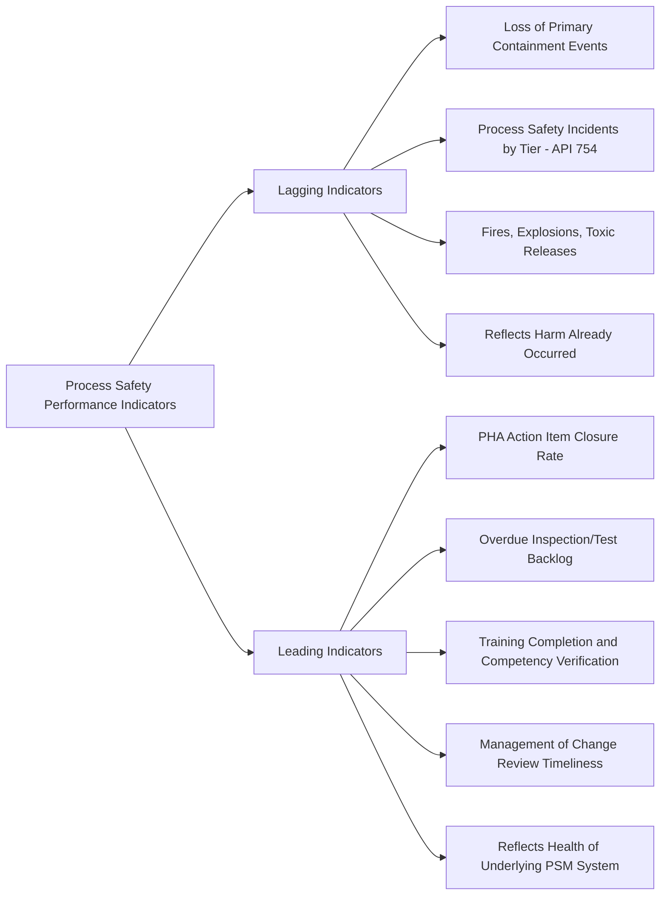

## Texas City Refinery Explosion 2005 and the Baker Panel Report

### Overview

The Texas City Refinery explosion occurred on March 23, 2005, at the BP-operated refinery in Texas City, Texas, when a raffinate splitter tower in the Isomerization (ISOM) unit was overfilled and overpressured during startup, leading to a liquid geyser release from a blowdown stack that formed a flammable vapor cloud, which subsequently ignited. The explosion killed 15 people and injured more than 170, most of whom were in or near temporary trailers positioned close to the process unit. The incident triggered the independent Baker Panel investigation, which produced findings that reshaped how the industry — and later, OSHA and API — approached process safety culture, leading indicators, and corporate governance of major accident risk, distinct from purely technical or engineering fixes.

### Background and Process Context

The ISOM unit's raffinate splitter tower was being restarted after a maintenance turnaround. The startup procedure required filling the tower with raffinate feed to a specified level before beginning normal operation. On the day of the incident, the tower was filled well beyond its intended startup level — investigations found liquid level had risen far past the top of the tower — while operators, relying on level instrumentation that was later found to be providing inaccurate readings, believed the level was low or dropping.

### Key Points

- The immediate technical trigger was gross overfilling of the raffinate splitter tower during startup, driven partly by malfunctioning/miscalibrated level instrumentation that gave operators a false low-level indication
- Liquid overflowed into the overhead system and was directed to a blowdown drum and stack that vented directly to the atmosphere rather than to a flare — a design lacking modern vapor control for this service
- The blowdown stack, undersized and without a flare, geysered flammable liquid and vapor into the atmosphere, forming a ground-level vapor cloud that ignited, likely from a running vehicle engine
- Temporary office trailers housing contractor personnel were located dangerously close to the blowdown stack and the ISOM unit, contributing significantly to the fatality count
- The Baker Panel, an independent panel commissioned by BP following the incident, found systemic deficiencies in process safety culture, leading indicator metrics, and corporate oversight extending well beyond the immediate technical causes

### Technical Failure Sequence

1. **Startup initiated** — the raffinate splitter tower was being brought back into service after maintenance, requiring controlled filling to a target startup level
2. **Level instrumentation malfunction/misreading** — the level indication available to operators did not accurately reflect the true, rapidly rising liquid level in the tower; operators believed level was low or normal when it was in fact far above the top of the tower
3. **Continued feed input without adequate cross-verification** — operators continued introducing feed based on the erroneous low-level indication, compounded by shift handover gaps and lack of clear startup procedure adherence
4. **Gross overfilling** — the tower filled to a point well beyond its design intent, with liquid entering the overhead vapor line
5. **Relief to blowdown system** — as pressure built, the overhead relief valves lifted, directing liquid and vapor to the blowdown drum
6. **Blowdown drum/stack inadequate for liquid carryover** — the blowdown drum was undersized to separate the large liquid volume from vapor, and the stack vented directly to atmosphere without a flare, a design considered obsolete for this potential liquid-carryover scenario by contemporary standards
7. **Liquid geyser release** — a geyser of flammable liquid and vapor erupted from the top of the blowdown stack
8. **Vapor cloud formation at grade** — the released liquid partially vaporized and fell as a dense, ground-hugging flammable vapor/mist cloud around the base of the stack, spreading toward nearby occupied trailers
9. **Ignition** — the vapor cloud ignited, most likely from an idling diesel pickup truck engine near the temporary trailers
10. **Explosion and trailer destruction** — the resulting vapor cloud explosion destroyed or severely damaged the nearby occupied trailers, causing the majority of the fatalities and injuries

### Diagram: Texas City Failure Sequence

### Root Causes and Contributing Factors

**Process and Instrumentation Deficiencies**

- Level instrumentation on the raffinate splitter was found to be unreliable/inaccurate, providing a false indication that masked the actual dangerously high liquid level
- Absence of a high-level alarm or automatic trip that was functioning and appropriately configured to prevent gross overfilling
- Blowdown drum/stack design (venting to atmosphere, undersized for liquid carryover) reflected outdated engineering practice inconsistent with API guidance current at the time for this service

**Procedural and Operational Deficiencies**

- Startup procedures were found to be inadequate or not properly followed, with historical evidence of the same unit having experienced level-control problems during startups previously without corrective action
- Shift handover between the outgoing night shift and incoming day shift regarding the startup status was found by investigators to be deficient
- Fatigue among operating personnel due to extended work hours was identified as a contributing factor by multiple investigations

**Facility Siting and Layout Deficiencies**

- Temporary trailers used for contractor personnel (present for turnaround work) were sited close to a process unit handling flammable hydrocarbons, without adequate blast/vapor cloud risk assessment for that siting decision — a direct violation of the facility siting principles later reinforced by API RP 752/753

**Organizational and Cultural Deficiencies (Baker Panel Findings)**

The Baker Panel's investigation extended well beyond the immediate technical trigger to examine BP's broader corporate process safety management, finding:

- Over-reliance on personal/occupational safety metrics (e.g., recordable injury rates) as a proxy for process safety performance, when these metrics do not reliably predict major accident risk
- Insufficient corporate-level process safety leadership, oversight, and resource allocation across BP's U.S. refining operations
- A corporate culture that, per the panel's findings, did not sufficiently prioritize process safety as distinct from personal safety
- Deferred maintenance and capital investment in aging infrastructure at the Texas City refinery
- Inadequate implementation and auditing of process safety management systems across the organization, despite formal PSM program existence

[Inference] The Baker Panel's specific findings regarding corporate culture and management systems are documented in its published report; characterizations of overall organizational culture involve interpretation of that evidence, and readers seeking precise findings should reference the Baker Panel Report directly.

### The Baker Panel Report — Key Contributions

The Baker Panel (formally, the BP U.S. Refineries Independent Safety Review Panel), chaired by former U.S. Secretary of State James A. Baker III, was commissioned by BP in the aftermath of the incident and issued its report in January 2007. Its most significant and lasting contributions to the process safety field include:

**Distinction Between Process Safety and Personal (Occupational) Safety**

The panel's most widely cited finding is that low personal injury/occupational safety statistics (e.g., low recordable injury rates) can coexist with — and mask — significant underlying process safety risk. This distinction became a cornerstone of modern process safety management thinking industry-wide.

**Process Safety Performance Indicators (Leading and Lagging)**

The panel's recommendations directly contributed to the development and widespread industry adoption of process safety performance indicator frameworks, distinguishing:

- **Lagging indicators** — indicators of harm that has already occurred (e.g., loss of primary containment events, process safety incidents by tier)
- **Leading indicators** — indicators of the health of underlying process safety management system elements (e.g., percentage of PHA action items closed on schedule, overdue inspections, training completion rates)

This leading/lagging framework was subsequently formalized in guidance such as API RP 754 (Process Safety Performance Indicators for the Refining and Petrochemical Industries) and CCPS process safety metrics guidance.

**Corporate Governance of Process Safety**

The panel emphasized that process safety performance requires visible, active leadership commitment and oversight at the highest corporate levels — not solely delegation to site-level management — and recommended structural changes to ensure process safety risk is reported to and understood by corporate boards.

**Independent Audit and Verification**

Recommendations included regular, independent (not solely internal) audits of process safety management system implementation, recognizing that a documented PSM program does not guarantee effective real-world implementation.

### Diagram: Leading vs. Lagging Indicator Framework (Baker Panel Legacy)

### Lessons Learned and Legacy

**Process Safety vs. Personal Safety Metrics**

Texas City is the defining case establishing that occupational safety performance (slips, falls, minor injuries) is not a valid proxy for process safety risk. Organizations must track and act on process-specific indicators distinct from personal injury statistics.

**Facility Siting for Temporary Structures**

The trailer siting failure directly reinforced and accelerated adoption of API RP 752 (Management of Hazards Associated with Location of Process Plant Permanent Buildings) and the subsequent API RP 753 addressing temporary buildings specifically, given that Texas City's fatalities were concentrated in temporary trailers.

**Blowdown System Design Standards**

The incident accelerated the phase-out of atmospheric blowdown stacks without flares for services with credible liquid carryover potential, reinforcing API 521 guidance on relief and flare system design for such scenarios.

**Startup and Non-Routine Operation Hazard Analysis**

The failure occurring during startup (a non-routine operating mode) reinforced that Process Hazard Analysis must comprehensively address startup, shutdown, and other non-routine operating modes, not only steady-state operation.

**Corporate Process Safety Governance**

The Baker Panel's recommendations regarding board-level process safety oversight, independent auditing, and leading/lagging indicator tracking became widely adopted across the process industries, well beyond BP, and influenced OSHA's subsequent National Emphasis Program on refinery process safety.

### Regulatory and Standards Legacy

| Development | Connection to Texas City / Baker Panel |
| --- | --- |
| API RP 754 (2010) | Formalized leading/lagging process safety indicator framework |
| API RP 753 | Addressed siting of temporary buildings near process hazards |
| OSHA Refinery/PSM National Emphasis Program | Increased regulatory scrutiny of refinery PSM compliance |
| CCPS Process Safety Metrics guidance | Industry-wide adoption of leading/lagging indicator concepts |
| Widespread phase-out of atmospheric blowdown stacks | Reinforced by API 521 relief system design guidance |

### Example Application in Modern Process Safety Metrics Programs

Consider a modern refinery seeking to avoid a Texas-City-type blind spot. Applying Baker Panel lessons, the facility would implement a metrics dashboard tracking both lagging indicators (Tier 1/Tier 2 process safety events per API RP 754 definitions) and leading indicators (percentage of safety-critical instrumentation calibrations completed on schedule, PHA recommendation closure rate, overdue mechanical integrity inspections), reported not only to site management but escalated to corporate leadership on a defined cadence. Additionally, any decision to site temporary trailers or occupied structures near a process unit would trigger a formal facility siting risk assessment per API RP 753 before placement is authorized, rather than being treated as a routine logistics decision.

### Related Topics

- Leading vs. lagging process safety indicators (API RP 754)
- Facility siting for permanent and temporary buildings (API RP 752/753)
- Blowdown and flare system design standards (API 521)
- Process Hazard Analysis for startup, shutdown, and non-routine operations
- Corporate governance and board-level process safety oversight
- Baker Panel Report recommendations and industry adoption
- Fatigue management in process operations staffing