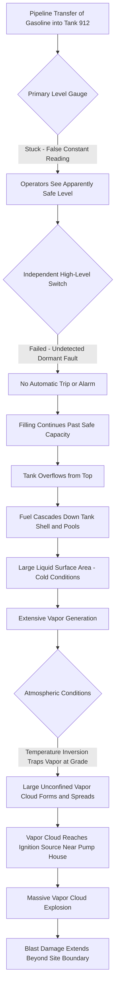

## Buncefield 2005 and Overfill Protection Failures

### Overview

The Buncefield incident occurred on December 11, 2005, at the Buncefield Oil Storage Depot in Hemel Hempstead, England, when Tank 912 was overfilled with unleaded gasoline, releasing a large volume of fuel that formed a massive unconfined vapor cloud, which subsequently ignited in what remains one of the largest peacetime explosions in Europe. The blast injured dozens (though remarkably, given the scale, no fatalities occurred, largely due to the timing in the early morning before most staff arrived), caused extensive property damage in the surrounding area, and became the defining case study for overfill protection system failure and independent protection layer design in atmospheric storage tank operations.

### Background and Process Context

Buncefield was a large fuel storage and distribution depot receiving refined petroleum products via pipeline from refineries for onward distribution. Tank 912 was being filled with unleaded gasoline via an automated pipeline transfer operation, relying on instrumentation and control systems to manage the fill rate and to signal when the tank approached its safe maximum level.

### Key Points

- The immediate technical trigger was catastrophic overfilling of Tank 912 because both the primary level gauge (which had stuck and was providing a false constant reading) and the independent high-level switch (which failed to trigger a shutdown, later found to have failed in a manner that was not detected) did not function
- The overflowing gasoline cascaded down the tank's exterior and formed a large pool, generating a massive, cold, unconfined vapor cloud that spread across the site and into neighboring areas due to a temperature inversion trapping the vapor near ground level overnight
- The vapor cloud found an ignition source (investigation identified a likely source in the vicinity of the site's pump house or fire pump enclosure) and exploded with a yield and blast damage radius far larger than had been previously modeled as credible for this type of atmospheric storage facility
- Both the level gauge and the independent high-level alarm/trip system — intended to be independent protection layers — had failed silently, with no routine functional testing regime in place to detect the dormant failures before they were needed
- The Buncefield Major Incident Investigation Board produced findings that fundamentally reshaped tank overfill protection standards, secondary containment design, and independent protection layer (IPL) testing requirements globally

### Technical Failure Sequence

1. **Pipeline transfer initiated** — unleaded gasoline was being pumped into Tank 912 as part of a routine, largely automated overnight receipt operation
2. **Primary level gauge failure (stuck reading)** — the tank's automatic tank gauge (ATG), used by control room operators to monitor filling progress, became stuck and continued to display a constant, non-increasing level reading rather than the true rising level
3. **Operator reliance on erroneous primary indication** — control room staff, observing an apparently stable/safe level reading, did not intervene to stop or slow the transfer
4. **Independent high-level switch failure** — an independent high-level trip system, mechanically and electrically separate from the primary gauge and intended to automatically stop the inflow or alarm if the primary system failed, did not activate; post-incident investigation found this device had a specific failure mode (a float-type switch that could stick) that had gone undetected due to inadequate functional testing
5. **Continued filling past safe capacity** — with both the primary and independent overfill protection layers unavailable, filling continued well beyond the tank's safe maximum level
6. **Tank overflow** — gasoline overflowed from the top of the tank, cascading down the external tank shell
7. **Bund/secondary containment overwhelm and vapor generation** — the released fuel pooled within the site's containment area; the very large liquid surface area and cold ambient conditions (a still, cold December night) contributed to substantial vapor generation and evaporation
8. **Vapor cloud accumulation under temperature inversion** — a nocturnal temperature inversion trapped the dense, cold hydrocarbon vapor near ground level rather than allowing it to disperse upward, allowing an unusually large and concentrated vapor cloud to form and spread across the site and beyond the boundary
9. **Ignition** — the vapor cloud found an ignition source, with investigation identifying the pump house/fire pump area as a probable ignition location
10. **Massive vapor cloud explosion** — the resulting explosion was significantly larger than prior consequence models for this facility type had anticipated, with blast damage extending well beyond the site boundary into surrounding commercial properties

### Diagram: Buncefield Failure Sequence

### Independent Protection Layer (IPL) Failure Analysis

Buncefield is a defining case study in the failure of what were assumed to be independent, redundant protective layers, illustrating principles central to Layer of Protection Analysis (LOPA):

**Assumed vs. Actual Independence**

- The primary gauge and the independent high-level switch were intended to be independent — a failure of one should not affect the reliability of the other
- However, both failed simultaneously (through unrelated failure modes), which is statistically possible when neither layer's failure probability is well characterized or the layers are not both regularly, independently function-tested

**Dormant/Undetected Failure Modes**

- Both failed components had reportedly been in a failed state for some time before the incident, with no routine functional testing in place to detect a dormant fault before the protective function was actually called upon
- This illustrates the core principle that a safety instrumented function's reliability depends critically on its proof-test interval — an untested safety device provides a false sense of security while its actual availability may be far lower than assumed

**Overfill Prevention System Design Standard**

- Investigation findings drove the recognition that overfill protection for atmospheric storage tanks handling flammable liquids should be designed and managed with the same rigor as a Safety Instrumented Function (SIF) under IEC 61511, including defined Safety Integrity Level (SIL) targets, independent testing regimes, and management of functional safety over the equipment lifecycle

### Root Causes and Contributing Factors

**Instrumentation and Protective System Deficiencies**

- Primary automatic tank gauge failure mode (sticking) was not a recognized or monitored failure condition
- Independent high-level switch lacked a routine, documented functional proof-test program to verify it would operate on demand
- No diverse technology or additional redundancy existed beyond these two layers for a large-inventory flammable liquid tank

**Operational and Procedural Deficiencies**

- Control room staff had no independent means (e.g., cross-checking against pipeline flow totals/mass balance) to detect the discrepancy between expected filling progress and the apparently static gauge reading
- Overnight/unattended operational periods reduced the likelihood of an alert operator noticing anomalous conditions through direct observation

**Consequence Modeling and Siting Deficiencies**

- Pre-incident risk assessments for the facility had not anticipated a vapor cloud explosion of the scale that occurred; the consequence severity substantially exceeded prior modeling assumptions for atmospheric tank overfill scenarios
- Secondary containment (bunding) design had not adequately accounted for the vapor generation and dispersion behavior under the specific meteorological conditions present that night (temperature inversion)

**Regulatory and Industry Standard Gaps (at the time)**

- [Inference] The Buncefield Major Incident Investigation Board's reports document that prevailing industry guidance at the time did not adequately address the specific combination of failure modes seen at Buncefield; the precise regulatory gap characterization is detailed in the Board's published recommendations, which should be consulted directly for the complete findings.

### Lessons Learned and Legacy

**Overfill Protection as a Safety Instrumented Function**

Buncefield is the foundational case for treating tank overfill protection with SIL-rated Safety Instrumented Function rigor rather than as simple instrumentation. This includes defined proof-test intervals, documented failure modes, and Safety Requirements Specifications addressing the specific overfill hazard scenario.

**Independent Layer Testing and Verification**

The dormant, undetected failure of the independent high-level switch reinforced that independent protection layers must be subject to routine, documented functional testing at intervals justified by the required risk reduction — an untested protective device cannot be credited with its assumed reliability.

**Secondary Containment and Bund Design**

Post-Buncefield guidance significantly revised secondary containment (bund) design standards to better address large-scale overfill scenarios, vapor generation, and the potential for bund overtopping or vapor escape beyond the immediate containment area.

**Vapor Cloud Explosion Consequence Modeling for Atmospheric Tanks**

The unexpectedly severe explosion overturned prior assumptions that atmospheric-pressure gasoline storage tank overfills would primarily result in pool fires rather than large-scale vapor cloud explosions; this drove revision of consequence modeling approaches to better account for congestion, confinement, and meteorological conditions that can promote VCE rather than simple pool fire outcomes.

**Human Factors in Automated Operations**

The incident highlighted risks in highly automated, overnight, minimally staffed operations where operators have limited independent means to detect instrumentation failure, reinforcing the value of diverse-technology cross-checks (e.g., mass balance/flow totalization) as a complement to primary level instrumentation.

### Regulatory and Standards Legacy

| Development | Connection to Buncefield |
| --- | --- |
| Buncefield Standards Task Group (BSTG) recommendations | Direct industry/regulatory response producing revised UK guidance |
| Process Safety Leadership Group (PSLG) | UK cross-industry body established to drive implementation of Buncefield lessons |
| Revised tank overfill protection guidance (SIL-rated systems) | Direct response to independent layer failure |
| Revised secondary containment/bund design guidance | Response to vapor generation and containment performance gaps |
| Enhanced consequence modeling practice for atmospheric tank VCE potential | Response to unexpectedly severe explosion outcome |

### Example Application in Modern Overfill Protection Design

Consider a modern atmospheric storage tank receiving flammable liquid via automated pipeline transfer. Applying Buncefield lessons, the facility would implement: a primary level gauge and a functionally independent, diverse-technology high-level trip system, each designed and managed as components of a defined Safety Instrumented Function with an assigned SIL target per IEC 61511; a documented, enforced proof-test schedule for the independent high-level trip, with testing intervals justified by the required probability of failure on demand; an independent mass-balance or flow-totalization cross-check accessible to control room operators to detect discrepancies between expected and indicated tank filling progress; and secondary containment design validated against credible large-scale overfill volumes, including consideration of vapor generation and dispersion behavior under adverse meteorological conditions such as temperature inversions.

### Related Topics

- Safety Instrumented Systems (SIS) and Safety Integrity Level (SIL) determination (IEC 61511)
- Independent Protection Layer (IPL) design and proof-testing intervals
- Layer of Protection Analysis (LOPA) methodology
- Secondary containment (bund) design standards for atmospheric storage tanks
- Vapor cloud explosion (VCE) consequence modeling and congestion/confinement effects
- Automatic Tank Gauging (ATG) system reliability and failure modes
- Temperature inversion effects on vapor dispersion behavior