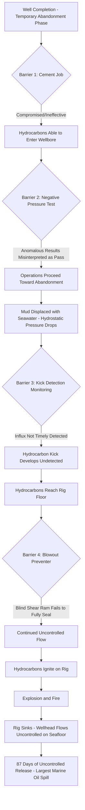

## Deepwater Horizon 2010 and Barrier Management Failures

### Overview

The Deepwater Horizon disaster occurred on April 20, 2010, aboard the Transocean-owned, BP-operated semi-submersible drilling rig Deepwater Horizon, operating the Macondo well in the Gulf of Mexico. A blowout during well completion operations led to an uncontrolled release of hydrocarbons, a catastrophic explosion and fire that killed 11 crew members, the sinking of the rig, and the largest accidental marine oil spill in history, with the well flowing uncontrolled for 87 days before final capping. The disaster became the defining modern case study in well barrier management, the failure of multiple independent barriers, and the complex interaction between organizational decision-making, cost/schedule pressure, and technical risk in deepwater drilling operations.

### Background and Process Context

The Macondo well was in its final stages of temporary abandonment, having completed drilling to total depth and undergoing cementing and well-control operations intended to safely isolate the hydrocarbon-bearing formation before the rig moved off location. Well control in this phase relies on a series of physical and procedural barriers, including drilling mud column hydrostatic pressure, cement barriers, and mechanical barriers (casing, seals, the blowout preventer), each intended to independently prevent hydrocarbon influx (a "kick") from reaching the surface uncontrolled.

### Key Points

- The immediate technical trigger was a failure of the cement barrier at the bottom of the well, allowing hydrocarbons to enter the wellbore, combined with failure to detect the resulting influx ("kick") during negative pressure testing and subsequent monitoring
- Multiple independent well barriers failed or were compromised nearly simultaneously: the cement job, the negative pressure test interpretation, kick detection during displacement operations, and ultimately the blowout preventer (BOP), which failed to fully seal the well when activated
- Significant organizational and decision-making factors were identified by multiple investigations, including cost and schedule pressure influencing technical decisions about well design and barrier verification
- The BOP's blind shear ram, the final mechanical barrier, failed to fully shear and seal the drill pipe, allowing continued hydrocarbon flow even after activation
- The disaster drove fundamental reform in offshore drilling regulation (creation of the Bureau of Safety and Environmental Enforcement, BSEE, separating safety regulation from resource leasing functions previously combined under the Minerals Management Service) and reinforced barrier-based risk management (bowtie methodology) as a standard framework industry-wide

### Technical Failure Sequence

1. **Cement job at well bottom** — a cement barrier was placed to isolate the hydrocarbon-bearing formation at the bottom of the well as part of temporary abandonment procedures; subsequent investigation found the cement slurry design and placement were compromised, allowing the cement to fail as an effective barrier
2. **Negative pressure test misinterpretation** — a negative pressure test, designed to verify that the well was successfully isolated (no flow from the formation), produced anomalous results; rig personnel and shore-based engineering support ultimately interpreted the test as successful ("passed") despite conflicting data patterns that, in later analysis, indicated a failed test
3. **Continued operations toward well abandonment** — based on the (mis)interpreted successful test, the crew proceeded with subsequent operations, including displacing heavy drilling mud from the riser with lighter seawater, which reduced hydrostatic pressure holding back the formation
4. **Kick undetected during displacement** — as mud was displaced and hydrostatic pressure decreased, hydrocarbons began entering the wellbore (a "kick"); monitoring of pit volumes and flow-out rates that should have detected this influx did not result in timely recognition, reportedly complicated by simultaneous operations and monitoring practices at the time
5. **Hydrocarbon influx reaches surface** — the undetected kick continued to develop, and hydrocarbons ultimately reached the rig floor level
6. **Well control attempt and BOP activation** — as the situation became apparent, crew attempted well control measures and activated the blowout preventer, the final mechanical barrier intended to seal the well by shearing the drill pipe and sealing the wellbore
7. **Blowout preventer failure to fully seal** — the BOP's blind shear ram engaged but failed to fully shear the drill pipe and achieve a complete seal, reportedly due to the drill pipe being off-center in the ram (buckled) at the moment of activation, among other contributing technical findings across the various investigations
8. **Uncontrolled hydrocarbon release and explosion** — hydrocarbons continued flowing onto the rig, finding ignition sources and resulting in a massive explosion and fire
9. **Rig destruction and sinking** — the fire could not be controlled, and the Deepwater Horizon sank approximately 36 hours later, with the wellhead left flowing uncontrolled on the seafloor
10. **Extended uncontrolled flow** — the well continued discharging oil into the Gulf of Mexico for 87 days until successfully capped, resulting in the largest accidental marine oil spill in U.S. history

### Diagram: Deepwater Horizon Barrier Failure Sequence

### Barrier Management Failure Analysis

Deepwater Horizon is the defining modern case for understanding how multiple, ostensibly independent barriers can fail in sequence or simultaneously, closely aligned with bowtie and Swiss-cheese barrier models used in process safety:

**Barrier Independence and Common-Cause Vulnerability**

- Well control barriers (cement, mechanical barriers, testing/verification procedures, monitoring) are intended to be independent, but investigation findings identified that decisions affecting multiple barriers were made under shared organizational pressures (time, cost) that could undermine several barriers' effectiveness simultaneously — a common-cause-like vulnerability at the decision-making level rather than purely a hardware coincidence

**Verification and Test Interpretation Failure**

- The negative pressure test is a critical verification barrier specifically intended to confirm well integrity before proceeding; its misinterpretation illustrates that a verification step is only as effective as the competence, procedure clarity, and decision criteria applied to interpreting its results — an ambiguous or poorly standardized interpretation protocol can neutralize an otherwise sound verification barrier

**Final Mechanical Barrier Reliability**

- The BOP, as the last line of mechanical defense, was found to have design and maintenance issues (including, per various investigation findings, battery/control system deficiencies and the specific pipe-buckling scenario that impaired shearing) that had not been fully anticipated in its risk-based design basis
- This reinforced that "ultimate" or "last-resort" barriers require rigorous, ongoing verification of their capability across the full range of credible failure scenarios, not just idealized conditions

**Simultaneous Operations Risk**

- Multiple operations occurring concurrently on the rig at the time of the incident were identified by investigations as complicating personnel's ability to correctly interpret monitoring data and recognize the developing kick in a timely manner

### Root Causes and Contributing Factors

**Technical and Engineering Deficiencies**

- Cement slurry design and placement did not achieve an effective barrier at the base of the well (multiple investigations examined specific technical contributors, including slurry stability and centralization practices)
- Blowout preventer design and maintenance issues affecting its ability to achieve a complete seal under the actual failure conditions encountered

**Procedural and Decision-Making Deficiencies**

- Negative pressure test results were ambiguous and were interpreted through a process that did not adequately resolve the conflicting data, allowing operations to proceed despite warning signs
- Kick detection monitoring practices and simultaneous operations reduced the likelihood of timely recognition of the developing influx

**Organizational and Risk Management Deficiencies**

- Multiple official investigations (including the National Commission on the BP Deepwater Horizon Oil Spill and Offshore Drilling, and the joint Coast Guard/BOEMRE investigation) identified that time and cost pressure associated with the well being significantly behind schedule and over budget influenced decisions regarding barrier verification and well design choices
- [Inference] The specific weighting of organizational/cultural versus purely technical causation has been analyzed differently across the several official and industry investigations conducted; readers seeking definitive attribution should consult the specific investigation reports (e.g., the National Commission report, the BOEMRE report, or BP's own internal investigation) as findings and emphasis vary somewhat between them.

**Regulatory Oversight Deficiencies (Pre-Incident)**

- The Minerals Management Service (MMS), the pre-incident regulator, combined resource leasing/revenue functions with safety oversight responsibilities, a structural arrangement later identified as creating a potential conflict of interest in safety regulation

### Lessons Learned and Legacy

**Barrier-Based Risk Management (Bowtie Methodology)**

Deepwater Horizon significantly reinforced industry-wide adoption of bowtie/barrier-based risk visualization and management, explicitly mapping preventive barriers (preventing an unwanted event) and mitigative barriers (limiting consequences if the event occurs), with clear accountability for the ongoing performance and testing of each barrier.

**Well Control Verification Standards**

The incident drove significant revision of well control testing and verification standards, including clearer, more standardized criteria for interpreting negative pressure tests and other well integrity verification procedures, reducing reliance on subjective judgment under ambiguous data.

**Blowout Preventer Design and Reliability**

Post-incident regulation and industry standards (including API Standard 53 revisions) addressed BOP design, testing, and reliability requirements, including addressing scenarios such as off-center pipe conditions during shear ram activation.

**Separation of Safety Regulation from Resource Development**

A major structural regulatory reform followed directly from the incident: the Minerals Management Service was reorganized, ultimately resulting in the creation of the Bureau of Safety and Environmental Enforcement (BSEE) as a distinct entity focused on safety and environmental enforcement, separate from the Bureau of Ocean Energy Management (BOEM), which retained leasing and resource management functions — directly addressing the identified conflict-of-interest structure.

**Safety and Environmental Management Systems (SEMS)**

The incident drove the introduction of mandatory Safety and Environmental Management Systems (SEMS) requirements for U.S. offshore oil and gas operations, establishing a systematic risk management framework analogous to onshore PSM requirements, tailored to offshore drilling and production operations.

**Organizational Decision-Making Under Schedule Pressure**

The incident is frequently cited in process safety training as a case study in how time and cost pressure can subtly erode barrier verification rigor across multiple, seemingly unrelated decision points, reinforcing the need for organizational safeguards (independent technical review, clear stop-work authority) that are resistant to schedule pressure.

### Regulatory and Standards Legacy

| Development | Connection to Deepwater Horizon |
| --- | --- |
| Bureau of Safety and Environmental Enforcement (BSEE) creation | Direct structural reform separating safety regulation from leasing functions |
| Safety and Environmental Management Systems (SEMS) rule | Introduced systematic risk management framework for offshore operations |
| API Standard 53 revisions | Addressed blowout preventer design, testing, and reliability |
| Well Control Rule (BSEE, 2016) | Enhanced well control equipment and procedural requirements |
| Widespread bowtie/barrier management adoption | Reinforced industry-wide barrier-based risk visualization practice |

### Example Application in Modern Barrier Management

Consider a modern offshore well completion operation approaching final abandonment. Applying Deepwater Horizon lessons, a robust barrier management approach would require: standardized, unambiguous acceptance criteria for negative pressure tests, with any anomalous result triggering mandatory escalation to independent technical review rather than field-level interpretation alone; explicit bowtie documentation of all well barriers (cement, mechanical, procedural, monitoring) with defined verification methods and accountable owners for each; kick detection monitoring protocols that account for and are not degraded by simultaneous rig operations; and organizational governance mechanisms — such as an empowered stop-work policy and independent technical authority review for barrier verification decisions — designed specifically to resist schedule and cost pressure at the point of critical safety decisions.

### Related Topics

- Bowtie methodology and barrier-based risk management
- Well control barrier verification (negative pressure testing standards)
- Blowout preventer (BOP) design, testing, and reliability (API Standard 53)
- Safety and Environmental Management Systems (SEMS) for offshore operations
- Organizational decision-making under schedule and cost pressure
- Regulatory separation of safety oversight from resource development functions
- Kick detection and well monitoring during simultaneous operations