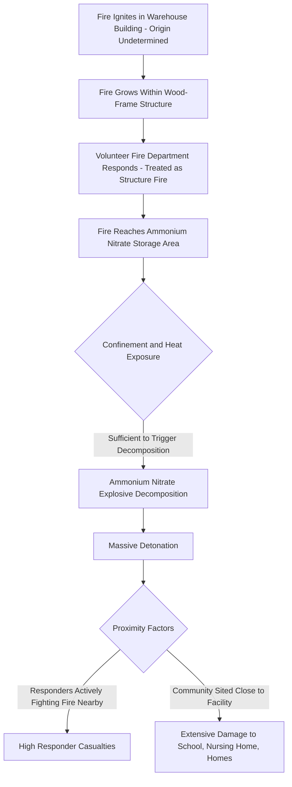

## West Fertilizer Explosion 2013 and Its Regulatory Influence

### Overview

The West Fertilizer Company explosion occurred on April 17, 2013, at a fertilizer storage and distribution facility in West, Texas, when a fire in a building storing ammonium nitrate led to a massive detonation, killing 15 people (mostly firefighters and emergency responders who were fighting the initial fire when the explosion occurred), injuring more than 260, and destroying or damaging hundreds of structures in the surrounding community, including a school and a nursing home. The incident became a pivotal case in exposing significant regulatory gaps regarding ammonium nitrate storage, facility siting near communities, and coordination between facilities and local emergency responders, ultimately driving both federal regulatory review and state-level reform.

### Background and Process Context

West Fertilizer Company stored and distributed agricultural products including anhydrous ammonia and ammonium nitrate, a widely used nitrogen fertilizer that is also a powerful oxidizer capable of explosive decomposition under certain conditions (notably when subjected to sufficiently intense and sustained heat, particularly when contaminated or confined). The facility stored ammonium nitrate in a wooden structure, with the surrounding community — including homes, a school, and a nursing home — located in close proximity to the facility, reflecting land-use patterns that had developed around the facility over time without hazard-based siting controls.

### Key Points

- The immediate technical trigger was a fire of undetermined origin (investigation identified several possible ignition sources but could not conclusively establish a single definitive cause) that began in the seed and fertilizer storage/warehouse building and reached the ammonium nitrate storage area
- The stored ammonium nitrate (approximately 30 tons, per various investigation accounts) underwent explosive decomposition once exposed to sufficiently intense, sustained fire conditions, producing a massive detonation
- Emergency responders, including volunteer firefighters, were actively fighting the fire in close proximity to the ammonium nitrate storage at the time of detonation, without complete awareness of the specific explosion hazard posed by ammonium nitrate under fire conditions, contributing significantly to responder casualties
- The facility was sited in extremely close proximity to residential areas, a school, and a nursing home, with no hazard-based buffer zone or land-use planning control in place
- The incident exposed significant gaps in ammonium nitrate storage regulation (including the fact that ammonium nitrate storage at the facility fell below regulatory thresholds triggering certain federal chemical safety oversight programs) and in coordination/information-sharing between the facility and local emergency responders regarding on-site hazardous materials

### Technical Failure Sequence

1. **Fire ignition** — a fire began in the facility's seed/fertilizer warehouse building; the specific ignition source was not conclusively determined by investigators, though several possibilities were examined (electrical fault, and other potential ignition sources considered during the investigation)
2. **Fire growth and spread** — the fire grew and spread within the wood-frame structure, which also housed or was in proximity to the ammonium nitrate storage
3. **Emergency response mobilization** — local volunteer fire department and other responders arrived and began firefighting operations, treating the incident as a structure fire
4. **Fire reaches ammonium nitrate storage** — the fire extended to or sufficiently heated the stored ammonium nitrate under confinement conditions within the structure
5. **Explosive decomposition threshold reached** — ammonium nitrate, an oxidizer that can undergo explosive decomposition when exposed to sufficiently intense and sustained heat (particularly under confinement, contamination, or specific packaging conditions), reached conditions sufficient to trigger detonation
6. **Massive detonation** — the ammonium nitrate detonated, producing a blast registering as a seismic event, destroying the immediate facility and causing catastrophic damage across a wide radius
7. **Responder and community casualties** — because firefighting operations were actively underway in close proximity at the time of detonation, and because the surrounding community was situated very close to the facility, casualties and damage were severe among both responders and nearby residents/structures

### Diagram: West Fertilizer Failure Sequence

### Root Causes and Contributing Factors

**Storage and Hazard Awareness Deficiencies**

- Ammonium nitrate was stored in a manner (wood-frame structure, proximity to other combustible materials) that did not adequately account for its fire and explosion decomposition hazard
- No indication that facility hazard information had been effectively communicated to responding firefighters in a way that would have informed a different tactical response (e.g., a defensive-only strategy avoiding close-proximity interior or near-structure firefighting given the ammonium nitrate hazard)

**Emergency Response Coordination Deficiencies**

- Local responders, many of them volunteers, reportedly had limited or incomplete awareness of the specific quantity and hazard characteristics of ammonium nitrate stored on-site at the time of the incident
- Pre-incident emergency planning and coordination between the facility and local fire/emergency services regarding hazardous materials on-site was found to be inadequate

**Regulatory Coverage Gaps**

- The facility's ammonium nitrate storage quantity, combined with the specific regulatory thresholds and classifications in effect at the time, meant the facility did not trigger certain federal chemical process safety oversight programs (such as OSHA PSM, which does not list ammonium nitrate among covered substances in the same way as other reactive/explosive materials, and EPA RMP coverage thresholds) that might otherwise have prompted more rigorous hazard review
- [Inference] The precise regulatory classification history and specific threshold determinations applicable to this facility are addressed in detail in the U.S. Chemical Safety Board's investigation report; readers seeking the exact regulatory coverage analysis should consult that report directly, as classification questions involve specific technical and legal determinations.

**Land-Use and Facility Siting Deficiencies**

- The facility had been sited, or the community had grown up around it, without hazard-based zoning or buffer distance requirements accounting for a credible ammonium nitrate explosion scenario
- Structures including a school and nursing home were located within a distance that suffered severe damage, reflecting an absence of land-use planning coordination between local zoning authorities and facility hazard information

### The U.S. Chemical Safety Board (CSB) Investigation

The CSB conducted an extensive investigation into the West Fertilizer explosion, producing findings and recommendations that were notably broader in scope than the immediate technical cause, addressing:

**Ammonium Nitrate Regulatory Framework**

The CSB's investigation highlighted that ammonium nitrate, despite its well-documented explosive decomposition hazard (as demonstrated in other historical incidents), was not comprehensively covered by the primary federal process safety regulations (OSHA PSM's list of highly hazardous chemicals and EPA RMP's regulated substances list) in a manner commensurate with its demonstrated hazard potential.

**Local Emergency Planning and Right-to-Know Implementation Gaps**

The investigation found that, despite EPCRA's Tier II reporting requirements (established in the wake of Bhopal) requiring facilities to report hazardous chemical inventories to state and local emergency planning authorities, the practical effectiveness of this information reaching and being understood by local first responders in a way that shaped tactical firefighting decisions was insufficient in this case.

**Land-Use Planning Recommendations**

The CSB recommended that state and local governments adopt hazard-based land-use planning and zoning practices to maintain appropriate separation between facilities storing hazardous chemicals like ammonium nitrate and vulnerable populations (schools, hospitals, nursing homes, residential areas).

**Fertilizer Industry and Ammonium Nitrate Storage Practices**

Recommendations addressed improved storage practices for ammonium nitrate, including separation from combustible materials and other incompatible substances, and fire protection system design appropriate to the specific decomposition hazard.

### Lessons Learned and Legacy

**Ammonium Nitrate Storage and Handling**

West Fertilizer reinforced (alongside historical precedents such as the 1947 Texas City ammonium nitrate ship explosion) that ammonium nitrate requires storage practices specifically designed around its explosive decomposition hazard under fire conditions — separation from combustibles, non-combustible storage structures where feasible, and fire protection systems capable of controlling a fire before it can heat the material to decomposition conditions.

**Emergency Responder Hazard Awareness**

The high responder casualty count directly reinforced the critical importance of pre-incident hazard communication to local fire departments, including specific tactical guidance (e.g., defensive firefighting posture, minimum safe stand-off distances) for facilities storing materials with explosive decomposition potential, and reinforced NFPA and other guidance regarding ammonium nitrate fire response protocols.

**Regulatory Coverage Review**

The incident prompted federal review (including a 2013 Executive Order on chemical facility safety and security issued in its aftermath) of regulatory gaps regarding ammonium nitrate and other reactive hazard chemicals not comprehensively covered by existing PSM/RMP frameworks, along with subsequent EPA RMP rule amendments addressing broader process safety program improvements.

**State-Level Regulatory Reform**

Following the incident, the state of Texas enacted specific ammonium nitrate storage and reporting requirements, and multiple states reviewed their own chemical facility safety and emergency planning coordination frameworks.

**Facility Siting Relative to Vulnerable Populations**

The devastating impact on the school and nursing home reinforced the broader process safety principle (also seen in Bhopal and other incidents) that land-use planning around hazardous facilities must specifically consider vulnerable population receptors, not just general population density.

### Regulatory and Standards Legacy

| Development | Connection to West Fertilizer |
| --- | --- |
| 2013 Executive Order on Improving Chemical Facility Safety and Security | Direct federal response reviewing regulatory coverage gaps |
| CSB investigation and recommendations | Comprehensive review of ammonium nitrate regulation and land-use planning |
| Texas state ammonium nitrate storage/reporting reforms | State-level regulatory response |
| EPA RMP rule amendments (subsequent years) | Broader process safety program review influenced partly by this and other incidents |
| Enhanced NFPA guidance on ammonium nitrate fire response | Reinforced firefighter tactical safety guidance |

### Example Application in Modern Ammonium Nitrate Storage Management

Consider a modern agricultural retail facility storing ammonium nitrate fertilizer. Applying West Fertilizer lessons, a robust hazard management approach would require: storage in non-combustible structures with adequate separation from combustible materials, organic matter, and incompatible substances; a documented, current hazardous materials inventory shared proactively with the local fire department, including specific tactical guidance communicated in advance (e.g., defensive-only firefighting posture and evacuation distances if fire reaches ammonium nitrate storage); regular coordination and joint training exercises between the facility and local emergency responders; and engagement with local zoning/planning authorities to ensure appropriate buffer distances are maintained between the facility and vulnerable receptors such as schools, hospitals, and nursing homes as community development occurs over time.

### Related Topics

- Ammonium nitrate explosive decomposition hazard and storage practices (NFPA 400)
- Emergency Planning and Community Right-to-Know Act (EPCRA) Tier II reporting
- Facility siting and land-use planning near vulnerable populations
- Fire department pre-incident planning and hazardous materials awareness
- U.S. Chemical Safety Board (CSB) investigation methodology and role
- Regulatory coverage gaps for reactive hazard chemicals (OSHA PSM/EPA RMP)
- Historical ammonium nitrate incidents (Texas City 1947, Tianjin 2015, Beirut 2020)