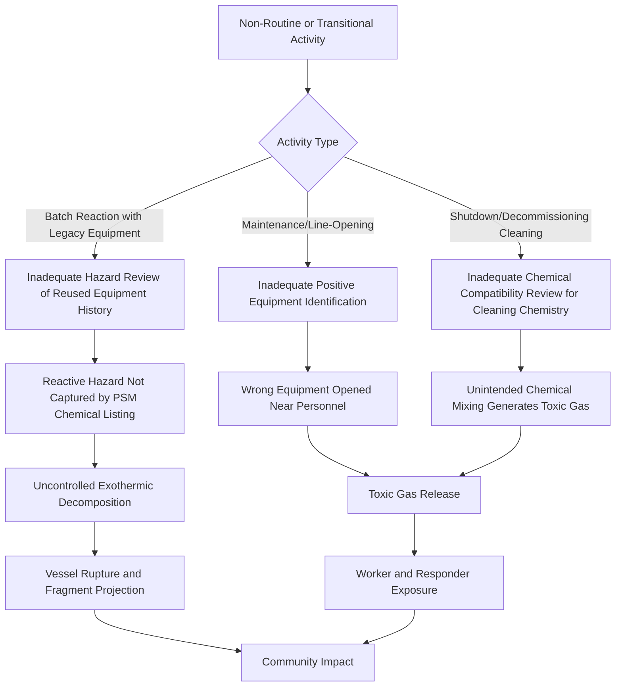

## Recent Incidents and Emerging Lessons 2024 to 2026

### Overview

The 2024-2026 period saw several significant process safety incidents that reinforced longstanding lessons while highlighting emerging concerns: reactive chemical hazards outside traditional PSM coverage, positive equipment identification failures during maintenance, decommissioning/shutdown-phase risk, and the persistent gap between chemical safety regulation and reactive hazard chemistry. This period's incidents are drawn primarily from finalized and ongoing U.S. Chemical Safety Board (CSB) investigations and are presented with the understanding that some investigations remain open and findings may be refined as final reports are issued.

### Key Points

- Reactive chemical hazards (uncontrolled exothermic decomposition, unintended chemical mixing) featured prominently, echoing a long-standing CSB concern that such hazards remain inadequately covered by OSHA's PSM standard
- Positive equipment identification during maintenance/line-breaking activities was identified as a root cause in a major toxic release, closely paralleling failure patterns identified in earlier incidents across the industry's history
- Decommissioning, shutdown, and end-of-life operations emerged as a recurring high-risk phase, as personnel and procedures are often less rigorous than during normal production
- The CSB continued to press for expansion of PSM coverage to address reactive hazards and remote isolation capability, recommendations it has repeated across multiple investigations spanning more than a decade
- Legacy/relocated equipment (reactors moved between facilities and reused after years in storage) raised new mechanical integrity and design-basis documentation concerns

### Incident Profile: Givaudan Sense Colour Explosion (Louisville, Kentucky, November 12, 2024)

**Summary**

A 2,500-gallon batch reactor (Reactor 6) producing caramel coloring for a food product experienced a runaway exothermic decomposition reaction involving the sugar-based process ingredient, resulting in a catastrophic explosion. The explosion killed two workers and seriously injured three others, and caused tens of millions of dollars in damage to the facility and the surrounding community. [Powder Bulk Solids](https://www.powderbulksolids.com/industrial-fires-explosions/csb-issues-final-report-on-fatal-2024-explosion)

**Key Technical and Organizational Findings**

- The explosion propelled large pieces of the batch reactor, pipe fragments, instrumentation, valves, and other debris into the surrounding neighborhood, with some fragments traveling as far as 400 feet from the facility, illustrating the fragment/missile hazard potential of even moderately sized reactive process equipment [CSB](https://www.csb.gov/assets/1/6/givaudan_second_investigation_update-final_version_(6-18-2025).pdf)
- A significant legacy equipment concern was identified: Reactor 6 was originally constructed in 1978 and had operated at a different facility before that facility closed in 2008, after which the reactor was relocated to the Louisville facility and kept in storage; in 2021, it was modified to meet the Louisville facility's design requirements and installed in the site's central manufacturing area [Powder Bulk Solids](https://www.powderbulksolids.com/industrial-fires-explosions/csb-issues-final-report-on-fatal-2024-explosion)
- The CSB Chairperson characterized the incident as "a catastrophe waiting to happen", reflecting findings regarding the reactor's history and the process hazard review gaps associated with reusing legacy equipment in a new service and facility context [Powder Bulk Solids](https://www.powderbulksolids.com/industrial-fires-explosions/csb-issues-final-report-on-fatal-2024-explosion)
- The CSB again recommended that OSHA expand the Process Safety Management standard to better address reactive hazards — a recommendation the agency has made repeatedly across multiple prior investigations, reflecting a persistent regulatory gap regarding chemicals and reactions that generate hazardous energy release through decomposition rather than through the traditional "highly hazardous chemical" listing approach [Powder Bulk Solids](https://www.powderbulksolids.com/industrial-fires-explosions/csb-issues-final-report-on-fatal-2024-explosion)

**Emerging Lesson: Reactive Hazard Coverage Gap**

Sugar and other food-processing ingredients are not typically classified or regulated as hazardous chemicals under OSHA PSM's Appendix A listing approach, yet under specific process conditions (elevated temperature, confinement, contamination) they can undergo uncontrolled exothermic decomposition capable of vessel-destroying overpressure. This incident reinforces a documented, longstanding pattern: PSM's chemical-listing approach does not comprehensively capture reactive chemical hazards that depend on process conditions rather than the inherent identity of a regulated substance.

**Emerging Lesson: Legacy and Relocated Equipment**

Equipment relocated between facilities and returned to service after an extended storage period represents a distinct mechanical integrity and design-basis risk category: the equipment's full engineering history, prior service conditions, and suitability for a new process's specific reactive chemistry may not be comprehensively re-verified through a standard Management of Change review unless the review process explicitly addresses equipment provenance and history as a specific line item.

### Incident Profile: Pemex Deer Park Refinery Hydrogen Sulfide Release (Deer Park, Texas, October 10, 2024)

**Summary**

More than 27,000 pounds of toxic hydrogen sulfide gas were released during a pipe-opening activity at the Pemex Deer Park Refinery, killing two contract workers and sending 13 others to local medical facilities, with dozens more treated at the scene. A shelter-in-place order was issued for two neighboring cities. [Powder Bulk Solids](https://www.powderbulksolids.com/industrial-fires-explosions/csb-issues-final-report-on-fatal-2024-chemical-release)[Powder Bulk Solids](https://www.powderbulksolids.com/industrial-fires-explosions/csb-issues-final-report-on-fatal-2024-chemical-release)

**Key Technical and Organizational Findings**

- Contributing to the severity of the incident was the refinery's failure to adequately assess the hazards of conducting pipe-opening activities in an active unit next to an area where numerous other workers were present, and deviations from established policies and procedures contributed to the event [Powder Bulk Solids](https://www.powderbulksolids.com/industrial-fires-explosions/csb-issues-final-report-on-fatal-2024-chemical-release)
- The CSB found that the refinery lacked an effective method to clearly identify the correct piping flange before work began — drawings and flange lists were insufficient to distinguish nearly identical segments, and the identification tag for the correct flange was placed out of view [Powder Bulk Solids](https://www.powderbulksolids.com/industrial-fires-explosions/csb-issues-final-report-on-fatal-2024-chemical-release)
- The refinery issued a broad work permit covering multiple jobs with varying hazard levels, a work-permitting practice that can obscure the specific hazard profile of any single task within the broader authorized scope [Powder Bulk Solids](https://www.powderbulksolids.com/industrial-fires-explosions/csb-issues-final-report-on-fatal-2024-chemical-release)

**Emerging Lesson: Positive Equipment Identification (PEI)**

This incident is a direct, contemporary illustration of the same failure category the CSB has flagged repeatedly across its incident history: line-breaking or equipment-opening activities require unambiguous, verifiable identification of the specific piece of equipment being isolated and opened — not reliance on drawings, tags, or lists that may not reliably distinguish visually similar or closely positioned components. This reinforces the value of physical, redundant identification methods (e.g., distinctly colored/tagged isolation points, direct field verification against an unambiguous single-line diagram, and — consistent with the CSB's ongoing Safety Study on remote isolation — capability to isolate equipment without requiring personnel to approach the hazard directly).

**Emerging Lesson: Work Permit Scope and Hazard Segregation**

Issuing a single broad permit covering multiple, distinct hazard-level activities can dilute the hazard-specific controls that a more narrowly scoped permit would trigger. This reinforces the general permit-to-work principle (also central to the Piper Alpha case) that permit scope should be defined narrowly enough that the specific hazards of each discrete task are individually and explicitly evaluated and controlled.

### Incident Profile: Catalyst Refiners Chemical Release (Institute, West Virginia, April 22, 2026)

**Summary**

A chemical release of hydrogen sulfide occurred at a plant owned by Ames Goldsmith Corporation, operating as Catalyst Refiners, killing two workers and injuring approximately 30 people, including one in critical condition. The reaction occurred during a cleaning process involving a tank at the facility. Officials confirmed that nitric acid combined with a metal-treatment product called Bonderite M2000A inside the facility, triggering a one-mile shelter-in-place order. [2026 Institute, West Virginia chemical disaster +2](https://en.wikipedia.org/wiki/2026_Institute,_West_Virginia_chemical_disaster)

**Key Technical and Organizational Findings**

- The incident occurred while crews were carrying out shutdown and cleanup work at the plant, during which chemicals interacted in a way that generated hazardous gas. By 2026, the site was no longer in full production and was undergoing shutdown procedures — circumstances that officials say contributed to the conditions leading to the deadly chemical release. [World Socialist Web Site](https://www.wsws.org/en/articles/2026/04/24/ebsx-a24.html)[World Socialist Web Site](https://www.wsws.org/en/articles/2026/04/24/ebsx-a24.html)
- A local emergency management official noted that the reaction was violent and "instantaneously overreacted," and observed that starting or ending a chemical reaction are among the most dangerous times in a process. [PBS](https://www.pbs.org/newshour/nation/chemical-leak-at-a-west-virginia-plant-kills-2-people-and-sends-19-to-hospital-officials-say)
- Among the injured were seven ambulance workers responding to the leak, indicating secondary exposure risk to emergency responders arriving without full situational awareness of the ongoing gas release [PBS](https://www.pbs.org/newshour/nation/chemical-leak-at-a-west-virginia-plant-kills-2-people-and-sends-19-to-hospital-officials-say)
- A CSB and West Virginia DEP investigation was opened; a subsequent CSB report finding indicated the chemical plant did not require workers to wear respirators during the incident. [West Virginia Watch](https://westvirginiawatch.com/2026/04/23/wv-federal-agencies-will-investigate-deadly-institute-chemical-leak-officials-say/)
- The facility had a documented history of prior safety issues, including nitric acid handling incidents in preceding years, reflecting a pattern of recurring reactive-chemical incidents at facilities handling strong oxidizers and metal-treatment chemistries

**Emerging Lesson: Decommissioning and End-of-Life Process Risk**

This incident reinforces a distinct and often under-addressed risk category: facilities in shutdown, decommissioning, or reduced-operation status may experience elevated risk because standard operating procedures, staffing levels, and hazard awareness developed for full production may not be adequately adapted for cleaning, tank decommissioning, and residual-chemical-handling activities — even though the chemical hazards involved (unintended mixing of incompatible chemicals) remain identical to those present during full operation.

**Emerging Lesson: Incompatible Chemical Mixing During Cleaning Operations**

Tank and vessel cleaning operations, particularly when residual process chemicals may remain in contact with cleaning agents or other materials not present during normal operation, require the same rigorous hazard review (compatibility assessment, sequential isolation verification) applied to normal production chemistry. A chemical combination that would never occur during standard operation can become newly possible during cleaning, flushing, or decommissioning unless explicitly evaluated in advance.

**Emerging Lesson: Respiratory Protection Program Adequacy**

The finding regarding absent respirator requirements during an activity with credible toxic gas generation potential reinforces that respiratory protection program design (per 29 CFR 1910.134) must be based on a documented hazard assessment specific to the task being performed, not solely on the facility's routine/steady-state operating hazard profile.

### Diagram: Common Failure Pattern Across 2024-2026 Incidents

### Cross-Cutting Regulatory Themes

| Theme | Illustrating Incident(s) | Longstanding CSB Position |
| --- | --- | --- |
| Reactive hazard coverage gap in PSM | Givaudan (Louisville) | CSB has recommended PSM expansion to cover reactive hazards across numerous investigations for over a decade |
| Remote/positive equipment isolation | Pemex Deer Park | Subject of dedicated CSB Safety Study (2024-01-H) synthesizing incidents including Philadelphia Energy Solutions and TPC Group Port Neches |
| Decommissioning/shutdown-phase risk | Catalyst Refiners (Institute) | Consistent with broader process safety literature on elevated risk during non-routine operating modes |
| Legacy equipment reuse and history verification | Givaudan (Louisville) | Reinforces Mechanical Integrity and Management of Change scope requirements |

[Inference] As of this writing, CSB investigations into some of these incidents (including the April 2026 Institute, West Virginia release) may remain open or only partially finalized; findings, root cause determinations, and recommendations described here reflect publicly reported information available at the time of this summary and should be cross-checked against final CSB reports as they are published, since preliminary findings are sometimes refined in final investigation reports.

### Practical Application for Facility Programs

Organizations reviewing these incidents for internal lessons-learned programs should consider: (1) auditing any equipment relocated or returned to service after extended storage against a formal design-basis re-verification checklist within MOC, rather than treating relocation as a routine mechanical installation task; (2) implementing redundant, field-verifiable positive equipment identification methods for any line-breaking or equipment-opening permit, independent of drawings or lists alone; (3) extending Process Hazard Analysis scope explicitly to decommissioning, shutdown, and cleaning activities, with specific chemical compatibility review for any cleaning agents or flush chemicals introduced into contact with residual process material; and (4) reviewing respiratory protection program hazard assessments to ensure non-routine and transitional activities are explicitly addressed, not only steady-state production tasks.

### Related Topics

- CSB Safety Study 2024-01-H: Remote Isolation of Process Equipment
- Reactive chemical hazard management and the PSM coverage gap
- Positive equipment identification and isolation verification practices
- Process Hazard Analysis scope for decommissioning and shutdown operations
- Chemical compatibility review for cleaning and flushing chemistries
- Management of Change scope for relocated/legacy equipment
- Respiratory protection program hazard assessment (29 CFR 1910.134)