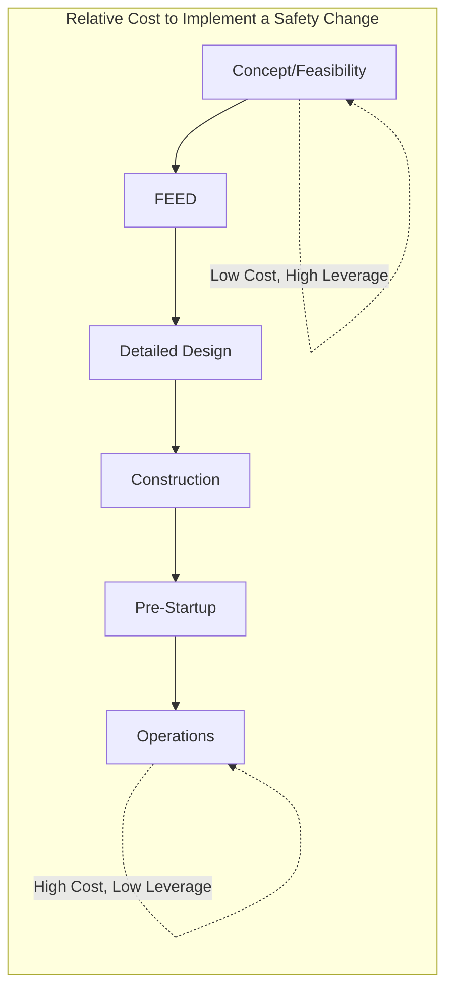
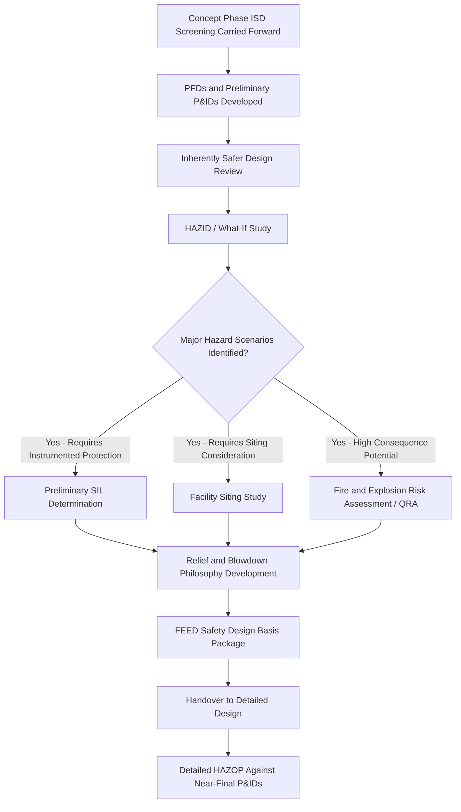

## Process Safety Reviews in Front-End Engineering Design

### Overview

Front-End Engineering Design (FEED) represents the critical project phase where process safety decisions have the highest leverage at the lowest cost of change. Process safety reviews conducted during FEED establish the fundamental risk profile of a facility before detailed design commitments are made, capital is deployed at scale, and design changes become progressively more expensive to implement. Embedding structured process safety reviews at this stage is a core application of Inherently Safer Design principles, since fundamental hazard reduction (inventory minimization, moderation of process conditions, substitution) is generally only achievable early in a project's lifecycle.

### Key Points

- The cost and difficulty of implementing safety improvements increases by roughly an order of magnitude at each successive project phase (concept → FEED → detailed design → construction → operation), making FEED the highest-leverage point for inherently safer design decisions
- Process safety reviews in FEED are staged and iterative, typically progressing through hazard identification, preliminary hazard analysis, and design-basis-level safety integrity assessments as design definition matures
- Key deliverables include a Process Hazard Analysis appropriate to the design maturity level, a Fire and Explosion Risk Assessment (where applicable), preliminary Safety Integrity Level (SIL) determination, and facility siting studies
- FEED-stage reviews establish the design basis for safety-critical systems (relief systems, fire protection, emergency shutdown) that detailed design will subsequently engineer in full
- Regulatory frameworks (OSHA PSM, EPA RMP) require PHA prior to startup, but front-loading hazard analysis into FEED avoids costly late-stage redesign when analysis is deferred to detailed design or pre-startup review

### The Project Lifecycle and Cost of Change

**Concept/Feasibility Phase**

- Broad technology selection, site selection, high-level process concept
- Preliminary hazard identification (checklist-based, "what-if" at a conceptual level)
- Inherently Safer Design opportunities are most available and least costly here (technology substitution, fundamental inventory decisions)

**Front-End Engineering Design (FEED) Phase**

- Process Flow Diagrams (PFDs) and preliminary Piping and Instrumentation Diagrams (P&IDs) developed
- Equipment sizing and preliminary layout established
- This is the primary focus of this topic — see detailed treatment below

**Detailed Design Phase**

- Full P&IDs, instrument specifications, relief system sizing calculations finalized
- Detailed PHA (typically HAZOP) conducted against near-final P&IDs
- Design changes are more costly here since equipment procurement may already be underway

**Construction and Pre-Startup**

- Pre-Startup Safety Review (PSSR) conducted per OSHA PSM requirements
- Design changes at this stage are extremely costly and time-consuming; PSSR is intended to verify design intent was correctly implemented, not to discover fundamental design flaws

**Operations**

- Ongoing PHA revalidation (typically every 5 years under OSHA PSM), Management of Change for any modifications

### Diagram: Cost of Change vs. Project Phase

### Key Process Safety Review Activities in FEED

**1. Inherently Safer Design (ISD) Review**

- Conducted early in FEED, ideally building on concept-phase ISD screening
- Systematically evaluates opportunities to minimize inventory of hazardous materials, substitute less hazardous chemicals or process routes, moderate process conditions (lower pressure/temperature where feasible), and simplify process configuration to reduce potential failure points
- Uses a structured framework (e.g., CCPS Inherently Safer Chemical Processes methodology) evaluating minimize, substitute, moderate, and simplify strategies against each significant hazard identified

**2. Preliminary/What-If or HAZID (Hazard Identification) Study**

- Conducted once PFDs and preliminary P&IDs are available
- Broader and less granular than a full HAZOP, focused on identifying major hazard scenarios, missing safeguards, and areas requiring further detailed analysis
- Typically uses a "what-if" or checklist-based methodology appropriate to the design's maturity level, since detailed node-by-node HAZOP is generally premature before P&IDs stabilize

**3. Facility Siting Study**

- Evaluates the layout of process units, storage, utilities, and occupied buildings (control rooms, offices, workshops) relative to major accident hazard potential
- Applies consequence modeling (fire radiation, explosion overpressure, toxic dispersion) to inform spacing and occupied building location decisions per API RP 752/753 principles
- Far more cost-effective to address during FEED layout development than after equipment foundations and structural steel are designed

**4. Preliminary SIL Determination (Safety Integrity Level)**

- Where a HAZID or preliminary HAZOP identifies scenarios requiring a Safety Instrumented Function, a preliminary SIL determination (per IEC 61511) establishes the target risk reduction the safety instrumented system must achieve
- This informs detailed design decisions regarding sensor/logic solver/final element architecture, redundancy requirements, and proof-test interval planning that follow in detailed design

**5. Fire and Explosion Risk Assessment (FERA) / Quantitative Risk Assessment (QRA)**

- For facilities with significant major accident hazard potential, a quantitative risk assessment during FEED evaluates individual and societal risk against defined criteria (e.g., ALARP demonstration)
- Particularly critical for offshore facilities, LNG facilities, and other installations where escalation potential and confined/congested layouts significantly affect explosion overpressure outcomes

**6. Relief and Blowdown Philosophy Development**

- FEED establishes the overall relief system design philosophy (per API 520/521) — which scenarios govern relief sizing, whether flare or direct atmospheric venting is appropriate, and preliminary sizing for major relief/blowdown headers
- Getting this philosophy right in FEED avoids costly relief header re-sizing during detailed design

### Diagram: FEED-Stage Process Safety Review Workflow

### FEED Safety Deliverables Package

A well-executed FEED phase typically produces the following process safety documentation, forming the design basis carried into detailed design:

| Deliverable | Purpose |
| --- | --- |
| ISD Review Report | Documents inherently safer alternatives evaluated and decisions made |
| HAZID/Preliminary HAZOP Report | Identifies major hazard scenarios and preliminary safeguards |
| Facility Siting Study | Establishes layout basis for occupied buildings and equipment spacing |
| Preliminary SIL Determination | Establishes safety instrumented function risk reduction targets |
| Relief and Blowdown Philosophy | Establishes relief system design basis for detailed sizing |
| Fire and Gas Detection Philosophy | Establishes detection system design basis and coverage strategy |
| Preliminary QRA (where applicable) | Demonstrates risk is being driven toward ALARP at the design-basis level |

### Common Pitfalls in FEED-Stage Process Safety Reviews

**Premature Detailed HAZOP**

- Conducting a full node-by-node HAZOP before P&IDs have stabilized wastes effort, since subsequent design changes invalidate portions of the analysis; FEED-stage reviews should match the analysis rigor to the design maturity level (HAZID/what-if, not full HAZOP)

**Deferring Facility Siting**

- Treating facility siting as a detailed-design or even construction-phase activity, after major equipment and building foundations are already committed, eliminates the most cost-effective opportunity to influence layout

**Inadequate ISD Documentation**

- Failing to formally document why inherently safer alternatives were or were not adopted leaves the facility without a clear record to reference during future Management of Change reviews or incident investigations, and can result in the same alternatives being repeatedly re-litigated without a documented basis

**Treating FEED Safety Reviews as a Compliance Checkbox**

- Conducting reviews with inadequate multidisciplinary participation (process, instrumentation, operations, safety engineering) or insufficient time allocated relative to the complexity of the hazards involved, reducing the review to a documentation exercise rather than a genuine hazard-reduction opportunity

### Example

A FEED team is developing the process design for a new chemical intermediate storage and handling facility. During the ISD review, the team identifies that the originally proposed design called for bulk on-site storage of a reactive intermediate at ambient temperature. Applying the "minimize" and "moderate" ISD strategies, the team evaluates producing the intermediate on a just-in-time basis with minimal buffer storage, and separately evaluates refrigerated storage to reduce the intermediate's reactivity and vapor pressure. The subsequent HAZID study identifies that even with reduced inventory, a credible loss-of-containment scenario would require a Safety Instrumented Function to isolate feed on high-temperature detection; a preliminary SIL determination establishes a SIL 2 target for this function, which is carried into detailed design for full safety instrumented system engineering. The facility siting study, conducted concurrently with layout development, identifies that the originally proposed control room location falls within the consequence radius of a credible vapor cloud explosion scenario from the storage area, prompting relocation of the control room during FEED — a change that would have required extensive structural rework and schedule delay had it been identified only during detailed design or construction.

### Related Topics

- Inherently Safer Design (ISD) methodology (CCPS framework: minimize, substitute, moderate, simplify)
- Hazard Identification (HAZID) vs. HAZOP methodology selection by design maturity
- Facility siting studies and API RP 752/753 application
- Safety Integrity Level (SIL) determination methods (IEC 61511)
- Quantitative Risk Assessment (QRA) and ALARP demonstration
- Relief and blowdown system design philosophy (API 520/521)
- Management of Change linkage to FEED-stage design basis documentation