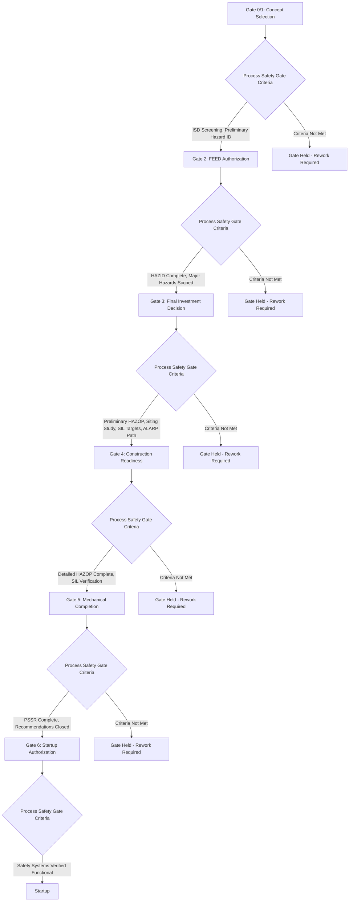

## Stage-Gate Integration of Process Safety

### Overview

Stage-gate project management divides capital project execution into distinct phases separated by formal review "gates," where a project must satisfy defined criteria before proceeding to the next phase. Integrating process safety into a stage-gate framework ensures that hazard identification, risk assessment, and safeguard design are neither deferred until too late in the project (when changes become costly) nor treated as a parallel, disconnected activity that fails to influence actual engineering decisions. Effective integration makes process safety deliverables explicit, mandatory gate-passage criteria rather than optional or advisory inputs.

### Key Points

- Stage-gate integration requires defining specific process safety deliverables and completion criteria at each gate, not simply noting that "a PHA will be conducted at some point"
- Each gate should have a defined set of process safety questions that must be answered before capital authorization or design progression is approved
- Poor stage-gate integration commonly manifests as PHA/HAZOP being treated as a late-stage, pre-startup compliance activity rather than a design-influencing input at earlier gates
- Gate reviews should include appropriately qualified process safety personnel with authority to withhold gate approval when safety deliverables are incomplete or reveal unresolved major hazards
- The framework applies equally to new capital projects and major modifications/revamps of existing facilities, since both involve design changes requiring hazard reassessment

### Typical Stage-Gate Framework Structure

While specific stage-gate models vary by organization, a common structure used across the process industries includes:

**Gate 0 / Gate 1 — Concept Selection**

- Business case and technology/concept selection
- Process safety input: preliminary hazard identification, inherently safer design screening at the concept level, identification of any "showstopper" hazards that might eliminate a technology option

**Gate 2 — FEED Authorization**

- Decision to proceed with Front-End Engineering Design
- Process safety input: documented ISD screening results, preliminary risk ranking of the concept, identification of major accident hazard potential requiring specialized study (e.g., QRA) during FEED

**Gate 3 — Detailed Design/Execution Authorization (Final Investment Decision)**

- Major capital commitment decision; often the highest-value gate for process safety influence since it is the last point before large-scale procurement and construction commitment
- Process safety input: completed HAZID/preliminary HAZOP from FEED, facility siting study results, preliminary SIL determinations, relief/blowdown philosophy, and demonstration that major hazards have a credible path to ALARP

**Gate 4 — Construction Readiness**

- Decision to proceed with, or continue, physical construction
- Process safety input: detailed HAZOP completed against near-final P&IDs, SIL verification calculations for safety instrumented functions, updated facility siting confirmation against final layout

**Gate 5 — Mechanical Completion / Pre-Startup**

- Decision to proceed from construction completion toward commissioning and startup
- Process safety input: Pre-Startup Safety Review (PSSR) per OSHA PSM requirements, verification that PHA recommendations have been resolved, confirmation that operating procedures and training are complete

**Gate 6 — Startup Authorization**

- Final authorization to introduce hazardous materials and begin operation
- Process safety input: closure verification of all outstanding PSSR items, confirmation that safety-critical systems have been tested and are functional

### Diagram: Stage-Gate Framework with Process Safety Deliverables

### Defining Gate-Specific Process Safety Criteria

Effective stage-gate integration requires translating general process safety principles into specific, verifiable gate-passage criteria. Vague criteria ("process safety has been considered") fail to create real accountability; specific, checkable criteria do.

**Weak Gate Criterion (Avoid)**

- "Process safety review completed"

**Strong Gate Criterion (Preferred)**

- "HAZID study completed and documented; all High and Extreme risk-ranked scenarios have an assigned safeguard or a documented action with an owner and due date; ISD screening report signed off by [role]; facility siting study confirms no occupied building within the consequence radius of any credible major accident scenario, or documented ALARP justification exists for any exception"

### Common Stage-Gate Integration Failures

**Deferred PHA Discovery**

- A frequent failure pattern is conducting the first substantive hazard analysis only during detailed design or, worse, as part of the Pre-Startup Safety Review, by which point major equipment has already been procured and structural/civil work may be underway — meaning any significant finding requires costly rework or a risk-acceptance decision made under schedule pressure rather than a genuine design choice

**Gate Reviews Without Process Safety Authority**

- Gate review boards sometimes include process safety personnel only in an advisory capacity, without the authority to hold a gate pending resolution of an identified major hazard, effectively subordinating process safety findings to schedule and budget considerations at the review board level

**Inconsistent Application Across Project Types**

- Full stage-gate rigor is sometimes applied only to large, clearly defined "capital projects" while being informally or inconsistently applied to smaller modifications, revamps, or brownfield tie-ins — even though such projects can introduce comparable process safety risk and should trigger equivalent (proportionate to scale) gate discipline through the Management of Change process

**Loss of Traceability Between Gates**

- Hazard analysis findings, ISD decisions, and risk-ranking results generated at an early gate are sometimes not carried forward or referenced at subsequent gates, resulting in later design changes that inadvertently reintroduce hazards that had been previously identified and mitigated, or duplicative re-analysis that fails to build on prior work

**Schedule-Driven Gate Waivers**

- Under schedule or cost pressure, organizations sometimes grant conditional gate passage with process safety deliverables incomplete, on the assumption they will be completed "in parallel" with subsequent phase work — a pattern that, per the general lessons of major incidents such as Deepwater Horizon, can allow schedule pressure to erode the rigor of safety verification across multiple points in a project

### Roles and Governance in Stage-Gate Process Safety Integration

**Process Safety/PHA Facilitator or Lead**

- Responsible for planning and executing the process safety studies appropriate to each gate, and for presenting findings to the gate review board in a form that supports go/no-go decision-making

**Gate Review Board**

- Should include a process safety representative with defined authority (ideally a formal "hold" or "veto" capability, not merely advisory input) to prevent gate passage when critical process safety deliverables are incomplete or unresolved major hazards exist

**Project Manager**

- Accountable for ensuring process safety deliverables are scheduled, resourced, and completed on the project timeline — treating process safety studies as a critical-path project activity rather than a parallel or optional task

**Independent Technical Authority / Corporate Process Safety Function**

- In larger organizations, an independent corporate-level process safety function often provides oversight of gate criteria consistency across projects and can escalate concerns when project-level pressure threatens to compromise gate rigor — a governance structure reinforced by lessons from incidents such as Texas City, where the Baker Panel emphasized the value of process safety oversight independent of site-level production pressure

### Example

A capital project team is developing a new reactor unit as an addition to an existing operating facility. At Gate 2 (FEED Authorization), the process safety criteria require a documented HAZID identifying all major hazard scenarios and a facility siting screening confirming no conflict with the existing site layout; the gate review board, which includes a corporate process safety representative with hold authority, identifies that the HAZID has not adequately addressed interconnection hazards with the existing operating unit (a lesson directly informed by escalation patterns seen in incidents like Piper Alpha) and holds the gate pending completion of an interconnection-specific hazard review. At Gate 3 (Final Investment Decision), the completed interconnection review identifies a need for an emergency isolation valve at the tie-in point; this valve is incorporated into the FEED design basis before major equipment procurement begins, avoiding the substantially higher cost of retrofitting the isolation valve after construction. This sequence illustrates the intended function of stage-gate integration: the process safety finding directly and measurably influenced the design at the point where the change was still low-cost to implement.

### Related Topics

- Process Safety Reviews in Front-End Engineering Design
- Pre-Startup Safety Review (PSSR) requirements under OSHA PSM (29 CFR 1910.119(i))
- Management of Change (MOC) as the stage-gate equivalent for existing-facility modifications
- Independent technical authority and corporate process safety governance structures
- Hazard and Operability Study (HAZOP) methodology and timing relative to design maturity
- Facility siting studies and interconnection hazard review for brownfield tie-ins
- Capital project risk management and schedule-pressure mitigation strategies