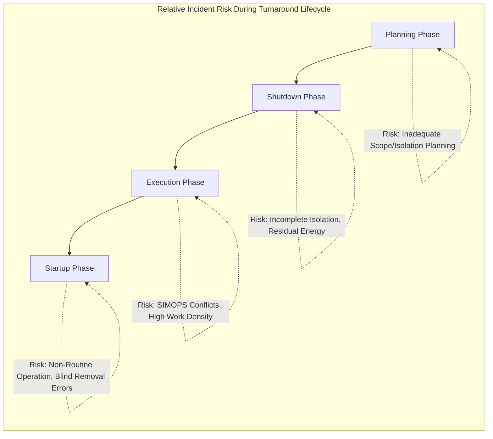
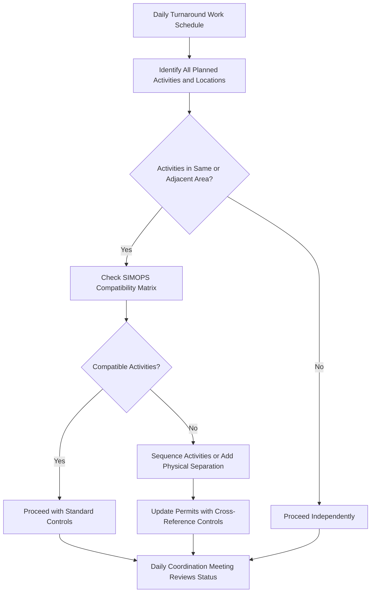

## Managing Process Safety During Turnarounds

### Overview

Turnarounds — planned, temporary shutdowns of a process unit or entire facility for inspection, maintenance, repair, and equipment replacement — represent one of the highest-risk periods in a facility's operating lifecycle. The compressed timeline, high concentration of contractor personnel, extensive simultaneous operations, and numerous equipment-opening and energy-isolation activities occurring in parallel create a risk profile fundamentally different from steady-state operation. Effective turnaround process safety management requires dedicated planning, phase-specific hazard controls, and rigorous execution discipline distinct from routine operational safety programs.

### Key Points

- Turnarounds concentrate a disproportionate share of a facility's annual process safety incidents into a short time window, driven by high work-crew density, extensive equipment opening, and elevated pace-of-work pressure
- The turnaround lifecycle has distinct phases — planning, shutdown, execution, startup — each with characteristic hazard profiles requiring tailored controls
- Positive isolation (physical lockout, blinding/slip-plating) rather than reliance on closed valves alone is the foundational engineering control for equipment opened during a turnaround
- Simultaneous Operations (SIMOPS) management is critical given the high density of concurrent work activities, often involving multiple contractors working in close proximity
- Startup following a turnaround is itself a high-risk, non-routine operating mode requiring the same hazard analysis rigor as the shutdown and execution phases

### Turnaround Lifecycle and Phase-Specific Hazards

**Planning Phase (Months to Years Before Execution)**

- Scope definition: identifying all inspection, maintenance, and modification work to be performed
- Process Hazard Analysis review/update to ensure the PHA addresses planned turnaround activities and any process modifications being implemented during the turnaround
- Development of the isolation philosophy: identifying every piece of equipment requiring positive isolation, the specific isolation points, and blind/slip-plate locations
- Contractor selection and safety pre-qualification, consistent with PSM Contractor Safety requirements (29 CFR 1910.119(h))
- Resource and schedule planning that avoids compressing safety-critical steps (isolation verification, permit issuance, pre-job hazard briefings) to meet an aggressive timeline

**Shutdown Phase**

- Controlled depressurization, draining, and purging of process equipment
- Establishment of positive isolation at each defined isolation point per the turnaround isolation plan
- Verification of zero-energy state (pressure, temperature, chemical residue) before equipment is opened for entry or maintenance access
- Confined space hazard assessment and atmospheric testing for any vessel entry planned

**Execution Phase (Active Maintenance and Inspection)**

- Highest-density period for concurrent work activities: multiple contractor crews, cranes, hot work, confined space entries, and radiography operations often occurring simultaneously across the unit
- Permit-to-work system manages authorization for each discrete task, verifying isolation status, required PPE, and specific task hazards
- Simultaneous Operations (SIMOPS) coordination to identify and control conflicts between concurrent activities (e.g., hot work near an area where another crew is handling flammable residue)
- Mechanical integrity inspections (thickness testing, internal vessel inspection) generating findings that may require real-time engineering evaluation and scope changes

**Startup Phase**

- Systematic re-commissioning: instrument calibration verification, isolation removal in the correct sequence, leak testing, and controlled introduction of process material
- Elevated risk given the non-routine nature of startup, historical precedent (Texas City 2005 occurred during a startup) demonstrating that startup-specific hazards require the same rigor as steady-state PHA scenarios
- Verification that all turnaround work is complete and all temporary modifications, blinds, or isolation devices have been removed before pressurization

### Diagram: Turnaround Risk Profile Across Phases

### Positive Isolation Management

**Isolation Hierarchy**

- **Blinding/slip-plating** — physically inserting a solid barrier into the piping system, providing the highest confidence isolation for equipment being opened
- **Double block and bleed** — two closed valves with a vented/monitored bleed point between them, providing verification that the upstream valve is not passing
- **Single valve closure with lockout** — lowest-confidence isolation method among the three; generally insufficient alone for high-hazard equipment opening, a lesson directly reinforced by the Phillips Petroleum Pasadena 1989 incident where reliance on a non-positive isolation method (disconnected actuator air) rather than physical lockout of the valve itself was a root cause

**Isolation Verification Requirements**

- Every isolation point in the turnaround isolation plan should be physically verified (not merely assumed from a drawing) before associated work begins
- A centralized isolation register/log tracking the status of every isolation point, cross-referenced to active permits, reduces the risk of a permit being issued or equipment being opened against an isolation that has not actually been established or verified
- Isolation removal at the end of the turnaround should follow the same rigor as isolation establishment: a documented, verified sequence rather than an assumed "put it back the way it was" approach

### Simultaneous Operations (SIMOPS) Management

**SIMOPS Risk Factors**

- Hot work (welding, grinding) occurring near areas with flammable atmosphere potential from adjacent work
- Crane lifts occurring over or near areas with personnel working below or nearby
- Radiography (radiation source use for weld inspection) requiring exclusion zones that may conflict with other planned work areas
- Confined space entries occurring concurrently with activities that could affect atmosphere or access/egress in adjacent spaces

**SIMOPS Control Approach**

- A SIMOPS matrix or compatibility chart identifying which activity types can safely occur concurrently and which require sequencing, physical separation, or additional controls
- Daily or shift-based coordination meetings among all work crews and permit issuers to identify and resolve emerging conflicts before they result in unsafe concurrent conditions
- Area-based visual management (color-coded zones, exclusion barriers) helping personnel recognize active hazard zones without relying solely on verbal communication

### Diagram: SIMOPS Conflict Identification Process

### Contractor Management During Turnarounds

- Turnarounds typically involve a substantial influx of contractor personnel, often exceeding the normal site workforce by a significant multiple, requiring robust site-specific orientation and hazard communication
- Contractor safety performance history and qualification should be evaluated during the planning phase, consistent with PSM Contractor Safety element requirements
- Clear definition of which permits, isolations, and hazard controls are the responsibility of the host employer versus the contractor, avoiding gaps where each party assumes the other has addressed a specific hazard — a coordination failure pattern also seen in the Phillips Pasadena 1989 incident, where contractor personnel reconnected isolation-defeating hoses without adequate coordination with the isolating crew's status

### Mechanical Integrity and Inspection Findings Management

- Turnarounds are the primary opportunity for internal inspection (vessel entry, tube bundle pulling, thickness testing) that cannot be performed during operation
- A defined process for evaluating and dispositioning inspection findings in real time is essential, since findings (unexpected corrosion, cracking) may require engineering evaluation, scope changes, or schedule extension to address safely — with the schedule and cost pressure to avoid such extensions requiring active management to prevent compromising repair adequacy
- Findings requiring scope changes should trigger an abbreviated Management of Change review appropriate to the finding's significance, even under turnaround time pressure

### Common Turnaround Process Safety Failures

**Isolation Plan Gaps**

- Incomplete identification of all isolation points during planning, discovered only during execution when a piece of equipment is found to still be connected to a live system

**Schedule Compression of Safety-Critical Steps**

- Under turnaround schedule pressure, permit issuance, isolation verification, or pre-job hazard briefings may be abbreviated or rushed, undermining the very controls intended to manage the elevated turnaround risk

**Inadequate SIMOPS Coordination**

- Multiple contractor crews operating without effective cross-crew communication, resulting in incompatible concurrent activities in the same area

**Startup Rushed to Meet Production Targets**

- Pressure to return the unit to production can compress startup verification steps (leak testing, instrument verification, isolation removal confirmation), directly paralleling the root cause pattern seen in the Texas City 2005 incident

**Inconsistent PHA Coverage of Turnaround-Specific Activities**

- Facility PHA programs sometimes focus primarily on steady-state operating hazards without adequately addressing turnaround-specific scenarios (large-scale simultaneous equipment opening, high contractor density, non-routine startup sequencing)

### Example

A refinery is planning a turnaround of a distillation unit involving vessel entry for internal inspection, tube bundle replacement in an exchanger, and instrumentation upgrades. During planning, the isolation plan identifies double block and bleed isolation for all lines connected to the vessel requiring entry, with blind installation at each isolation point rather than reliance on valve closure alone, directly incorporating the lesson from Phillips Pasadena regarding non-positive isolation. A centralized isolation register tracks each blind's installation and removal status, cross-referenced to the vessel entry permit. During execution, a SIMOPS conflict is identified between planned radiography work on the exchanger welds and a concurrent confined space entry in the adjacent vessel; the daily coordination meeting resolves this by sequencing the radiography to occur only during breaks in the confined space entry, with a defined exclusion zone. During inspection, unexpected internal corrosion is found in the vessel beyond the original scope; an abbreviated MOC review evaluates the finding, and the repair scope is extended by two days rather than deferring the repair to meet the original schedule — a decision made explicitly to avoid schedule pressure compromising repair adequacy, consistent with lessons from incidents where cost/schedule pressure eroded barrier integrity decisions.

### Related Topics

- Positive isolation methods and lockout/tagout for process equipment
- Permit-to-work system design and shift handover procedures
- Simultaneous Operations (SIMOPS) management and compatibility matrices
- Contractor Safety Management under OSHA PSM (29 CFR 1910.119(h))
- Mechanical Integrity programs and inspection finding disposition
- Pre-Startup Safety Review (PSSR) requirements
- Confined space entry hazard assessment and atmospheric testing