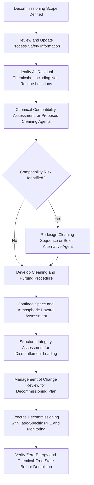

## Process Safety Considerations in Decommissioning

### Overview

Decommissioning — the permanent removal of process equipment, units, or entire facilities from service — presents a distinct process safety risk profile that is frequently underestimated relative to normal operations or even turnarounds. Unlike a turnaround, where equipment is returned to the same service, decommissioning involves permanently breaking the operational context that generated the original process hazard controls, often while residual hazardous materials, energy, and institutional knowledge about the equipment's history remain present. Recent incidents have reinforced that facilities in reduced operation, shutdown, or active decommissioning status can experience elevated risk precisely because standard operating rigor is not always adapted to the specific hazards of end-of-life activities.

### Key Points

- Decommissioning risk arises from the combination of residual hazardous material/energy, degraded institutional knowledge (as experienced operations personnel may have already left or been reassigned), and the temptation to apply reduced procedural rigor to a facility perceived as "already shutting down"
- A comprehensive decommissioning hazard assessment must address every residual chemical, in every piece of equipment, including materials that may not have been part of the facility's routine PSM-covered inventory
- Chemical compatibility hazards during cleaning, flushing, and residue removal are a distinct and often underappreciated decommissioning risk, since cleaning agents may contact residual process chemicals in combinations that never occurred during normal operation
- Decommissioning activities should be governed by the same Management of Change and Process Hazard Analysis rigor applied to other significant facility changes, not treated as an operations-adjacent activity outside the PSM program's scope
- Demolition and dismantlement introduce structural, mechanical, and buried/hidden hazard considerations (contaminated soil, abandoned piping, legacy equipment) beyond the chemical process hazards addressed during operation

### Decommissioning Hazard Categories

**Residual Chemical Hazards**

- Process equipment being decommissioned may retain residual hazardous material even after apparent draining or purging — in vessel low points, dead-leg piping, insulation, catalyst beds, or absorbed within equipment linings
- Materials present in quantities below routine PSM-covered thresholds during operation may still pose a significant hazard when concentrated in a confined decommissioning work area or when combined with cleaning chemicals

**Chemical Compatibility Hazards During Cleaning**

- Cleaning, flushing, and neutralization chemicals introduced during decommissioning create new potential reaction pathways not present during normal operation
- A rigorous chemical compatibility assessment should evaluate every combination of residual process chemical and every cleaning/flushing agent proposed for use, not only the chemicals present during standard operation

**Confined Space and Atmospheric Hazards**

- Vessels, tanks, and enclosed equipment being prepared for decommissioning frequently require entry for cleaning, inspection, or dismantlement, triggering confined space hazard assessment requirements
- Oxygen deficiency, residual flammable vapor, and toxic gas generation (including from unexpected chemical reactions during cleaning) must be addressed through atmospheric testing before and during entry

**Structural and Mechanical Hazards**

- Aging or corroded structures being dismantled may have reduced structural integrity not fully characterized by routine operational inspection programs, which typically focus on pressure-containing integrity rather than overall structural condition for demolition loading conditions
- Legacy equipment with unknown or poorly documented modification history (compounding the general mechanical integrity documentation challenge) requires particular caution before cutting, opening, or applying mechanical loads during dismantlement

**Institutional Knowledge Loss**

- Personnel with direct operating experience and process knowledge of the facility may have already departed, been reassigned, or reduced their involvement by the time decommissioning work begins, particularly for facilities decommissioned well after operations ceased
- Process Safety Information (PSI) documentation — piping diagrams, equipment specifications, chemical inventories — may be outdated, incomplete, or difficult to locate for older or previously modified equipment

### Diagram: Decommissioning Hazard Assessment Workflow

### The Decommissioning-Phase Risk Pattern

A recurring pattern identified across recent process safety incidents involves facilities in reduced operation or active shutdown/decommissioning status experiencing elevated risk from unintended chemical mixing during cleaning operations, precisely because standard operating procedures and staffing levels developed for full production are not always adequately adapted for the specific hazards of decommissioning-phase activities — even though the underlying chemical hazards (incompatible chemical combinations) remain unchanged from full operation. This reinforces that decommissioning-phase hazard assessment cannot simply inherit the operational-phase hazard analysis; it requires its own dedicated review addressing the specific chemistry, sequence, and conditions of cleaning and dismantlement activities.

### Process Hazard Analysis for Decommissioning

**Scope Considerations**

- A decommissioning-specific PHA (or a dedicated decommissioning hazard review, scaled appropriately to the complexity and hazard potential involved) should address: the sequence of cleaning/purging steps and any chemical interactions at each step, confined space entry scenarios, structural hazards during dismantlement, and any interfaces with adjacent equipment or units that remain in operation

**Interface Hazards with Operating Units**

- Where decommissioning occurs adjacent to or interconnected with equipment that remains in active operation, the hazard review must address potential interaction — inadvertent isolation breach, vibration/mechanical impact on adjacent operating equipment, or fire/explosion escalation potential between the decommissioning work area and the operating unit

**Documentation and Institutional Knowledge Capture**

- Where possible, decommissioning planning should actively capture institutional knowledge from personnel with direct operating history of the equipment before that knowledge is lost, particularly regarding any known non-standard modifications, past incidents, or unusual residual material locations not reflected in current documentation

### Management of Change for Decommissioning

Decommissioning represents a permanent, significant change to the facility and should trigger full Management of Change review, addressing:

- Technical basis for the decommissioning approach (draining/purging sequence, cleaning chemical selection, dismantlement method)
- Impact on safety systems and procedures, including whether any safety instrumented functions, relief devices, or fire protection systems serving the equipment being decommissioned also serve adjacent operating equipment
- Necessary time period and phased approach, particularly where decommissioning occurs over an extended period with intermediate states (partially drained, partially isolated) that may persist for weeks or months
- Authorization requirements consistent with the scale and hazard potential of the specific decommissioning activity

### Common Decommissioning Process Safety Failures

**Underestimating Residual Hazard**

- Assuming that a facility "no longer in production" or "already shut down" has a correspondingly reduced hazard profile, when significant residual chemical inventory, structural hazards, or reaction potential may still be present

**Inadequate Chemical Compatibility Review for Cleaning Chemistry**

- Introducing cleaning, neutralization, or flushing agents into contact with residual process chemicals without a specific compatibility assessment for that combination, given that such combinations did not occur during normal operation and are not addressed by the facility's standard operating hazard analysis

**Reduced Procedural Rigor During Reduced Operations**

- Applying less rigorous permit-to-work, isolation verification, or PPE requirements during decommissioning-phase activities than would be applied during full operation, despite the underlying chemical and physical hazards remaining comparable or, in some cases, less well-characterized than during routine operation

**Loss of Process Safety Information Currency**

- Proceeding with decommissioning based on outdated piping and instrumentation diagrams or incomplete chemical inventory records, particularly for older equipment or equipment that underwent undocumented field modifications during its operating life

**Inadequate Respiratory and Personal Protective Equipment Planning**

- Failing to conduct a task-specific respiratory protection hazard assessment for decommissioning activities with credible toxic gas generation potential, rather than relying on the facility's standard operational PPE program, which may not anticipate decommissioning-specific chemical interactions

### Example

A facility is decommissioning a metal-treatment process area following cessation of production. The decommissioning plan calls for cleaning residual chemical treatment tanks using a standard facility cleaning protocol. Applying rigorous decommissioning hazard assessment principles, the review team identifies that one of the cleaning agents proposed for use is a strong oxidizer, and residual material from the treatment process includes compounds that could react violently with that oxidizer under the specific conditions expected during tank cleaning — a combination that never occurred during normal production operation and would not be addressed by the facility's standard operating PHA. The compatibility assessment prompts selection of an alternative cleaning agent and a revised cleaning sequence that neutralizes residual material through a controlled, monitored process before the oxidizing cleaning agent is introduced. The decommissioning plan undergoes a formal Management of Change review, and task-specific respiratory protection (including supplied-air or appropriately rated air-purifying respirators based on the hazard assessment) is specified for personnel performing the tank cleaning, rather than relying on standard facility PPE requirements developed for routine operations.

### Related Topics

- Chemical compatibility assessment methodology for mixed/residual chemical hazards
- Management of Change scope for permanent facility modifications
- Confined space entry hazard assessment and atmospheric monitoring
- Process Safety Information currency and documentation management
- Respiratory protection program hazard assessment (29 CFR 1910.134)
- Institutional knowledge capture and retention in facility lifecycle management
- Structural integrity assessment for demolition and dismantlement loading