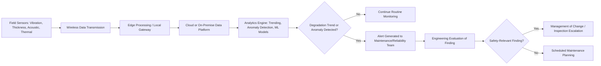
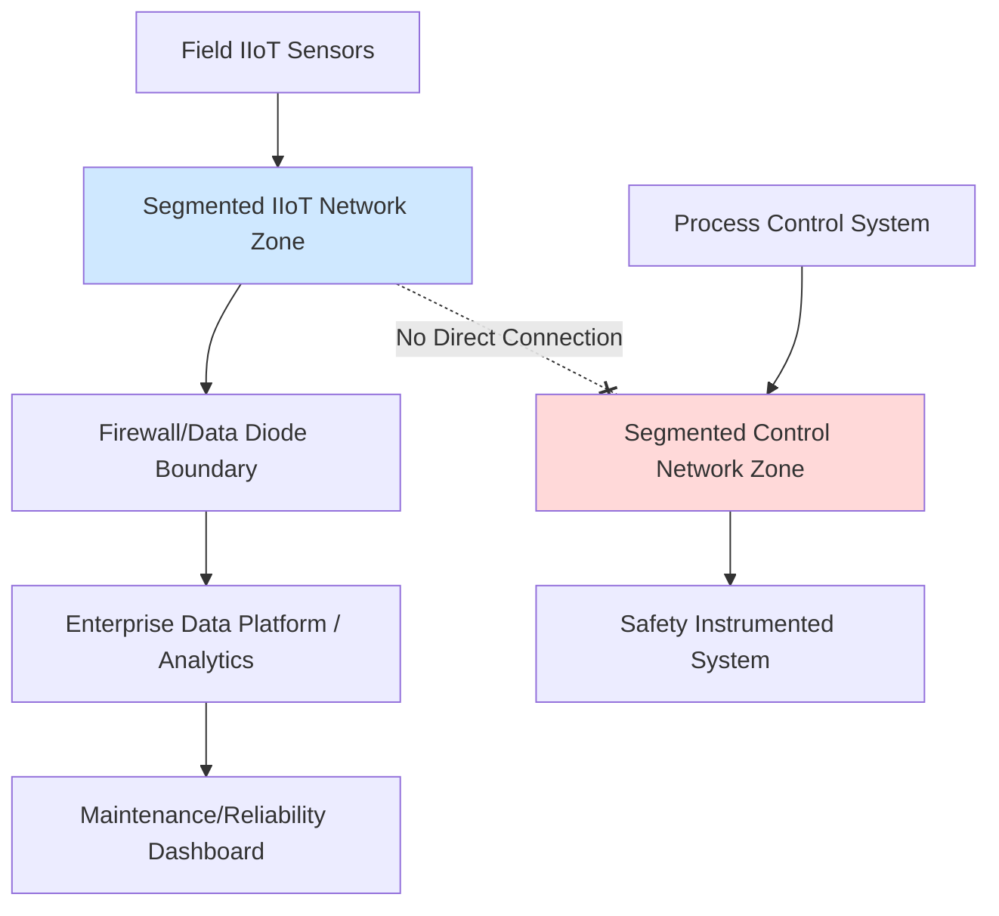

## Industrial Internet of Things and Predictive Maintenance

### Overview

Industrial Internet of Things (IIoT) technology applies networked sensors, wireless data transmission, and cloud/edge analytics to process equipment, enabling continuous condition monitoring at a scale and granularity not achievable through traditional periodic manual inspection. When applied to predictive maintenance, IIoT shifts mechanical integrity programs from time-based or reactive maintenance toward condition-based intervention, with the potential to detect equipment degradation trends before they progress to a loss-of-containment event. This represents a significant evolution in process safety practice, though it introduces its own set of implementation, validation, and cybersecurity considerations.

### Key Points

- IIoT-enabled predictive maintenance moves beyond traditional preventive (time-based) and reactive (failure-based) maintenance strategies toward condition-based maintenance informed by continuous or high-frequency sensor data
- Common IIoT sensor applications in process safety-relevant equipment include vibration monitoring on rotating equipment, corrosion/thickness monitoring on piping and vessels, acoustic emission monitoring for leak detection, and thermal imaging for electrical and mechanical hot-spot detection
- Predictive analytics (including machine learning models) can identify degradation trends and anomalies earlier than periodic manual inspection, but require validated baseline data and appropriate model training to avoid false positives/negatives
- Integration of IIoT data with existing Mechanical Integrity programs must be managed through Management of Change, since IIoT systems can become safety-relevant inputs rather than purely informational tools
- Cybersecurity of IIoT sensor networks is a critical consideration, since wireless sensor networks and cloud connectivity introduce potential attack surfaces into process safety-relevant monitoring systems

### IIoT Sensor Technologies Applied to Process Safety

**Vibration Monitoring**

- Continuous or high-frequency wireless vibration sensors on rotating equipment (pumps, compressors, turbines) detect bearing wear, misalignment, and imbalance trends well before failure
- Enables trending of vibration signatures over time, distinguishing gradual degradation from sudden onset conditions

**Corrosion and Thickness Monitoring**

- Ultrasonic thickness sensors, permanently or semi-permanently mounted on piping and vessel walls, provide continuous or frequent wall-thickness trend data rather than relying solely on periodic manual inspection during turnarounds
- Particularly valuable for high-corrosion-rate service or hard-to-access locations where manual inspection frequency has historically been limited by access difficulty or cost

**Acoustic Emission and Leak Detection**

- Acoustic sensors detect the characteristic sound signature of fluid escaping through a small breach, enabling early leak detection potentially before a release becomes visually or otherwise apparent
- Useful for buried or insulated piping where visual inspection is impractical

**Thermal Imaging and Infrared Monitoring**

- Fixed or periodic thermal imaging identifies abnormal hot spots in electrical equipment (indicating loose connections or overloading) and mechanical equipment (indicating friction or lubrication issues)

**Corrosion Under Insulation (CUI) Monitoring**

- Specialized sensor technologies (including some non-intrusive techniques) address the historically difficult-to-inspect problem of corrosion occurring beneath insulation, where traditional visual inspection requires costly insulation removal

### Diagram: IIoT Predictive Maintenance Data Flow

### Maintenance Strategy Evolution

| Strategy | Basis for Action | Typical Application |
| --- | --- | --- |
| Reactive (Run-to-Failure) | Equipment fails, then repaired | Non-critical, low-consequence equipment |
| Preventive (Time-Based) | Fixed calendar/usage interval regardless of condition | Traditional approach for safety-critical equipment |
| Condition-Based (IIoT-Enabled) | Maintenance triggered by measured condition/trend data | Equipment with reliable, validated condition-monitoring technology available |
| Predictive (Analytics-Driven) | Machine learning/statistical models forecast remaining useful life or failure probability | Equipment with sufficient historical data and validated model performance |

### Integration with Mechanical Integrity Programs

**Complementing, Not Replacing, Regulatory Inspection Requirements**

- IIoT continuous monitoring can supplement but generally should not be assumed to fully replace code-mandated periodic inspection requirements (e.g., API 510/570/653 inspection intervals) unless a formal risk-based inspection justification, validated against the specific technology's demonstrated reliability, supports interval extension
- [Inference] The extent to which IIoT-based continuous monitoring can justify extended inspection intervals under specific jurisdictional and code requirements depends on the applicable regulatory framework and the specific technology's validated reliability; this is a facility- and jurisdiction-specific determination rather than a universal rule.

**Management of Change for New Monitoring Systems**

- Deploying new IIoT sensor networks on safety-critical equipment should be evaluated through Management of Change, particularly where the sensor data will be relied upon to inform inspection intervals, alarm thresholds, or maintenance decisions that were previously governed by different criteria
- MOC review should address sensor reliability, false-positive/false-negative rates, data validation methodology, and the decision protocol for acting on sensor-generated alerts

**Alarm Management Considerations**

- As IIoT deployments scale, the volume of generated alerts/alarms can create alarm management challenges analogous to those addressed in process control alarm rationalization (per ISA 18.2 principles) — poorly tuned predictive maintenance alert thresholds can produce alarm fatigue that undermines the technology's safety value

### Data Validation and Model Reliability Considerations

**Baseline Data Requirements**

- Predictive analytics models require sufficient historical baseline data to distinguish normal operating variation from genuine degradation trends; insufficient baseline data can produce unreliable predictions in either direction (missed degradation or excessive false alarms)

**False Positive/Negative Management**

- A false negative (failing to detect genuine degradation) carries direct safety consequence, while excessive false positives can erode confidence in the system and lead to alert fatigue, undermining the program's long-term effectiveness
- Model validation should include periodic comparison against traditional inspection/testing methods to confirm ongoing predictive accuracy, particularly as equipment, process conditions, or sensor technology evolves over time

**Human Factors in Predictive Maintenance Adoption**

- Maintenance and operations personnel need appropriate training to interpret IIoT-generated findings correctly and to understand the technology's capabilities and limitations, avoiding both over-reliance (assuming the system will catch everything) and under-utilization (ignoring findings due to unfamiliarity or distrust of the technology)

### Cybersecurity Considerations for IIoT Deployment

- Wireless sensor networks and cloud-connected data platforms introduce potential cybersecurity attack surfaces that did not exist with traditional, air-gapped or hard-wired instrumentation
- IIoT devices deployed in or near process areas require security architecture consistent with recognized frameworks such as IEC 62443 (industrial automation and control systems security), including network segmentation between IIoT monitoring systems and safety-critical control/safety instrumented systems
- Compromise of IIoT sensor data integrity (whether through cyberattack or system malfunction) could result in false assurance about equipment condition, masking genuine degradation — a scenario requiring the same due diligence applied to any safety-relevant data source

### Diagram: IIoT Cybersecurity Segmentation Concept

### Common Implementation Pitfalls

**Deploying Sensors Without a Clear Decision Framework**

- Installing IIoT sensors and collecting data without first defining what specific decisions (inspection interval changes, maintenance triggers, alarm escalation) the data will inform can result in data accumulation without actionable safety value

**Inadequate Validation Before Reliance**

- Shifting maintenance or inspection decisions to rely on IIoT data before the technology's reliability has been adequately validated against traditional methods for the specific application and equipment type

**Treating IIoT as Purely an IT/Reliability Initiative**

- Implementing IIoT programs without process safety engineering involvement can result in systems that generate useful reliability insights but fail to integrate with, or appropriately inform, the facility's formal Mechanical Integrity and Management of Change programs

**Underestimating Cybersecurity Requirements**

- Treating IIoT sensor networks as low-risk "informational" systems not warranting the same cybersecurity rigor applied to control and safety systems, despite their potential to influence safety-relevant maintenance decisions

### Example

A refinery implements a wireless ultrasonic thickness monitoring program on a set of piping circuits identified as having elevated corrosion risk under its Risk-Based Inspection program. Sensors transmit thickness readings at defined intervals to a cloud analytics platform, which trends wall-thickness loss rate against the circuit's established corrosion allowance. The deployment is evaluated through Management of Change, which establishes that the sensor data will supplement, not replace, the existing API 570 periodic inspection schedule until at least two years of validated sensor data confirms correlation with manual inspection results. The analytics platform generates an alert when a specific circuit's corrosion rate trend projects remaining wall thickness will reach the retirement thickness earlier than the next scheduled turnaround inspection; this triggers an engineering evaluation and an interim inspection scope addition, allowing proactive repair scheduling rather than discovering the condition only at the next scheduled turnaround. The IIoT sensor network is deployed on a segmented network architecture, with no direct connectivity to the facility's process control or safety instrumented systems, consistent with IEC 62443 segmentation principles.

### Related Topics

- Risk-Based Inspection (RBI) methodology and interval justification
- Mechanical Integrity program elements under OSHA PSM (29 CFR 1910.119(j))
- Industrial control system cybersecurity (IEC 62443)
- Alarm management and rationalization (ISA 18.2)
- Corrosion Under Insulation (CUI) inspection challenges and technologies
- Machine learning model validation for safety-relevant applications
- Management of Change for digital and monitoring system deployments