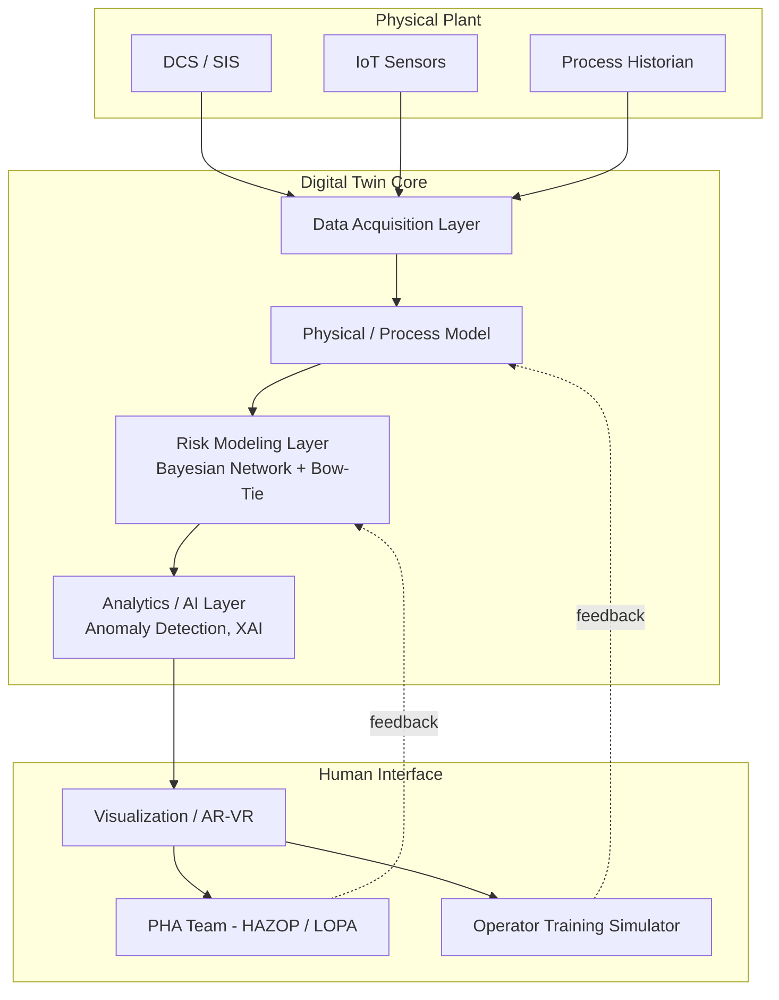

## Digital Twins for Hazard Analysis and Training

### Definition and Scope

A digital twin (DT) in Process Safety Management (PSM) is a dynamic, data-connected virtual replica of a physical asset, process unit, or entire facility that mirrors its real-time state, behavior, and configuration throughout its lifecycle. Unlike a static 3D model or a one-time simulation, a process safety digital twin maintains bidirectional synchronization with the physical plant through sensor feeds, control system data, and engineering documentation, allowing it to reflect actual operating conditions rather than design-intent conditions alone.

In PSM, digital twins serve two overlapping but distinct functions:

- **Hazard analysis support** — continuously or periodically informing Process Hazard Analysis (PHA) methods such as HAZOP, Layer of Protection Analysis (LOPA), and Bow-Tie barrier modeling with live plant data, transforming these from static, point-in-time studies into living risk assessments.
- **Training and competency development** — providing immersive, risk-free virtual environments where operators, maintenance technicians, and emergency responders can rehearse normal operations, abnormal situation management, and emergency response without exposure to actual process hazards.

### Why Digital Twins Matter in PSM

Traditional PHA studies (HAZOP, What-If, FMEA) are conducted periodically — often on a 5-year revalidation cycle — and are document-centered, relying heavily on expert judgment captured at a single point in time. This creates a structural gap: conventional HAZOP studies remain central to process safety management, but their periodic, document-centered implementation and dependence on expert judgment limit their ability to track dynamic operational risk as plant conditions, equipment degradation, and operating envelopes shift between revalidations. [doi](https://doi.org/10.3390/pr14142334)

Digital twins address this gap by acting as a continuous decision-support layer. Current literature frames this as an "augmentation principle": DT–AI should strengthen expert-led hazard analysis as a decision-support layer, not replace human judgment. This is a critical distinction for PSM practitioners — the digital twin does not replace the PHA team's judgment; it extends the team's situational awareness between formal studies and surfaces emerging deviations that would otherwise go undetected until the next scheduled revalidation. [doi](https://doi.org/10.3390/pr14142334)

### Core Architecture

A process safety digital twin typically consists of five integrated layers:

**1. Data Acquisition Layer**

Real-time feeds from distributed control systems (DCS), safety instrumented systems (SIS), IoT sensors, and historians. This layer captures process variables (temperature, pressure, flow, level), equipment status, and safety-critical alarms.

**2. Physical/Process Model Layer**

First-principles or hybrid physics-data models that replicate the actual chemical process behavior — mass and energy balances, reaction kinetics, and equipment performance curves — allowing the twin to predict how the real system would respond to a given deviation.

**3. Risk/Hazard Modeling Layer**

This layer maps monitored variables onto structured risk frameworks. One documented architecture integrates sensor data with a trained Bayesian Network and a dynamic Bow-Tie model to enable continuous monitoring of failure risks and predictive hazard analysis, aligning outputs with recognized industry standards. Notably, this type of system has been aligned with major industry standards, including API 754 for Tier 3 safety indicators, API 521 for pressure-relieving scenarios, OSHA 1910.119 for compliance, and the IBM Bow-Tie framework for barrier-based risk visualization. [springer](https://link.springer.com/chapter/10.1007/978-3-032-03515-8_15)[springer](https://link.springer.com/chapter/10.1007/978-3-032-03515-8_15)

**4. Analytics/AI Layer**

Machine learning models for anomaly detection, degradation trending, and predictive failure probability estimation. This layer is also where explainable AI (XAI) techniques are applied so that operators and PHA leaders can trust and interpret the twin's outputs rather than treating it as a black box.

**5. Visualization/Interaction Layer**

3D/AR/VR interfaces, dashboards, and training simulators through which human users — control room operators, PHA teams, or trainees — interact with the twin.

### Application 1: Dynamic Hazard Analysis

**Continuous HAZOP Augmentation**

Rather than replacing the deviation-guideword methodology of HAZOP, digital twins feed it live data. Four complementary pathways have been identified in the literature for how DT and AI technologies augment hazard analysis: AI-assisted HAZOP, digital twin-based monitoring, hybrid physics–data models, and explainable AI. [doi](https://doi.org/10.3390/pr14142334)

**Barrier Health Monitoring via Bow-Tie**

The Bow-Tie diagram — showing threats, a central hazard/top event, and consequences connected by preventive and mitigative barriers — is particularly well suited to digitalization. As one study frames it: a digital twin is a model embedded in software that mirrors a specific aspect of a real system; the aspect in this case is the risk space associated with a process. The well-known BowTie is the model that turns out to be singularly well suited as a digital twin from the risk perspective as it maps out the risk space together with real-life controls. In practice, this means each barrier (e.g., a relief valve, an interlock, a fire suppression system) is linked to live health/status data, so barrier degradation — a corroded relief valve, a bypassed interlock — is reflected in the model immediately rather than being discovered at the next audit. [doaj](https://doaj.org/article/99cf427f04f941bf93a7553b9820baf6)

**LOPA and SIL Verification**

Digital twins support Safety Instrumented System (SIS) lifecycle management. As one industry description notes, such twins provide analysis modules like hazard and operability (HAZOP) and layer of protection analysis (LOPA) to examine the process unit's risk and recommend IPLs to reduce the risk to acceptable levels, along with engineering modules to design and implement IPLs like safety integrity level (SIL) calculation engine, cause and effect chart generation and functional test plans to validate the safety instrumented functions (SIF). [controleng](https://www.controleng.com/articles/digital-twins-for-safety-instrumented-systems/)[controleng](https://www.controleng.com/articles/digital-twins-for-safety-instrumented-systems/)

**Predictive Risk Quantification**

A more advanced concept extends the standard digital twin into a "Digital Risk Twin" (DRT), which formalizes hazard prediction mathematically. In this framework, the twin's simulated state is passed through successive transformation layers — system simulation, feature extraction, hazard dynamics, and risk functionals within a unified and interpretable structure — so that continuously monitored degradation indicators are converted into quantitative, time-dependent failure probabilities rather than qualitative risk rankings alone. [mdpi](https://www.mdpi.com/2227-7390/13/19/3222)

**Worked Example: Bow-Tie Barrier Degradation Alert**

Consider a reactor overpressure top event with a relief valve as a mitigative barrier:

| Element | Static PHA (Traditional) | Digital Twin (Dynamic) |
| --- | --- | --- |
| Barrier status | Assumed 100% available (per design) | Live: valve last tested 11 months ago, set-pressure drift +2% detected via sensor trend |
| Risk reassessment trigger | Next 5-year PHA revalidation | Automatic alert when barrier health score drops below threshold |
| Data source | Interview + P&ID review | DCS, SIS diagnostics, maintenance CMMS integration |
| Output | Static LOPA credit (e.g., PFD = 0.01) | Dynamically updated PFD estimate, flagged for engineering review |

### Application 2: Training and Competency Development

**Immersive Operator Training Simulators (OTS)**

Coupling the process model layer with VR/AR interfaces creates a training environment where trainees interact with a physics-accurate replica of the actual plant — not a generic simulator — including its specific quirks, instrumentation layout, and current operating philosophy. Because the twin ingests real-time data acquisition from IoT integrated sensors, which facilitate continuous monitoring of operational conditions and environmental factors, training scenarios can be built from actual historical upset conditions rather than only generic textbook cases. [springer](https://link.springer.com/chapter/10.1007/978-3-031-91334-1_30)

**Scenario-Based Emergency Response Rehearsal**

Digital twins allow trainees to safely experience:

- Startup and shutdown sequences with realistic process lag
- Abnormal situation management (e.g., runaway reaction precursors, loss of cooling)
- Emergency isolation and depressurization procedures
- Multi-person coordination drills (control room + field operators + incident commander)

**Human Digital Twins (HDT) for Individual Risk Profiling**

An emerging and more granular concept applies the digital twin paradigm to the worker rather than the plant. This approach proposes virtual representations of individual operators that could leverage wearable technologies, AI, and existing digital twin technology to continuously collect, analyze, and predict safety risks based on personal physiological conditions, individual factors, as well as environmental factors. In a training context, this allows fatigue, stress load, or task-specific competency gaps to be factored into scenario difficulty and post-exercise coaching. [Inference: HDT-based training personalization is conceptually described in recent literature but industrial deployment maturity and standardized competency metrics remain limited as of current publications.] [springer](https://link.springer.com/chapter/10.1007/978-3-032-03515-8_34)

**Rapid Hazard Detection for Field Training Scenarios**

Real-time hazard-recognition training benefits from high-speed anomaly detection models. In a related construction-safety application, a digital-twin monitoring system achieved substantial performance: tests across 90 cases produced recall rates of 96% to 99% in under a second of processing time, with accuracy of risk-factor identification almost 98%. [Unverified: figures are drawn from a construction high-rise safety monitoring study, not a chemical process facility; process industry HAZOP-integrated DT systems are not yet validated at comparable statistical scale according to current review literature.] [techxplore](https://techxplore.com/news/2026-08-digital-twin-hazards.html)

### Data and Model Integration Requirements

For a digital twin to function reliably as a hazard analysis and training tool, it must integrate:

1. **Engineering data** — P&IDs, PFDs, equipment datasheets, SIL/LOPA studies, relief system design basis
2. **Real-time operational data** — DCS/SIS tags, historian trends, alarm and event logs
3. **Maintenance data** — CMMS work orders, inspection results, instrument calibration records
4. **Safety management data** — incident reports, near-miss logs, MOC (Management of Change) records

A digital twin's ability to support the full safety lifecycle stems from this integration: a digital twin is an example of a comprehensive software package that can import existing engineering documentation for any of the phases of the safety life-cycle as well as having the capability to execute the steps of the safety life-cycle. [controleng](https://www.controleng.com/articles/digital-twins-for-safety-instrumented-systems/)

### Known Failure Modes and Limitations

Recent critical review literature identifies specific technical and organizational risks that must be managed when deploying DT/AI-enhanced hazard analysis systems. Key failure modes documented include model drift, sensor faults, large language model hallucination, and automation complacency, and the same review proposes a thirteen-item implementation risk register spanning technical, organizational, economic, security, and scalability concerns. [mdpi](https://www.mdpi.com/2227-9717/14/14/2334)[mdpi](https://www.mdpi.com/2227-9717/14/14/2334)

**Key Points**

- **Model drift**: As the physical plant is modified (MOC) or degrades, the twin's underlying model can diverge from reality if not actively maintained — a stale twin is worse than no twin, since it can produce false confidence.
- **Sensor faults**: Erroneous sensor data propagates directly into risk calculations; the twin is only as trustworthy as its instrumentation.
- **AI hallucination / over-trust**: When generative or LLM-based components are used to assist hazard identification (e.g., auto-drafting HAZOP deviations), unverified outputs risk being accepted uncritically by time-pressured teams.
- **Automation complacency**: Continuous monitoring can erode operator vigilance and independent judgment if the twin's alerts are treated as infallible.
- **Validation gap**: [Inference] Many industrial pilots remain at low technology readiness levels; peer-reviewed literature explicitly frames deployment as still emerging, noting persistent gaps between pilot-scale demonstration and sustained industrial use.

### Standards and Regulatory Alignment

Digital twins deployed for PSM purposes are typically mapped to existing regulatory and industry frameworks rather than treated as a standalone compliance mechanism:

- **OSHA 29 CFR 1910.119** (Process Safety Management of Highly Hazardous Chemicals) — the digital twin supports several PSM elements (Process Hazard Analysis, Mechanical Integrity, Training) but does not itself satisfy the regulation; documentation and human validation remain required.
- **API 754** — Tier 3/Tier 4 process safety performance indicators can be automated and trended via the twin's data layer.
- **API 521** — Pressure-relieving and depressurizing system design basis can be cross-checked against live relief scenario simulations.
- **IEC 61511 / ISA 84** — SIL verification and SIF validation workflows can be supported by the twin's engineering modules, though independent functional safety assessment is still required.

[Inference: Regulatory bodies have not, as of current published guidance, formally certified digital twins as a standalone substitute for any specific PSM element; they function as a supporting tool within an auditable PSM program.]

### Implementation Roadmap (Phased Approach)

1. **Foundation** — Digitize and validate as-built P&IDs, equipment data, and historian connectivity.
2. **Static-to-Dynamic Bow-Tie migration** — Convert existing Bow-Tie/LOPA studies into data-linked models with barrier health tags.
3. **Pilot monitoring** — Deploy on a single high-consequence unit; validate model outputs against known historical incidents/near-misses before trusting live alerts.
4. **AI-assisted deviation analysis** — Introduce anomaly detection and explainable AI recommendations as decision support, with mandatory human review.
5. **Training environment build-out** — Extend the validated process model into an immersive OTS/VR training platform using the same physics core.
6. **Continuous validation and MOC integration** — Establish a formal process to update the twin whenever a Management of Change is approved, preventing model drift.

### Digital Twin Data Flow for Hazard Analysis (svg_diagram)

<svg xmlns="http://www.w3.org/2000/svg" viewBox="0 0 800 380" font-family="sans-serif">
<text x="400" y="24" text-anchor="middle" font-size="16" font-weight="bold" fill="#1a1a1a">Digital Twin Data Flow for Hazard Analysis (svg_diagram)</text>
<rect x="30" y="60" width="150" height="60" rx="6" fill="#dbeafe" stroke="#2563eb" />
<text x="105" y="85" text-anchor="middle" font-size="12" fill="#1e3a8a">DCS / SIS</text>
<text x="105" y="102" text-anchor="middle" font-size="12" fill="#1e3a8a">Live Process Data</text>
<rect x="30" y="150" width="150" height="60" rx="6" fill="#dbeafe" stroke="#2563eb" />
<text x="105" y="175" text-anchor="middle" font-size="12" fill="#1e3a8a">CMMS</text>
<text x="105" y="192" text-anchor="middle" font-size="12" fill="#1e3a8a">Maintenance Records</text>
<rect x="30" y="240" width="150" height="60" rx="6" fill="#dbeafe" stroke="#2563eb" />
<text x="105" y="265" text-anchor="middle" font-size="12" fill="#1e3a8a">P&amp;ID / SIL Docs</text>
<text x="105" y="282" text-anchor="middle" font-size="12" fill="#1e3a8a">Engineering Baseline</text>
<line x1="180" y1="90" x2="260" y2="150" stroke="#64748b" stroke-width="2" />
<line x1="180" y1="180" x2="260" y2="170" stroke="#64748b" stroke-width="2" />
<line x1="180" y1="270" x2="260" y2="190" stroke="#64748b" stroke-width="2" />
<rect x="260" y="130" width="180" height="90" rx="6" fill="#fef3c7" stroke="#d97706" />
<text x="350" y="160" text-anchor="middle" font-size="13" font-weight="bold" fill="#78350f">Digital Twin</text>
<text x="350" y="180" text-anchor="middle" font-size="12" fill="#78350f">Bow-Tie / Bayesian</text>
<text x="350" y="197" text-anchor="middle" font-size="12" fill="#78350f">Risk Model</text>
<line x1="440" y1="150" x2="520" y2="120" stroke="#64748b" stroke-width="2" />
<line x1="440" y1="190" x2="520" y2="220" stroke="#64748b" stroke-width="2" />
<rect x="520" y="80" width="200" height="70" rx="6" fill="#dcfce7" stroke="#16a34a" />
<text x="620" y="108" text-anchor="middle" font-size="12" font-weight="bold" fill="#14532d">Barrier Health Alert</text>
<text x="620" y="128" text-anchor="middle" font-size="11" fill="#14532d">to PHA / Engineering Team</text>
<rect x="520" y="190" width="200" height="70" rx="6" fill="#fee2e2" stroke="#dc2626" />
<text x="620" y="218" text-anchor="middle" font-size="12" font-weight="bold" fill="#7f1d1d">Training Scenario Feed</text>
<text x="620" y="238" text-anchor="middle" font-size="11" fill="#7f1d1d">to VR/AR Simulator</text>
<line x1="620" y1="150" x2="620" y2="190" stroke="#94a3b8" stroke-width="1.5" stroke-dasharray="4,3" />
<rect x="400" y="310" width="260" height="50" rx="6" fill="none" stroke="#475569" stroke-width="1.5" stroke-dasharray="5,3" />
<text x="530" y="340" text-anchor="middle" font-size="12" fill="#334155">Human review required at every decision point</text>
</svg>

### Worked Example: Emergency Response Training Scenario

**Scenario**: Loss-of-cooling event on an exothermic batch reactor, replicated in the digital twin training environment.

**Setup**: Trainee is placed in a virtual control room replicating the actual DCS graphics of the real unit. The twin's process model, calibrated against the real reactor's kinetics and cooling system dynamics, drives the simulated response.

**Sequence**:

1. Twin injects a simulated cooling water pump trip.
2. Reactor temperature trend begins rising per the twin's physics model — matching the actual thermal runaway rate characteristic of that specific reaction.
3. Trainee must recognize the deviation, diagnose root cause, and execute the correct emergency procedure (e.g., initiate emergency quench, isolate feed) within the time window the real chemistry would allow.
4. Twin scores response time against the calculated safe response window derived from the reaction's adiabatic temperature rise rate.
5. Post-exercise debrief uses twin-logged data (decision timestamps vs. simulated consequence escalation) for objective competency assessment.

**Value over generic simulators**: Because the twin uses the unit's actual process model rather than a generic reactor archetype, the trained response window and consequence severity reflect the real plant's chemistry and equipment — not textbook approximations.

### Related Topics

- HAZOP Methodology and Deviation Analysis
- Layer of Protection Analysis (LOPA) Fundamentals
- Bow-Tie Risk Modeling and Barrier Management
- Safety Instrumented Systems (SIS) and IEC 61511 Lifecycle
- Management of Change (MOC) Procedures
- Bayesian Networks for Predictive Risk Assessment
- Explainable AI (XAI) in Safety-Critical Decision Support
- Operator Training Simulators (OTS) and Competency Assurance
- Industry 4.0 and IoT Sensor Integration in Process Plants
- API 754 Process Safety Performance Indicators
- Human Factors Engineering and Human Digital Twins
- Virtual and Augmented Reality for Emergency Response Drills