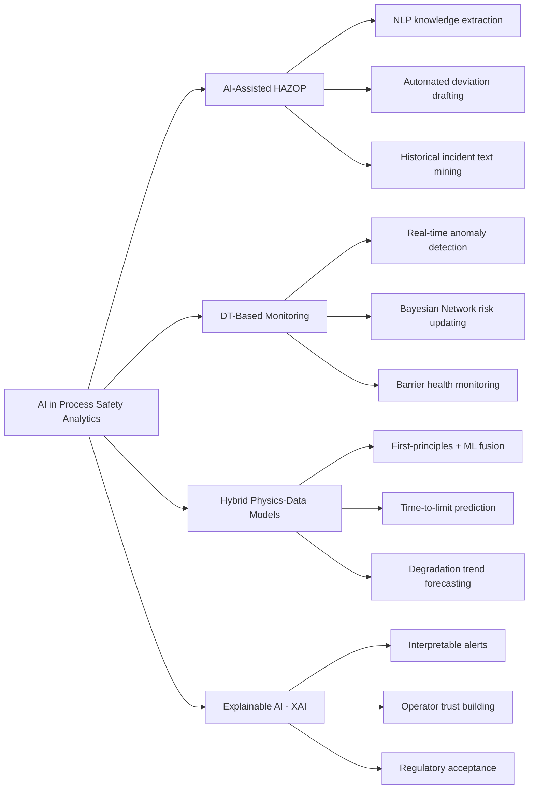

## Artificial Intelligence Applications in Process Safety Analytics

### Definition and Scope

Artificial Intelligence (AI) in Process Safety Analytics refers to the application of machine learning (ML), natural language processing (NLP), large language models (LLMs), and hybrid physics-data modeling techniques to support the identification, prediction, and management of process safety hazards. Within PSM, AI functions as a computational support layer that augments — rather than replaces — expert-led hazard analysis, incident investigation, and risk quantification. As framed in current literature, HAZOP captures expert knowledge about deviations, causes, consequences, safeguards, and required actions, while digital twins provide a continuously updated representation of the operating process by linking process models with live plant data, and AI provides computational support for knowledge extraction, anomaly recognition, prediction, diagnosis, and explanation.

This item is closely related to, but distinct from, digital twins: a digital twin is the *architecture* (the connected, synchronized virtual representation), whereas AI comprises the *analytical methods* — the algorithms — that operate on the data the twin or other systems provide. AI can be deployed with or without a full digital twin architecture.

### Four Core Application Pathways

Recent literature organizes AI-enhanced process safety into four complementary, non-exclusive pathways: AI-assisted HAZOP, digital twin-based monitoring, hybrid physics–data models, and explainable AI.

### Pathway 1: AI-Assisted HAZOP and Knowledge Extraction

**Text Mining of Historical Studies and Incident Reports**

NLP and text-mining techniques are used to extract structured hazard knowledge from unstructured historical PHA worksheets, P&ID annotations, and incident narratives, reducing reliance on scarce expert time for initial deviation screening. In one demonstrated approach applied to petrochemical processes, various machine learning models — including KNN, Random Forest, Decision Tree, Support Vector Machine, Gradient Boosting, Neural Networks, and an Ensemble model — are applied to predict overall risk for each node, and the study found improved accuracy through a KNN classifier compared to other models, with further gains from hyperparameter tuning. This class of application supports node prioritization and helps focus expert HAZOP review time on the highest-risk nodes rather than treating all nodes with equal scrutiny.

**Large Language Models for Root Cause Classification**

A more recent development applies domain-augmented LLMs directly to incident investigation. One framework combines structured Chain-of-Thought prompting with retrieval-augmented generation (RAG) to classify offshore-platform incident reports into standardized top-level root cause categories. This approach demonstrated that combining domain-specific prompts with information retrieval significantly enhances the reasoning capacity of generative LLMs for multi-label safety analytics, offering a scalable, low-cost pathway toward digitizing incident investigations. Critically, the researchers explicitly recognized that hallucination is a major concern in applying pretrained language models to this domain, which is why the RAG and domain-guideline grounding were embedded directly into the framework rather than relying on the LLM's unaided output — a design pattern that also cut overclassification significantly by embedding RCA guidelines and examples directly into the prompting process.

**Automated Report Summarization**

LLM-based summarization is used to compress large volumes of free-text incident narratives into structured, reviewable summaries. In an adjacent but methodologically instructive aviation safety application, a fine-tuned transformer-based sequence-to-sequence model was used to automate the summarization of incident narratives, combined with exploratory data analysis to identify underlying safety trends including human factors and temporal patterns. [Unverified: this specific example is drawn from aviation incident data rather than process industry PSM records; the underlying NLP summarization technique is directly transferable, but quantitative accuracy figures should not be assumed to hold for chemical process incident text without independent validation.]

### Pathway 2: Digital Twin-Based Monitoring and Anomaly Detection

AI models — typically Bayesian Networks, autoencoders, or supervised classifiers — are layered onto live sensor data to detect deviations before they cross conventional alarm thresholds. The model layer in these systems comprises first-principles, reduced-order, empirical, machine learning, or hybrid physics–data models that are used to estimate hidden states and forecast trajectories before a conventional alarm threshold is crossed. This capability directly supports the "predictive" function of process safety analytics — shifting hazard detection from reactive (post-alarm) to anticipatory (pre-threshold).

*(This pathway overlaps substantially with digital twin architecture; see the related "Digital Twins for Hazard Analysis and Training" reference for full architectural detail.)*

### Pathway 3: Hybrid Physics-Data Models for Predictive Safety Analytics

Pure data-driven ML models often struggle with the low-frequency, high-consequence nature of process safety events, since major incidents are — by design of a well-run PSM program — rare, leaving limited training data. Hybrid physics-data models address this by combining first-principles process models (mass/energy balances, reaction kinetics) with data-driven correction terms trained on plant history. Literature frames the objective of this pathway carefully: in the context of HAZOP enhancement, the role of hybrid modeling is not simply to improve prediction accuracy in isolation, but to strengthen the overall dynamic monitoring and forecasting capability that supports the hazard analysis lifecycle.

**Key Points**

- Pure ML models risk poor extrapolation to novel, rare failure modes not represented in historical training data — a critical limitation for low-frequency/high-consequence process safety events.
- Hybrid models retain physics-based constraints (e.g., conservation laws) so predictions remain physically plausible even outside the training data's range.
- These models are used for time-to-limit prediction — estimating how long a deviating process variable has before it reaches a safety-critical limit, giving operators an actionable response window.

### Pathway 4: Explainable AI (XAI) for Trust and Regulatory Acceptance

Because process safety decisions carry major consequence, AI outputs that function as "black boxes" face resistance from both operators and regulators. XAI techniques (e.g., feature attribution, rule extraction, attention visualization) are applied specifically to make AI-generated risk alerts interpretable — showing *why* a model flagged a deviation, not just *that* it did. This pathway is treated in the literature as a load-bearing requirement for industrial adoption, not an optional add-on: explainable AI for operator trust and regulatory acceptance is one of the four foundational technology pathways underpinning the entire DT-AI-enhanced HAZOP framework, alongside AI-assisted knowledge capture, DT-based monitoring, and hybrid physics-data modeling.

### Worked Example: LLM-Assisted Root Cause Classification Workflow

Consider an offshore platform incident investigation team processing a backlog of free-text district investigation reports:

| Step | Traditional Approach | AI-Augmented Approach |
| --- | --- | --- |
| Initial triage | Analyst manually reads each report | LLM performs first-pass classification into standardized root cause categories |
| Categorization | Analyst assigns root cause using judgment | Chain-of-Thought prompting + RAG grounds classification in domain-specific root cause guidelines |
| Consistency check | Inter-analyst variability common | Domain-guideline grounding reduces overclassification |
| Output | Report filed to database | Structured, auditable classification with retrieved supporting evidence, reviewed by human investigator |
| Investigator role | Full manual read and categorization | Reviews and validates AI-proposed classification (human-in-the-loop) |

**Output** (illustrative, not a specific published result): For a queue of 1,000+ historical incident reports, an AI-assisted first-pass classification can substantially reduce the analyst hours required for initial root-cause tagging, while flagging low-confidence classifications for prioritized human review. [Inference: exact time/accuracy figures are implementation- and dataset-dependent; the framework referenced above reports the *classification consistency and hallucination-reduction* benefit rather than a specific hours-saved metric.]

### Known Limitations and Failure Modes

**Key Points**

- **Hallucination risk**: Generative models can produce plausible-sounding but factually incorrect root causes or hazard descriptions if not grounded via retrieval-augmented generation or structured prompting; researchers explicitly flag hallucination as a major concern when applying pretrained language models to safety-critical classification tasks.
- **Data scarcity for rare events**: Major process safety incidents are infrequent by design of effective PSM programs, which constrains the volume of labeled training data available for supervised models — a structural challenge distinct from most commercial ML applications.
- **Automation complacency**: Continuous or automated AI screening can erode independent operator/analyst judgment if outputs are trusted without verification.
- **Validation and TRL gaps**: Review literature notes that fewer studies demonstrate the complete pathway from HAZOP knowledge formalization to live data integration, predictive modeling, explanation, safeguard verification, and feedback into revalidation — meaning most published frameworks address a portion of the full analytics lifecycle rather than the whole loop end-to-end.
- **Domain transfer risk**: [Inference] Many of the most quantitatively validated LLM/NLP safety applications currently published are from adjacent domains (aviation, radiation oncology, construction, offshore RCA) rather than continuous chemical process operations; direct transfer of reported accuracy metrics to a specific chemical plant's analytics program should be independently validated rather than assumed.

### Implementation Considerations

1. **Human-in-the-loop by default** — Every reviewed framework treats AI outputs as decision support requiring human sign-off, not autonomous determination, consistent with the augmentation principle that DT–AI should strengthen expert-led hazard analysis as a decision-support layer, not replace human judgment.
2. **Domain grounding is not optional** — Raw LLM outputs on safety-critical classification tasks are demonstrably improved, and hallucination demonstrably reduced, by embedding domain-specific guidelines and retrieval grounding directly into the prompting/architecture rather than relying on general pretraining alone.
3. **Model maintenance and drift** — As with digital twins, ML/AI models trained on historical plant behavior require ongoing revalidation as the process, equipment, or operating envelope changes via Management of Change (MOC).
4. **Regulatory documentation** — AI-assisted classifications and predictions should be logged with retrieved evidence/rationale (not just final output) to support auditability under PSM recordkeeping requirements.

### Future Research Directions

The research agenda identified in current review literature emphasizes moving from idealized demonstrations toward operational validation: in the medium term, research should focus on HAZOP-informed monitoring and predictive analytics, including mapping HAZOP deviations to measurable indicators, developing hybrid models for selected high-risk units, validating time-to-limit prediction, and integrating model outputs with safeguard-status information — with demonstrations moving beyond idealized case studies toward realistic plant data and degraded/abnormal operating conditions.

### Related Topics

- Digital Twins for Hazard Analysis and Training
- HAZOP Methodology and Deviation Analysis
- Natural Language Processing for Incident Report Mining
- Bayesian Networks for Predictive Risk Assessment
- Hybrid Physics-Informed Machine Learning Models
- Retrieval-Augmented Generation (RAG) for Domain-Grounded AI
- Explainable AI (XAI) in Safety-Critical Decision Support
- Root Cause Analysis Frameworks (e.g., ABS Group Root Cause Map)
- Management of Change (MOC) and Model Revalidation
- Human Factors in Automation Complacency
- Predictive Maintenance and Anomaly Detection in Process Plants
- Data Governance for Safety-Critical AI Systems