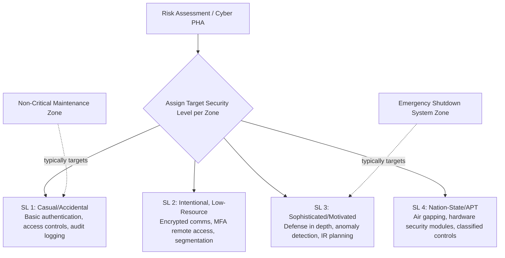

## Cybersecurity of Safety Instrumented Systems

### Definition and Scope

Cybersecurity of Safety Instrumented Systems (SIS) addresses the protection of the sensors, logic solvers, and final elements that execute Safety Instrumented Functions (SIFs) — the systems responsible for automatically bringing a process to a safe state when a hazardous deviation occurs (e.g., emergency shutdown systems, high-integrity pressure protection systems). Because a compromised SIS can be manipulated to fail silently or be prevented from acting during a real hazard, SIS cybersecurity sits at the direct intersection of functional safety (IEC 61508/61511) and operational technology (OT) cybersecurity (IEC 62443). This intersection is explicitly recognized in current guidance: functional safety designs the Safety Instrumented Systems whose failure has direct physical consequences, and depends on those systems remaining reliable — a reliability that a cyberattack can undermine just as effectively as a random hardware failure.

The core concern distinguishing SIS cybersecurity from general IT security is consequence class: OT cybersecurity prioritizes the safe and continuous operation of physical processes, in contrast to IT security's traditional confidentiality-first priority. An SIS breach is not merely a data-loss event — it is a potential trigger for fire, explosion, toxic release, or loss of life.

### Why SIS Requires Distinct Cybersecurity Treatment

Standard IT security controls cannot be applied unmodified to SIS environments. Training and guidance in this space explicitly separates the two: it explores the procedural and technical differences between the security for traditional IT environments and those solutions appropriate for distributed control systems (DCS), programmable logic controllers (PLC), safety instrumented systems (SIS), supervisory control and data acquisition (SCADA) or OT plant floor environments. Key distinctions include:

| Factor | Standard IT Security | SIS Cybersecurity |
| --- | --- | --- |
| Primary priority | Confidentiality | Availability and integrity of the safety function |
| Patch cadence | Regular, often automatic | Must be scheduled around safety-critical uptime; unplanned reboots are unacceptable |
| Failure tolerance | Downtime is costly but survivable | A disabled or spoofed SIS can directly enable a hazardous event |
| Network posture | Often internet-facing | Should be isolated; safety-instrumented systems stay in their own zone |
| Change control | IT change management | Must integrate with functional safety Management of Change (MOC) |

### Governing Standards Framework

**IEC 62443 (ISA/IEC 62443)**

This is the international benchmark for securing Industrial Automation and Control Systems (IACS), jointly developed by ISA and IEC, and is structured across four series addressing policy, system, and component-level requirements. Key components relevant to SIS:

- **IEC 62443-2-1** — specifies security-program requirements for IACS asset owners; the most recent edition reorganizes requirements around Security Program Elements (SPEs) and introduces a four-level maturity model (Initial, Managed, Defined, Improving) for evaluating program elements.
- **IEC 62443-3-3** — defines system-level security requirements organized around seven foundational requirements: identification and authentication control, use control, system integrity, data confidentiality, restricted data flow, timely response to events, and resource availability. Each requirement maps to four Security Levels (SL 1 through SL 4) of increasing rigor, with SL 1 protecting against casual or coincidental violation and SL 4 protecting against intentional, well-resourced, motivated, and skilled attackers using sophisticated means.
- **IEC 62443-4-1 / -4-2** — specify secure-product-development lifecycle requirements for IACS component vendors and technical security capabilities for individual components (PLCs, HMIs, RTUs, network devices) respectively; these have become the principal vehicle through which device vendors demonstrate cybersecurity compliance to industrial customers.

**IEC 61508 / IEC 61511 (Functional Safety)**

These standards define the Safety Integrity Level (SIL) framework governing SIS design and probability-of-failure targets. Cybersecurity intersects directly with SIL assignment: with a higher SIL value, the critical OT control system may be associated with a higher risk of failure leading to disastrous accidents, and cybersecurity assessments and operations are correspondingly scaled to the SIL value of the system being protected.

**ISA TR84.00.09 / Cyber PHA**

This technical report underpins the "Cyber PHA" (or "Cyber HAZOP") methodology — a safety-oriented approach to conducting a cybersecurity risk assessment for an industrial control system or SIS. It is described as a systematic, consequence-driven approach based on industry standards such as ISA 62443-3-2, ISA TR84.00.09, ISO/IEC 27005, ISO 31000, and NIST SP 800-39. The naming ("Cyber PHA"/"Cyber HAZOP") reflects deliberate methodological alignment with traditional process hazard analysis, so that cyber risk assessment fits within the same team-based, consequence-driven review structure PSM practitioners already use.

### Security Levels (SL) Applied to SIS Zones

A zone protecting an emergency shutdown system might warrant SL 3, while a non-critical maintenance laptop zone might sit at SL 1 — illustrating that SL targets are assigned per zone based on the consequence of compromise, not applied uniformly across the entire facility.

### Zones and Conduits: SIS Network Architecture

The foundational architectural pattern in IEC 62443 is network segmentation via "zones and conduits." Applied to SIS specifically:

**Key Points**

- **Zone isolation**: With the risk assessment in hand, IACS assets get partitioned from enterprise assets, and safety-instrumented systems stay in their own zone — physically and logically separated from the Basic Process Control System (BPCS) and from enterprise IT networks.
- **SIL-based prioritization**: A documented architectural approach uses SIL classification directly as a network segmentation input, assigning cybersecurity posture based on the SIL value of each OT control system, consistent with the SIS environment's IEC 61508/61511 safety classification.
- **Conduits as controlled pathways**: Any data path connecting the SIS zone to other zones (e.g., for engineering workstation access or historian data pull) is treated as a conduit requiring its own explicit security controls — not an open channel.
- **Defense in depth**: Primary methods for securing OT devices include risk assessment, defense in depth, zones and conduits, and network segmentation, applied as layered, redundant controls rather than a single perimeter defense.

### The Cyber PHA / Cyber HAZOP Process

Because SIS cybersecurity and process safety hazard analysis share a consequence-driven, team-based methodology, many organizations integrate cyber risk assessment directly into the PHA program rather than running it as a separate IT exercise.

**Worked Example: Cyber PHA Applied to an Emergency Shutdown Valve**

| HAZOP-style Element | Traditional PHA Framing | Cyber PHA Framing |
| --- | --- | --- |
| Node | Emergency shutdown (ESD) valve on high-pressure separator | Same physical node |
| Deviation/Threat | Valve fails to close on demand (random hardware failure) | Valve command spoofed or blocked via network intrusion |
| Cause | Actuator degradation, loss of air supply | Compromised engineering workstation, unauthorized logic change, malware on SIS network |
| Consequence | Overpressure, potential rupture | Same physical consequence, but attacker-initiated and potentially coordinated with other simultaneous failures |
| Safeguard (Traditional) | Redundant relief valve, SIL-rated SIF | Same physical safeguards, assuming they are not also compromised |
| Safeguard (Cyber-specific) | N/A | Network segmentation (zone/conduit), authentication controls, change-detection monitoring, air-gapped engineering access |
| Recommendation | Inspection/test interval review | Access control audit, patch management review, anomaly detection deployment |

### Secure Lifecycle Management

SIS cybersecurity is not a one-time control installation but a lifecycle discipline spanning the full asset life: the lifecycle scope for OT cybersecurity runs from design through commissioning, operation, and secure decommissioning — deliberately mirroring the functional safety lifecycle already familiar to PSM practitioners from IEC 61511.

1. **Design/Specification** — Define zones and conduits; assign target Security Levels (SL-T) per zone based on consequence of compromise.
2. **Component Procurement** — Require vendor conformance to IEC 62443-4-1 (secure development lifecycle) and 62443-4-2 (component-level technical capability).
3. **Commissioning** — Verify achieved Security Level (SL-A) meets or exceeds SL-T before handover; baseline asset inventory.
4. **Operation** — Continuous monitoring, patch management (scheduled around safety-critical uptime constraints), access control enforcement, and periodic Cyber PHA revalidation.
5. **Change Management** — Any modification to SIS logic, network configuration, or connected devices must pass through both functional-safety MOC and cybersecurity change-control review.
6. **Decommissioning** — Secure removal/sanitization of SIS components to prevent residual data or credential exposure.

### Emerging Attack Surface Considerations

As Industrial IoT (IIoT), cloud-integrated SCADA, and AI-driven monitoring expand connectivity into traditionally isolated OT environments, IEC 62443 has been progressively interpreted alongside newer architectural paradigms such as Zero Trust Network Architecture to address the resulting attack surface growth. For PSM practitioners, this trend has direct relevance: digital twins and AI-based analytics (see related topics) increase the number of data conduits into the SIS zone, meaning each new digitalization initiative should be evaluated through a Cyber PHA lens *before* deployment, not retrofitted afterward.

Research applying the IEC 62443 framework specifically to IIoT environments has identified several areas requiring further development, including system hardening, asset inventory, safety instrumented system isolation, risk assessment methodologies, change management systems, data storage security, and incident response procedures — with system hardening noted as having more mature existing guidance than the others, particularly for IIoT-specific contexts. [Inference: this indicates that SIS isolation practices for newer IIoT-connected architectures remain an active area of standards development rather than fully mature guidance as of current published research.]

### Governance and Executive Metrics

Organizations implementing SIS/OT cybersecurity programs commonly track operational metrics to demonstrate program maturity to regulators and leadership, including: Asset Inventory Coverage (percentage of OT devices identified), Patch and Segmentation Compliance, Mean Time to Detect (MTTD) OT incidents, Incident Response Time (MTTR) for breaches, and Recovery Rate (systems restored within Recovery Time Objective).

### Known Limitations and Implementation Challenges

**Key Points**

- **Patch timing conflicts**: Unlike IT systems, SIS cannot be rebooted or patched on arbitrary schedules — patching must be coordinated with planned shutdowns or maintenance windows to avoid introducing operational risk while attempting to reduce cyber risk.
- **Legacy equipment**: Many SIS installations include long-service-life hardware (20+ years) not designed with modern cybersecurity capabilities, creating a persistent gap between IEC 62443-4-2 component requirements and installed base reality.
- **Skills/readiness gap**: Industry surveys cited in current guidance indicate that only 14% of industrial organizations report feeling fully prepared for OT cybersecurity threats, despite IEC 62443 providing established, actionable guidance — indicating an implementation gap rather than a standards-availability gap. [Unverified: this is a single cited industry statistic; prevalence figures for "readiness" vary by survey methodology and should be corroborated against the most current source before being cited authoritatively.]
- **IT/OT convergence risk**: Digitalization initiatives (digital twins, cloud analytics, remote access) inherently increase conduits into previously isolated SIS zones, requiring continuous re-evaluation of the zone/conduit model rather than a one-time architecture decision.

### Related Topics

- Digital Twins for Hazard Analysis and Training
- Artificial Intelligence Applications in Process Safety Analytics
- IEC 61511 Safety Instrumented System Lifecycle
- Safety Integrity Level (SIL) Determination and Verification
- Zones and Conduits Network Segmentation Model
- Cyber PHA / Cyber HAZOP Methodology
- Management of Change (MOC) for OT Systems
- IT/OT Convergence Risk Management
- Zero Trust Architecture in Industrial Control Systems
- Incident Response Planning for OT Environments
- Secure Remote Access to Safety-Critical Systems
- Vendor Security Assurance (IEC 62443-4-1/4-2 Compliance)