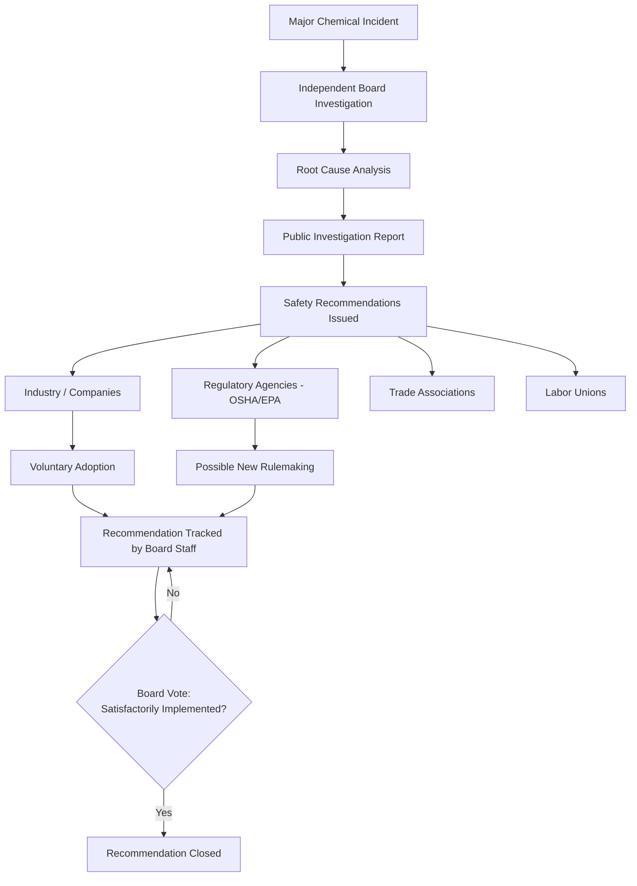

## Independent Investigation Boards and Institutional Sustainability

*Note: this item concerns institutional/regulatory governance rather than digitalization; it does not naturally belong under "Digitalization and Emerging Trends in Process Safety." Content is generated in full per workflow instructions — consider re-filing this item under a regulatory/institutional-frameworks chapter.*

### Definition and Scope

An independent investigation board, in the PSM context, is a government-chartered body whose sole function is to determine the root causes of major industrial incidents and issue safety recommendations — structurally separated from the regulatory and enforcement agencies that write and enforce standards. The defining characteristic is functional independence: the board investigates *why* an accident happened and *what should change*, without the power (or the conflicting incentive) to fine, cite, or prosecute the parties it investigates. The paradigmatic example in U.S. process safety is the Chemical Safety and Hazard Investigation Board (CSB): an independent, nonregulatory federal agency that investigates the root causes of major chemical accidents in the U.S. and conducts thorough root-cause investigations, with a mission to drive chemical safety change through independent investigations to protect people and the environment.

"Institutional sustainability" in this context refers to a board's capacity to continue functioning — through stable funding, political insulation, and organizational continuity — across changes in political administration, budget cycles, and public attention. This is a materially different challenge from an investigation board's *technical* capability; a board can have excellent investigators and still cease to function if its funding or charter is not durable.

### Why Structural Independence Matters

**Key Points**

- **Separation from enforcement removes a conflict of interest**: A regulator that must both enforce compliance and investigate its own enforcement gaps has an institutional incentive to minimize findings that implicate its own oversight. Independent boards avoid this by design — the CSB operates independently from regulatory bodies such as the Occupational Safety and Health Administration (OSHA) and the Environmental Protection Agency (EPA), and does not issue fines or citations, affix blame or apportion responsibility for accidents, or promulgate new regulations.
- **Non-punitive posture encourages candor**: Because the board cannot fine or prosecute, employees, operators, and companies have less incentive to withhold information or lawyer up defensively during an investigation — a dynamic broadly recognized across independent investigation bodies (aviation, rail, chemical) as essential to root-cause discovery rather than blame assignment.
- **Legislative insulation from executive direction**: The CSB's founding legislative history explicitly bars other agencies or executive branch officials from directing its investigative activities or focus — the Board operates under the supervision of independent board members and no other agency or executive branch officials are authorized to direct the activities and focus of CSB in its investigation of chemical incidents.
- **Modeled on a proven precedent**: The CSB was explicitly modeled in part on the National Transportation Safety Board (NTSB), following the successful model of the National Transportation Safety Board and the Department of Transportation, with Congress directing that the CSB's investigative function be completely independent of the rulemaking, inspection, and enforcement functions of federal regulatory agencies.

### Institutional Structure of the CSB (Representative Model)

- **Governance**: A five-member board of chemical safety experts, appointed by the president and confirmed by the U.S. Senate, serving five-year terms.
- **Legal authorization**: Authorized under the Clean Air Act Amendments of 1990, though the agency was not funded and did not become operational until 1998 — an eight-year gap between legal creation and functional existence that itself illustrates the institutional-sustainability challenge.
- **Output mechanism**: The board concludes investigations by issuing detailed reports — similar to how the NTSB operates for aircraft accidents — often including recommendations to industry, regulatory agencies, and labor groups for safety improvements and/or the adoption of new industry or regulatory standards.
- **Recommendation tracking**: Recommendations are issued to government agencies, companies, trade associations, labor unions, and other groups, and implementation of each recommendation is tracked and monitored by staff; a recommendation is formally closed only by a board vote once the recommended action has been completed satisfactorily.
- **No compulsory authority**: Recipients of CSB recommendations are not obligated to accept them, meaning the board's influence depends entirely on the persuasive and technical credibility of its investigations rather than any enforcement mechanism.

### The Institutional Sustainability Problem

Independent investigation boards face a structural tension: the same independence that gives them credibility also removes the natural political constituency that would otherwise defend their budget. Because they issue no fines and generate no revenue, and because their "customers" (industry, labor, regulators) are not obligated to act on their findings, boards are recurrently vulnerable during federal budget negotiations.

**Documented funding volatility (CSB case study)**

| Year/Period | Event | Outcome |
| --- | --- | --- |
| 1990 | CSB authorized under Clean Air Act Amendments | Legal existence created |
| 1998 | CSB funded and becomes operational | 8-year gap between authorization and function |
| Until 2023 | Budget had never topped $12 million | Chronic under-resourcing relative to investigative scope |
| FY2018 proposal | Trump administration budget blueprint proposed zeroing out CSB funding | Would have eliminated the agency; would have reduced federal expenditures by approximately $12 million annually |
| FY2026 proposal | Renewed elimination proposal | Sparked concern among industry and professional engineering groups |
| FY2026 (resolved) | Congress intervened | Level funding of $14 million secured to continue operations |

**Key Points**

- **Repeated elimination attempts are a pattern, not a one-time event**: The CSB's independence has drawn ire over the years from some US presidents and members of Congress, with proposed defunding recurring across multiple budget cycles rather than being a single historical anomaly.
- **Advocacy from professional communities as a sustainability mechanism**: In response to funding threats, professional engineering organizations have mobilized members to contact lawmakers — for example, nearly 700 messages were sent by National Society of Professional Engineers (NSPE) members to Congress, underscoring the importance of maintaining an independent agency that preserves critical safety lessons.
- **Self-funding justification as a persuasion strategy**: Facing elimination proposals, the CSB itself has argued its investigations more than pay for themselves: if the CSB's many safety lessons have prevented even one catastrophic chemical incident, the money saved in avoided injuries, environmental damage, and litigation would exceed the agency's modest annual budget — a cost-avoidance argument used specifically because the board lacks enforcement revenue or a natural funding constituency.
- **Congressional rescue is not guaranteed**: Even after Congress restored CSB funding in a given cycle, budget uncertainty (e.g., dependence on continuing resolutions) left the agency's near-term future dependent on final congressional action in subsequent cycles — meaning institutional sustainability is a recurring, not a solved, problem.

### Worked Example: The Funding Vulnerability Cycle

1. **Trigger**: A new administration's budget proposal zeroes out or sharply reduces the board's appropriation, framed as cost-cutting or duplicative-function elimination.
2. **Mobilization**: Professional societies, safety advocates, labor organizations, and sometimes industry groups (who value the board's investigative credibility even without enforcement power) publicly campaign to preserve funding.
3. **Argument structure used in defense**: Advocates emphasize (a) the board's unique non-duplicative role — modeled on the NTSB but for chemical/industrial incidents rather than aviation/rail; (b) the disproportion between its small budget and the scale of incidents it investigates; and (c) cost-avoidance from prevented future incidents.
4. **Legislative resolution**: Congress typically acts through the appropriations process — sometimes through a continuing resolution extending prior-year funding levels, sometimes through explicit line-item restoration — to preserve at least level funding.
5. **Recurrence**: Because the underlying structural vulnerability (no enforcement revenue, no dedicated funding constituency, non-mandatory recommendations) is not resolved by any single appropriations cycle, the same threat pattern recurs in subsequent budget years.

### Comparative Institutional Design Considerations

**Key Points**

- **Enforcement boards vs. investigation-only boards**: Regulatory agencies like OSHA and EPA can fund investigative-adjacent activity partly through penalty revenue and have a built-in political constituency tied to their enforcement mandate; pure investigation boards like the CSB structurally cannot, since fines and citations are explicitly outside their mission.
- **Precedent-based legitimacy**: Modeling a new board explicitly on an established, respected precedent (the CSB on the NTSB) provides institutional legitimacy at creation, but does not by itself guarantee durable funding — the NTSB benefits from broader public salience (aviation incidents affecting the traveling public) that a narrower chemical-industry-focused board may not enjoy to the same degree. [Inference: this comparative public-salience difference is not explicitly stated in the sourced material but is a reasonable structural inference from the boards' differing public visibility and the CSB's recurrent funding challenges relative to the NTSB's comparatively stable funding history.]
- **Track record as a sustainability asset**: A long operating history with a substantial body of completed work strengthens the case for continuity — the CSB has investigated and issued reports on some 120 incidents and prepared and distributed about 100 safety videos, which are popular with unions, companies, and safety advocates worldwide, giving the agency a demonstrable body of stakeholder-valued output to cite when defending its existence.

### Practical Implications for PSM Practitioners

1. **Do not assume permanence of external investigative oversight** — a facility's PSM program should not be designed around the assumption that an independent board will always be available to investigate incidents; internal incident investigation capability (per CCPS Risk Based Process Safety and OSHA PSM requirements) must stand on its own regardless of external board funding status.
2. **Engage constructively with board recommendations while they are issued** — because recommendations are non-mandatory and tracked only voluntarily, proactive adoption by industry strengthens the practical case for the board's continued value (and, indirectly, its funding case).
3. **Monitor the current operational status of relevant boards** — given documented funding volatility, PSM programs that rely on referencing board investigation reports or recommendation databases (e.g., CSB report archives) should verify current agency status rather than assuming continuous, uninterrupted operation.
4. **Recognize the root-cause versus blame distinction in internal culture** — the non-punitive investigative model used by independent boards (root-cause focus rather than blame apportionment) is a design principle PSM programs can emulate internally to encourage candid incident reporting, independent of whether an external board exists.

### Related Topics

- CCPS Risk Based Process Safety Framework — Learn from Experience Pillar
- Incident Investigation and Root Cause Analysis Methodologies
- EPA Risk Management Program and Regulatory Evolution
- OSHA Process Safety Management Fourteen Elements
- National Transportation Safety Board (NTSB) Investigation Model
- Regulatory Independence and Conflict-of-Interest Design in Agency Structure
- Federal Appropriations Process and Regulatory Agency Funding
- International Comparators (e.g., UK COMAH Investigation Bodies, EU Seveso III Reporting)
- Professional Society Advocacy in Safety Policy
- Public Reporting and Transparency in Major Accident Investigations
- Non-Regulatory vs. Regulatory Agency Design Trade-offs
- Legislative History and Charter Design for Independent Agencies