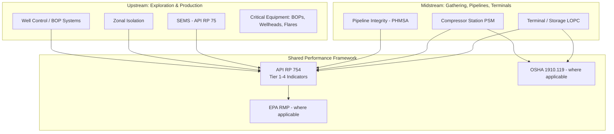

## Upstream and Midstream Oil and Gas Operations

### Definition and Scope

Upstream and midstream operations represent the exploration/production and transportation/storage segments of the oil and gas value chain, respectively. Upstream includes oil and gas exploration and production — drilling, well completion, and wellhead production. Midstream encompasses gathering, processing, pipeline transportation, and storage/terminal operations that move hydrocarbons from the wellhead to refining and distribution. This item examines how core Process Safety Management (PSM) principles — hazard identification, barrier management, mechanical integrity, and leading/lagging indicators — apply to the distinct hazard profile of these two segments, which differ significantly from the fixed, continuous-process refining/petrochemical facilities that much of PSM regulation was originally written around.

### Why Upstream/Midstream PSM Differs from Fixed-Facility PSM

**Key Points**

- **Well control is a unique upstream hazard category absent downstream**: A blowout is defined as an uncontrolled flow of well fluids or formation fluids, or both, from the wellbore or into lower pressured subsurface zones (an underground blowout) — a hazard mechanism with no direct analog in refining or chemical processing.
- **Distributed, linear assets versus fixed-point facilities**: Midstream pipeline systems span long geographic distances with variable terrain, population proximity, and third-party interference risk (excavation damage), fundamentally different from a bounded refinery or plant site.
- **Regulatory coverage gaps at the wellsite**: Upstream drilling and production operations sit partially outside OSHA's Process Safety Management standard (29 CFR 1910.119), which has historically focused on fixed facilities with threshold quantities of highly hazardous chemicals; well control and offshore operations are instead governed substantially by API standards and, for offshore, BSEE regulations.
- **Multi-regulator environment**: US upstream and midstream operators in 2026 must navigate OSHA PSM 1910.119, API RP 754 LOPC tiering, BSEE SafeOCS for offshore operations, and PHMSA for pipeline reporting — a materially more fragmented regulatory landscape than a single-site refinery typically faces.

### Upstream: Well Control and Drilling Safety

**Blowout Prevention Equipment**

The primary engineered barrier against a blowout is the blowout preventer (BOP) — a device attached to the wellhead or tree that allows the well to be closed in with or without a string of pipe or wireline in the borehole. Governing standards include API 53 (Blowout Prevention Equipment Systems for Drilling Wells), which provides the requirements on the installation, maintenance, testing and inspection of blowout prevention equipment, and has been incorporated by reference into BSEE's regulations for offshore operations.

**Critical Equipment Designation**

API guidance defines critical equipment as equipment and other systems determined to be essential in preventing the occurrence of or mitigating the consequences of an uncontrolled event, explicitly including vessels, machinery, piping, blowout preventers, wellheads and related valving, and flares — establishing a mechanical-integrity scope specific to drilling and production operations.

**Zonal Isolation**

Well construction practice requires zone isolation — best practices for preventing annular pressure or flow past containment barriers that are installed and verified during well construction — addressing the specific upstream hazard of formation fluid migration behind casing, distinct from the piping/vessel integrity concerns of fixed-facility PSM.

**Safety and Environmental Management Systems (SEMS)**

For offshore operations, API RP 75 defines SEMS as a proactive, risk-based performance approach whose purpose is to enhance the safety of operations by reducing the frequency and severity of accidents, outlining the key elements for inclusion in an effective safety management program — functioning as the offshore-specific analog to onshore PSM.

### Midstream: Pipeline and Terminal Operations

Midstream assets (gathering lines, transmission pipelines, compressor stations, storage terminals) apply core process safety indicator frameworks even though they were not the original focus of PSM regulation. API RP 754, though originally developed for refining and petrochemical industries, may also be applicable to other industries with operating systems and processes where loss of containment has the potential to cause harm, explicitly including pipeline and terminal operations and upstream drilling operations — and its applicability is not limited to facilities covered by OSHA PSM or similar national/international regulations, allowing voluntary adoption across the value chain.

**Regulatory Interface for Pipelines**

Midstream pipeline operators report to PHMSA (Pipeline and Hazardous Materials Safety Administration) for pipeline-specific incident and integrity data, layered alongside any applicable OSHA PSM coverage at connected facilities (e.g., gas processing plants, compressor stations with covered process quantities).

### API RP 754: The Shared Performance Indicator Framework

Because API RP 754 spans upstream, midstream, and downstream by design, it functions as a common process safety language across the full value chain. The framework, most recently updated to a fourth edition, classifies process safety indicators into four tiers that represent a leading and lagging continuum, and identifies both how to use leading indicators, which can help signal potential weaknesses in key safety systems before an incident occurs, and lagging indicators, which help companies learn from events that have already happened.

**Four-Tier Structure**

| Tier | Category | Focus |
| --- | --- | --- |
| Tier 1 | Lagging | Loss of Primary Containment events with greater consequence — significant unplanned releases meeting defined thresholds, fires, or explosions |
| Tier 2 | Lagging | Loss of Primary Containment events with lesser consequence — smaller releases and challenges to containment |
| Tier 3 | Leading | Challenges to safety systems — demands on safeguards, near-misses, and operating discipline deviations |
| Tier 4 | Leading | Operating discipline and management system performance — the earliest warning signals, tied to management system health |

**Origin and Regulatory Role**

API RP 754 was created by an industry working group following the Baker Panel report on the BP Texas City incident (2005, 15 fatalities), with the Chemical Safety Board and Baker Panel recommendations centered on the lack of leading indicators preceding the catastrophic event — meaning Tier 3 and Tier 4 metrics were specifically designed to surface the kind of early warnings that were absent before Texas City. Within the current regulatory landscape, it is used as a RAGAGEP (Recognized and Generally Accepted Good Engineering Practice) reference under OSHA 1910.119(j), referenced by the EPA Risk Management Program, and adopted by global operators as the de facto process safety performance reporting framework.

**Fourth Edition (2026)**

The most recent edition, published August 2026, continues to provide a consistent framework to help companies track process safety performance, identify warning signs and contribute to the reduction of risk for major incidents, such as hazardous material releases, fires or explosions, and strengthens that approach based on years of real-world use across the industry.

### Worked Example: Applying Tiered Indicators Across the Value Chain

Consider a midstream gas processing plant connected to an upstream gathering system:

| Event | Segment | RP 754 Tier | Example Metric |
| --- | --- | --- | --- |
| Relief valve lifts and discharges to atmosphere above threshold quantity | Midstream (processing plant) | Tier 1 | Loss of Primary Containment — greater consequence |
| Minor flange leak, contained and repaired same shift, below Tier 1 threshold | Midstream (processing plant) | Tier 2 | Loss of Primary Containment — lesser consequence |
| Blowout preventer function test reveals a component out of spec, corrected before operation resumes | Upstream (drilling) | Tier 3 | Challenge to safety system / demand on safeguard |
| Overdue mechanical integrity inspection on critical wellhead valving | Upstream (production) | Tier 4 | Operating discipline / management system performance gap |
| Pipeline right-of-way excavation near a transmission line without proper one-call notification | Midstream (pipeline) | Tier 3/4 (context-dependent) | Near-miss / procedural deviation |

### Contractor and Vendor Management Considerations

Upstream and midstream operations rely heavily on contractor workforces for drilling, well services, and pipeline construction/maintenance, making contractor pre-qualification and management a load-bearing element of the PSM program in these segments. Industry practice commonly integrates dedicated contractor pre-qualification and safety-data-sharing platforms (e.g., ISN, Avetta, Veriforce) alongside core PSM/HSE software, reflecting how upstream/midstream risk management extends structurally beyond the operator's direct workforce more than is typical in a fixed refining facility. [Unverified: specific vendor/platform names are drawn from an industry vendor-comparison source rather than a regulatory or standards body, and should not be read as an endorsement or regulatory requirement — they illustrate a common industry practice pattern, not a mandated toolset.]

### Regulatory and Standards Summary

**Key Points**

- **OSHA 1910.119 (PSM)** — Applies where covered process quantities of highly hazardous chemicals exist; commonly triggers at gas processing plants and certain midstream facilities, less consistently at wellsites.
- **API RP 754** — Voluntary but widely adopted performance-indicator framework spanning upstream, midstream, and downstream; serves as RAGAGEP reference under 1910.119(j).
- **API RP 75 (SEMS)** — Offshore-specific safety and environmental management system framework.
- **API Standard 53** — Blowout prevention equipment system requirements, incorporated by reference into BSEE offshore regulations.
- **BSEE (Bureau of Safety and Environmental Enforcement)** — Primary offshore regulator in US federal waters, overseeing well control and SEMS compliance.
- **PHMSA (Pipeline and Hazardous Materials Safety Administration)** — Primary midstream pipeline safety and incident-reporting regulator.

### Related Topics

- Digital Twins for Hazard Analysis and Training
- Artificial Intelligence Applications in Process Safety Analytics
- Cybersecurity of Safety Instrumented Systems
- EPA Risk Management Program and Regulatory Evolution
- CCPS Risk Based Process Safety Framework
- Well Control Equipment and Blowout Prevention Systems
- Pipeline Integrity Management (PHMSA Requirements)
- Offshore Safety and Environmental Management Systems (SEMS)
- API RP 754 Tiered Process Safety Indicators
- Contractor Safety Management in Oil and Gas
- Mechanical Integrity Programs for Upstream Assets
- Baker Panel Report and the Origins of Leading Indicators