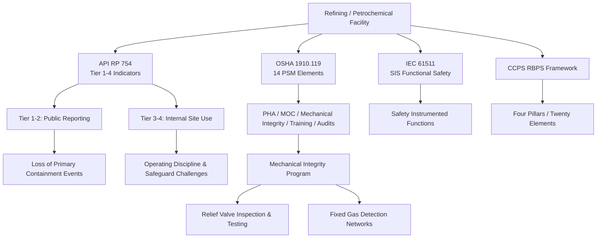

## Refining and Petrochemical Manufacturing

### Definition and Scope

Refining and petrochemical manufacturing represent the downstream segment of the hydrocarbon value chain — fixed, continuous-process facilities that convert crude oil into fuels (refining) or convert petroleum/natural gas derivatives into chemical building blocks such as ethylene, propylene, and aromatics (petrochemicals). This segment is the historical center of gravity for modern PSM regulation: petrochemicals are the chemical products derived from petroleum and natural gas at different stages of processing, and the fixed, high-throughput, high-hazard-inventory nature of these facilities is precisely the operating profile OSHA's Process Safety Management standard (29 CFR 1910.119) was written to address.

Unlike the well control and linear-pipeline hazards distinguishing upstream and midstream operations, refining and petrochemical PSM centers on large-inventory continuous processes: fractionation towers, reactors, fired heaters, and extensive piping networks operating at high temperature and pressure with large hydrocarbon inventories in a single, bounded site.

### The Occupational Safety vs. Process Safety Distinction

A foundational conceptual framework for this sector separates two categories of risk that are frequently conflated in general safety programs but require distinct management systems:

| Dimension | Occupational Safety | Process Safety |
| --- | --- | --- |
| Focus | Individual worker exposure | Loss of primary containment |
| Metrics | TRIR, LTIFR, DART | API RP 754 Tier 1–4 events |
| Example event | Slip resulting in fractured wrist | Vapor cloud explosion |
| Governing standards | OSHA 1904, ISO 45001 | OSHA 1910.119, Seveso III, CCPS RBPS |

This distinction matters operationally: a facility can have an excellent occupational safety record (low TRIR) while simultaneously carrying significant unmanaged process safety risk, since the two track fundamentally different failure modes.

### Core Regulatory and Standards Framework

**OSHA Process Safety Management (29 CFR 1910.119)**

The 14 elements of OSHA Process Safety Management form the backbone of process safety programs for US refineries, gas processing, and chemical plants — this is the primary regulatory anchor for the sector, more consistently and directly applicable here than in upstream or midstream segments.

**API RP 754 — Process Safety Performance Indicators**

Originally published in 2010 specifically for this sector — *Process Safety Performance Indicators for the Refining and Petrochemical Industries* — API RP 754 is the sector's foundational performance-measurement standard, most recently updated to its fourth edition in August 2026. The standard classifies process safety indicators into a four-tier leading/lagging continuum and identifies both how to use leading indicators, which can help signal potential weaknesses in key safety systems before an incident occurs, and lagging indicators, which help companies learn from events that have already happened.

**Tier Structure and Reporting Scope**

| Tier | Nature | Reporting Scope |
| --- | --- | --- |
| Tier 1 | Lagging — greater consequence LOPC | Suitable for nationwide/public reporting |
| Tier 2 | Lagging — lesser consequence LOPC | Suitable for nationwide/public reporting |
| Tier 3 | Leading — challenges to safety systems | Intended for internal use at individual sites |
| Tier 4 | Leading — operating discipline/management system performance | Intended for internal use at individual sites |

The standard explicitly covers mechanical-integrity-related findings within this scheme — reportable and measurable events such as exceedances of safe operating limits (including integrity operating windows) and inspection/testing results outside acceptable limits, which the standard notes typically trigger an action, such as replacement-in-kind, repairs to restore fitness-for-service, replacement with other materials, increased inspection or testing, or de-rating of process equipment.

**Origin: The Baker Panel and BP Texas City**

API RP 754 was created by an industry working group following the Baker Panel report on the BP Texas City incident (2005, 15 fatalities), with the Chemical Safety Board and Baker Panel recommendations centered specifically on the absence of leading indicators preceding that catastrophic event — establishing the direct causal link between a major refining-sector incident and the leading-indicator methodology that now defines the standard.

**Complementary Standards**

Beyond OSHA 1910.119 and API RP 754, the sector's full standards landscape includes ISO 45001:2018 for occupational health and safety management systems, IEC 61511 governing functional safety of safety instrumented systems, and industry consensus standards including API RP 752, 753, 754, and 770, NFPA 30, and NFPA 70E, together with the CCPS Risk-Based Process Safety framework, filling gaps that direct regulation does not address.

### Key Operational Risk Areas

**Mechanical Integrity and Inspection**

Relief valve inspection and testing is cited as the most frequently identified mechanical integrity deficiency in OSHA's refinery National Emphasis Program, indicating how often this critical last-line-of-defense safeguard is not being adequately maintained across the sector. [Unverified: this is drawn from an industry blog synthesis rather than a primary OSHA NEP data publication; the underlying finding is plausible and consistent with widely reported refinery PSM audit patterns but should be corroborated against OSHA's own NEP inspection data before being cited as an official regulatory finding.]

**Gas Detection**

Fixed gas detection networks — covering combustible, toxic, and oxygen hazards — provide early warning for loss-of-containment events, with open-path detection specifically used to cover perimeter zones that point-style detectors cannot adequately monitor, reflecting the large physical footprint typical of refining and petrochemical sites.

**Hot Work Permitting**

Hot work permit programs illustrate how process safety and occupational safety controls must function together rather than independently: a hot work permit only protects you if the gas testing is honest, the fire watch is present, the surrounding inventory is correctly modeled, and the operating crew isn't drowning in alarms at the same time — meaning the administrative permit is only as reliable as the underlying process safety information (inventory modeling) and human factors conditions (alarm management, workload) supporting it.

**Root Cause Patterns from Major Incidents**

Analysis of major refinery incident lessons learned identifies recurring root cause clusters: mechanical integrity failures such as corrosion loops that fall outside the formal inspection program, and management of change failures involving informal modifications that bypass the MOC process — reinforcing that the majority of major refining-sector incidents trace back to breakdowns in two specific PSM elements rather than novel or unpredictable failure modes.

### Worked Example: Applying the Tier Framework to a Refinery Event

Consider a crude distillation unit at a refinery:

| Scenario | Classification | Required Action Under RP 754 |
| --- | --- | --- |
| Hydrocarbon release exceeding the RP 754 Tier 1 quantity threshold from a corroded pipe section | Tier 1 — Loss of Primary Containment, greater consequence | Root cause analysis linkage required; public/industry reportable |
| Small contained leak at a flange, repaired same shift, below Tier 1 threshold | Tier 2 — LOPC, lesser consequence | Logged and tracked; contributes to normalized metrics |
| Relief valve found to have lifted below its set pressure during scheduled testing | Tier 3 — Challenge to safety system | Internal tracking; feeds mechanical integrity corrective action |
| Overdue integrity operating window (IOW) excursion review on a corrosion-prone line | Tier 4 — Operating discipline/management system gap | Internal tracking; feeds leading-indicator trend analysis |

Full RP 754 compliance documentation for a facility typically requires threshold quantity tables and a site-specific application guide, a Tier 1–4 event log with classification rationale, an annual normalized metrics report, root cause analysis linkage for Tier 1 and Tier 2 events, action tracking integrated with MOC and PHA registers, and — where applicable — industry benchmarking submissions and a site leadership process safety dashboard.

**Important Regulatory Note**

API RP 754 is voluntary industry guidance, not directly enforceable — its regulatory weight comes indirectly through its role as a RAGAGEP (Recognized and Generally Accepted Good Engineering Practice) reference under OSHA 1910.119(j), not through direct statutory mandate. A facility cannot be cited under 1910.119 for "violating RP 754" per se, but can be cited for failing to apply RAGAGEP where RP 754 is the recognized practice for a given element.

### Comparison with Other Value-Chain Segments

**Key Points**

- Refining/petrochemical facilities are far more consistently and directly subject to OSHA 1910.119's full 14-element program than upstream drilling operations, due to the fixed-facility, large-inventory hazard profile the standard was designed around.
- API RP 754, though native to this sector, is explicitly designed for cross-sector portability — it may also be applicable to other industries with operating systems and processes where loss of containment has the potential to cause harm, including pipeline and terminal operations and upstream drilling operations, giving the refining/petrochemical sector's indicator framework outsized influence across the broader value chain.
- Unlike upstream well control (blowout preventers) or midstream pipeline integrity (PHMSA-specific), refining/petrochemical mechanical integrity centers on vessel, piping, and relief-system fitness-for-service — a materially different equipment population requiring different inspection disciplines (e.g., API 510/570/653 inspection codes, not covered in the sourced material above but standard sector practice).

### Related Topics

- Upstream and Midstream Oil and Gas Operations
- Digital Twins for Hazard Analysis and Training
- Artificial Intelligence Applications in Process Safety Analytics
- Cybersecurity of Safety Instrumented Systems
- CCPS Risk Based Process Safety Framework
- OSHA Process Safety Management Fourteen Elements
- Mechanical Integrity Programs and API Inspection Codes (510/570/653)
- Management of Change (MOC) Failure Patterns
- Baker Panel Report and BP Texas City Incident
- Integrity Operating Windows (IOWs)
- Hot Work Permitting and Fire Watch Programs
- Fixed and Open-Path Gas Detection Systems