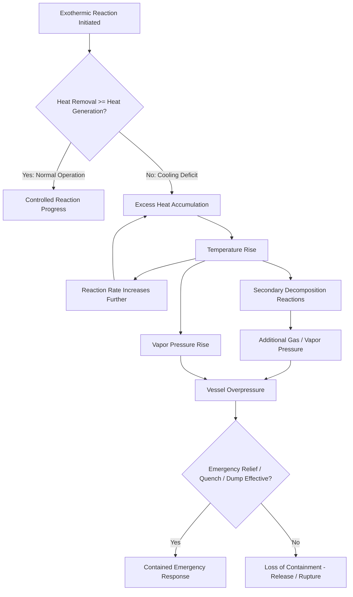

## Specialty and Batch Chemical Manufacturing

### Definition and Scope

Specialty and batch chemical manufacturing encompasses production processes where a single reactor vessel or production train is used sequentially for multiple distinct chemical products, rather than being dedicated continuously to one process, as is typical in refining or large-scale commodity petrochemical production. This "multi-purpose" character is the defining engineering and safety distinction of the sector: a single batch reactor may be used to carry out many different chemical processes, and for each reaction it is necessary to ensure that a runaway cannot occur — for example, by allowing the heat of reaction to exceed the cooling capacity of the vessel. In contrast, in steady-state continuous processes the plant is dedicated to the process, which often gives economic justification for more technically sophisticated means of operation and control, with well-established techniques and mathematical models for deciding the design criteria for continuous processes.

This structural difference — general-purpose equipment running many recipes versus dedicated equipment running one process — is the reason batch and specialty chemical manufacturing carries a distinct process safety risk profile from the refining/petrochemical sector, even though both fall under the same broad PSM regulatory umbrella.

### The Central Hazard: Thermal Runaway

**Mechanism**

The dominant hazard category in batch chemical manufacturing is the exothermic runaway reaction. Raw materials react together during manufacture, and such a chemical process often releases energy in the form of heat, with the reaction described as "exothermic" — and critically, a reaction may be exothermic even if the reaction mass initially requires heating to get the reaction started, meaning the hazard is not always obvious from the process's startup behavior. Thermal runaway begins when the heat produced by the reaction exceeds the heat removed by the cooling system, at the point where heat generation exceeds the system's capacity to absorb and remove energy through normal cooling processes — leading to an accumulation of excess heat and a self-accelerating temperature/pressure rise.

**Why Batch Reactors Are Particularly Vulnerable**

Runaway is described as a particular problem in unsteady-state batch reactors, where the rate of reaction — and therefore the rate of heat production — varies with time, unlike the steady, predictable heat-generation profile of a continuous process operating at fixed conditions. This time-varying character makes cooling system sizing and control system response inherently more complex for batch operations.

**Secondary Pressure Effects**

Beyond direct temperature rise, batch reaction hazards commonly involve compounding pressure sources: gas generation as a reaction product or byproduct can contribute directly to pressure build-up; vapor pressure effects occur as reaction heat changes the vapor pressure of the reaction mass; and heat from the normal process may trigger secondary reactions such as decomposition, generating additional gas or vapor pressure on top of the primary reaction's heat release.

### Historical Incident Basis

**The Seveso Disaster**

The 1976 Seveso incident is the sector's most frequently cited case study, and its causal chain illustrates several compounding failure modes at once. A thermal runaway event occurred during a standard weekend shutdown; the reactor vessel, which employed steam for heating reactions, experienced a lack of stirring due to the shutdown; localized heating ensued, triggering a thermal runaway reaction whereby more energy was released, ultimately leading to the release of six tons of chemicals into the surrounding area. Critically, despite the activation of the emergency venting system, the escalating pressure, coupled with the absence of stirring, thwarted containment efforts — demonstrating that engineered emergency relief alone is not always sufficient when a contributing failure (loss of agitation) compounds the primary hazard.

**Systematic Incident Analysis**

An analysis of 189 industrial incidents in batch reactors involving thermal-runaway chemical reactions (of the general form A + B → products) reported to the UK Health and Safety Executive over a 25-year period found causes clustering under two broad headings — process chemistry and plant design/operation — with a number of contributing factors identified under each; notably, only 6 (14%) of the incidents analyzed were maintenance-related, indicating that the larger share of causes traced to chemistry understanding and design/procedural factors rather than equipment upkeep failures. [Unverified: the cited study spans incidents through 1987 and reflects UK HSE data from that period; while the underlying hazard mechanisms remain valid, current incident-frequency patterns should not be assumed identical to this historical dataset.]

**A More Recent Case: Reactive Decomposition in a Tolling Operation**

CSB investigation findings from a chemical tolling (contract manufacturing) incident illustrate a specific and recurring specialty-chemical failure pattern: none of the parties involved in the tolling operation effectively assessed the hazards of the reactive material or operation, including a failure to identify the initiation of a decomposition reaction as a credible scenario except under a narrow set of assumed conditions (a specific decomposition temperature threshold, water intrusion, or contamination) — when in the actual incident, a runaway decomposition reaction occurred through a pathway the hazard assessment had not credited. The investigation's corrective recommendations included augmenting the process hazard analysis (PHA) element to explicitly require an evaluation of reactive hazards, and developing a formalized program for toll manufacturing agreements using resources such as the Center for Chemical Process Safety's guidelines — directly addressing the multi-party responsibility gap that contributed to the incident.

### Distinguishing Feature: Multi-Party Toll Manufacturing Risk

Specialty chemical manufacturing frequently involves toll manufacturing (contract manufacturing) arrangements, where the material owner, the formulator, and the manufacturing site may be different organizations with different levels of chemistry-specific hazard knowledge. This structural arrangement creates a distinct risk not typically present in a single-owner, single-operator refinery: hazard knowledge about a specific reactive chemical may reside with one party while the operational control resides with another, and if hazard assessment responsibility is not explicitly and formally assigned across the parties, reactive hazards can go unassessed — exactly the gap identified in the CSB tolling-operation investigation above.

### Core Risk Assessment Methodology

**Calorimetry Testing**

Because thermal runaway hazard is chemistry-specific rather than generic, specialty and batch chemical PHAs rely heavily on laboratory thermal hazard characterization before a reaction is scaled to production. Common techniques include identifying exothermic decomposition reactions, determining onset temperatures, and assessing the potential for runaway reactions — with the Accelerating Rate Calorimeter (ARC) specifically cited as a tool for this class of assessment.

**Knowledge of Chemistry as a Prerequisite**

It is treated as axiomatic in the field that in order to avoid conditions for runaway arising, it is necessary to have knowledge of the chemistry and associated thermochemistry of the desired reaction and potential side reactions, and also of the thermal stability and physical properties of reactants, intermediates and products — meaning thermal hazard assessment is not an optional add-on to a batch chemical PHA but a foundational input without which the hazard analysis is structurally incomplete. Historical incident review reinforces this: causes of runaway have repeatedly been traced to an inadequate understanding of the process chemistry and thermochemistry, alongside inadequate engineering design for heat transfer, inadequate control systems and safety back-up systems, and inadequate operational procedures including training.

**Independent Hazard Assessment Teams**

A recurring good-practice principle in the specialty/batch chemical literature is organizational separation: hazard assessors should ideally be part of an independent team, to avoid conflict of interest between production and safety — addressing the risk that production-schedule pressure could otherwise bias a hazard evaluation toward optimistic assumptions.

**Emergency Response Design**

Because not every runaway scenario can be prevented by design margin alone, batch process safety explicitly incorporates emergency mitigation as a designed layer of protection: pressure relieving of the reactor, or dumping the contents, or quenching the reaction should be considered as an emergency response option — though as the Seveso case demonstrates, relief system activation is not guaranteed to fully contain the consequence if a contributing failure (such as loss of agitation) is also present. Notably, it is unusual for batch reactor plant to be designed to resist any calculated pressure rise resulting from a runaway reaction through containment strength alone — meaning relief and mitigation systems, not vessel strength, are typically the primary engineered defense against a full-scale runaway.

### Worked Example: Batch Reactor Hazard Assessment Framework

| PHA Step | Batch/Specialty-Specific Consideration | Continuous-Process Comparison |
| --- | --- | --- |
| Chemistry review | Requires thermochemistry data (heat of reaction, decomposition onset temperature) via calorimetry for every recipe run in the vessel | Chemistry is fixed and typically already well-characterized for the dedicated process |
| Cooling capacity check | Must verify cooling margin against the *time-varying* heat generation profile of the specific batch reaction, not a steady-state rate | Cooling system sized once against a known steady-state heat load |
| Multi-recipe risk | Each new product/recipe run through shared equipment requires its own reactive-hazard screening | N/A — single dedicated process |
| Agitation dependency | Loss-of-agitation scenario must be explicitly assessed (per Seveso lesson) as a credible initiating event | Less commonly a dominant scenario in continuous, flow-driven processes |
| Emergency mitigation | Relief, dump, and quench systems sized against worst-credible-case runaway scenario per reaction chemistry | Emergency systems sized against well-modeled steady-state upset scenarios |
| Toll manufacturing interface | Formal hazard-knowledge-transfer requirement between material owner and manufacturing site (per CSB recommendation) | Typically not applicable — single owner/operator |

### Practical Implications for PSM Programs

**Key Points**

- **PHA scope must explicitly require reactive hazard evaluation** — the CSB's post-incident recommendation to augment the PHA element to explicitly require an evaluation of reactive hazards reflects a documented historical gap where reactive/decomposition hazards were assumed away rather than actively tested.
- **Recipe changes are effectively process changes**: because a single vessel runs multiple products, introducing or modifying a recipe should trigger the same Management of Change rigor as a physical plant modification, since the reactive hazard profile changes with the chemistry, not the equipment.
- **Toll/contract manufacturing arrangements need explicit hazard-information contracts**: CCPS guidance materials are specifically recommended for developing formalized toll manufacturing agreements that ensure reactive hazard knowledge transfers correctly across organizational boundaries.
- **Independence in hazard assessment reduces schedule-pressure bias**: keeping hazard assessors organizationally separate from production decision-makers is a specific, named good practice for this sector.

### Related Topics

- Refining and Petrochemical Manufacturing
- Upstream and Midstream Oil and Gas Operations
- CCPS Risk Based Process Safety Framework
- Reactive Chemical Hazard Screening and Calorimetry (ARC, DSC)
- Management of Change (MOC) for Recipe and Formulation Changes
- Emergency Relief System Design (DIERS Methodology)
- Toll and Contract Manufacturing Risk Management
- Process Hazard Analysis (PHA) Methodologies
- Seveso Directive and Major Accident Lessons Learned
- Thermal Stability Testing of Reactants and Intermediates
- Independent Protection Layers (IPLs) for Reactive Systems
- CSB Investigation Reports as a Learning Resource