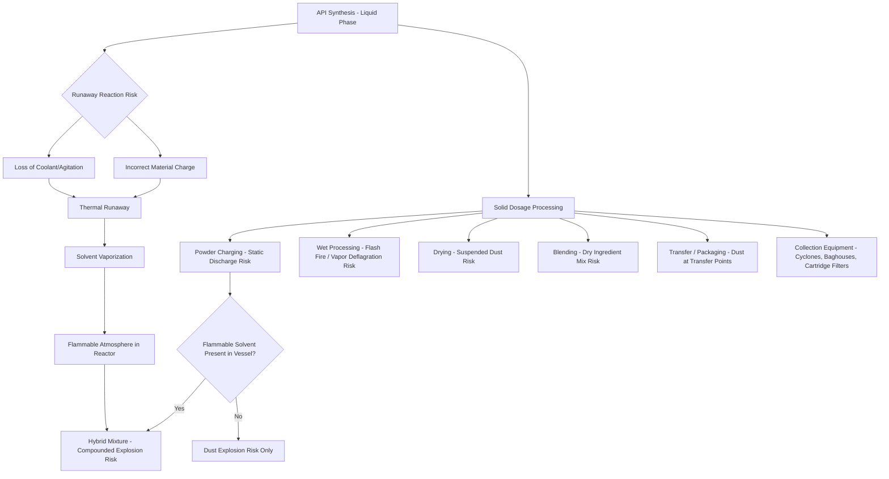

## Pharmaceutical and Fine Chemical Process Safety

### Definition and Scope

Pharmaceutical and fine chemical process safety addresses the distinct hazard profile of Active Pharmaceutical Ingredient (API) synthesis and dosage-form manufacturing (tablets, capsules, injectables), where small-scale, multi-step batch chemistry intersects with combustible powder handling. A common and consequential misconception in this sector is that its inherent scale mitigates process safety risk: the pharmaceutical industry is often perceived as inherently safe, since its processes involve small-scale unit operations with lesser quantities of hazardous materials than typically found in the chemical industry, and the industry is subject to very strict operational and quality controls — yet it would be a mistake to neglect explosion and fire hazards in particular, as several accidents have historically demonstrated. This sector therefore combines two hazard categories that must both be actively managed: reactive/thermal hazards from API synthesis chemistry (shared with the broader specialty and batch chemical manufacturing sector) and combustible dust hazards from solid dosage processing, which is comparatively distinctive to pharmaceutical/fine chemical operations.

### Sector-Specific Process Overview

API is generally obtained via chemical or biological synthesis involving multiple liquid phase reaction and separation steps, after which the pharmaceutical manufacturing process combines the API and excipients (e.g., binders, coatings) into a final dosage form such as tablets or capsules. This two-stage structure — liquid-phase synthesis followed by solid dosage processing — is why the sector's hazard profile spans both reactive chemistry risk and combustible dust risk within a single value chain, often within the same facility.

### Hazard Category 1: Runaway Reaction in API Synthesis

During API synthesis, an uncontrolled exothermic reaction can be triggered by various process deviations, such as introduction of incorrect material or loss of coolant or agitation, resulting in a rapid temperature rise that can trigger secondary decomposition reactions and lead to thermal runaway. In the pharmaceutical-specific context, this hazard is compounded by solvent use: the heat produced during a runaway is often sufficient to vaporize solvent present in the liquid phase, forming a flammable atmosphere that can ultimately cause the reactor itself to explode — meaning a thermal runaway in this sector can escalate directly into a solvent vapor explosion rather than remaining a purely thermal/pressure event.

*(This hazard mechanism is the same fundamental phenomenon covered under Specialty and Batch Chemical Manufacturing; see that reference for calorimetry-based assessment methodology, which applies directly to API synthesis reactors.)*

### Hazard Category 2: Combustible Dust Explosions

**Why Pharmaceutical Powders Are High-Risk**

Most active pharmaceutical ingredients and excipients — including common materials such as magnesium stearate, lactose, and starch — are combustible powders with low Minimum Ignition Energies (MIE), making them particularly susceptible to ignition from common sources such as electrostatic discharge. The relationship between particle size and hazard severity is direct: the finer the dust, the greater the explosive potential, due to increased surface area and greater concentration when suspended.

**Hybrid Mixture Risk**

A hazard specific to combined liquid/solid processing is the hybrid mixture: transferring combustible powders into a reactor that already contains flammable vapors can create hybrid mixtures, which can explode as well — meaning dust explosion risk assessment in this sector cannot be conducted in isolation from solvent vapor presence, since the two combine to worsen the hazard rather than existing as independent risks.

**Process Stages Where Dust Hazard Is Present**

Combustible dust hazard is distributed across the entire solid-handling process train, not confined to a single unit operation:

- **Powder charging**: Static discharge risk when dry powder is introduced into a vessel; this hazard is compounded further if the receiving vessel contains a flammable solvent rather than water.
- **Wet processing**: Once material is wetted, dust explosion risk decreases, but flash fire or solvent vapor deflagration risk emerges instead.
- **Drying**: After solvent removal, suspended dust again becomes a hazard as the material dries out.
- **Blending**: Mixing several dry ingredients together is a recognized dust-hazard operation.
- **Transfer and packaging**: Dumping dried material into a process line for shipment creates combustible dust hazards at transfer points; downstream collection equipment (cyclones, bag houses, cartridge filters) used to capture fugitive dust or final product for bagging introduces additional, distinct hazard zones.

**Detonation vs. Deflagration Potential**

Excipients used alongside APIs also carry explosive capability (e.g., starch or lactose), so the pharmaceutical manufacturing industry must manage explosive dust potential of two distinct kinds: materials that may cause a deflagration, and materials that have detonation potential, which require much more rigorous controls and fail-safes to prevent ignition and detonation — a distinction that should inform the level of protective rigor applied to a given material rather than treating all combustible dusts uniformly.

**Ignition Source**

The most common cause of ignition in the pharmaceutical industry is electrostatic discharge, occurring during mixing, pouring, or sieving processes; combined with a higher-than-normal oxygen concentration in process equipment and the presence of a highly combustible API, this forms what industry literature terms "the explosive trinity."

### Historical Incident Reference

The West Pharmaceutical Services explosion (2003, Kinston, North Carolina) occurred due to a dust cloud ignited by static electricity during production of rubber components for pharmaceutical packaging, claiming the lives of six workers and injuring many others — a frequently cited case illustrating that dust explosion hazard in this sector is not confined to API/excipient powders specifically but extends to any combustible dust generated in a pharmaceutical manufacturing environment, including ancillary component production.

### Dual Hazard Profile: Health Exposure and Explosion Risk

Pharmaceutical dust control must simultaneously address two distinct concern categories that require different technical approaches:

| Concern | Nature | Primary Control Approach |
| --- | --- | --- |
| Personnel exposure (toxicological) | API potency, allergenic properties, occupational exposure limit (OEL) compliance | Risk-based exposure evaluation, containment, filtration |
| Fire/explosion (combustion) | Fugitive dust deposition, airborne dust cloud formation | Explosion protection systems, housekeeping, ignition source control |

Effective management requires understanding the toxicological properties of handled materials via OEL review and risk-based exposure evaluation for the first concern, while separately addressing fugitive dust particles — often invisible to the eye — that can create fire and explosion hazards when depositing on machinery and other surfaces for the second. Facilities must design containment and extraction systems that satisfy both objectives concurrently, since a system optimized only for worker exposure control will not necessarily address explosion risk, and vice versa.

### Explosion Protection and Mitigation Strategies

**Key Points**

- **Good housekeeping**: Diligent cleaning of the process facility is described as having no substitute, since accumulated dust deposits can be disturbed by a primary explosion and result in a more severe secondary explosion; UK HSE guidance specifically recommends eliminating high-level horizontal surfaces (e.g., via sloping surfaces) to minimize dust accumulation opportunities.
- **Bonding and grounding**: Dissipation of electrostatic ignition sources via equipment bonding and grounding is specifically emphasized as a pharmaceutical-sector priority, given electrostatic discharge's status as the most common ignition source.
- **Chemical suppression systems**: Active suppression technology is used as an engineered mitigation layer for equipment handling combustible dust.
- **Inerting**: Nitrogen inerting is used to reduce oxygen concentration below the level needed to sustain combustion in process equipment.
- **Explosion-proof equipment and area classification**: Equipment selection and installation should follow recognized area classification standards such as ATEX or IECEx, with risk assessments conducted by identifying ignition sources and analyzing process hazards against these standards. [Unverified: ATEX is a European regulatory framework; facilities outside the EU/EEA should confirm the equivalent locally applicable area classification standard (e.g., NEC/NFPA 70 Class/Division system in the US) rather than assuming ATEX applies universally.]
- **Ventilation and containment engineering**: Effective dust extraction combined with containment solutions is required both to mitigate worker exposure and to protect against dust explosions, addressing both hazard categories through integrated system design.

### Design Challenge: Diverse and Proprietary Product Lines

A distinctive operational challenge in this sector is the sheer diversity of materials processed through shared or similar equipment: the pharmaceutical industry commonly handles diverse product lines, some of them proprietary and with insufficient test data, raising the practical question of how to design protection systems for all the possible permutations of material combinations and process conditions a facility might encounter — a challenge more acute here than in sectors with a narrower, more stable product slate, and one that reinforces the need for material-specific dust and thermal hazard testing (analogous to the calorimetry-based approach used for reactive hazards in batch chemical manufacturing) rather than relying on generic or historical assumptions about "similar" materials.

### Worked Example: Hazard Assessment Across a Combined Synthesis-to-Dosage Process

| Process Stage | Primary Hazard | Compounding Factor | Key Control |
| --- | --- | --- | --- |
| API synthesis reactor | Runaway exothermic reaction | Solvent present — vaporization on temperature rise | Calorimetry-based thermal hazard testing; cooling/agitation reliability |
| Powder charging into solvent-containing vessel | Static discharge + hybrid mixture | Flammable vapor already present in vessel | Bonding/grounding; inerting; controlled charge rate |
| Drying of wet API/excipient | Suspended dust cloud | Fine particle size increases explosivity | Nitrogen inerting; explosion venting/suppression |
| Dry blending of excipients | Combustible dust cloud | Multiple dry materials combined | Housekeeping; sloped surfaces; grounding |
| Transfer to packaging line | Dust at transfer points | Fugitive dust accumulation on surfaces | Containment; regular cleaning regime |
| Collection systems (cyclones, baghouses) | Concentrated dust accumulation | Secondary explosion risk from disturbed deposits | Explosion isolation/venting on collection equipment |

### Related Topics

- Specialty and Batch Chemical Manufacturing
- Refining and Petrochemical Manufacturing
- Combustible Dust Hazard Analysis (NFPA 652/654 principles)
- Reactive Chemical Hazard Screening and Calorimetry
- Area Classification Standards (ATEX, IECEx, NEC/NFPA 70)
- Electrostatic Discharge Control and Bonding/Grounding
- Nitrogen Inerting System Design
- Occupational Exposure Limits (OEL) for Potent Compounds
- Hybrid Mixture Explosion Hazards
- Explosion Venting and Suppression System Design
- Toll and Contract Manufacturing Risk Management
- CCPS Risk Based Process Safety Framework