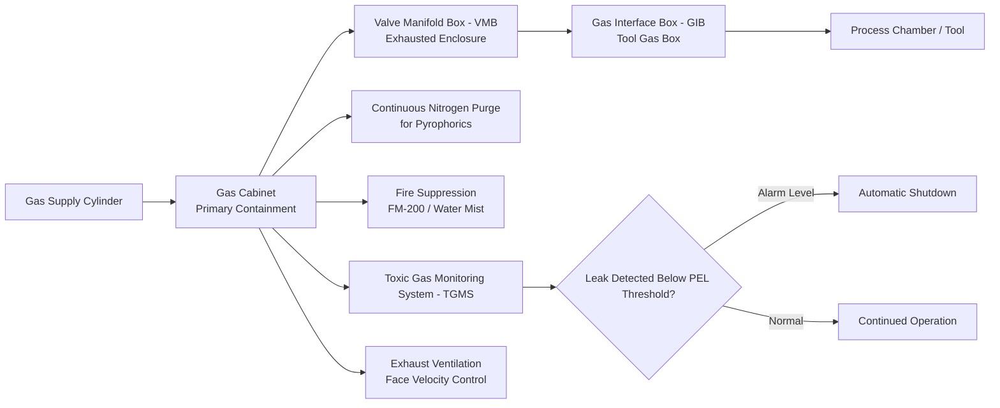

## Semiconductor and Electronics Manufacturing Hazards

### Definition and Scope

Semiconductor and electronics manufacturing process safety addresses the distinctive hazard profile of chip fabrication ("fab") facilities, where extremely small gas quantities carry extreme consequence severity — the inverse of the large-inventory hazard model typical of refining or petrochemical PSM. Microprocessors and their many layers, circuits, substrates and coatings are produced using severely toxic gases in processes that, despite the diminutive scale of individual devices, require hazard control systems as rigorous as those found in far larger-volume chemical operations. This sector is defined by three overlapping hazard categories: acute toxicity at extraordinarily low exposure thresholds, pyrophoricity (spontaneous ignition in air), and corrosivity — often combined within a single gas species.

### Core Hazard Gas Classes

**Toxic Hydride Gases**

Dopant gases used in semiconductor doping processes represent some of the most acutely toxic industrial chemicals in routine use. A common example is the hydride arsine (AsH₃), which has an American Conference of Governmental Industrial Hygienists time-weighted average threshold limit value (TWA-TLV) of only five parts per billion — an extraordinarily low exposure threshold compared to most industrial chemicals, reflecting arsine's severe acute toxicity. Related hydride gases used for doping, etching, and thin-film deposition include phosphine (PH₃) and boron trifluoride (BF₃), which pose significant safety and environmental challenges due to their high toxicity and pyrophoricity.

**Pyrophoric Gases**

Silane (SiH₄) is a widely used pyrophoric hydride gas in fab processes, meaning it self-ignites in air; its behavior is particularly hazardous because it is so unpredictable that it may delay "self-ignition" until forming a vapor cloud, at which point ignition can cause a large explosion rather than a small, immediately self-extinguishing flame. Formally, pyrophoric materials are defined in semiconductor facility specifications as materials that have an auto-ignition temperature of ≤130°F — a specific, codified threshold used to trigger the enhanced engineering controls described below. Additional pyrophoric gases used in fab processes include dichlorosilane.

**Corrosive and Multi-Hazard Gases**

Many process gases carry combined hazard classifications rather than a single hazard type — for example, silane is both pyrophoric and flammable, while chlorine is toxic and corrosive, and hydrogen chloride and boron trichloride are corrosive. Because a single cylinder may present multiple simultaneous hazard classes, containment and control systems must be designed for the most severe hazard combination present, not simply the average or most common hazard type.

### Hazardous Production Material (HPM) Classification

Semiconductor facility engineering specifications formally define Hazardous Production Material (HPM) as a solid, liquid, or gas associated with semiconductor manufacturing that has a hazard rating in health, flammability, or reactivity of Class 3 or 4 as ranked by NFPA 704 — establishing a specific, standardized threshold above which the enhanced containment infrastructure covered below becomes mandatory.

### Primary Engineering Control: The Gas Cabinet System

**Function and Definition**

A semiconductor gas cabinet is a specially engineered enclosure used to store and control the delivery of high-purity and hazardous gases such as toxic, flammable, corrosive, or pyrophoric gases used in semiconductor processes, serving as the primary engineering control protecting fab operators, equipment, and facilities — not merely a storage container but the frontline safety barrier for the entire hazardous gas supply chain within the fab.

**System Architecture**

Beyond the gas cabinet itself, the hazardous gas delivery infrastructure includes several standardized sub-enclosures: Valve Manifold Boxes (VMBs), which distribute specialty gases safely and stably to semiconductor production equipment and are themselves considered exhausted enclosures; T-Boxes; and Gas Interface Boxes (GIBs) or "tool gas boxes" — a gas system enclosed in a cabinet typically adjacent to the process tool or onboard the tool, functioning as the final gas system prior to the process chamber.

**Mandatory Cabinet Design Features by Hazard Type**

| Hazard Class | Example Gases | Required Cabinet Feature |
| --- | --- | --- |
| Pyrophoric | Silane, dichlorosilane | Continuous nitrogen purge and fire-resistant construction |
| Corrosive | HCl, boron trichloride | Special internal surface coatings (electropolished stainless steel, nickel plating) and compatible diaphragm valves |
| Toxic | Arsine, phosphine, chlorine | High-integrity exhaust and real-time monitoring with alarms set below the Permissible Exposure Limit (PEL) |

For pyrophoric and flammable gases specifically, a fire suppression system — often a water mist or clean agent such as FM-200 — is required per NFPA 318, typically incorporating a fusible link that releases the suppressant automatically without relying on active detection/activation logic alone.

### Ventilation Design Requirements

Gas cabinet exhaust systems are governed by codified minimum airflow standards designed to protect workers during the highest-risk moment: door/access-port opening. Under the International Fire Code (Section 3704.1.2), the average face velocity at the face of gas cabinet access ports or windows cannot be less than 200 feet per minute, with a minimum velocity of 150 feet per minute at any point of the access port or window — with equivalent standards independently promulgated by SEMI (Semiconductor Equipment Manufacturers International). These regulations exist specifically to ensure that when the access door of the enclosure is open, the rate of air intake is sufficient to capture any toxic or hazardous species that could be present or released during that time, targeting a specific protective outcome: maintaining worker exposure to toxic gases below one-quarter of the applicable Personal Exposure Limit (PEL) — i.e., a 4x safety margin below the regulatory exposure threshold, not merely compliance at the threshold itself.

### Toxic Gas Monitoring Systems (TGMS)

**Design Basis**

Because hazardous gases in semiconductor manufacturing span multiple distinct "gas families" (e.g., hydrides, halogens, mineral acids, flammables), each with unique properties and safe exposure limits, TGMS design must begin with a formal risk assessment: a complete list of all hazardous gases (including inerts) and how they are employed — stored, delivered, and handled — must be obtained to determine how best to safely detect a gas leak for each individual gas target, rather than applying a single generic detection approach across all gas types.

**Functional Safety Integration**

TGMS design in leading engineering practice is explicitly integrated with IEC 61511-1 (equivalently ANSI/ISA-84.00.01), the functional safety standard for Safety Instrumented Systems (SIS) in the process industries — specifically, Clauses 8 through 11 of IEC 61511-1 are identified as most applicable to toxic gas monitoring system design, providing a step-by-step approach for determining TGMS requirements and whether a Safety Integrity Level (SIL) classification is required for any resulting safety instrumented functions. This represents a direct structural link between semiconductor-sector gas safety and the SIS/SIL methodology used across broader process safety practice.

### Governing Standards Framework

**Key Points**

- **NFPA 318** — Standard for the Protection of Semiconductor Fabrication Facilities; the primary fire-protection standard specific to this sector.
- **NFPA 45** — Standard on Fire Protection for Laboratories Using Chemicals; relevant where pyrophoric materials are used in R&D/lab settings adjacent to production.
- **NFPA 55** — Compressed Gases and Cryogenic Fluids Code; governs the storage side of hazardous gas cylinders.
- **SEMI S2** — Environmental, Health, and Safety Guideline for Semiconductor Manufacturing Equipment, published by Semiconductor Equipment and Materials International, providing sector-specific best-practice guidance beyond baseline fire/building code requirements.
- **FM 4910** — Fire protection standard referenced for cleanroom material and cabinet fire-resistance performance.
- **IEC 61511-1 / ANSI-ISA-84.00.01** — Functional safety standard applied specifically to toxic gas monitoring system design and SIL determination for gas-detection safety functions.

### Containment Engineering: Preventing Back-Migration

A specific engineering failure mode addressed in gas delivery system design is back-migration — the risk of hazardous gas migrating backward into the ambient environment around the delivery apparatus rather than only forward toward the process. Purpose-built gas cabinet assemblies incorporate back-migration scrubber units specifically to prevent hazardous gases from migrating back into the ambient environment surrounding the apparatus, addressing a leak pathway distinct from the more commonly considered forward-flow release scenario.

### Cylinder Storage Considerations for Toxic/Pyrophoric Gases

Because many of these specialty gases are compressed and liquefied for storage under high pressure, conventional metal cylinder storage carries elevated risk: storage of toxic gases under high pressure in metal cylinders is often considered unacceptable because of the possibility of developing a leak or catastrophic rupture of the cylinder — driving the semiconductor industry toward alternative storage and delivery technologies (such as sub-atmospheric or adsorbed-gas delivery systems) specifically to reduce the stored energy and consequence severity associated with traditional high-pressure cylinder storage of these gas classes. [Inference: the sourced material identifies the safety motivation for moving away from conventional high-pressure cylinder storage but does not itself detail the specific alternative technologies in depth; readers seeking implementation specifics for sub-atmospheric delivery systems should consult current SEMI or vendor engineering documentation.]

### Worked Example: Risk-Layered Control Design for an Arsine Doping Process

| Layer | Control | Rationale |
| --- | --- | --- |
| Material selection/quantity | Minimize on-hand cylinder inventory of arsine | Reduces consequence severity of a worst-case release given the 5 ppb TWA-TLV |
| Primary containment | Gas cabinet with high-integrity exhaust | Contains the gas source itself as the first barrier |
| Detection | TGMS designed per IEC 61511-1, SIL-rated per risk assessment | Ensures reliable, functional-safety-grade leak detection |
| Ventilation | Exhaust sized to maintain ≥200 fpm face velocity at access ports | Protects worker exposure below ¼ PEL during door-open conditions |
| Secondary containment | VMB/GIB as exhausted enclosures between cabinet and process chamber | Limits release pathway if a downstream connection fails |
| Emergency response | Automatic shutdown triggered on TGMS alarm | Removes reliance on manual operator response for acute-toxicity gas |

### Related Topics

- Cybersecurity of Safety Instrumented Systems
- Digital Twins for Hazard Analysis and Training
- Combustible Dust and Pyrophoric Material Handling (cross-reference: Pharmaceutical and Fine Chemical Process Safety)
- Safety Integrity Level (SIL) Determination for Toxic Gas Detection
- NFPA 318 Semiconductor Fabrication Facility Protection
- Hazardous Production Material (HPM) Classification per NFPA 704
- Cleanroom Fire Protection and FM 4910 Standards
- Gas Cabinet, VMB, and GIB Engineering Design
- Sub-Atmospheric and Adsorbed Gas Delivery Systems
- Permissible Exposure Limits (PEL) and Threshold Limit Values (TLV) for Acute Toxins
- Area Classification and Ventilation Design for Hazardous Gas Enclosures
- Electronics Manufacturing Emergency Response Planning