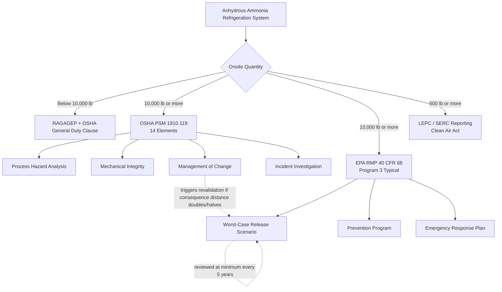

## Ammonia Refrigeration in Food and Agricultural Processing

### Definition and Scope

Ammonia refrigeration process safety addresses the industrial use of anhydrous ammonia (NH₃) as a refrigerant in closed-circuit cooling systems at cold storage, meat/poultry processing, dairy, and other food and agricultural facilities. Unlike the hydrocarbon-centric hazard profile of refining and petrochemical operations, ammonia refrigeration presents a toxic-release hazard from a widely used, low-cost industrial refrigerant embedded in the food supply chain — anhydrous ammonia is a hazardous chemical demanding stringent safety measures to protect workers, communities, and the environment across the sector, from food processing to industrial cooling generally.

### Regulatory Threshold and Applicability

**The 10,000-lb Trigger**

Anhydrous ammonia is designated a highly hazardous chemical with a specific threshold quantity of 10,000 lbs under both major federal regulatory frameworks. Facilities storing 10,000 lbs or more of anhydrous ammonia in a refrigeration system trigger simultaneous obligations under OSHA's Process Safety Management standard (29 CFR 1910.119) and EPA's Risk Management Program (40 CFR Part 68) — two overlapping federal frameworks that apply concurrently once the threshold is crossed, requiring facilities to satisfy both worker-safety-focused PSM elements and community/environmental-focused RMP requirements simultaneously.

**Below-Threshold Obligations**

Facilities below the 10,000-lb threshold are not exempt from safety obligation entirely: even systems under 10,000 lbs must still follow Recognized and Generally Accepted Good Engineering Practices (RAGAGEP) and comply with OSHA's General Duty Clause — meaning there is no regulatory-free zone for smaller ammonia refrigeration systems, only a shift from prescriptive PSM/RMP program requirements to the more general RAGAGEP/General Duty Clause standard.

**Additional Community Notification Threshold**

A separate, lower threshold applies to community coordination obligations under the Clean Air Act: facilities storing more than 500 pounds of ammonia must report and coordinate with their Local Emergency Planning Committee as well as their State Emergency Response Commission — a materially lower trigger point than the 10,000-lb PSM/RMP threshold, meaning many smaller facilities carry community-notification obligations even without full PSM/RMP program requirements.

### Split Regulatory Function: PSM vs. RMP

| Framework | Focus | Key Obligations |
| --- | --- | --- |
| OSHA PSM (29 CFR 1910.119) | Worker safety | 14 documented program elements including process hazard analysis, mechanical integrity, management of change, and incident investigation |
| EPA RMP (40 CFR Part 68) | Community/environmental protection | Worst-case and alternative release scenario assessment, prevention program, emergency response coordination with Local Emergency Planning Committees (LEPCs) |

RMP extends the PSM worker-safety obligation outward to surrounding communities, requiring facilities to assess worst-case and alternative release scenarios and maintain emergency response coordination — reflecting ammonia's dual hazard character: an acute worker-exposure hazard inside the facility and a toxic-cloud hazard capable of affecting off-site public receptors.

### RMP Program Tier Classification

Most ammonia refrigeration facilities fall into RMP "Program 3," the most stringent of EPA's three RMP program tiers, because they are covered by OSHA PSM and their worst-case release scenario has public receptors within the circle of influence — which specifically disqualifies the facility from the less stringent Program 1 classification. Program 3 status carries a defined set of requirements: Management System, Hazard Assessment, Prevention Program, Emergency Response, and a formal Risk Management Plan.

**Revalidation Triggers**

RMP obligations are not static after initial submission. Under 40 CFR 68.36, a revised hazard analysis and revised Risk Management Plan are required within six months of process changes, or of any change that increases or decreases the distance to a defined consequence endpoint by a factor of two or more — directly linking a facility's Management of Change process to its RMP compliance status. Independent of any specific triggering change, worst-case and alternative release scenarios must be reviewed and updated at least once every five years as a standing requirement.

### Physical and Chemical Hazard Characteristics

Ammonia's specific physical/chemical properties directly shape its hazard profile and drive certain protective design choices distinct from other toxic gas hazards. Ammonia is hygroscopic — it has a high affinity for water and migrates toward moist areas such as the eyes, nose, mouth, throat, and moist skin — meaning released ammonia will rapidly seek out and concentrate in the body's moist tissues, which is directly relevant to both the injury mechanism from exposure and the design rationale for water-based mitigation systems (e.g., water curtains/deluge used to absorb released ammonia).

### Industry Consensus Standards (IIAR / ANSI)

Because ammonia refrigeration is a highly standardized industrial application, OSHA relies heavily on American National Standards Institute (ANSI) and International Institute of Ammonia Refrigeration (IIAR) standards as the RAGAGEP reference for the sector, rather than developing ammonia-refrigeration-specific regulatory text independently.

**Key IIAR/ANSI Standards**

| Standard | Scope |
| --- | --- |
| ANSI/IIAR 6 | Minimum requirements for inspection, testing, and maintenance (ITM) applicable to safe closed-circuit ammonia refrigeration systems |
| ANSI/IIAR 7 | Operating procedures guidance (RAGAGEP reference for developing procedures that keep personnel safe) |
| ANSI/IIAR 9 | Essential safety and design standards for closed-circuit industrial refrigeration systems — described by one source as the RAGAGEP a facility must adhere to for safe operation |
| IIAR Bulletin 110 | Supplementary guidelines referenced alongside ANSI/IIAR 6 for ITM compliance approaches |

### Mechanical Integrity in Practice

Mechanical integrity is repeatedly identified across sector-specific guidance as the highest-consequence PSM element for ammonia refrigeration compliance — not because other elements matter less, but because inspection/testing recordkeeping failures have driven some of the sector's most severe enforcement outcomes even in the complete absence of an actual release.

**Illustrative Enforcement Case**

A poultry processing facility with 180,000 pounds of anhydrous ammonia in its refrigeration system — well above the 10,000-lb PSM threshold — had mechanical integrity inspection records seven months behind schedule and missing leak detection calibration logs for two systems; upon a programmed OSHA inspection, the facility received three willful citations with penalties exceeding $280,000, despite the fact that no leak had occurred and no employee had been injured. This case illustrates a critical operational lesson: the violations were entirely documentation and program management failures, underscoring that ammonia refrigeration is one of the few maintenance domains where a paperwork failure carries the same regulatory penalty as an actual equipment failure. [Unverified: this is a single case example drawn from a compliance-vendor marketing publication rather than a primary OSHA citation record; the specific facility, penalty amount, and date should be independently verified against OSHA's public enforcement database before being cited in a formal training or compliance context.]

**Inspection Techniques**

Applied inspection methods for ammonia system mechanical integrity commonly include ultrasonic non-destructive testing (NDT), which is typically incorporated as part of a five-year mechanical integrity inspection cycle, alongside deficiency determination, corrosion rate establishment, and remaining component life estimation to support ongoing OSHA PSM compliance.

### System Operations and Maintenance Practices

Recommended ongoing operational practices under RAGAGEP-aligned programs include: monitoring refrigeration system operating parameters, maintaining good housekeeping practices, maintaining current piping and instrumentation diagrams, tracking ammonia purchases and distribution within the system, and conducting periodic process hazard analysis — a documented, standards-referenced maintenance discipline (ANSI/IIAR 6) rather than an informal or facility-specific practice.

### Security Considerations

A hazard category distinctive to ammonia refrigeration, less commonly emphasized in fixed-facility petrochemical PSM discussions, is theft and vandalism risk: ammonia theft and vandalism of storage and refrigeration systems have resulted in accidental ammonia releases historically, making site security safeguards a recognized element of the sector's prevention program rather than a purely process-engineering concern. [Inference: this concern reflects ammonia's illicit secondary use as a precursor in clandestine methamphetamine production, though the sourced material states the theft/vandalism-to-release causal link without elaborating on the underlying motive.]

### Worked Example: PSM/RMP Interaction Following a Process Change

Consider a cold storage facility with 45,000 lbs of anhydrous ammonia that expands its refrigerated floor space, adding new evaporator coils and piping runs:

| Step | Action Required | Governing Requirement |
| --- | --- | --- |
| 1. Change proposed | Formal Management of Change review of new piping/coil addition | OSHA PSM 1910.119(l) |
| 2. Hazard reassessment | Determine if the change alters worst-case/alternative release scenario distance | EPA RMP 40 CFR 68.36 |
| 3. Threshold check | If consequence distance to an endpoint changes by a factor of two or more | Triggers mandatory RMP revision within 6 months |
| 4. Mechanical integrity | New piping/coils entered into ITM inspection schedule per ANSI/IIAR 6 | RAGAGEP compliance |
| 5. Documentation update | P&IDs, PSI, and RMP submission updated to reflect as-built configuration | OSHA PSI element + EPA RMP recordkeeping |
| 6. Standing 5-year review | Regardless of this specific change, full worst-case/alternative scenario review still due at the standing 5-year interval | EPA RMP periodic requirement |

### Related Topics

- Refining and Petrochemical Manufacturing
- Specialty and Batch Chemical Manufacturing
- EPA Risk Management Program and Regulatory Evolution
- CCPS Risk Based Process Safety Framework
- Mechanical Integrity Programs and Inspection Cycles
- Management of Change (MOC) and RMP Revalidation Triggers
- IIAR/ANSI Consensus Standards for Refrigeration Systems
- Local Emergency Planning Committee (LEPC) Coordination
- Toxic Gas Release Consequence Modeling (Worst-Case/Alternative Scenarios)
- RAGAGEP and the OSHA General Duty Clause
- Security Vulnerability Assessment for Hazardous Chemical Facilities
- OSHA Enforcement Patterns and Willful Citation Case Studies