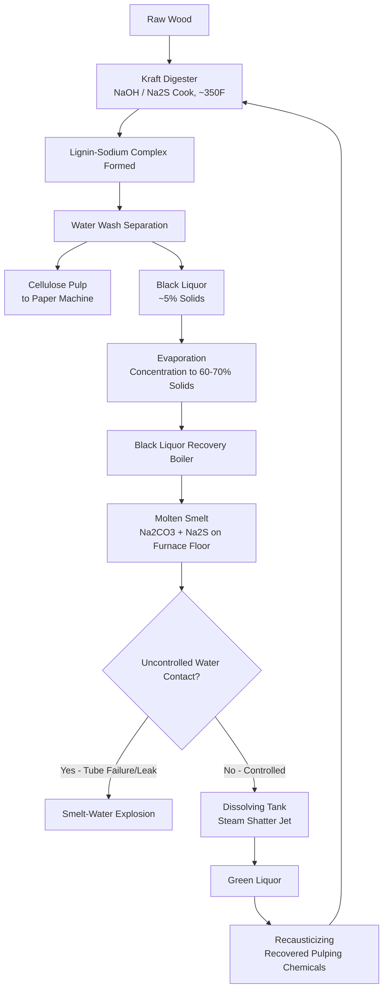

## Pulp, Paper, and Bulk Solids Handling Facilities

### Definition and Scope

Pulp and paper manufacturing, together with the bulk solids handling operations that support it, presents a process safety profile that combines two distinct hazard categories rarely found together in a single sector: chemical recovery process hazards (specifically the kraft/sulfate pulping recovery cycle) and combustible dust hazards from wood-based particulate materials. Process safety in this context looks at an entire process, from end to end, examining things that can go wrong with a process and how the safety of workers or others may be impacted — a framework distinct from occupational health and safety, which focuses on individual work tasks rather than system-level failure modes.

The modern pulp and paper mill is described as a complex, high-valued facility that, to operate profitably under current environmental constraints, must efficiently integrate steam and power demands and chemical recovery systems with the pulp and paper processes, with computer control of all mill processes now the norm.

### The Kraft Pulping Chemical Recovery Cycle

**Process Overview**

In kraft (sulfate) pulping, raw wood is delignified by a thermo-chemical process — an approximately 350°F cook in the presence of sodium hydroxide, sodium carbonate, sodium sulfide, and other sodium-based compounds. Under these conditions, the lignin binder holding natural cellulose fibers together reacts with the sodium compounds to form water-soluble lignin-sodium complexes, permitting a water-wash separation of the black, tar-like lignin from the pulp fiber, which is then used to manufacture bleached white paper.

**Black Liquor and the Recovery Boiler**

The separated liquor stream, now termed "black liquor," is diluted and initially contains only about 5% solids upon collection from diverse pulp processing steps starting with digester blow tanks and finishing with the pulp washers — meaning considerable concentration through continuous evaporation is required before the liquor reaches a combustible consistency, typically targeting 60–70% solids content, before it can be fed to the recovery boiler as fuel.

**Molten Smelt Formation**

Combustion of concentrated black liquor in the recovery boiler leaves inorganic constituents on the furnace floor as a molten mass known as "smelt," consisting of sodium carbonate and sodium sulfide, with the sodium sulfide resulting from sulfate reduction occurring during incineration of the organic portion of the black liquor. This molten smelt is subsequently directed to a dissolving tank, where a steam shatter jet breaks it up so it can dissolve in water to form "green liquor" — the first step of the chemical recovery loop back to usable pulping chemicals.

### The Dominant Recovery Boiler Hazard: Smelt-Water Reaction

**Mechanism and Severity**

The primary fire hazard associated with black liquor recovery boilers is explosion from a smelt-water reaction, alongside uncontrolled ignition of accumulated unburned fuel from auxiliary burners. This hazard is repeatedly identified across multiple independent sources as the sector's signature catastrophic-incident risk: such furnaces are susceptible to major safety problems as a result of serious explosions which occur when significant quantities of water contact the smelt, and although major efforts have been made to avoid such accidental contact, failure of a tube in the water wall or in the boiler section of the furnace — for whatever reason — has historically resulted in explosions.

**Root Cause Pathway**

A specific failure pathway involves the critical balance between liquor solids content and available combustion heat: if the lignin/solids concentration in the black liquor fuel stream falls too low to allow sufficient lignin fuel content to evaporate all the accompanying water, free water becomes available for direct, reactive contact with the sodium smelt in the furnace bed — meaning an upstream process upset (inadequate evaporator performance) can directly create the conditions for a downstream catastrophic explosion, illustrating a cross-unit hazard propagation pathway characteristic of this integrated chemical recovery cycle.

**Alternative Technology: Fluidized Bed Recovery**

An engineering approach that eliminates the smelt-water explosion hazard entirely uses fluidized bed combustion to recover chemicals from residual liquors: because the recovered inorganic chemicals form as solid pellets rather than molten smelt, the explosion hazard is eliminated — though this requires combustion at a lower temperature (below approximately 1300°F for kraft liquor) to prevent the pellets from melting, agglomerating, and defluidizing the bed, which in turn requires feeding a more dilute liquor (30–40% concentration, versus 65% in a conventional kraft furnace) so that excess combustion heat is absorbed evaporating the extra water rather than driving the bed temperature above the melting point.

**Consequence of Recovery Boiler Loss**

Beyond the acute explosion hazard, loss of the black liquor recovery boiler (BLRB) has severe operational consequences distinct from the immediate safety event: loss of the BLRB shuts down the entire mill, reflecting the recovery boiler's central, non-redundant role in both the mill's chemical recovery loop and its steam/power generation.

### Recent Catastrophic Incident: Caustic Storage Tank Implosion

A distinct but related hazard category — separate from the recovery boiler explosion mechanism — was illustrated by a 2025 incident at a Longview, Washington mill, where a large tank of heavily caustic chemicals imploded, killing 11 workers and injuring several others, and releasing hundreds of thousands of gallons of hazardous compounds into the environment, contaminating the Columbia River. Industry experts identified plausible mechanical causes distinct from smelt-water chemistry: large temperature swings in the tank could potentially lead to an implosion, and separately, if crews attempted to remove quantities of white liquor from the tank without a supply of air or another medium to replace the withdrawn volume, that could also lead to an implosion — a vacuum-collapse failure mode rather than an overpressure event.

**Broader Pattern of Recovery-Cycle Incidents**

This event was described by industry experts as part of a wider pattern: other pulp and paper mills across the United States and Europe have seen boiler explosions, corrosive gas and chemical leaks, multiple smelt water reactions, and more, with these incidents having killed and injured people and polluted the environment repeatedly across the sector's history — reinforcing that the recovery cycle's hazard profile is a recurring, industry-wide pattern rather than isolated to any single facility.

**Material Hazard Characteristics**

Black liquor and its associated process chemicals carry severe direct-contact hazard even absent an explosion: black liquor is corrosive to a degree comparable to lye, with the potential to burn skin and eyes and cause lung damage. A documented prior incident at the same facility involved dozens of gallons of black liquor discharging through a pressure relief valve, with a mist of the chemicals settling over the property and spraying as far as the maintenance parking lot — illustrating that relief system activation, while functioning as designed to prevent a more severe containment failure, can itself create a significant secondary chemical exposure hazard.

**Expert Commentary on Root Causes**

Industry experts characterize these hazards as well understood and manageable under normal conditions, but caution that consequences escalate sharply when underlying program elements degrade: these hazards and more are well known and can be managed, but when maintenance, inspection, training, or safety systems fail, the consequences can be serious — and specifically, if a facility already has repeated violations, maintenance issues, or other operational problems, the inherent hazards become much more concerning. This closely parallels the general PSM principle that most major incidents trace back to degraded management systems rather than novel or unforeseeable hazards.

### Combustible Dust Hazards

**Sources and Mechanism**

Independent of the chemical recovery cycle, pulp and paper facilities carry a substantial combustible dust hazard from wood-based particulate matter generated throughout the manufacturing process. The manufacture of paper and cardboard from pulp can lead to fire and explosion risk principally through the creation of dust as a by-product, and paper dust produced during processing is combustible, giving rise to fire, flash fire, and explosion risks under certain circumstances.

**Ignition Pathway**

A specific and non-obvious hazard mechanism involves mechanical processing operations acting as an ignition source for dust accumulated elsewhere in the facility: mechanical processing of paper — trimming, cutting, punching, and similar operations — can create sparks or embers, which may self-extinguish, but if they travel via mechanical or pneumatic conveying systems to reach cyclones, filters, or presses, they have the opportunity to encounter dispersed dust in higher concentrations, where fire or dust explosion can then result. This illustrates that dust explosion risk in this sector is not confined to the immediate location where dust is generated — a spark from one process area can travel through conveying infrastructure to ignite a hazardous dust accumulation elsewhere in the facility.

**Regulatory and Standards Framework for Combustible Dust**

- **NFPA 654** — Governs the prevention of fire and dust explosions from manufacturing, processing, and handling of combustible particulate solids, the primary consensus standard applicable to pulp/paper combustible dust hazard.
- **OSHA 1910.261(c)** — Addresses handling and storage of pulpwood and pulp chips specifically.
- Employers are required to develop and implement a combustible dust inspection and control plan and to work to eliminate or reduce sources of ignition, reflecting the sector-specific regulatory expectation that dust hazard management is a standing, documented program rather than an ad hoc practice.

### Additional Process Hazard Categories (Kraft Mill Risk Advisory Framework)

A regulatory risk advisory specifically addressing kraft pulp mill hazards identifies a broader hazard taxonomy beyond the recovery boiler and dust issues covered above, framed explicitly around the principle that it is essential to regularly question and challenge the status quo instead of waiting for major accident events to inform safety improvements:

**Key Points**

- **Chemical hazards**: Toxic, flammable, corrosive, reactive, and explosive substances are typically present throughout the mill, with significant risk from the unintended reaction of incompatible substances — not limited to the smelt-water reaction specifically.
- **Steam and pressure systems**: Potential for steam releases or explosions from high-pressure systems distributed throughout the integrated mill (beyond the recovery boiler alone).
- **Combustible dust**: Explosion risk of wood dust or other combustible dust inside process equipment or occupied work areas due to hazardous accumulations, consistent with the mechanism described above.
- **Confined spaces**: Risk of asphyxiation, toxic exposure, or other incidents within confined spaces common in tank and vessel-heavy mill infrastructure.
- **Structural failures**: Explicitly named alongside fires, explosions, and chemical releases as a category of serious incident that workplaces must minimize the likelihood and consequence of — directly relevant given the 2025 tank implosion incident's mechanical (non-chemical) failure pathway.

### Worked Example: Cross-Unit Hazard Propagation in the Recovery Cycle

| Stage | Normal Condition | Upset Condition | Downstream Consequence |
| --- | --- | --- | --- |
| Evaporators | Black liquor concentrated to 60–70% solids | Evaporator underperformance leaves liquor too dilute | Insufficient lignin fuel content to evaporate accompanying water in the furnace |
| Recovery boiler furnace | Liquor combusts fully, smelt remains dry and controlled | Free water reaches the molten smelt bed | Smelt-water reaction — potential furnace explosion |
| Boiler tubes | Water wall/boiler tubes intact | Tube failure introduces water directly to smelt | Same explosion mechanism via a different pathway |
| Dissolving tank | Steam shatter jet safely breaks up smelt into green liquor | N/A (designed controlled water contact) | Normal, intended process — illustrates the difference between controlled and uncontrolled smelt-water contact |

This example illustrates why recovery-cycle process safety in this sector requires end-to-end hazard analysis spanning multiple unit operations (evaporators, furnace, boiler tubes), consistent with the process safety principle of examining an entire process rather than isolated equipment items.

### Related Topics

- Specialty and Batch Chemical Manufacturing
- Ammonia Refrigeration in Food and Agricultural Processing
- Combustible Dust Hazard Analysis (NFPA 654/652 principles)
- Reactive Chemical Hazard Screening (smelt-water and similar incompatible-material reactions)
- Confined Space Entry Programs in Industrial Facilities
- Pressure Vessel and Storage Tank Structural Integrity
- Emergency Relief System Design and Secondary Exposure Hazards
- Mechanical Integrity Programs for Boiler and Furnace Systems
- Fluidized Bed Combustion as an Inherently Safer Design Alternative
- CCPS Risk Based Process Safety Framework
- Bulk Material Conveying System Ignition Source Control
- OSHA 1910.261 Pulp and Paper Industry Standard