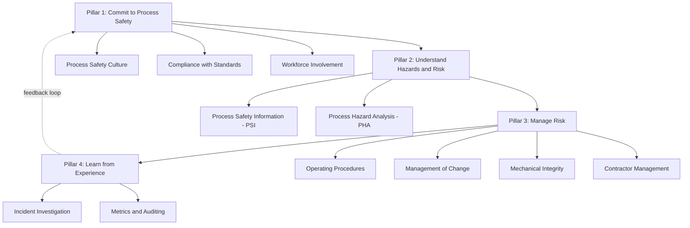

## Program Implementation Roadmap for New Facilities

### Definition and Scope

A Program Implementation Roadmap for New Facilities is the structured, phased approach used to design, build, and activate a complete Process Safety Management (PSM) system for a facility that does not yet have one — most commonly a greenfield facility under construction, but equally applicable to an acquired facility with no prior PSM program, or an existing facility whose program must be rebuilt from a deficient baseline. This topic sits at the intersection of the CCPS Risk Based Process Safety (RBPS) framework and practical program-building sequencing: RBPS guidelines exist specifically to help organizations design and implement more effective process safety management systems, providing methods and ideas on how to (1) design a process safety management system, (2) correct a deficient process safety management system, or (3) improve process safety management practices — a three-way framing directly applicable to the "new facility" scenario as case (1).

### Foundational Principle: Risk-Based Resource Allocation

Before any implementation sequencing decision is made, the RBPS approach establishes the governing principle that should shape the entire roadmap: the approach recognizes that all hazards and risks are not equal, and consequently advocates that more resources should be focused on more significant hazards and higher risks. For a new facility, this means the implementation roadmap itself should not be a uniform, checklist-driven rollout of all twenty RBPS elements (or fourteen OSHA elements) simultaneously and at equal depth — it should be sequenced and resourced according to where the facility's actual hazard and risk concentration lies.

### The Four RBPS Pillars as Implementation Scaffolding

The CCPS Risk-Based Process Safety framework organizes its twenty elements under four foundational pillars, and this structure provides a natural high-level sequencing logic for a new-facility roadmap, since later pillars depend on the outputs of earlier ones:

**Sequencing Logic**

- **Commit to Process Safety** must be established first because it defines the organizational culture, leadership commitment, and workforce involvement structures that every subsequent element depends on for effective execution.
- **Understand Hazards and Risk** must precede risk management activity, since Process Safety Information (PSI) — described in the framework as the critical process safety information required to operate safely — is a direct prerequisite input to Process Hazard Analysis, which in turn informs which risk-management controls (Pillar 3) are actually needed.
- **Manage Risk** elements (procedures, MOC, mechanical integrity) can only be meaningfully built once the hazard understanding from Pillar 2 defines what is being managed and to what standard.
- **Learn from Experience** closes the loop, feeding incident investigation and metrics findings back into Pillar 1 commitment and Pillar 2 hazard understanding — meaning the roadmap is not linear-and-done but cyclical once initial startup is achieved.

### Historical Development of the Framework Underpinning the Roadmap

Understanding the roadmap's structure benefits from knowing its lineage: this framework builds upon ideas first published by AIChE in 1989 in *Guidelines for Technical Management of Chemical Process Safety*, further refined in AIChE's 1992 *Plant Guidelines for Technical Management of Chemical Process Safety* — meaning the phased, management-systems approach to PSM implementation is not a recent innovation but the product of decades of iterative refinement following major industrial accidents. The Center for Chemical Process Safety has recognized since its inception that enhancements in chemical process technologies, taken alone, are not sufficient to prevent catastrophic events such as the Bhopal disaster — establishing early that the roadmap must build management systems and organizational commitment alongside (not instead of) engineering controls.

### Implementation Roadmap: A Phased Approach for New Facilities

**Phase 1 — Pre-Design and Commitment (Concept through FEED)**

1. Secure documented senior management commitment to process safety as a corporate value, establishing accountability structures before detailed engineering begins.
2. Define workforce involvement mechanisms early, so operations and maintenance personnel input shapes design decisions rather than being retrofitted after commissioning.
3. Establish which regulatory frameworks apply (e.g., OSHA 1910.119, EPA RMP, applicable state or international equivalents) based on anticipated chemical inventories, since threshold-quantity determinations shape design-basis decisions from this point forward.

**Phase 2 — Hazard Understanding (Detailed Design)**

4. Compile Process Safety Information (PSI) — P&IDs, equipment specifications, material safety data, relief system design basis — concurrently with detailed engineering, since PSI functions as a required input to Process Hazard Analysis rather than a document produced after the fact.
5. Conduct Process Hazard Analysis (PHA) at a design stage where findings can still influence layout and equipment selection cost-effectively, rather than after construction is substantially complete.
6. Where applicable, incorporate Inherently Safer Design (ISD) evaluation directly into PHA reviews at this stage — current industry practice specifically encourages ISD principles being implemented in new or existing facilities through different approaches to ISD evaluations during facility PHA reviews, and evaluates compliance approaches for regulatory Safer Technologies and Alternatives Analysis (STAA) requirements where applicable.
7. Complete facility siting and layout analysis, addressing occupied building placement, spacing, and consequence-distance considerations before construction locks in the physical arrangement.

**Phase 3 — Risk Management System Build (Construction through Pre-Commissioning)**

8. Develop written operating procedures aligned to the as-designed process, not generic templates — procedures must be defined in sufficient detail for workers to reliably perform the required tasks in a consistent manner on a sustainable basis.
9. Establish the Management of Change (MOC) procedure and activate it *before* first process change request, covering the full spectrum of changes in facility design, operations, and organization — critical because a new facility inevitably experiences early post-startup modifications, and an MOC system stood up reactively after the first change request has already occurred is structurally too late.
10. Build the Mechanical Integrity program, including inspection/testing schedules for safety-critical equipment, before those items are placed into service.
11. Establish contractor management and pre-qualification processes, particularly relevant given construction-to-operations workforce transitions common at new facility startups.
12. Confirm that modified facilities meet Management of Change requirements and ensure necessary training has been completed before proceeding to startup — a specific pre-startup verification checkpoint distinct from routine MOC and training program existence.

**Phase 4 — Startup Readiness and Commissioning**

13. Conduct a formal Pre-Startup Safety Review (PSSR), verifying PSI accuracy against as-built conditions, PHA action item closure, procedure availability, and training completion.
14. Start up the process only once it is confirmed ready to operate against the criteria established in Phase 3 — the operational discipline function of "Conduct of Operations" specifically encompasses this readiness determination as an ongoing management practice, not merely a one-time gate.

**Phase 5 — Learn from Experience (Post-Startup, Continuous)**

15. Activate incident investigation and near-miss reporting systems from day one of operation, not after the first significant event — early operational data from a new facility is disproportionately valuable for catching design or procedural gaps before they mature into larger incidents.
16. Establish process safety metrics and begin baseline data collection (leading and lagging indicators) immediately, since meaningful trend analysis requires an operating history baseline.
17. Schedule the facility's first compliance audit cycle (commonly a 3-year cycle under many regulatory and RAGAGEP frameworks) from the startup date, rather than allowing the clock to start informally.

### Guiding Implementation Principles Throughout the Roadmap

**Key Points**

- **Effectiveness over mere presence**: The framework directs organizations to focus on process safety effectiveness as a function of performance and efficiency, using metrics to sustain this in a consistent manner — meaning the roadmap's success criterion is not simply "all fourteen/twenty elements exist on paper" but that they function effectively and sustainably.
- **Risk-differentiated depth**: Reviewing work activities associated with each element and updating them based on an understanding of facility-specific risk, resource demand, and organizational process safety culture is an explicit RBPS instruction — meaning two new facilities in different sectors (e.g., a large-inventory refinery versus a small specialty batch facility) should implement the same twenty elements at different depths and rigor levels, not identically.
- **Documentation sufficiency for reliable execution**: Work activities must be defined in sufficient detail for workers to reliably perform the required tasks — a specific, testable standard for whether a procedure or program element is "complete" during roadmap execution, beyond simply existing in written form.
- **Small-facility scalability**: The framework family explicitly includes guidance offering sufficient information for managers of facilities with small chemical operations to implement a process safety program and meet existing regulations — confirming the roadmap concept scales down to smaller new facilities, not only large complex ones.

### Worked Example: Applying the Roadmap to a New Specialty Chemical Batch Facility

| Roadmap Phase | Facility-Specific Application |
| --- | --- |
| Phase 1 — Commitment | Establish that reactive hazard screening will be a non-negotiable gate for any new recipe introduced to the facility (anticipating the multi-recipe hazard pattern common to batch operations) |
| Phase 2 — Hazard Understanding | PHA explicitly scoped to include calorimetry-based thermal hazard testing for planned initial product recipes, not just equipment-level HAZOP |
| Phase 3 — Risk Management Build | MOC procedure explicitly defines "new recipe" as a change type requiring the same rigor as a physical modification |
| Phase 4 — Startup Readiness | PSSR confirms thermal hazard data exists and has been reviewed for every recipe planned for initial operation, not only the first product run |
| Phase 5 — Learn from Experience | Near-miss reporting specifically prompts for "unexpected exotherm" or "unplanned temperature deviation" as a reportable category from day one |

### Related Topics

- CCPS Risk Based Process Safety Framework — Four Pillars and Twenty Elements Overview
- Specialty and Batch Chemical Manufacturing
- Management of Change (MOC) Procedures
- Pre-Startup Safety Review (PSSR) Requirements
- Inherently Safer Design (ISD) and STAA Evaluation
- Process Hazard Analysis (PHA) Methodologies
- Mechanical Integrity Program Development
- Facility Siting and Layout Analysis
- Process Safety Metrics and Leading/Lagging Indicators
- Contractor Management and Pre-Qualification
- Compliance Audit Cycles and Scheduling
- Conduct of Operations and Operational Discipline