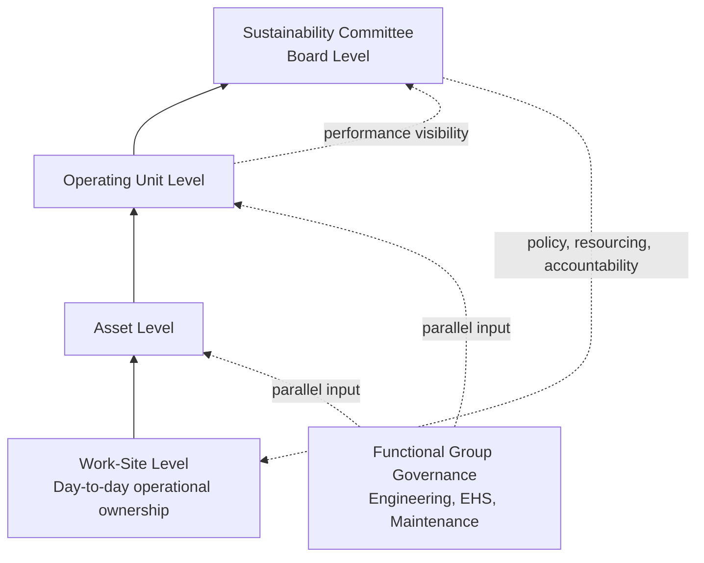

## Governance Structures and Organizational Roles

### Definition and Scope

Governance structures and organizational roles in Process Safety Management define who is accountable for what across an organization — from board-level oversight down to the individual worksite — and how process safety decision-making authority, reporting lines, and performance visibility flow through that structure. This is distinct from the technical content of PSM elements (PHA, MOC, mechanical integrity) covered elsewhere in this curriculum; governance addresses the organizational architecture that makes those technical elements function reliably and sustainably over time, rather than the elements themselves.

A compliant PSM program is explicitly not a one-time project: it requires leadership commitment, clear accountability, accurate Process Safety Information, competent PHA teams, disciplined Management of Change, and continuous verification — a framing that positions governance as the ongoing organizational infrastructure sustaining every other PSM element, not a one-time setup task.

### Why Governance Is a Distinct Discipline from Technical PSM Elements

**Historical Lessons Driving Governance Focus**

The case for treating governance as its own dedicated discipline is grounded directly in major accident history: successive major accidents, including those at Piper Alpha, Texas City, Longford, and Buncefield, have graphically demonstrated the catastrophic consequences that can occur when senior leaders fail to set the right culture within their organizations — establishing that these incidents are cited not primarily as engineering failures but as governance and leadership failures, reinforcing why governance structure is treated as a foundational topic rather than a peripheral compliance formality.

**Regulatory and Institutional Recognition**

International guidance bodies have formalized this governance emphasis into specific structural requirements: requirements for board-level involvement, visibility, competence, and promotion of process safety management are recognized standards, alongside putting process safety leadership at the core of business policies and ways of working to ensure risks are properly managed, engaging and involving the workforce in managing safety, robust and regular auditing of safety management systems, publication of process safety performance indicators, and sharing of good practice and lessons learned across industry sectors.

### Core Governance Principle: Board-Level Accountability

A recurring theme across authoritative process safety governance guidance is that leadership accountability cannot be delegated away from senior organizational levels. Leadership has a critical impact on organizational culture, employee behavior, and safety, and safety management system guidance specifically addresses the roles and responsibilities of personnel involved in the management of major hazards at all levels in the organization — explicitly including senior leadership, not only site-level operational staff.

### The Line-Led Governance Model

One documented approach to structuring process safety governance uses a "line-led" model, in which accountability originates at the operational level and flows upward through the organization's existing management hierarchy rather than being managed as a parallel, separate safety function:

Based on the line-led approach, governance starts at the work-site level and flows upward, with appropriately focused activities, through asset level to operating unit level and then through to the sustainability committee at the board level, with functional group governance also taking place alongside this line structure. This governance model leverages existing company governance structures and allows for effective integration of PSM into business activities — a design choice specifically intended to avoid process safety becoming an isolated, siloed function disconnected from how the business is actually run and reported on.

**Sustaining Governance Changes**

Embedding governance structures for durability, rather than as a one-time reorganization, requires integration with existing organizational systems: to make the changes sustainable, process safety responsibilities and competencies have been embedded in role profiles with existing personnel management tools being used to manage ongoing competency — meaning process safety accountability is written directly into job descriptions and performance management systems rather than existing only in a separate policy document.

**Metrics as a Governance Visibility Mechanism**

This line-led governance approach is specifically designed to enable improved visibility of process safety performance, with metrics representing the quantifiable aspects of process safety, and other, less quantifiable aspects monitored through separate assurance assignments — establishing that governance structure and performance metrics are functionally linked: the reporting hierarchy exists in large part to carry performance visibility upward to the board level.

### Core Organizational Roles

**Key Points**

- **Senior management/leadership**: Responsible for providing the vision, leadership, and resources for PSM implementation and improvement — establishing clear policies and objectives, allocating adequate budget and personnel, and communicating expectations and accountability for PSM to all levels of the organization. Leadership is also responsible for ensuring a culture of learning and continuous improvement exists, where incidents and near-misses are reported, investigated, and corrected, and where lessons learned are shared and applied.
- **Process Safety Manager (enterprise/functional level)**: A working-manager role combining people leadership with direct technical contribution — leading the company's enterprise process safety function (encompassing both OSHA PSM and EPA RMP program scope), serving as a trusted partner to Operations, Engineering, EHS, Maintenance, and Integrity functions, and developing practical, risk-based programs, governance, and tools that strengthen process safety performance while reinforcing operational ownership at the regional/site level. This role is explicitly framed as service-oriented rather than purely directive — helping regional teams manage risk effectively while reinforcing local ownership of safe, reliable operations, rather than centralizing all process safety decision-making away from the site.
- **Process Safety Management Coordinator/Manager (site level)**: Responsible for overseeing the development, implementation, and continuous improvement of the site PSM program.
- **Process Safety Information Manager**: Responsible for maintaining accurate and up-to-date process safety information, including process technology, equipment design, and operating limits documentation.
- **Process Hazard Analysis Team**: Responsible for conducting comprehensive hazard analyses and identifying potential risks and mitigation strategies — typically a cross-functional, periodically convened team rather than a standing individual role.
- **Operating Procedures Development Team**: Responsible for developing and maintaining clear, concise, and up-to-date operating procedures.
- **Training Coordinator**: Responsible for developing and delivering effective process safety training programs for employees and contractors.
- **Engineers**: Contribute technical expertise to hazard identification, design of controls, and mechanical integrity oversight — distinct from, but coordinated with, the process safety management functions above.
- **Operators**: Execute operating procedures and serve as a frontline source of hazard observation and near-miss reporting, making their role integral to the "Learn from Experience" governance feedback loop.

### Governance Maturity Spectrum

Process safety governance maturity can be characterized along several dimensions, illustrating how the same organizational function (e.g., "safety leadership") can range from nominal to fully embedded:

| Dimension | Low Maturity | High Maturity |
| --- | --- | --- |
| Organization of safety services | Few experts with unclear responsibilities; main focus on occupational health and safety rather than process safety specifically | Well-determined structure reporting directly to the CEO |
| Board-level leadership involvement | Rarely on the board agenda | Permanently present on the board agenda |
| Scope of leadership responsibilities | Meaningless or generic requirements | Leaders directly involved in safety matters with full authority to act |
| Visibility of personal leadership engagement | Manager occasionally seen at the plant | Full authority, charisma, respect, and ability to convince staff — genuine influence, not just formal title |

**Key Points**

- Strong and engaged leadership, able to manage and influence the accomplishment of process safety tasks, is identified as the first and highest-ranking component of effective process safety management — positioned ahead of technical or procedural elements in this maturity framework.
- Leaders in mature organizations are expected to prioritize process safety tasks and actively encourage staff to perform them effectively, rather than treating process safety as a delegated, background compliance function.

### Governance Implementation Practice

**Defining Roles with Authority, Not Just Titles**

A foundational governance-building step is ensuring role definitions carry genuine authority: leadership must empower teams handling hazardous materials with the authority and resources they need to build systems and practices they can rely upon, with individuals who have been properly trained assigned appropriate roles across all aspects of relevant business processes and safety procedures — a distinction between merely naming a role and actually resourcing and empowering it to act.

**Governance Framework Components**

Applied more generally to organizational governance (and directly transferable to process safety governance structure), an effective framework defines responsibilities, decision-making authority, and reporting lines, and assigns roles such as process owners, compliance officers, and subject matter experts to ensure accountability — with a clear structure promoting collaboration and smooth decision-making across the organization.

**Periodic Review**

Governance structures and the policies underlying them should not be treated as static: governance policies should be reviewed at least once a year, or sooner if significant regulatory, business, or technology changes occur — directly relevant to process safety governance given the frequency of regulatory updates (e.g., evolving EPA RMP rules, updated API standards) and organizational changes (mergers, facility acquisitions, new technology deployment) that can outdate a governance structure between scheduled reviews.

### Worked Example: Governance Escalation Pathway for a Process Safety Metric Deviation

| Level | Trigger | Action | Escalates To |
| --- | --- | --- | --- |
| Work-site | Tier 3/4 leading indicator trend shows degrading operating discipline | Site PSM Coordinator reviews root cause, assigns corrective action | Asset level (if trend persists beyond defined threshold) |
| Asset level | Repeated site-level escalation or a Tier 1/2 lagging event | Asset-level process safety review; resourcing decision on corrective action | Operating unit level |
| Operating unit | Pattern across multiple assets, or single high-consequence event | Operating unit leadership review; potential program-wide corrective action | Sustainability committee (board level) |
| Board level | Systemic governance gap identified, or major incident occurred | Board-level policy review; resourcing and accountability decisions | Cascades back down as revised policy/resourcing |

This structure reflects the line-led model's design intent: routine performance signals are handled and resolved at the level closest to the operation, while only genuinely systemic or severe issues require board-level attention — preserving both accountability at the point of work and appropriate senior visibility for matters that warrant it.

### Related Topics

- CCPS Risk Based Process Safety Framework — Commit to Process Safety Pillar
- Program Implementation Roadmap for New Facilities
- Process Safety Culture and Workforce Involvement
- Process Safety Performance Indicators (API RP 754)
- Independent Investigation Boards and Institutional Sustainability
- Compliance Audit Cycles and Third-Party Review
- Conduct of Operations and Operational Discipline
- Competency Management and Role-Based Training Requirements
- Major Accident Case Studies (Piper Alpha, Texas City, Longford, Buncefield)
- Management of Change (MOC) Governance and Approval Authority
- Contractor Management and Accountability Structures
- Board-Level Reporting on Process Safety Performance