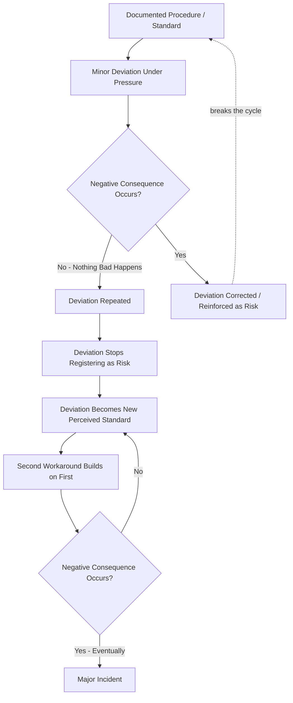

## Avoiding Program Drift and Complacency

### Definition and Scope

Program drift and complacency in Process Safety Management describes the gradual, often imperceptible erosion of a PSM program's rigor over time, even when the program was originally designed and implemented correctly. This topic addresses the sustainment challenge distinct from initial program design (covered under the implementation roadmap) or governance structure: a well-designed program with clear accountability can still degrade silently if organizations do not actively guard against drift. The central formal concept underpinning this topic is normalization of deviance, defined by CCPS as a gradual erosion of standards of performance as a result of increased tolerance of nonconformance — also termed normalization of deviation.

### Origin of the Concept

**Sociological Roots**

The concept has its roots in the work of sociologist Diane Vaughan, who coined the term "normalization of deviance" when researching the factors that led to the Space Shuttle Challenger disaster in 1986 — establishing that this is not an industry-specific PSM concept but a general organizational-sociology phenomenon later recognized as directly applicable to process safety.

**Cross-Sector Applicability**

The phenomenon, though originating in NASA safety practice investigations, is now recognized as ubiquitous across high-risk domains: normalization of deviance is a phenomenon in which individuals and teams depart from acceptable performance standards until the adopted way of practice becomes the new norm, and prior research has documented this pattern across oil and gas, nuclear power, aviation, healthcare, and rail industries — confirming this is a general high-consequence-industry pattern, not unique to chemical process safety, which is useful context for understanding why the same warning signs and countermeasures recur across sectors.

### Mechanism: How Drift Develops

**The Core Process**

Normalization of deviance happens when employees repeatedly break from standard procedures without any immediate negative consequence; over time, they stop seeing the deviation as a risk, the shortcut becomes the new normal, and no one sees a need to question or challenge it anymore. Critically, this process does not require negligence or malice — it emerges from the ordinary dynamics of organizations under competitive pressure, meaning drift is not necessarily a story of bad actors but of ordinary organizational behavior under sustained pressure, which is precisely what makes it difficult to detect and easy to underestimate.

**Distinction from Simple Rule-Breaking**

A precise distinction separates normalization of deviance from isolated rule violations: rule-breaking tends to be micro — focused on the actions of a specific individual or group — whereas normalization of deviance is what happens when that rule-breaking becomes consistent and widespread. With simple rule-breaking, a person or group consciously deviates from a known standard and blame can be assigned accordingly; with normalization of deviance, as deviations repeat without consequence, they stop registering as deviations in employees' minds altogether, making individual blame both difficult to assign and arguably beside the point — the failure has become systemic and collective rather than individual.

**Compounding Effect**

Drift is not typically a single static deviation but a compounding process: as time goes on, an employee can invent another workaround on top of a previous workaround that has already become normalized ("we've always done it like this!"), which increases safety drift even further and ultimately culminates in a major incident — illustrating why early intervention matters more than late-stage correction, since each successive workaround builds on an already-eroded baseline rather than starting fresh from the original standard.

### Documented Drivers of Normalization of Deviance

Research identifies four consistent, recurring drivers across studied incidents and organizations:

**Key Points**

- **Production pressure**: Time or budget pressures, or simply a need to satisfy leadership expectations, are consistently identified as a primary driver pushing workers toward shortcuts and workarounds.
- **Absence of negative consequences**: When shortcuts save time and nothing goes wrong, they get repeated and normalized, and compliance suffers — the absence of an immediate visible consequence functions as tacit reinforcement of the unsafe practice.
- **Workplace/organizational culture**: Broader research identifies productivity pressures, generalized complacency, complacency related to length of experience, social pressures, and negative acculturation as contributing factors — indicating drift is shaped by group norms and organizational culture, not only individual decision-making.
- **Gradual desensitization to risk**: Normalization of deviance occurs when people within an organization become so desensitized to the deviant practice that it no longer feels wrong — this desensitization does not happen overnight but builds up over years and becomes part of the organizational culture, the behavioral substrate of the workplace.

### Illustrative Examples of Drift in Practice

Concrete operational examples help make the abstract mechanism recognizable: a supervisor shortening a pre-job briefing because it's a task the team has performed hundreds of times before, or a permit being completed because it's required for a job — but with no substantive discussion behind it — both illustrate how a procedural safeguard can remain technically "completed" on paper while its actual protective function has eroded to a formality.

### Case Study: Normalization of Deviance in a Major Process Safety Incident

The Baker Panel investigation into BP's Texas City refinery incident is cited as a documented, real-world illustration of accumulated normalization of deviance across multiple simultaneous dimensions: operators accepted inoperable instrumentation, procedures were routinely not followed, operators were not adequately trained and the training staff was cut over time, nonessential workers were allowed to be near the process, and everyone accepted the faulty atmospheric blowdown stack arrangement. This example is significant because it demonstrates drift accumulating across several independent PSM elements concurrently (instrumentation integrity, procedure adherence, training, facility siting) rather than in a single isolated area — meaning organizational drift assessment should not be scoped narrowly to one PSM element but examined holistically across the program.

**The Compounding Role of Non-Detection**

A precise mechanistic description from process safety behavioral research frames drift as: acceptance of risk shaped over time by deviant behavior that is never corrected because it is ignored or never detected — with a critical embedded insight that ignoring deviant behavior is itself a deviant behavior in its own right. When enough deviant behavior has been ignored, it becomes accepted or normalized from a sociological standpoint, and ultimately no reaction is accepted as the appropriate reaction to deviant behavior — the deviant behaviors themselves may come to be regarded as normal. This reframes leadership's non-response to early warning signs as an active contributor to drift, not a neutral or passive failure.

### High Reliability Organization Principles as a Countermeasure

Normalization of deviance is described as inimical to the principles of high reliability organizing — specifically, to the first of the five high-reliability principles: preoccupation with failure. This framing positions "preoccupation with failure" (treating near-misses and small anomalies as significant signals rather than routine noise) as a direct organizational antidote to drift, since drift fundamentally depends on small deviations being dismissed as insignificant rather than treated as meaningful warning signs.

### Warning Signs of Program Drift

**Key Points**

- **Shortened or perfunctory safety rituals**: Pre-job briefings, permits, or checklists being completed as a formality without substantive discussion, as illustrated in the examples above.
- **Repeated "nothing bad happened" reasoning**: Justification of a shortcut based on its track record of no visible consequence, rather than an actual risk assessment.
- **Inoperable safeguards tolerated**: Continued operation with known-degraded instrumentation, alarms, or safety systems without urgency to restore them — directly mirrored in the Texas City case.
- **Training and competency erosion accepted as routine**: Reduced training rigor or staffing treated as an acceptable cost-saving measure rather than a process safety risk.
- **Erosion of workforce reporting culture**: Declining near-miss or deviation reporting is itself a warning sign, since detection depends on these reports surfacing drift before it compounds further.

### Countermeasures and Prevention Practices

**Nonpunitive, Transparent Reporting Systems**

A specific and directly actionable countermeasure is strengthening standardized reporting systems for near-misses and safety standard deviations in a nonpunitive and supportive environment, fortifying reporting systems to promote transparency and the acknowledgment of near-misses and deviations so that risk can be attenuated before deviations from safety standards become entrenched and normalized in personnel's practice behavior. This directly targets the "absence of negative consequences" driver by ensuring deviations are surfaced and addressed even when they have not (yet) caused visible harm.

**Cultivating Awareness of High-Risk Context**

Organizations should actively promote awareness of the high-risk nature of their operations so that complacency is seen as an outlier rather than the norm — an explicit cultural countermeasure aimed at preventing the gradual desensitization to risk that drift depends on.

**Organizational Reappraisal Keeping Pace with Operational Pressure**

Drift is specifically linked to organizational reappraisals not keeping up with workplace pressures: workers adapt to changing circumstances by creating workarounds that feel more efficient, and over time, this risk normalization becomes accepted practice even though it differs from documented procedures — implying that periodic, proactive review of whether documented procedures still match actual operational conditions (rather than waiting for an audit finding or incident) is itself a preventive practice, closing the gap between formal procedure and evolving practice before that gap becomes entrenched.

**Digital and Proactive Detection Tools**

Contemporary practice increasingly emphasizes proactive safety practices and digital tools to help detect and reduce safety drift over time — reflecting a trend toward using data (e.g., leading indicator trends, procedure-compliance monitoring) to surface drift earlier than would be possible through periodic audit alone. [Unverified: this is a general industry trend claim from a vendor-oriented source rather than a specific documented methodology; readers should evaluate specific digital drift-detection tools on their individual merits rather than treating "digital tools" as a validated category.]

### Worked Example: Drift Detection Through the Governance Escalation Pathway

Connecting this topic to the governance structure covered elsewhere in this chapter, drift detection can be embedded directly into the line-led governance escalation model:

| Governance Level | Drift Indicator to Monitor | Response if Threshold Crossed |
| --- | --- | --- |
| Work-site | Declining near-miss reporting rate; shortened pre-job briefings observed | Site-level reinforcement of nonpunitive reporting; supervisor coaching |
| Asset level | Pattern of "same workaround" appearing across multiple work orders or permits | Formal review of whether documented procedure still matches actual practice; potential procedure update or retraining |
| Operating unit | Multiple assets showing correlated drift indicators | Operating-unit-level culture assessment; resourcing review for training/staffing gaps |
| Board level | Systemic drift pattern surfaced through audit or incident investigation | Policy-level review of production-pressure incentives contributing to drift; potential structural intervention |

### Related Topics

- Governance Structures and Organizational Roles
- CCPS Risk Based Process Safety Framework — Learn from Experience Pillar
- Process Safety Culture and Workforce Involvement
- Baker Panel Report and BP Texas City Incident
- Incident Investigation and Near-Miss Reporting Systems
- High Reliability Organizing Principles
- Compliance Audit Cycles and Third-Party Review
- Weak Signals Versus Strong Signals in RBPS Implementation
- Management of Change (MOC) and Procedure-Practice Gap Closure
- Independent Investigation Boards and Institutional Sustainability
- Program Implementation Roadmap for New Facilities
- Process Safety Performance Indicators (API RP 754) as Drift Detection Tools