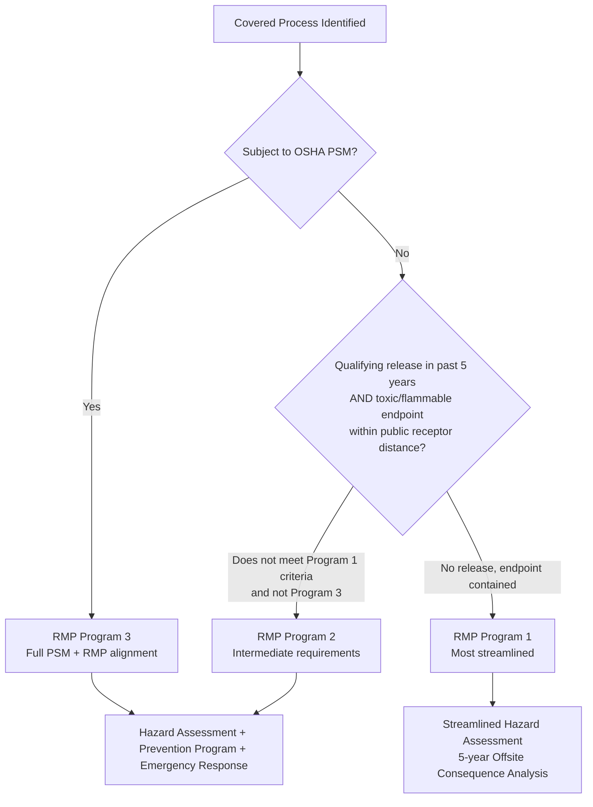

## Small Business and Lower-Tier Facility Considerations

### Definition and Scope

Small business and lower-tier facility considerations address how PSM and RMP requirements apply — and how they should be practically implemented — at facilities with more limited technical staff, budget, and organizational infrastructure than a large integrated refinery or major chemical manufacturer, and at facilities whose risk profile places them in a lower regulatory tier rather than the most stringent program level. This topic matters because the full PSM/RMP regulatory framework was designed to apply uniformly to any covered facility regardless of size, yet the practical resources available to implement it vary enormously; the regulatory system responds to this partly through tiered program structures (RMP Programs 1/2/3) and partly through built-in flexibility in how smaller facilities may satisfy identical substantive requirements.

### Regulatory Tiering: RMP Programs 1, 2, and 3

**Framework Overview**

The EPA RMP rule is broken into three programs with requirements based on the threat a covered process poses to the community and environment. Most facilities that fall under the scope of both PSM and RMP fall into RMP Program 3, and many of the requirements in RMP Programs are identical to PSM's requirements, though the overlap in coverage between the two standards is close but not complete.

**Program 1 Eligibility**

Chemicals not subject to PSM are regulated under either Program 1 or Program 2. Facilities are eligible for Program 1 if they have not experienced a qualifying accidental release within the previous five years and the distance to a toxic or flammable endpoint is less than the distance to a public receptor, based on the required offsite consequence analysis — establishing Program 1 as the least stringent tier, reserved for processes with both a clean release history and limited off-site consequence potential.

**Program 2 as the Lower-Tier Category**

Program 2 applies to covered processes that do not qualify for Program 1 or Program 3, functioning as an intermediate tier. Program 2 has fewer requirements than Program 3, and while both Program 2 and Program 3 require a hazard assessment, a prevention program, and an emergency response program, Program 2 requirements are less extensive and more streamlined.

### Comparing Program 2 and PSM/Program 3 Requirements

A dedicated cross-reference tool developed by a chemical facility safety and security working group illustrates that Program 2 requirements, while streamlined relative to full PSM/Program 3, remain substantively similar in structure. Selected examples:

| Element | PSM / RMP Program 3 | RMP Program 2 |
| --- | --- | --- |
| Process Safety Information | Full documentation requirement | For each Program 2 process, the owner or operator shall provide the date of the most recent review or revision of the safety information and a list of federal or state regulations or industry-specific design codes and standards used to demonstrate compliance — and where the same information applies to more than one covered process, it may be provided only once, indicating which processes it applies to (a streamlining specifically useful for a small facility running similar processes) |
| Training | Full 14-element training requirement | Training shall include emphasis on the specific safety and health hazards, emergency operations including shutdown, and safe work practices applicable to the employee's job tasks — substantively similar content requirement, framed more concisely |
| Contractors | Full contractor management element | The employer shall develop and implement safe work practices to control the entrance, presence, and exit of contract employers and contract employees in covered process areas |

This comparison illustrates a key practical point for lower-tier facilities: Program 2's requirements are streamlined in documentation burden and specificity, not eliminated in substance — a small facility in Program 2 still needs functioning safety information, training, and contractor management systems, just structured with somewhat less prescriptive detail than full PSM/Program 3.

### The 2026 RMP Rule Update and Program 2 RAGAGEP Alignment

Recent rulemaking has specifically addressed how RAGAGEP compliance obligations apply differently across program tiers, with a notable 2026 change tightening the Program 2 standard. Prior to the 2024 Safer Communities by Chemical Accident Prevention (SCCAP) rule, owners or operators of Program 2 processes were required to "ensure" compliance with RAGAGEP; with the 2024 changes, they now need to "ensure and document" compliance — adding an explicit documentation burden previously not required at the Program 2 level. Additionally, the language for Program 3 previously referred to "equipment" while Program 2 referred to the "process," but Programs 2 and 3 were aligned to generally state that owners or operators are required to ensure and document compliance of their processes with RAGAGEP — reducing (though not eliminating) the historical gap between how rigorously the two tiers must demonstrate RAGAGEP compliance.

### OSHA's Explicit Small Business Guidance

**Full Standard Applicability, With Flexible Compliance Approaches**

OSHA's dedicated small-business guidance establishes a clear governing principle: although all elements of the PSM standard apply to a PSM-covered small business, certain elements warrant particular attention given typical small-facility resource constraints — meaning small businesses are not exempt from any PSM element, but the guidance specifically helps them understand practical, resource-appropriate ways to satisfy each element.

**RAGAGEP Selection Remains the Facility's Responsibility**

A recurring point of confusion for smaller facilities is who determines the applicable engineering standard: the PSM standard references RAGAGEP, and businesses must be able to demonstrate that their PSM-covered processes are designed and constructed to meet requirements of the applicable engineering standards (e.g., ASME, API, ANSI) — critically, the facility itself is responsible for selecting the applicable RAGAGEP and demonstrating how its processes are built to the appropriate design standards and have been maintained, rather than a regulator prescribing a single universal standard. For a small facility without in-house engineering staff experienced in RAGAGEP selection, this responsibility can be a significant practical challenge distinct from larger facilities with dedicated engineering departments.

**Mechanical Integrity Without Manufacturer Guidance**

A specific practical gap addressed in small-business guidance concerns equipment lacking manufacturer-provided maintenance recommendations: in many cases, mechanical integrity program equipment will have inspection and testing recommendations from the manufacturer, but if covered equipment does not have any MI-related manufacturer recommendations, employers should look for applicable codes/standards or industry best practices instead. Inspections and tests must still follow RAGAGEP, and inspection/test frequency must be consistent with manufacturer recommendations and good engineering practice, or more frequently if indicated by operating experience — establishing a fallback hierarchy (manufacturer guidance → applicable codes/standards → industry best practice) specifically useful when a smaller facility's equipment inventory includes older or less common items without clear manufacturer MI documentation.

### Small Facility Management System Flexibility (EPA RMP Guidance)

EPA guidance specifically addressing small facilities under the Management System element emphasizes built-in regulatory flexibility rather than a rigid, one-size-fits-all structure: sources covered by the rule are diverse, so the facility is in the best position to decide how to appropriately implement the risk management program elements at its facility, and the rule therefore provides considerable flexibility in complying with its program requirements.

**Practical Implementation for a Small Facility**

As a small facility complying with the management system provision, a facility most likely has only one or two Program 2 or 3 processes; to begin, it may identify either the qualified person or the position with overall responsibility for implementing the risk management program elements. As a small facility, it may make sense and be practical to identify the specific named person, rather than only a job position, given the likely absence of a large, formally structured department — and notably, the only management system element that must be reported in the RMP submission itself is the name of the qualified person or position with overall responsibility, with changes to this specific data element not triggering a special RMP update outside the normal update cycle.

**Ongoing Commitment Beyond Initial Submission**

A specific caution embedded in EPA small-facility guidance addresses a common misconception: management commitment to process safety does not end when the risk management plan is submitted to EPA — since the program requires ongoing implementation of accident prevention and emergency response measures, facility personnel must remain committed to every element of the risk management program on an ongoing basis, and all groups within the source must understand the lines of responsibility and communication. This directly parallels the "Avoiding Program Drift and Complacency" concern covered elsewhere in this chapter, but is specifically flagged as a risk for small facilities where initial RMP submission may be treated (incorrectly) as a completion milestone rather than an ongoing program commitment.

### Consulting and External Resource Dependency

Because small facilities frequently lack in-house process safety engineering expertise, external consulting support is a common practical pathway to compliance, though the decision authority remains with the facility itself: a consulting engagement will typically summarize the applicable OSHA PSM and EPA accident prevention requirements, identify specific policy/procedure improvements needed, and present recommendations for the most effective way to provide required improvements — but the decision on how to proceed with PSM development and improvement activities is explicitly retained by the client, based on available facility and corporate resources. This reflects an important governance point for lower-tier facilities: external expertise can inform and support program development, but resourcing and implementation prioritization decisions remain an internal management responsibility, consistent with the governance accountability principles covered elsewhere in this chapter.

### Worked Example: A Small Ammonia Refrigeration Facility Navigating Tiered Requirements

Connecting this topic to the Ammonia Refrigeration reference covered earlier in this curriculum, consider a small cold-storage facility with 12,000 lbs of anhydrous ammonia (just above the 10,000-lb PSM/RMP threshold):

| Consideration | Small-Facility Approach |
| --- | --- |
| Program tier determination | Facility must assess whether its worst-case release scenario places public receptors within the circle of influence (as is typical for ammonia refrigeration) — likely places it in Program 3 given ammonia's common RMP Program 3 classification, despite its otherwise modest size |
| Management system | Identify a single named qualified person with overall responsibility (practical given likely absence of a dedicated process safety department) |
| RAGAGEP selection | Apply ANSI/IIAR 6 and 9 as the facility's selected RAGAGEP, since these are the recognized consensus standards for ammonia refrigeration regardless of facility size |
| Mechanical integrity | Where manufacturer recommendations exist for specific components (compressors, valves), follow those; where absent, default to IIAR-published inspection guidance |
| External support | May engage a specialized ammonia refrigeration PSM consultant for initial program development, retaining final decision authority on implementation scope internally |
| Ongoing commitment | Explicitly avoid treating initial RMP submission as program completion — maintain active management system engagement post-submission |

### Related Topics

- Ammonia Refrigeration in Food and Agricultural Processing
- EPA Risk Management Program and Regulatory Evolution
- Governance Structures and Organizational Roles
- Program Implementation Roadmap for New Facilities
- RAGAGEP Selection and Documentation Requirements
- Mechanical Integrity Programs Without Manufacturer Guidance
- Avoiding Program Drift and Complacency
- Safer Technologies and Alternatives Analysis (STAA)
- Third-Party Compliance Audits Under Updated RMP Rules
- CCPS Risk Based Process Safety Framework — Selecting the Level of Rigor for Each Element
- Contractor Management for Resource-Constrained Facilities
- OSHA Small Business Regulatory Enforcement Fairness Act (SBREFA) Process