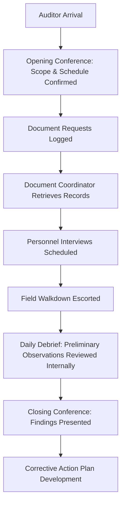

## Preparing for Third-Party and Regulatory Audits

### Overview

Audit preparation is the systematic process by which a facility organizes documentation, verifies program implementation, and rehearses interview readiness ahead of an external compliance audit (OSHA PSM compliance audit under 1910.119(o), EPA RMP audit under 40 CFR 68.220, or a third-party/insurance-driven audit). Effective preparation reduces the likelihood of findings rooted in documentation gaps rather than actual safety deficiencies, and demonstrates to auditors that the facility's PSM program operates continuously rather than being reconstructed for the audit itself.

### Types of Audits

#### Regulatory Audits

- OSHA PSM Compliance Safety and Health Officer (CSHO) inspections, which may be triggered by a complaint, referral, programmed National Emphasis Program (NEP) selection, or following an incident
- EPA RMP inspections, verifying accident prevention program elements under Part 68
- State-level equivalents (e.g., Cal/OSHA PSM, which has additional requirements beyond federal OSHA)

#### Third-Party and Internal Audits

- Corporate/internal PSM audits, often conducted on a triennial cycle consistent with 1910.119(o)(2) requirements even though the mandatory audit itself must be conducted by the employer (self-audit) or a qualified contracted auditor
- Insurance carrier loss-prevention audits
- Industry association or certification body audits (e.g., Responsible Care management system audits)
- Pre-acquisition due diligence audits

### Pre-Audit Preparation Components

#### 1. Documentation Readiness

- **Key Points**
  - Compile and verify currency of all fourteen PSM elements' documentation: PHA, Operating Procedures, Training, Mechanical Integrity, MOC, Pre-Startup Safety Review, Incident Investigation, Emergency Planning, Compliance Audits, Trade Secrets, Employee Participation, Contractor Safety, Hot Work Permits, and Process Safety Information (PSI)
  - Verify document version control — auditors frequently cross-check that field-posted procedures match the current controlled version
  - Ensure PHA revalidations are current (every 5 years per 1910.119(e)(6)) and that action item closure documentation is complete with sign-offs

**Example**

An auditor requests to see the current P&ID for a reactor system alongside the corresponding operating procedure; if the P&ID reflects a piping modification made eight months prior but the procedure has not been updated, this indicates a gap between MOC and Operating Procedures elements — a common audit finding.

#### 2. Gap Self-Assessment

- Conduct an internal readiness review against the actual regulatory text (1910.119 or Part 68) rather than solely against a previous audit's checklist, since prior audits may not have covered every element
- Use a formal audit protocol, such as OSHA's own PSM audit protocol or a recognized third-party checklist (e.g., CCPS audit protocol), to structure the self-assessment
- Prioritize corrective actions for identified gaps before the audit where feasible; document remediation plans with target dates for gaps that cannot be closed in time

#### 3. Personnel Interview Readiness

- Identify likely interviewees for each PSM element (process engineers for PHA, maintenance technicians for Mechanical Integrity, operators for Operating Procedures)
- Conduct informal readiness discussions so personnel understand what documentation supports their answers and are comfortable describing actual practice rather than reciting policy language
- Reinforce that interview answers should reflect genuine current practice; inconsistency between what employees describe and what documentation shows is a common source of audit findings

#### 4. Physical/Field Verification

- Walk down representative process areas to confirm field conditions match documentation (labeling, valve tagging, PPE availability, permit postings)
- Verify Mechanical Integrity inspection tags and test records are current and physically present at equipment
- Confirm hot work permits, confined space entries, and other active permits are properly completed and displayed if any are open during the audit window

#### 5. Records and Data Retrieval Logistics

- Establish a document control point/room and a designated document coordinator to retrieve requested records promptly during the audit
- Organize records (physical or electronic) by PSM element with an index, so retrieval time itself does not become a negative signal to the auditor
- Confirm electronic document management system (EDMS) search functionality works and personnel are trained on retrieval

### Common Audit Focus Areas (Based on Historical OSHA Citation Patterns)

| Element | Frequent Finding Type |
| --- | --- |
| Process Safety Information | Incomplete or outdated PSI for existing equipment |
| Process Hazard Analysis | Untimely revalidation; unresolved or undocumented action item closure |
| Mechanical Integrity | Inspection/test frequency not met; deficiency correction not documented |
| Management of Change | Changes made without formal MOC documentation ("undocumented MOC") |
| Operating Procedures | Procedures not reflecting current operations |
| Compliance Audits | Prior audit findings not tracked to closure |

[Unverified] Exact citation frequency rankings shift year to year and by OSHA region; the table reflects commonly cited historical patterns rather than a current statistical ranking, and facilities should consult current OSHA enforcement data for up-to-date figures.

### Audit Day Logistics

#### Opening and Closing Conference Practices

- Assign a single point of contact to receive and log all document requests, preventing duplicate or inconsistent responses from multiple departments
- Conduct internal daily debriefs during multi-day audits to track emerging themes and proactively prepare related documentation
- At closing conference, request written or verbal summary of preliminary findings to begin corrective action planning immediately, rather than waiting for the formal report

### Post-Audit Follow-Through

- Formally document and track every finding to closure with assigned owner and target date, consistent with the same rigor expected of internal compliance audit action items under 1910.119(o)(4)
- Conduct a lessons-learned review of the audit process itself to improve readiness for the next cycle
- Where findings reveal systemic gaps (not isolated to one area), consider whether root cause extends across the site or corporate program

**Conclusion**

Audit preparation is most effective as a continuous discipline rather than a pre-audit scramble: facilities that maintain document currency, closure tracking, and field/documentation alignment as standing operating practice generally experience shorter, lower-friction audits with fewer findings rooted in administrative gaps. [Inference] Treating audit readiness as an ongoing management system output, rather than a periodic event, is widely regarded as best practice, though its direct causal effect on audit outcomes is not independently quantified here.

**Related Topics**

- OSHA PSM Compliance Audit Protocol (1910.119(o))
- Management of Change Documentation Rigor
- PHA Revalidation Cycles and Action Item Tracking
- Mechanical Integrity Inspection and Test Recordkeeping
- Corrective Action Tracking Systems
- Responsible Care and Third-Party Certification Audits