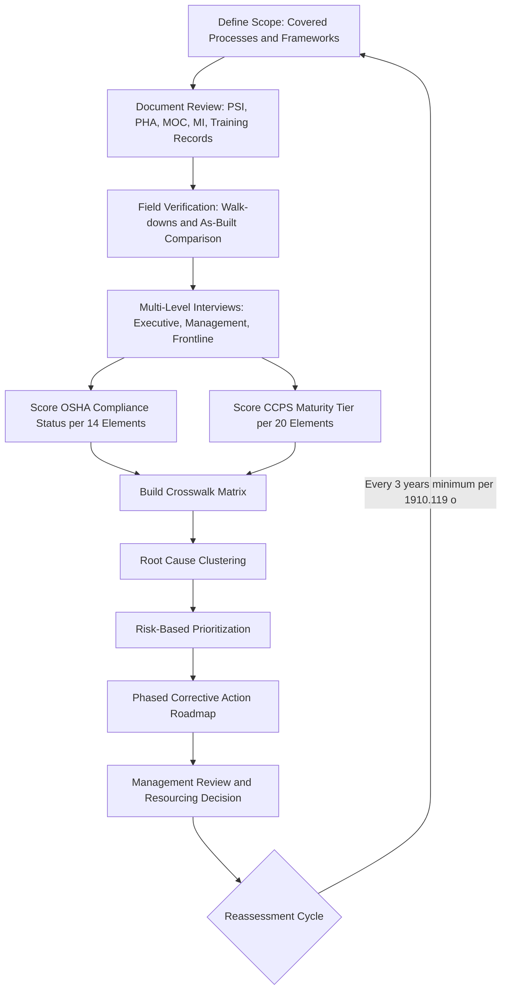

## Capstone Gap Assessment Against OSHA and CCPS Frameworks

### Overview

A capstone gap assessment is the comprehensive, integrated audit an organization performs at or near the end of a PSM program build-out (or on a recurring cycle) to measure the actual state of the program against two reference frameworks simultaneously: the regulatory floor set by OSHA 29 CFR 1910.119 (and, where applicable, EPA RMP 40 CFR 68) and the voluntary, more granular good-practice ceiling set by the CCPS (Center for Chemical Process Safety) Risk Based Process Safety (RBPS) 20-element model. The assessment is "capstone" because it does not evaluate elements in isolation — it evaluates the *system as a whole*: whether the 14 OSHA elements and 20 CCPS elements interlock, whether outputs from one element correctly feed inputs to another, and whether the management system sustains performance over time rather than merely existing on paper at a single point of inspection.

### Purpose and Positioning in the PSM Lifecycle

**Key Points**

- Serves as the terminal verification step after initial PSM program development, a major MOC-driven redesign, an acquisition/divestiture, or a multi-year compliance audit cycle (OSHA requires compliance audits at least every three years under 1910.119(o)).
- Distinguishes itself from a routine compliance audit by being *dual-framework*: OSHA defines legal minimum compliance, while CCPS RBPS defines maturity and sustainability. A facility can be OSHA-compliant and still be CCPS-immature (reactive, undocumented, personality-dependent).
- Functions as the primary input to a multi-year PSM improvement roadmap and capital/resource planning cycle.
- Often triggered by: a significant incident or near-miss, corporate merger/standardization, regulatory citation history, insurance/carrier risk survey findings, or leadership transition.

### The Two Reference Frameworks Compared

| Dimension | OSHA 1910.119 | CCPS RBPS |
| --- | --- | --- |
| Nature | Mandatory regulation (legal minimum) | Voluntary guidance (industry good practice) |
| Element count | 14 elements | 20 elements grouped into 4 pillars |
| Granularity | Performance-based, broad requirements | Highly granular, with work activities per element |
| Maturity concept | Pass/fail (compliant or cited) | 4-tier maturity model per element |
| Legal enforceability | Citable, fines, criminal liability under Clean Air Act §112(r) overlap | Not legally enforceable; adopted as due-diligence standard |
| Scope emphasis | Highly hazardous chemicals above TQ (threshold quantity) | Applies RBPS thinking across all process safety risk, not just listed chemicals |

### OSHA 1910.119: The 14 Elements (Compliance Floor)

1. Employee Participation
2. Process Safety Information (PSI)
3. Process Hazard Analysis (PHA)
4. Operating Procedures
5. Training
6. Contractors
7. Pre-Startup Safety Review (PSSR)
8. Mechanical Integrity (MI)
9. Hot Work Permit
10. Management of Change (MOC)
11. Incident Investigation
12. Emergency Planning and Response
13. Compliance Audits
14. Trade Secrets

**Example**

A gap assessment finding against Element 8 (Mechanical Integrity) might read:

> [Confirmed] Facility PSI drawings for the ammonia refrigeration system list wall-thickness specifications for the compressor discharge piping, but the corresponding inspection and testing (ITPM) schedule in the CMMS does not reference an inspection interval derived from a documented RBI (risk-based inspection) methodology or API 510/570 code basis — 1910.119(j)(4)(ii) requires inspections consistent with recognized and generally accepted good engineering practices (RAGAGEP).

### CCPS Risk Based Process Safety: The 20 Elements (Maturity Ceiling)

CCPS organizes 20 elements into 4 pillars, which is the structural feature most useful for a capstone assessment because it forces evaluation of *how elements interact*, not just whether each exists.

**Pillar 1 — Commit to Process Safety**

1. Process Safety Culture
2. Compliance with Standards
3. Process Safety Competency
4. Workforce Involvement
5. Stakeholder Outreach

**Pillar 2 — Understand Hazards and Risk**

6. Process Knowledge Management

7. Hazard Identification and Risk Analysis (HIRA)

**Pillar 3 — Manage Risk**

8. Operating Procedures

9. Safe Work Practices

10. Asset Integrity and Reliability

11. Contractor Management

12. Training and Performance Assurance

13. Management of Change

14. Operational Readiness

15. Conduct of Operations

16. Emergency Management

**Pillar 4 — Learn from Experience**

17. Incident Investigation

18. Measurement and Metrics

19. Auditing

20. Management Review and Continuous Improvement

**Key Points**

- Pillar 1 has no direct OSHA equivalent for elements 1, 3, 4 (culture, competency, workforce involvement) as *standalone* citable requirements — OSHA touches these only indirectly through Employee Participation. This is consistently the largest gap zone found in capstone assessments.
- Pillar 4's "Measurement and Metrics" and "Management Review" elements have no OSHA equivalent at all. OSHA requires audits (Element 13) but does not require a formal leading/lagging indicator program or documented management review cadence.

### Cross-Framework Mapping Methodology

The core analytical task of a capstone assessment is building a crosswalk matrix that maps each OSHA element to its corresponding CCPS element(s), because the relationship is not 1:1.

$$\text{Coverage Ratio} = \frac{\text{OSHA-mandated elements found compliant}}{\text{14}} \quad \text{vs.} \quad \text{Maturity Score} = \frac{\sum_{i=1}^{20} M_i}{20}$$

where $M_i$ is the maturity tier (typically 1–4) assigned to CCPS element $i$.

**Typical mapping table (abridged):**

| OSHA Element | Corresponding CCPS Element(s) |
| --- | --- |
| PSI | Process Knowledge Management |
| PHA | Hazard Identification and Risk Analysis |
| Operating Procedures | Operating Procedures + Conduct of Operations |
| Training | Training and Performance Assurance + Process Safety Competency |
| Contractors | Contractor Management |
| PSSR | Operational Readiness |
| Mechanical Integrity | Asset Integrity and Reliability |
| MOC | Management of Change |
| Incident Investigation | Incident Investigation + Measurement and Metrics |
| Emergency Planning | Emergency Management |
| Compliance Audits | Auditing + Management Review |
| Employee Participation | Workforce Involvement + Stakeholder Outreach |
| (no OSHA equivalent) | Process Safety Culture |
| (no OSHA equivalent) | Compliance with Standards |

[Inference] Organizations that treat this crosswalk as a checkbox exercise (mapping element names without verifying actual work-activity equivalence) tend to overstate their CCPS maturity, since an OSHA-compliant procedure element does not automatically satisfy the CCPS "Conduct of Operations" sub-activities around shift handover discipline and operator rounds documentation.

### Maturity Tiering Model (CCPS-Style 4-Tier Scale)

| Tier | Label | Characteristics |
| --- | --- | --- |
| 1 | Reactive / Ad Hoc | Activity happens inconsistently, undocumented, dependent on specific individuals |
| 2 | Compliance-Focused | Meets minimum OSHA requirement; documented but not integrated with other elements |
| 3 | Proactive / Managed | Documented, integrated, metrics tracked, resourced with defined roles |
| 4 | Sustaining / Institutionalized | Self-correcting via leading indicators, embedded in culture, survives personnel turnover |

**Example**

- MOC scored Tier 2: MOC forms are completed and filed for every change (satisfies 1910.119(l)), but there is no tracking of MOC cycle time, no periodic review of "temporary" changes that became permanent, and no linkage from MOC to PSI updates — a Tier 3/4 CCPS expectation.

### Capstone Assessment Methodology (Step-by-Step)

1. **Scope Definition**: Confirm covered processes (threshold quantity chemicals per Appendix A, or all processes if applying RBPS site-wide), boundary conditions, and which frameworks apply (OSHA only, OSHA + EPA RMP, OSHA + CCPS, or all three).
2. **Document Review**: PSI, PHA reports, MOC logs, incident investigation records, audit history, training records, ITPM/MI records, emergency response plans.
3. **Field Verification**: Walk-downs comparing PSI (P&IDs, equipment specs) against as-built conditions; interview operators and maintenance technicians to verify procedural knowledge matches written procedures (a classic OSHA/CCPS divergence point).
4. **Interviews Across Organizational Levels**: Executive leadership (for culture and management review), middle management (for resourcing and metrics), frontline (for competency and workforce involvement) — this multi-level interview structure is what CCPS Pillar 1 specifically requires and OSHA audits often skip.
5. **Gap Scoring**: Assign OSHA status (Compliant / Partial / Non-Compliant / Not Applicable) and CCPS maturity tier (1–4) independently for each element.
6. **Root Cause Clustering**: Group individual findings by systemic root cause (e.g., "MOC backlog" and "PSSR incomplete checklist" and "PHA action items overdue" may all trace to a single root cause: inadequate PSM staffing/resourcing — a Pillar 1 issue).
7. **Prioritization**: Rank gaps by regulatory risk (citation/civil penalty exposure), process safety risk (potential severity per PHA consequence categories), and cost/effort to remediate.
8. **Roadmap Development**: Convert prioritized gaps into a phased corrective action plan with owners, resources, and target maturity tiers.

### Gap Assessment Workflow Diagram

### Common Systemic Gap Patterns Found in Capstone Assessments

**Key Points**

- **PHA action item closure lag**: PHA recommendations tracked but closure dates routinely extended without re-risk-ranking — an OSHA finding (1910.119(e)(5)) and a CCPS HIRA/Management Review gap simultaneously.
- **MOC scope creep**: "Like-for-like" replacements misclassified to bypass MOC review, discovered during PSSR field walk-downs.
- **Orphaned PSI**: Process Safety Information not updated after MOC closure, breaking the PSI–PHA–Training linkage chain that CCPS treats as a single Knowledge Management continuum.
- **Metrics theater**: Lagging indicators (incident counts) tracked and reported, but leading indicators (PSSR completion rate, overdue MI inspections, MOC cycle time, training compliance rate) absent — a Tier 1–2 CCPS Measurement and Metrics finding even when OSHA compliance is otherwise strong.
- **Contractor PSM knowledge asymmetry**: Contractor personnel trained on generic safety but not on process-specific hazards relevant to the work being performed (1910.119(h) vs. CCPS Contractor Management pre-qualification depth).
- **Culture-practice disconnect**: Leadership states process safety is a "core value" in interviews, but capital/budget requests for PSM staffing or MI backlog remediation are consistently deferred — the classic Tier 1 Process Safety Culture finding that no document review alone would surface.

### Scoring and Reporting Structure

A capstone report typically presents findings in a dual-axis format so that regulatory risk and maturity risk are visible independently, since a Tier 3-mature element can still contain a technical OSHA non-compliance, and a fully OSHA-compliant element can still be Tier 1 (fragile, person-dependent).

$$\text{Priority Score} = w_1 \cdot (\text{Regulatory Citation Risk}) + w_2 \cdot (\text{Process Safety Consequence Severity}) + w_3 \cdot (4 - M_i)$$

where $w_1, w_2, w_3$ are organization-defined weighting factors and $(4 - M_i)$ inverts the maturity tier so lower maturity contributes more to priority.

[Unverified] Specific weighting values are organization- and risk-tolerance-dependent; no universal standard weighting scheme is published by either OSHA or CCPS, so any numeric example should be treated as illustrative rather than prescriptive.

### Deliverables of a Capstone Gap Assessment

1. Element-by-element OSHA compliance matrix with citation-level findings and 29 CFR 1910.119 subparagraph references.
2. Element-by-element CCPS maturity scorecard (radar/spider chart commonly used to visualize the 20-element profile).
3. Crosswalk gap matrix showing where OSHA compliance and CCPS maturity diverge.
4. Root-cause narrative report grouping findings into systemic themes.
5. Prioritized, resourced, multi-year corrective action roadmap.
6. Executive summary tying findings to enterprise risk (insurance, regulatory, reputational, operational continuity).

### Maturity Profile Illustration (svg_diagram)

<svg xmlns="http://www.w3.org/2000/svg" viewBox="0 0 480 480">
<text x="240" y="24" text-anchor="middle" font-size="16" font-weight="bold" fill="#1a1a1a">CCPS Pillar Maturity Radar (svg_diagram)</text>
<g transform="translate(240,250)">
<polygon points="0,-180 156,-90 156,90 0,180 -156,90 -156,-90" fill="none" stroke="#999" stroke-width="1" />
<polygon points="0,-135 117,-67.5 117,67.5 0,135 -117,67.5 -117,-67.5" fill="none" stroke="#ccc" stroke-width="1" />
<polygon points="0,-90 78,-45 78,45 0,90 -78,45 -78,-45" fill="none" stroke="#ccc" stroke-width="1" />
<polygon points="0,-45 39,-22.5 39,22.5 0,45 -39,22.5 -39,-22.5" fill="none" stroke="#ccc" stroke-width="1" />
<line x1="0" y1="0" x2="0" y2="-180" stroke="#bbb" />
<line x1="0" y1="0" x2="156" y2="-90" stroke="#bbb" />
<line x1="0" y1="0" x2="156" y2="90" stroke="#bbb" />
<line x1="0" y1="0" x2="0" y2="180" stroke="#bbb" />
<line x1="0" y1="0" x2="-156" y2="90" stroke="#bbb" />
<line x1="0" y1="0" x2="-156" y2="-90" stroke="#bbb" />
<polygon points="0,-90 78,-33.75 39,45 0,90 -117,67.5 -78,-45" fill="#2563eb" fill-opacity="0.35" stroke="#2563eb" stroke-width="2" />
<text x="0" y="-190" text-anchor="middle" font-size="12" fill="#1a1a1a">Commit (Culture/Competency)</text>
<text x="165" y="-92" text-anchor="start" font-size="12" fill="#1a1a1a">Understand Hazards</text>
<text x="165" y="98" text-anchor="start" font-size="12" fill="#1a1a1a">Manage Risk</text>
<text x="0" y="200" text-anchor="middle" font-size="12" fill="#1a1a1a">Learn from Experience</text>
<text x="-165" y="98" text-anchor="end" font-size="12" fill="#1a1a1a">Sustaining Systems</text>
<text x="-165" y="-92" text-anchor="end" font-size="12" fill="#1a1a1a">Workforce Involvement</text>
</g>
<text x="240" y="460" text-anchor="middle" font-size="12" fill="#555">Shaded area = current maturity; outer hexagon = Tier 4 target</text>
</svg>

### Regulatory Consequences of Unaddressed Gaps

**Key Points**

- OSHA citations under PSM are frequently classified as "willful" or "repeat" when a prior audit (including an internal capstone assessment) documented the same gap and it recurs — internal assessment records are discoverable and can increase penalty exposure if findings are not acted upon.
- [Inference] This creates an internal tension: rigorous self-assessment surfaces more findings, but unremediated findings from a prior self-assessment can be used as evidence of employer knowledge in enforcement actions, which is why the corrective action roadmap and tracking-to-closure discipline matter as much as the assessment itself.
- EPA RMP overlaps significantly with OSHA PSM for the same covered processes; a full capstone should verify RMP Program Level determination and the Prevention Program (essentially PSM-equivalent) is not silently diverging from the OSHA PSM program over time.

### Conclusion

A capstone gap assessment is not an audit repeated twice under two names — it is the exercise of holding a compliance framework and a maturity framework side by side to reveal where legal sufficiency masks operational fragility, and where genuine best-practice maturity may have outpaced (or, more dangerously, been assumed to exist without) documented regulatory compliance. Its value lies almost entirely in the crosswalk and root-cause clustering steps, not in the individual element checklists, because those steps are what convert two long compliance documents into a single, resourced, risk-prioritized roadmap that leadership can actually act on.

**Related Topics**

- Building a PSM Element Interdependency Map (PSI → PHA → Training → MOC data flow)
- Leading vs. Lagging Indicator Program Design (CCPS Measurement and Metrics deep dive)
- PHA Revalidation Cycle Management and Action Item Tracking Systems
- Root Cause Analysis Taxonomies for Systemic PSM Findings (e.g., Taproot, CCPS RCA methodology)
- Designing a Multi-Year PSM Corrective Action Roadmap with Capital Planning Integration
- EPA RMP Program Level Determination and Prevention Program Crosswalk to OSHA PSM
- Process Safety Culture Assessment Instruments and Survey Methodologies