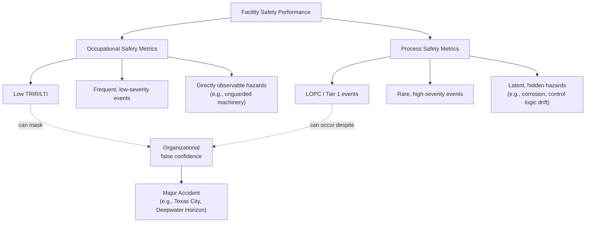

## Defining Process Safety versus Occupational Safety

### Overview

Process Safety Management (PSM) and Occupational Safety (OS) are two distinct but complementary disciplines within industrial safety. Confusing the two—or assuming strong occupational safety performance implies strong process safety performance—is a well-documented root cause of catastrophic industrial incidents.

**Key Points**

- Process Safety focuses on preventing the uncontrolled release of hazardous materials or energy that can cause major accidents (fires, explosions, toxic releases).
- Occupational Safety focuses on preventing injuries to individual workers from everyday workplace hazards (slips, falls, struck-by incidents, ergonomic injuries).
- The two use different metrics, different leading/lagging indicators, and different organizational ownership structures.
- Excellent occupational safety records (low injury rates) can coexist with poor process safety performance, and vice versa—this is the "safety paradox" observed in incidents like BP Texas City (2005) and Deepwater Horizon (2010).

### Core Definitions

#### Process Safety

Process Safety is a disciplined framework for managing the integrity of operating systems and processes handling hazardous substances by applying good design principles, engineering, and operating practices. It deals with the prevention and control of incidents that have the potential to release hazardous materials or energy.

**Scope of Process Safety:**

- Chemical reactivity hazards
- Equipment integrity (pressure vessels, piping, relief systems)
- Process control systems and safety instrumented systems (SIS)
- Management of change (MOC)
- Process hazard analysis (PHA)
- Emergency shutdown systems
- Human factors in complex system operation

#### Occupational Safety

Occupational Safety (also called personal safety or worker safety) is the discipline concerned with protecting individual employees from hazards that could cause personal injury or illness during the course of their normal work activities.

**Scope of Occupational Safety:**

- Slips, trips, and falls
- Personal protective equipment (PPE)
- Lockout/Tagout (LOTO) for individual equipment servicing
- Manual handling and ergonomics
- Vehicle and traffic safety on-site
- Electrical safety (shock hazards to individuals)
- Confined space entry (individual worker protocols)

### Comparative Analysis

| Dimension | Process Safety | Occupational Safety |
| --- | --- | --- |
| **Primary concern** | Loss of containment of hazardous material/energy | Injury to an individual worker |
| **Consequence scale** | Potentially catastrophic, multiple fatalities, community impact | Typically limited to the individual(s) involved |
| **Typical hazards** | Reactive chemistry, overpressure, corrosion, equipment failure | Falls, cuts, strains, vehicle incidents |
| **Lagging indicators** | Loss of Primary Containment (LOPC) events, Tier 1/Tier 2 incidents (per API RP 754) | Total Recordable Incident Rate (TRIR), Lost Time Injury (LTI) |
| **Leading indicators** | % of PHA action items closed, inspection/test/preventive maintenance (ITPM) completion, MOC backlog | Safety observations, near-miss reporting, training completion |
| **Regulatory anchor (US)** | OSHA 29 CFR 1910.119 (PSM), EPA RMP 40 CFR 68 | OSHA General Duty Clause, 1910 Subpart D/I/etc. |
| **Typical owner** | Process/mechanical/chemical engineering, operations | EHS/Safety department, line supervisors |
| **Failure signature** | Low-frequency, high-consequence ("black swan") | Higher-frequency, lower-consequence |

### The Safety Paradox

[Inference] The term "safety paradox" is used informally in the industry literature to describe organizations that achieve excellent personal injury statistics (e.g., zero LTIs for years) while simultaneously experiencing a major process safety event.

This occurs because:

1. **Different causal pathways** — A worker slipping on a wet floor and a pressure vessel rupturing are governed by entirely different failure mechanisms.
2. **Metric masking** — TRIR and LTI rates are driven by high-frequency, low-severity events. A facility can suppress these through behavior-based programs (e.g., discouraging injury reporting) while process safety systems silently degrade.
3. **Attention allocation** — Visible, frequent personal injuries draw management attention; rare, latent process hazards (corrosion under insulation, aging relief valves) do not trigger the same response until they fail.
4. **Barrier degradation is invisible** — Occupational hazards are often directly observable (an unguarded machine). Process safety barriers (metallurgy, instrumentation logic, procedural safeguards) degrade silently over time.

### Illustrative Example

**Scenario:** A refinery unit reports zero recordable injuries for three consecutive years.

- **Occupational Safety view:** Excellent performance — workers are following PPE requirements, housekeeping is good, and near-miss reporting for slips/trips is proactive.
- **Process Safety view (independent assessment):** A PHA revalidation is 18 months overdue, three relief valves have exceeded their inspection interval, and a management-of-change record shows a bypass of a high-pressure interlock during a debottlenecking project that was never formally closed out.

**Conclusion:** The facility's occupational safety program is functioning well, but its process safety barriers have degraded without detection because the two systems are tracked, resourced, and reported separately.

### Regulatory and Standards Distinction

- **OSHA PSM Standard (29 CFR 1910.119)** applies specifically to processes involving threshold quantities of highly hazardous chemicals and covers 14 elements (PHA, MOC, mechanical integrity, etc.)—this is process safety codified into regulation.
- **General OSHA standards** (walking-working surfaces, PPE, hazard communication, machine guarding) constitute the regulatory backbone of occupational safety.
- **CCPS (Center for Chemical Process Safety)** publishes the Risk Based Process Safety (RBPS) framework as the leading industry guidance for process safety management systems, distinct from occupational safety management systems (e.g., ISO 45001).
- **API RP 754** establishes process safety performance indicators (Tier 1–4) specifically to prevent the metric-conflation problem described above.

### Why the Distinction Matters Practically

1. **Resource allocation** — Underinvesting in process safety because occupational metrics look good is a recurring root cause in incident investigations (CSB reports on Texas City, BP Grangemouth, others).
2. **Leadership reporting** — Boards and executives require separate visibility into both metric families; blending them into a single "safety score" obscures risk.
3. **Competency requirements** — Process safety requires engineering and chemical process expertise; occupational safety requires behavioral, ergonomic, and industrial hygiene expertise. Different training and staffing implications follow.
4. **Audit and assurance design** — Process safety audits examine engineering documentation, equipment integrity records, and barrier status; occupational safety audits examine behaviors, PPE compliance, and workplace conditions.

**Next Topics**

- **Related Topics**
  - History of Major Process Safety Incidents (Bhopal, Piper Alpha, Texas City, Deepwater Horizon)
  - The 14 Elements of OSHA PSM (29 CFR 1910.119)
  - CCPS Risk Based Process Safety (RBPS) Framework
  - Process Safety Performance Indicators per API RP 754 (Tier 1–4)
  - Leading vs. Lagging Indicators in Safety Management
  - Introduction to Management of Change (MOC)