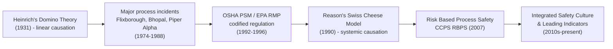
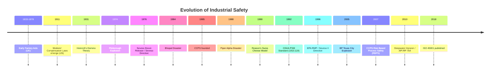

## History and Evolution of Industrial Safety

### Overview

Industrial safety has evolved through distinct eras, each shaped by major disasters, emerging science, and shifting regulatory philosophy. Understanding this evolution clarifies why modern process safety management exists as a discipline separate from general occupational safety, and why current frameworks (PSM, RBPS, ISO 45001) look the way they do.

### Era 1: Pre-Regulatory Industrial Period (Late 1800s – 1930s)

**Key Points**

- Industrial safety was largely absent as a formal discipline; injuries and fatalities were treated as an inherent cost of production.
- Early factory acts (UK Factory Act 1833, 1844, 1878) focused narrowly on child labor and machine guarding, not systemic hazard management.
- Workers' compensation laws (e.g., US state-level laws beginning ~1911) shifted liability but did little to drive proactive prevention.
- **Heinrich's Domino Theory (1931)** — H.W. Heinrich proposed that accidents result from a sequential chain of factors (social environment → fault of person → unsafe act/condition → accident → injury), and that removing any one "domino" prevents the injury. This became the foundational model for accident causation for decades.

[Inference] Heinrich's original injury-ratio claims (his famous "300-29-1" pyramid) have since been widely criticized as based on unverifiable data, though the domino/causal-chain concept remained influential.

### Era 2: Emergence of Systematic Occupational Safety (1930s – 1960s)

**Key Points**

- Focus remained almost entirely on personal/occupational injury prevention — guarding, PPE, housekeeping.
- Safety engineering became a recognized profession; the National Safety Council (US, founded 1913) and similar bodies expanded influence.
- Behavior-based approaches emerged, framing most accidents as caused by "unsafe acts" of workers rather than systemic/design deficiencies — a framing later seen as incomplete when applied to complex process hazards.

### Era 3: Birth of Modern Process Safety (1970s – 1980s)

This era is defined by catastrophic chemical process incidents that exposed the inadequacy of occupational-safety-only thinking for complex hazardous processes.

**Landmark Incidents**

| Incident | Year | Location | Significance |
| --- | --- | --- | --- |
| Flixborough explosion | 1974 | UK | Cyclohexane vapor cloud explosion; exposed dangers of unreviewed process modifications (precursor to Management of Change) |
| Seveso dioxin release | 1976 | Italy | Triggered EU "Seveso Directive" — first major regulatory framework for major-accident hazards |
| Three Mile Island | 1979 | USA | Nuclear (not chemical), but pivotal in advancing human factors and control room design thinking |
| Bhopal disaster | 1984 | India | Methyl isocyanate release killed thousands; the single most influential event in process safety history, directly catalyzing CCPS formation and OSHA PSM |
| Piper Alpha | 1988 | UK North Sea | Offshore platform explosion, 167 deaths; drove the UK's shift to "safety case" regulatory regimes |

**Key Points**

- These incidents demonstrated that excellent occupational safety performance (low injury rates) provided no protection against catastrophic, low-frequency, high-consequence events.
- The **Center for Chemical Process Safety (CCPS)** was founded in 1985 by AIChE directly in response to Bhopal, formalizing "process safety" as a distinct engineering discipline.
- Regulatory bodies began distinguishing "major accident hazards" from routine occupational hazards for the first time.

### Era 4: Regulatory Codification (Late 1980s – 1990s)

**Key Points**

- **OSHA Process Safety Management Standard (29 CFR 1910.119)** — promulgated in 1992 in direct response to Bhopal and a subsequent incident at Phillips 66 Pasadena (1989); codified 14 elements including PHA, MOC, mechanical integrity, and incident investigation.
- **EPA Risk Management Program (RMP, 40 CFR 68)** — issued 1996, requiring offsite consequence analysis for facilities handling regulated chemicals.
- **UK Safety Case Regime** — post-Piper Alpha, shifted offshore regulation from prescriptive rule-following to demonstrating a documented, holistic safety case.
- **Seveso II Directive (1996, EU)** — expanded on Seveso I with quantitative risk assessment requirements and land-use planning controls.

### Era 5: Systems Thinking and Human Factors (1990s – 2000s)

**Key Points**

- Accident causation models evolved beyond Heinrich's linear domino theory toward systemic models:
  - **James Reason's "Swiss Cheese Model" (1990)** — accidents occur when weaknesses ("holes") in multiple layered defenses align, rather than from a single root cause.
  - Growing recognition of "latent conditions" (organizational/design weaknesses) versus "active failures" (immediate errors).
- Human factors and safety culture became central themes, influenced heavily by high-reliability organization (HRO) theory from aviation and nuclear industries.

### Era 6: Risk-Based and Performance-Based Management (2000s – 2010s)

**Key Points**

- **CCPS Risk Based Process Safety (RBPS) framework (2007)** — reorganized process safety into 20 elements across four pillars (Commit to Process Safety, Understand Hazards and Risk, Manage Risk, Learn from Experience), replacing a purely compliance-driven approach with a risk-prioritized one.
- **API RP 754 (2010, revised 2021)** — established standardized Tier 1–4 process safety performance indicators specifically to prevent the "safety paradox" of good occupational metrics masking poor process safety.
- **BP Texas City refinery explosion (2005)** and **Deepwater Horizon (2010)** reinforced the same lesson as Bhopal a generation earlier: strong occupational safety records (Texas City had excellent injury statistics) can coexist with catastrophic process safety failure.
- **US Chemical Safety Board (CSB)** investigations from this period became widely used case studies embedding the process-vs-occupational distinction into industry training.

### Era 7: Integrated and Culture-Based Safety Management (2010s – Present)

**Key Points**

- Growing emphasis on **safety culture** and **leading indicators** rather than purely lagging (after-the-fact) metrics.
- **ISO 45001 (2018)** replaced OHSAS 18001 as the international occupational health and safety management systems standard, formally distinguishing OH&S management systems from process safety frameworks like RBPS.
- Digitalization trends: real-time process monitoring, predictive maintenance, and data analytics increasingly integrated into mechanical integrity and PHA revalidation programs. [Inference] The pace and maturity of this digital integration vary significantly by industry sector and region, and specific tool adoption rates are not well-documented in a standardized way.
- Increasing integration of human factors, organizational psychology, and "Safety-II" thinking (focusing on why things go right, not just why they go wrong — Erik Hollnagel's work) into mainstream process safety practice.

### Summary Timeline

**Conclusion**

The history of industrial safety shows a clear trajectory: from informal, reactive occupational injury management, through catastrophic process incidents that exposed the limits of that approach, to today's risk-based, systems-oriented, and culturally-integrated management frameworks. Each major disaster acted as a forcing function for regulatory and conceptual advancement, and the persistent recurrence of the "safety paradox" (Bhopal, Texas City, Deepwater Horizon) underscores why process safety and occupational safety must be managed as distinct, parallel disciplines rather than a single unified "safety" metric.

**Related Topics**

- Heinrich's Domino Theory vs. Reason's Swiss Cheese Model
- Case Study: Bhopal Disaster and Its Regulatory Legacy
- Case Study: BP Texas City Refinery Explosion (2005)
- CCPS Risk Based Process Safety (RBPS) 20-Element Framework
- Safety-I vs. Safety-II Thinking (Hollnagel)
- Evolution of Regulatory Regimes: Prescriptive vs. Safety Case Approaches