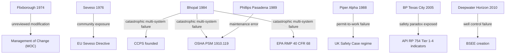

## Major Industrial Disasters and Their Influence on Regulation

### Overview

Virtually every major process safety regulation in force today can be traced to a specific catastrophic incident. This case-based causality is a defining feature of process safety regulation, distinguishing it from occupational safety rulemaking, which tends to evolve more incrementally. This document examines the principal disasters and the direct regulatory and standards responses each produced.

### Flixborough Explosion (1974, UK)

**Key Points**

- A temporary bypass pipe, installed to replace a reactor removed for inspection, was not engineered to the same standard as the original process piping and was never subjected to formal design review.
- The bypass failed, releasing approximately 30 tonnes of cyclohexane, which formed a vapor cloud that ignited, killing 28 people and causing extensive destruction of the site.
- **Regulatory influence:** Directly catalyzed the concept of formal **Management of Change (MOC)** — the principle that any modification to a process, however apparently minor, requires documented engineering review, hazard assessment, and authorization before implementation. MOC later became a core element of both CCPS RBPS and OSHA PSM.

### Seveso Dioxin Release (1976, Italy)

**Key Points**

- A runaway exothermic reaction in a trichlorophenol reactor released a cloud containing dioxin (TCDD) over a populated area near Seveso, Italy, causing widespread contamination and long-term health effects.
- **Regulatory influence:** Directly produced the **Seveso Directive (1982, "Seveso I")**, the European Union's first comprehensive major-accident hazard regulation. It required facilities holding threshold quantities of dangerous substances to identify hazards, adopt safety policies, and inform local authorities and the public.
- Later revised as **Seveso II (1996)** and **Seveso III (2012)**, progressively expanding scope to include quantitative risk assessment, land-use planning, and domino-effect analysis between neighboring facilities.

### Bhopal Disaster (1984, India)

**Key Points**

- A Union Carbide pesticide plant released approximately 40 tonnes of methyl isocyanate (MIC) gas following water ingress into a storage tank, triggering a runaway reaction. Estimates of resulting deaths range from roughly 3,800 (official immediate toll) to over 15,000–20,000 including long-term effects. [Unverified: exact fatality figures remain disputed across sources.]
- Contributing factors included inoperative safety systems (refrigeration unit shut down, gas scrubber undersized, flare tower out of service), inadequate maintenance, and insufficient emergency response planning for the surrounding community.
- **Regulatory influence:** The single most consequential process safety event in modern history.
  - Directly led to the founding of the **Center for Chemical Process Safety (CCPS)** in 1985 by AIChE.
  - Catalyzed the US **Emergency Planning and Community Right-to-Know Act (EPCRA, 1986)**.
  - Directly informed the drafting of **OSHA's Process Safety Management standard (29 CFR 1910.119, 1992)**.
  - Influenced the **EPA Risk Management Program (40 CFR 68, 1996)**, particularly its emphasis on offsite consequence analysis for community protection.

### Piper Alpha Disaster (1988, UK North Sea)

**Key Points**

- A gas condensate leak on the Piper Alpha offshore platform ignited following a maintenance permit-to-work failure (a safety valve had been removed for maintenance, but the corresponding pump was restarted by a different shift unaware of the ongoing work). The resulting explosion and subsequent fires destroyed the platform and killed 167 workers, the deadliest offshore oil disaster in history.
- The subsequent **Cullen Inquiry** (led by Lord Cullen) identified deficiencies in permit-to-work systems, emergency shutdown design, and regulatory oversight structure.
- **Regulatory influence:** Directly produced the UK's shift from prescriptive, rule-based offshore regulation to the **"Safety Case" regime**, requiring operators to proactively demonstrate — through a comprehensive documented safety case — that major hazards have been identified and risks reduced to as low as reasonably practicable (ALARP). This model was subsequently adopted, in varying forms, by Australia, Norway, and other offshore regulatory jurisdictions.

### Phillips 66 Pasadena Explosion (1989, USA)

**Key Points**

- A polyethylene plant explosion, triggered by a maintenance procedure error involving a double block-and-bleed valve system left in an unsafe configuration, killed 23 workers.
- **Regulatory influence:** Occurring shortly before OSHA's PSM rulemaking was finalized, this incident is widely cited [Inference] as reinforcing the urgency and final scope of the 1992 PSM standard, particularly its emphasis on mechanical integrity and safe work practices for maintenance activities.

### BP Texas City Refinery Explosion (2005, USA)

**Key Points**

- Overfilling of an isomerization unit raffinate splitter tower during startup led to liquid overflow through a blowdown stack vented to atmosphere (rather than a flare), creating a vapor cloud that ignited, killing 15 workers and injuring over 170.
- The **CSB investigation** and the independent **Baker Panel** review found that the refinery had excellent occupational (personal) safety statistics at the time of the incident, while process safety systems — aging equipment, understaffing, bypassed alarms, inadequate process safety culture — had severely degraded. This incident became the canonical case study for the "safety paradox" distinction between process and occupational safety.
- **Regulatory influence:** Directly accelerated development of **API RP 754 (2010)**, which established standardized Tier 1–4 process safety performance indicators specifically so that process safety performance could be measured and reported independently of occupational injury metrics.

### Deepwater Horizon Disaster (2010, Gulf of Mexico)

**Key Points**

- A blowout during well completion operations on the Macondo well, following failure of the cement barrier and blowout preventer (BOP), caused an explosion killing 11 workers and resulted in the largest accidental marine oil spill in history.
- Like Texas City, the rig had a strong occupational safety record prior to the incident, again illustrating the safety paradox.
- **Regulatory influence:** Led to a major restructuring of US offshore regulation, including the dissolution of the Minerals Management Service (MMS) and creation of the **Bureau of Safety and Environmental Enforcement (BSEE)**, alongside new well-control and blowout preventer regulations.

### Comparative Regulatory Impact Table

| Disaster | Year | Key Failure Mode | Primary Regulatory/Standards Outcome |
| --- | --- | --- | --- |
| Flixborough | 1974 | Unreviewed process modification | Management of Change (MOC) principle |
| Seveso | 1976 | Uncontrolled runaway reaction | EU Seveso Directive (I, II, III) |
| Bhopal | 1984 | Multiple safety system failures + community exposure | CCPS founded; OSHA PSM; EPA RMP; EPCRA |
| Piper Alpha | 1988 | Permit-to-work failure, poor emergency design | UK Safety Case regime |
| Phillips Pasadena | 1989 | Maintenance procedure/valve error | Reinforced OSHA PSM scope (mechanical integrity, safe work practices) |
| BP Texas City | 2005 | Degraded process safety masked by good occupational metrics | API RP 754 (Tier 1-4 indicators) |
| Deepwater Horizon | 2010 | Well control/BOP failure | BSEE creation; offshore well-control rules |

### Cross-Cutting Regulatory Themes

**Key Points**

1. **Reactive rather than purely proactive rulemaking** — nearly all major process safety regulations followed, rather than preceded, a catastrophic loss event.
2. **Recurring root cause categories** across disasters: inadequate management of change, degraded mechanical integrity, permit-to-work/maintenance coordination failures, and organizational complacency during periods of good occupational safety performance.
3. **Progressive shift in regulatory philosophy** — from prescriptive rule-following (early factory acts, initial PSM) toward performance/risk-based frameworks (Safety Case, RBPS) that require organizations to demonstrate active hazard understanding rather than simple compliance checklists.
4. **International regulatory convergence** — while jurisdictions differ (OSHA/EPA in the US, Seveso Directives in the EU, Safety Case in the UK/Australia/Norway), the underlying element sets (hazard identification, MOC, mechanical integrity, emergency response, incident investigation) show substantial overlap, reflecting shared lessons from the same disasters.

**Conclusion**

The regulatory architecture of modern process safety management is not the product of abstract theorizing but a direct, traceable response to specific catastrophic failures. Each major disaster exposed a distinct systemic gap — unreviewed modifications (Flixborough), inadequate community protection (Seveso), cascading safety system failures (Bhopal), maintenance coordination breakdowns (Piper Alpha, Phillips Pasadena), and the masking effect of strong occupational metrics (Texas City, Deepwater Horizon) — and each gap was subsequently codified into standards or regulation. Understanding this disaster-to-regulation lineage is essential for interpreting *why* current PSM elements exist in their specific form, not merely *what* they require.

**Related Topics**

- Management of Change (MOC): Principles and Implementation
- OSHA PSM 14 Elements: Detailed Breakdown
- The Seveso Directives: Evolution from I to III
- UK Safety Case Regime vs. US Prescriptive Regulation
- API RP 754: Process Safety Performance Indicators
- Root Cause Analysis Methodologies in Incident Investigation