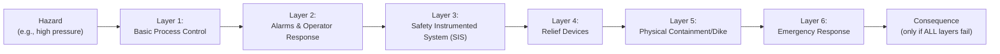

## Key Terminology and Concepts

### Overview

This reference establishes the core vocabulary used throughout process safety and occupational safety practice. Precise use of these terms is essential, as regulatory text, incident investigations, and technical standards assign specific, often non-interchangeable meanings to terms that appear similar in casual usage (e.g., "hazard" vs. "risk," "incident" vs. "accident").

### Foundational Hazard and Risk Terms

**Hazard**

A source of potential harm or a condition with the potential to cause an undesirable consequence — e.g., a flammable liquid, a pressurized vessel, an elevated walking surface. A hazard exists independent of whether harm actually occurs.

**Risk**

The combination of the likelihood (probability/frequency) of a hazardous event occurring and the severity of its consequences. Commonly expressed conceptually as:

$$Risk = Likelihood \times Consequence$$

**Key Points**

- Hazard is a property of the system; risk is a function of both the hazard and the circumstances of exposure.
- Eliminating a hazard reduces risk to zero for that specific hazard; merely reducing likelihood or consequence reduces but does not eliminate risk.

**Loss of Containment (LOC) / Loss of Primary Containment (LOPC)**

An unplanned or uncontrolled release of material from primary containment (piping, vessels, tanks) — the central concept underlying most process safety metrics (per API RP 754).

**Major Accident Hazard (MAH)**

A hazard with the potential to cause a major accident — typically defined regulatorily (e.g., under Seveso Directives) as an event causing serious danger to human health or the environment, immediately or with delay, arising from uncontrolled developments during an industrial activity.

### Incident Classification Terminology

**Incident**

A general term for an unplanned event that did or could have resulted in injury, illness, or damage. Used as an umbrella term encompassing accidents and near misses.

**Accident**

An unplanned event that results in actual injury, illness, environmental damage, or property/asset loss.

**Near Miss (or "Close Call")**

An unplanned event that did *not* result in injury, illness, or damage, but had the potential to do so under slightly different circumstances. Near-miss reporting is a critical leading indicator in both process and occupational safety programs.

**Key Points**

- The relationship between near misses, incidents, and accidents is often depicted using the "iceberg" or "pyramid" model (originating conceptually from Heinrich's ratios), illustrating that many more near misses and minor events occur for every major accident.
- [Inference] While the specific numeric ratios in Heinrich's original pyramid (300:29:1) have been widely criticized as unverifiable, the qualitative structural insight — that minor events and near misses vastly outnumber major accidents — remains broadly accepted as directionally valid.

### Barrier and Layer Concepts

**Safeguard / Barrier**

Any device, system, or action that prevents, controls, or mitigates undesired events. Barriers can be physical (relief valves, containment), procedural (permits, checklists), or human (trained operator response).

**Layers of Protection (LOP)**

The concept that multiple independent barriers are stacked between a hazard and a potential consequence, such that failure of any single layer does not by itself result in an incident. This underlies **Layer of Protection Analysis (LOPA)**, a semi-quantitative risk assessment methodology.

**Safety Instrumented System (SIS)**

An engineered system of sensors, logic solvers, and final control elements designed to bring a process to a safe state when predetermined conditions are violated, independent of the basic process control system (BPCS).

**Safety Integrity Level (SIL)**

A discrete quantitative measure (SIL 1–4, per IEC 61511) of the reliability/performance required of a safety instrumented function, based on probability of failure on demand.

### Process Safety-Specific Terms

**Process Hazard Analysis (PHA)**

A systematic, organized effort to identify and analyze the significance of potential hazards associated with the processing or handling of hazardous materials. Common methodologies include HAZOP (Hazard and Operability Study), What-If Analysis, and Fault Tree Analysis.

**Management of Change (MOC)**

A formal, documented process for reviewing and authorizing changes to process technology, equipment, procedures, or personnel before implementation, to ensure new hazards are not inadvertently introduced.

**Mechanical Integrity (MI)**

The element of process safety management ensuring that equipment is designed, installed, and maintained to operate safely throughout its intended lifecycle — covering inspection, testing, and preventive maintenance of pressure vessels, piping, relief systems, and safety-critical instrumentation.

**Pre-Startup Safety Review (PSSR)**

A confirmation review conducted before introducing hazardous materials into a new or modified process, verifying construction matches design specifications and that safety, operating, and emergency procedures are in place.

**Highly Hazardous Chemical (HHC)**

A chemical possessing toxic, reactive, flammable, or explosive properties, specifically listed (in the US context) under Appendix A of OSHA's PSM standard, or exceeding regulatory threshold quantities.

### Occupational Safety-Specific Terms

**Lockout/Tagout (LOTO)**

A procedure for ensuring that hazardous energy sources are isolated and rendered inoperative before maintenance or servicing work begins on equipment, protecting individual workers from unexpected energization.

**Personal Protective Equipment (PPE)**

Equipment worn by an individual to minimize exposure to specific workplace hazards (e.g., respirators, hard hats, safety glasses, hearing protection).

**Total Recordable Incident Rate (TRIR)**

A standardized occupational safety lagging metric measuring the number of recordable injuries/illnesses per 200,000 hours worked (equivalent to 100 full-time workers over one year):

$$TRIR = \frac{Number\ of\ Recordable\ Incidents \times 200{,}000}{Total\ Hours\ Worked}$$

**Lost Time Injury (LTI)**

An injury resulting in the affected worker being unable to work for one or more scheduled shifts beyond the day of the injury.

### Indicator and Metric Terminology

**Leading Indicator**

A proactive, forward-looking metric that measures the presence or health of safety-critical activities before an incident occurs (e.g., percentage of PHA action items closed on schedule, overdue inspection backlog).

**Lagging Indicator**

A reactive metric that measures the outcome after an incident has already occurred (e.g., number of LOPC events, TRIR).

**Tier 1 / Tier 2 Process Safety Events (per API RP 754)**

A standardized classification of process safety incidents by severity:

- **Tier 1** — the most severe LOPC events, involving significant consequence thresholds (e.g., quantity released, injury, fire/explosion damage).
- **Tier 2** — less severe LOPC events that still represent a challenge to safety systems but below Tier 1 consequence thresholds.
- **Tier 3 / Tier 4** — challenges to safety system performance and operating discipline (near-miss and leading-indicator territory).

### Risk Tolerance and Reduction Concepts

**ALARP (As Low As Reasonably Practicable)**

A risk management principle, foundational to UK Safety Case regulation, requiring that risk be reduced to the point where further reduction would require costs (time, money, effort) grossly disproportionate to the benefit gained.

**Inherently Safer Design (ISD)**

A design philosophy that seeks to eliminate or reduce hazards at the source (e.g., substituting a less hazardous chemical, reducing inventory) rather than relying solely on added-on control layers. Often summarized by four strategies: *Minimize, Substitute, Moderate, Simplify*.

**Key Points**

- ISD is philosophically distinct from "add-on" safety measures (like SIS or PPE), which control or mitigate a hazard rather than remove it.
- ISD is generally considered the most robust and durable form of risk reduction because it does not depend on a barrier continuing to function correctly.

### Terminology Comparison Table

| Term | Discipline | Definition Focus |
| --- | --- | --- |
| Hazard | Both | Potential source of harm |
| Risk | Both | Likelihood × Consequence |
| LOPC | Process Safety | Uncontrolled material/energy release |
| Near Miss | Both | Event with potential but no actual harm |
| LOTO | Occupational Safety | Individual equipment energy isolation |
| MOC | Process Safety | Formal review of process changes |
| TRIR | Occupational Safety | Injury rate per 200,000 hours |
| Tier 1/2 Events | Process Safety | Severity-classified LOPC events |
| ALARP | Both (esp. Safety Case) | Risk reduced to practicable minimum |
| ISD | Process Safety | Hazard elimination at design stage |

**Conclusion**

These terms form the shared vocabulary that underpins process hazard analysis, incident investigation, regulatory compliance, and performance measurement across the field. Precise, consistent use — particularly distinguishing hazard from risk, and process safety metrics (LOPC, Tier 1/2) from occupational metrics (TRIR, LTI) — is a prerequisite for accurately interpreting standards, investigation reports, and performance data throughout the remainder of this curriculum.

**Related Topics**

- Layer of Protection Analysis (LOPA) Methodology
- HAZOP: Structured Hazard and Operability Studies
- Inherently Safer Design: The Four Core Strategies
- API RP 754 Tier Classification in Depth
- ALARP and Risk Tolerance Criteria (UK vs. US Approaches)
- Safety Instrumented Systems and IEC 61511 Compliance