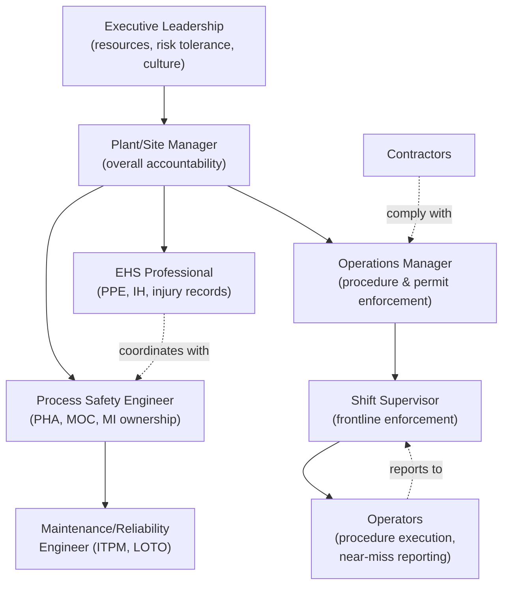

## Roles and Responsibilities in a Safety Organization

### Overview

Effective process and occupational safety management depends on clearly defined roles distributed across organizational levels — from executive leadership down to individual operators and contractors. Ambiguity in role ownership is a recurring root cause identified in major incident investigations (e.g., unclear accountability for interlock bypass authorization at BP Texas City). This reference maps the principal roles, their scope, and how process safety and occupational safety responsibilities differ in ownership structure.

### Organizational Levels Overview

**Key Points**

- Safety responsibility is not concentrated in a single "safety department" — it is distributed and layered, with the safety/EHS function typically playing an advisory, auditing, and program-management role rather than sole ownership of risk.
- Process safety ownership sits predominantly with engineering and operations leadership, since it requires deep technical understanding of the specific process; occupational safety ownership is more broadly distributed across all line supervision.
- CCPS's Risk Based Process Safety framework explicitly identifies "Process Safety Culture" and "Compliance with Standards" as leadership-owned elements, reflecting the principle that safety accountability cannot be fully delegated downward.

### Executive and Senior Leadership

**Responsibilities**

- Establish and visibly commit to a process safety culture (CCPS RBPS Pillar: "Commit to Process Safety").
- Allocate sufficient resources (staffing, capital, training budget) to safety-critical systems — including maintenance backlogs, inspection programs, and PHA revalidation.
- Set organizational risk tolerance criteria and ALARP decision-making frameworks.
- Ensure process safety performance indicators (Tier 1–4 per API RP 754) are reported to the board/executive level independently from occupational injury statistics, preventing the "safety paradox" of good occupational metrics masking process safety degradation.
- Hold line management accountable for closing PHA action items, MOC backlogs, and audit findings.

[Inference] Investigations into major incidents such as BP Texas City and Deepwater Horizon have been widely interpreted as identifying insufficient senior leadership engagement with process safety indicators (as opposed to occupational indicators) as a contributing organizational factor, though the specific weighting of this factor varies across different published analyses.

### Plant/Site Manager

**Responsibilities**

- Overall accountability for both process safety and occupational safety performance at the facility level.
- Ensures PSM program elements (PHA, MOC, MI, PSSR, incident investigation, etc.) are resourced and functioning, not merely documented.
- Chairs or delegates chairing of major incident investigation review boards.
- Balances production pressure against safety-critical maintenance and shutdown decisions — a frequently cited tension in incident root-cause analyses.

### Process Safety Engineer / Process Safety Manager

**Responsibilities**

- Owns and facilitates Process Hazard Analyses (HAZOP, What-If, LOPA) and ensures recommendations are tracked to closure.
- Manages the Management of Change (MOC) program, reviewing proposed changes for hazard introduction.
- Oversees mechanical integrity program scope, coordinating with maintenance/reliability engineering on inspection intervals for pressure vessels, piping, and relief systems.
- Tracks and reports process safety performance indicators (Tier 1–4).
- Serves as the technical authority on safety instrumented systems (SIS) integrity levels (SIL) and their required testing intervals.

**Key Points**

- This role is engineering-credentialed and process-specific — a process safety engineer for a refinery isomerization unit requires different technical depth than one supporting a batch chemical reactor.
- Distinct from the occupational safety/EHS role in required technical background: process safety roles typically require chemical, mechanical, or process engineering degrees; occupational safety roles typically draw from industrial hygiene, safety science, or EHS-specific credentials (e.g., CSP — Certified Safety Professional).

### Operations Manager / Shift Supervisor

**Responsibilities**

- Ensures operating procedures are followed and kept current; authorizes deviations only through approved MOC channels.
- Enforces permit-to-work systems (hot work, confined space entry, LOTO) at the shift level — a role directly implicated in the Piper Alpha investigation, where permit-to-work coordination between shifts failed.
- First-line accountability for both occupational hazard control (housekeeping, PPE compliance) and operational discipline supporting process safety (correct valve lineups, startup/shutdown procedure adherence).

### Maintenance/Reliability Engineer

**Responsibilities**

- Executes mechanical integrity program: inspection, testing, and preventive maintenance (ITPM) of safety-critical equipment.
- Coordinates lockout/tagout for equipment being serviced, protecting individual maintenance workers (occupational safety function).
- Provides equipment condition data feeding into process safety leading indicators (e.g., overdue inspection backlog, relief valve test compliance).

### EHS (Environmental, Health & Safety) Department / Occupational Safety Professional

**Responsibilities**

- Manages occupational safety programs: PPE selection and compliance, industrial hygiene monitoring, ergonomics assessments, incident/injury recordkeeping (OSHA 300 logs), and occupational health surveillance.
- Facilitates safety observation and near-miss reporting programs.
- Often also administers environmental compliance (emissions, waste) alongside occupational safety, though this varies by organization.
- Provides safety training coordination, though process-specific technical training (e.g., HAZOP methodology) is typically delivered jointly with process safety engineering.

**Key Points**

- EHS departments frequently sit organizationally separate from process safety engineering — a structural split that, if not actively bridged through joint reporting and shared leadership review, can itself contribute to the safety paradox described in the Texas City investigation.
- Some organizations have moved toward integrated "Process Safety and Risk Management" functions that report both process and occupational metrics through a single organizational channel, explicitly to counter this fragmentation risk. [Inference] The prevalence of this integrated structure across industry as a whole is not well-quantified in publicly available literature.

### Operators / Frontline Workers

**Responsibilities**

- Execute operating procedures accurately and report deviations.
- Participate in near-miss reporting and safety observation programs (both process and occupational).
- Comply with individual protective measures: LOTO participation, PPE use, confined space entry protocols.
- Provide frontline input during PHA revalidations, given direct operational knowledge of process behavior.

### Contractors and Third Parties

**Responsibilities**

- Comply with host-site permit-to-work, LOTO, and PPE requirements.
- For contractors performing safety-critical maintenance (e.g., relief valve testing, vessel inspection), work is typically subject to the same mechanical integrity quality assurance requirements as in-house personnel.
- OSHA PSM explicitly addresses contractor safety as a distinct program element, given the elevated incident rates historically associated with contract labor during turnarounds and maintenance activities. [Inference] This elevated-risk association is a widely cited rationale in PSM guidance; specific current statistics vary by source and industry sector.

### Regulatory and External Roles

**Key Points**

- **Regulators** (OSHA, EPA in the US; HSE in the UK; equivalent bodies elsewhere) set minimum compliance requirements and conduct inspections/audits but do not own day-to-day risk management.
- **Independent/Third-Party Auditors** periodically assess PSM program conformance against standards (e.g., CCPS RBPS self-assessment tools) and provide external assurance beyond internal audit.
- **Employee/Worker Safety Committees** — in many jurisdictions, formal or informal worker representation bodies contribute to hazard identification and program review, particularly for occupational safety topics.

### Roles Comparison Table

| Role | Primary Discipline | Key Accountability |
| --- | --- | --- |
| Executive/Senior Leadership | Both | Resource allocation, risk tolerance, culture |
| Plant/Site Manager | Both | Overall site safety performance accountability |
| Process Safety Engineer | Process Safety | PHA, MOC, MI program ownership |
| Operations Manager/Shift Supervisor | Both | Procedure adherence, permit-to-work enforcement |
| Maintenance/Reliability Engineer | Both | ITPM execution, LOTO coordination |
| EHS Professional | Occupational Safety | PPE, industrial hygiene, injury recordkeeping |
| Operators | Both | Procedure execution, near-miss reporting |
| Contractors | Both | Compliance with host-site safety requirements |
| Regulators | Both | Compliance enforcement, minimum standards |

### Common Role-Related Failure Patterns

**Key Points**

1. **Diffusion of accountability** — when process safety responsibility is assumed to belong to "the safety department" rather than line engineering/operations, technical ownership gaps emerge (a pattern identified across multiple CSB investigations).
2. **Shift handover failures** — as in Piper Alpha, incomplete communication of permit-to-work status between shifts remains a recurring failure mode requiring explicit procedural controls.
3. **Contractor oversight gaps** — inconsistent enforcement of host-site safety standards on contract labor, particularly during turnarounds and major maintenance campaigns.
4. **Reporting structure fragmentation** — when process safety metrics and occupational safety metrics report through entirely separate management chains to leadership, cross-cutting risk signals can be missed.

**Conclusion**

Effective safety organizations distribute responsibility deliberately across leadership, technical, operational, and frontline roles, with explicit accountability at each level rather than assuming a centralized "safety department" bears sole ownership. Process safety roles skew toward engineering ownership given their technical specificity, while occupational safety responsibility is more broadly distributed across all supervisory levels. Recurring incident investigation findings — diffused accountability, shift handover breakdowns, contractor oversight gaps, and fragmented reporting — consistently point back to role clarity and cross-functional coordination as foundational safety management requirements.

**Related Topics**

- Process Safety Culture: CCPS RBPS Leadership Pillar
- Permit-to-Work Systems and Shift Handover Protocols
- Contractor Safety Management Programs
- Organizational Structures for Integrated Safety Reporting
- Competency and Training Requirements for Process Safety Roles
- Worker Participation and Safety Committee Structures