## OSHA Process Safety Management Standard 29 CFR 1910.119

### Overview

The OSHA Process Safety Management (PSM) standard, codified at 29 CFR 1910.119, is the principal US federal regulation governing the management of highly hazardous chemicals (HHCs) to prevent catastrophic releases. Promulgated in 1992 in direct response to the Bhopal disaster (1984) and the Phillips 66 Pasadena explosion (1989), it established 14 mandatory program elements that remain the structural foundation of process safety management practice in the United States and have influenced equivalent frameworks internationally.

### Scope and Applicability

**Key Points**

- Applies to processes involving a listed **highly hazardous chemical** at or above its specified threshold quantity, per **Appendix A** of the standard (a list of roughly 130+ specific chemicals with individual threshold quantities).
- Applies to processes involving a flammable liquid or gas on-site in one location in a quantity of **10,000 lbs (4,535.9 kg) or greater** (with certain exclusions, e.g., flammable liquids stored in atmospheric tanks below their boiling point without connection to a process).
- Also explicitly applies to certain processes regardless of chemical: those involving a Category 1 flammable gas or a flammable liquid with a flashpoint below 100°F used in specific manners covered by the standard.

**Exclusions**

- Retail facilities
- Oil or gas well drilling/servicing operations
- Normally unoccupied remote facilities
- Hydrocarbon fuels used solely as a fuel (if not part of a covered process, and not stored in a manner that could allow mixing with other regulated substances)

### The 14 Elements of PSM

#### 1. Employee Participation

Requires employers to develop a written plan of action for employee participation and to consult with employees on the conduct of PHAs and other elements of the standard. Employees and their representatives must have access to PHAs and all other PSM information.

#### 2. Process Safety Information (PSI)

Employers must compile written information on:

- **Chemical hazard information** — toxicity, permissible exposure limits, physical/reactivity data, corrosivity, thermal/chemical stability, and hazardous effects of inadvertent mixing.
- **Process technology information** — block flow diagrams or process flow diagrams, process chemistry, maximum intended inventory, safe upper/lower limits for temperature/pressure/flow, and consequences of deviation.
- **Process equipment information** — materials of construction, P&IDs (piping and instrumentation diagrams), electrical classification, relief system design basis, ventilation system design, design codes/standards employed, material and energy balances, and safety systems.

#### 3. Process Hazard Analysis (PHA)

**Requirements**

- Must be conducted using one or more recognized methodologies: What-If, Checklist, What-If/Checklist, HAZOP, Failure Mode and Effects Analysis (FMEA), Fault Tree Analysis, or an appropriate equivalent methodology.
- Must address: hazards of the process; identification of any previous incident with catastrophic potential; engineering and administrative controls and their interrelationship; consequences of control failure; facility siting; human factors; qualitative evaluation of possible safety/health effects on employees from failure of controls.
- Must be performed by a team with expertise in engineering and process operations, including at least one employee with experience and knowledge specific to the process.
- **Revalidation requirement:** PHAs must be updated and revalidated at least every 5 years.

#### 4. Operating Procedures

Written operating procedures must be developed covering:

- Initial startup, normal operations, temporary operations, emergency shutdown, emergency operations, normal shutdown, and startup following a turnaround or emergency shutdown.
- Operating limits, safety and health considerations, and safety systems and their functions.
- Procedures must be readily accessible to employees and reviewed as often as necessary to ensure accuracy, certified annually.

#### 5. Training

- **Initial training** for employees involved in operating a process, covering an overview of the process and the operating procedures.
- **Refresher training** at least every 3 years (or more often if necessary).
- Employer must ascertain that the employee has received and understood the training.

#### 6. Contractors

Applies to contractors performing maintenance, repair, turnaround, major renovation, or specialty work on or adjacent to a covered process. Requires:

- Host employer to inform contract employers of known hazards and applicable safe work practices.
- Contract employer to train contract employees and document that training.
- Host employer to evaluate contractor safety performance and maintain injury/illness logs related to the contractor's work.

#### 7. Pre-Startup Safety Review (PSSR)

Required for new facilities and for modified facilities when the modification is significant enough to require a change in the process safety information. Must confirm:

- Construction and equipment are in accordance with design specifications.
- Safety, operating, maintenance, and emergency procedures are in place and adequate.
- A PHA has been performed for new facilities, and recommendations resolved/implemented before startup.
- Training of each employee involved in the process has been completed.

#### 8. Mechanical Integrity

Applies to specific equipment types: pressure vessels and storage tanks, piping systems (including valves), relief and vent systems, emergency shutdown systems, controls (including monitoring devices and sensors, alarms, interlocks), and pumps.

**Requirements**

- Written procedures for maintaining ongoing integrity.
- Training for employees involved in maintaining process integrity.
- Inspections and tests performed following recognized and generally accepted good engineering practices (RAGAGEP).
- Frequency of inspections/tests consistent with manufacturer recommendations and good engineering practice.
- Documentation of each inspection/test, including date, name of performer, serial number, description of work, and results.
- Correction of equipment deficiencies before further use or in a safe and timely manner.
- Quality assurance for new equipment construction and critical spare parts.

#### 9. Hot Work Permit

Requires a hot work permit (documenting the date, equipment location, and certification that fire prevention/protection requirements have been implemented) for hot work operations conducted on or near a covered process.

#### 10. Management of Change (MOC)

Requires written procedures to manage changes (except "replacement in kind") to process chemicals, technology, equipment, and procedures. Must address:

- The technical basis for the proposed change.
- Impact of the change on safety and health.
- Modifications to operating procedures.
- Necessary time period for the change.
- Authorization requirements for the proposed change.
- Employees whose jobs are affected must be informed of and trained in the change prior to startup.

#### 11. Incident Investigation

Requires investigation of each incident that resulted in, or could reasonably have resulted in, a catastrophic release of a highly hazardous chemical.

**Requirements**

- Investigation initiated within **48 hours** of the incident.
- Investigation team must include at least one person knowledgeable in the process involved, and other persons with appropriate knowledge and experience (including a contract employee if the incident involved contractor work).
- Written report covering: date of incident, date investigation began, description, contributing factors, and recommendations.
- Findings must be reviewed with affected personnel; reports retained for 5 years.

#### 12. Emergency Planning and Response

Requires an emergency action plan compliant with 29 CFR 1910.38, addressing procedures for small releases as well.

#### 13. Compliance Audits

**Requirements**

- Certification that the employer has evaluated compliance with PSM provisions at least every **3 years**.
- Audit conducted by at least one person knowledgeable in the process.
- Written report of findings; deficiencies documented and corrected; documentation of corrective actions retained.
- The two most recent compliance audit reports must be retained.

#### 14. Trade Secrets

Requires employers to make all information necessary for PSM compliance available to those who need it (PHA teams, employees, contractors), regardless of trade secret status, subject to appropriate confidentiality agreements.

```mermaid
flowchart TD
    A["1. Employee Participation"] --> N["PSM 14 Elements
(29 CFR 1910.119)"]
    B["2. Process Safety Information"] --> N
    C["3. Process Hazard Analysis"] --> N
    D["4. Operating Procedures"] --> N
    E["5. Training"] --> N
    F["6. Contractors"] --> N
    G["7. Pre-Startup Safety Review"] --> N
    H["8. Mechanical Integrity"] --> N
    I["9. Hot Work Permit"] --> N
    J["10. Management of Change"] --> N
    K["11. Incident Investigation"] --> N
    L["12. Emergency Planning & Response"] --> N
    M["13. Compliance Audits"] --> N
    O["14. Trade Secrets"] --> N
```

### Key Recurring Timeframes

| Element | Requirement | Frequency |
| --- | --- | --- |
| PHA | Revalidation | Every 5 years |
| Training | Refresher training | Every 3 years |
| Operating Procedures | Certification of accuracy | Annually |
| Compliance Audit | Program evaluation | Every 3 years |
| Incident Investigation | Investigation initiation | Within 48 hours |
| Incident Investigation Reports | Retention | 5 years |
| Compliance Audit Reports | Retention | 2 most recent reports |

### Enforcement and Interpretation

**Key Points**

- OSHA enforces PSM through the **National Emphasis Program (NEP) for PSM-covered chemical facilities**, involving targeted inspections at facilities handling HHCs above threshold quantities.
- OSHA frequently cites the **General Duty Clause (Section 5(a)(1))** in conjunction with, or independent of, PSM for hazards not explicitly enumerated but recognized as causing serious harm.
- Citations for PSM violations are commonly issued for deficiencies in mechanical integrity (inadequate inspection documentation), incomplete PHA action item closure, and inadequate MOC documentation — consistently ranking among OSHA's most-cited standards in the chemical/refining sector. [Inference] Specific annual citation rankings vary year to year; current figures should be verified against OSHA's published enforcement statistics.

### Relationship to Other Frameworks

**Key Points**

- **EPA Risk Management Program (40 CFR 68)** parallels PSM but focuses on offsite consequence analysis and community/environmental protection; many facilities are subject to both simultaneously, with substantial overlap in required elements (PHA, MOC, incident investigation).
- **CCPS Risk Based Process Safety (RBPS)** is a voluntary, non-regulatory framework with 20 elements that encompasses and extends beyond the 14 PSM elements, incorporating explicit culture, competency, and stakeholder-outreach elements not mandated by PSM.
- PSM is broadly considered the regulatory floor; RBPS and internal company programs typically exceed PSM's minimum requirements.

**Conclusion**

29 CFR 1910.119 remains the cornerstone of US chemical process safety regulation, translating the lessons of Bhopal and Phillips Pasadena into 14 specific, auditable program elements spanning the full process lifecycle — from initial hazard analysis and pre-startup review through ongoing mechanical integrity, change management, and incident investigation. Its element structure has directly shaped subsequent frameworks (EPA RMP, CCPS RBPS) and remains the primary compliance reference against which US process safety programs are measured.

**Related Topics**

- EPA Risk Management Program (40 CFR 68) in Detail
- HAZOP Methodology for Process Hazard Analysis
- Management of Change: Documentation and Approval Workflows
- Mechanical Integrity and RAGAGEP Requirements
- Incident Investigation Root Cause Methodologies
- CCPS Risk Based Process Safety: 20-Element Comparison to PSM