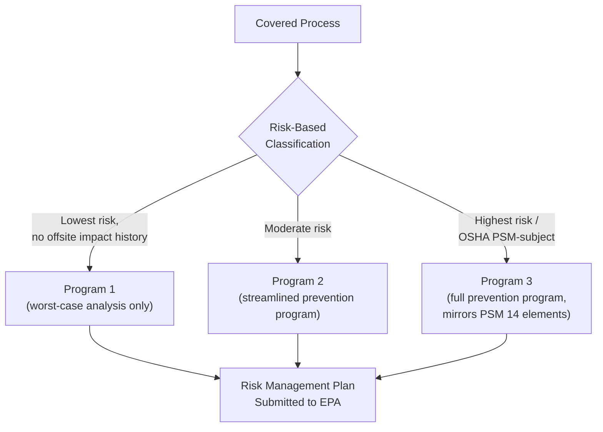

## EPA Risk Management Program 40 CFR Part 68

### Overview

The EPA Risk Management Program (RMP), codified at 40 CFR Part 68, implements Section 112(r) of the Clean Air Act and requires facilities holding regulated substances above threshold quantities to develop and submit a Risk Management Plan. While structurally parallel to OSHA's PSM standard, RMP's regulatory purpose centers on offsite consequence analysis and protection of surrounding communities and the environment, rather than solely worker protection — reflecting its origin in environmental rather than occupational safety law.

### Regulatory Basis and Applicability

**Key Points**

- Authorized under **Section 112(r) of the 1990 Clean Air Act Amendments**, the accidental release prevention provision.
- Applies to "stationary sources" holding a regulated substance (listed at **40 CFR 68.130**) above its threshold quantity.
- EPA has determined that over 11,740 facilities are impacted, spanning agricultural chemical distributors, chemical manufacturing, food and beverage manufacturing, oil and gas extraction, refrigeration and wastewater treatment, paper manufacturing, petroleum refining, electric generation, and water utilities. [Kmcllaw](https://www.kmcllaw.com/client-alert-epa-announces-risk-management-program-final-rule/)
- List of regulated substances includes both toxic and flammable chemicals, each with an individually specified threshold quantity — structurally analogous to OSHA PSM's Appendix A but not identical in chemical list or thresholds.

### Program Tiers

RMP classifies covered processes into three risk-based tiers, each with escalating requirements:

**Program 1**

- Lowest-risk processes: no history of specified accidents within the past 5 years, and worst-case release scenario analysis shows no offsite public receptor impact within the distance to a specified endpoint.
- Requires only a worst-case release scenario analysis, a 5-year accident history, and certification of no additional prevention program elements needed.

**Program 2**

- Moderate-risk processes not eligible for Program 1 or 3.
- Requires a streamlined prevention program: hazard review (rather than full PHA), operating procedures, training, maintenance, compliance audits, and incident investigation — generally less rigorous than Program 3/OSHA PSM.

**Program 3**

- Highest-risk processes, including those subject to OSHA PSM or classified under specific NAICS codes (e.g., petroleum refining, chemical manufacturing).
- Requires the full prevention program essentially mirroring OSHA PSM's 14 elements: PHA (not just hazard review), operating procedures, training, mechanical integrity, MOC, PSSR, compliance audits, incident investigation, employee participation, and hot work permits.

### Core Components of a Risk Management Plan (RMP Submission)

**Hazard Assessment**

- Worst-case release scenario: a single scenario assuming maximum quantity release under worst-case meteorological conditions.
- Alternative release scenario(s): more likely release scenarios reflecting realistic accident conditions.
- 5-year accident history documentation.

**Prevention Program** (varies by Program tier — see above)

**Emergency Response Program**

- Coordination with local emergency planning committees and response agencies.
- Requirements for emergency response procedures, unless the facility relies entirely on outside responders (in which case reduced documentation applies).

### 2024 "Safer Communities by Chemical Accident Prevention" (SCCAP) Amendments

On February 27, 2024, EPA signed the final Safer Communities by Chemical Accident Prevention (SCCAP) rule, amending accident prevention program requirements, emergency preparedness requirements, and increasing public availability of chemical hazard information. [ALL4](https://www.all4inc.com/4-the-record-articles/revisions-to-the-risk-management-program-safer-communities-by-chemical-accident-prevention-requirements/)

**Key Changes Introduced**

1. **Hazard Evaluation Amplifications** — Program 2 and 3 regulated processes must now address natural hazards (defined as meteorological, environmental, or geographical phenomena with potential for negative impact, accounting for climate change impacts) and loss of power, including a requirement for monitoring equipment to have standby or backup power. [ALL4](https://www.all4inc.com/4-the-record-articles/revisions-to-the-risk-management-program-safer-communities-by-chemical-accident-prevention-requirements/)
2. **New Regulatory Definitions** — the amendments added definitions for "active measures," "inherently safer technology or design," "natural hazard," "passive measures," "practicability," "procedural measures," "root cause," and "third-party audit." [Liskow](https://www.liskow.com/insights/epas-new-risk-management-program-regulations-impose-new-requirements-including-a-102lz8h/)
3. **RAGAGEP Documentation Alignment** — Program 2 recognized and generally accepted good engineering practices requirements were amended to mirror Program 3 requirements more closely, requiring documentation and no longer allowing reliance on federal or state regulatory compliance alone to satisfy RAGAGEP. [Liskow](https://www.liskow.com/insights/epas-new-risk-management-program-regulations-impose-new-requirements-including-a-102lz8h/)
4. **Employee Participation Expansion** — Program 2 owner/operators are now subject to employee participation requirements similar to those previously required only for Program 3. [Liskow](https://www.liskow.com/insights/epas-new-risk-management-program-regulations-impose-new-requirements-including-a-102lz8h/)
5. **Public Information Access** — Under a new provision, owners/operators must make certain Part 68 information available on request — including regulated substances at the facility and emergency response procedures — to those living, working, or spending significant time within 6 miles of the facility, in English and at least two other commonly spoken languages of the affected population. [Liskow](https://www.liskow.com/insights/epas-new-risk-management-program-regulations-impose-new-requirements-including-a-102lz8h/)
6. **Third-Party Audits and Enhanced Incident Investigation** — the revisions added requirements for industry to identify safer technologies and chemical alternatives, additional safeguard measures, more thorough incident investigations, and third-party auditing for certain higher-risk facilities. [Kmcllaw](https://www.kmcllaw.com/client-alert-epa-announces-risk-management-program-final-rule/)

**Implementation Timeline**

The regulations went into effect on May 10, 2024, though most of the new requirements do not need to be implemented until May 10, 2027. [Liskow](https://www.liskow.com/insights/epas-new-risk-management-program-regulations-impose-new-requirements-including-a-102lz8h/)

### Current Regulatory Status (2025–2026)

**Key Points**

- On March 12, 2025, EPA announced it is reconsidering the 2024 SCCAP final rule. [US EPA](https://www.epa.gov/rmp/risk-management-program-safer-communities-chemical-accident-prevention-final-rule)
- On February 13, 2026, EPA announced the "Common Sense Approach to Chemical Accident Prevention" rule, proposing revisions to the Risk Management Program intended to reduce regulatory burden, with a 45-day public comment period following Federal Register publication. [US EPA](https://www.epa.gov/rmp/risk-management-program-safer-communities-chemical-accident-prevention-final-rule)
- [Unverified/Inference] As of this writing, the outcome of this reconsideration process and the final scope of any rollback to the 2024 SCCAP amendments had not yet been finalized; practitioners should verify current compliance obligations against EPA's RMP program page directly, as requirements may be in flux for the 2026–2027 implementation window.

### Enforcement

**Key Points**

- RMP enforcement is identified as an EPA National Enforcement and Compliance Initiative for fiscal years 2024–2027, with three typical case types: failure to submit a risk management plan, failure to implement an RMP, and cases involving an actual accident/release where EPA cites failure to adequately implement the RMP alongside a Clean Air Act General Duty Clause violation. [Stinson LLP](https://www.stinson.com/newsroom-publications-epa-releases-risk-management-program-final-rule)
- Civil penalties for RMP violations can be assessed up to a statutory maximum of $121,275 per violation per day. [Stinson LLP](https://www.stinson.com/newsroom-publications-epa-releases-risk-management-program-final-rule)

### RMP vs. OSHA PSM Comparison

| Dimension | EPA RMP (40 CFR 68) | OSHA PSM (29 CFR 1910.119) |
| --- | --- | --- |
| Statutory basis | Clean Air Act §112(r) | Occupational Safety and Health Act |
| Primary protection focus | Offsite public/community & environment | Onsite workers |
| Risk tiering | Program 1/2/3 (risk-based) | Single uniform requirement set |
| Chemical list basis | 40 CFR 68.130 | Appendix A (PSM) |
| Public disclosure requirement | Yes (post-2024 amendments, 6-mile radius) | No direct public disclosure requirement |
| Overlap | Program 3 processes largely mirror PSM elements | Applicable to same HHC-handling facilities |

**Conclusion**

40 CFR Part 68 functions as the environmental/community-protection counterpart to OSHA's worker-focused PSM standard, with substantial structural overlap — particularly for Program 3 processes, which closely mirror the PSM 14-element framework. The 2024 SCCAP amendments significantly expanded prevention program rigor (natural hazard/power loss evaluation, third-party audits, inherently safer technology consideration) and introduced new public transparency obligations, though the rule's regulatory future remains actively contested as of the 2025–2026 reconsideration process. Facilities subject to both PSM and RMP must maintain compliance with both frameworks concurrently, and should track the ongoing rulemaking status closely given the multi-year phased implementation timeline.

**Related Topics**

- Risk-Based Program Tiering: Program 1 vs. 2 vs. 3 Criteria
- Inherently Safer Technology/Design Analysis Under RMP
- Worst-Case and Alternative Release Scenario Modeling
- Local Emergency Planning Committee (LEPC) Coordination
- Comparing OSHA PSM and EPA RMP Compliance Obligations
- Third-Party Audit Requirements for High-Risk Facilities