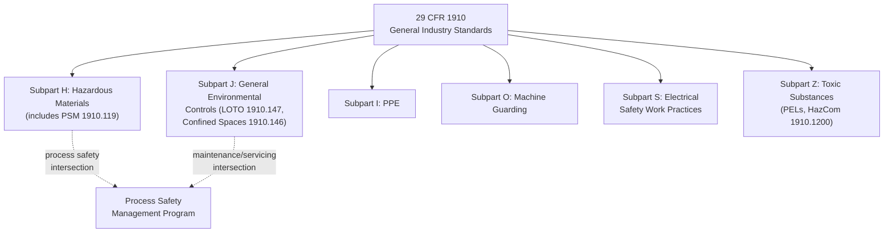

## OSHA General Industry Standards 29 CFR 1910

### Overview

29 CFR 1910 is OSHA's comprehensive body of regulations governing occupational safety and health for general industry — the broad category encompassing most workplaces other than construction (29 CFR 1926), maritime (29 CFR 1915–1918), and agriculture (29 CFR 1928). Where PSM (1910.119) addresses catastrophic process hazards, the remainder of Part 1910 constitutes the regulatory backbone of occupational safety: the standards governing everyday worker protection from mechanical, electrical, chemical, and physical hazards.

### Structure of 29 CFR 1910

Part 1910 is organized into subparts, each addressing a distinct hazard category:

| Subpart | Title | Focus Area |
| --- | --- | --- |
| A | General | Purpose, scope, definitions |
| B | Adoption of Established Federal Standards | Legacy standard incorporation |
| D | Walking-Working Surfaces | Floors, ladders, stairways, fall protection |
| E | Means of Egress | Exit routes, emergency action plans |
| F | Powered Platforms, Manlifts, Vehicle-Mounted Platforms | Aerial work platforms |
| G | Occupational Health and Environmental Control | Ventilation, noise |
| H | Hazardous Materials | Flammable liquids, compressed gases, PSM (1910.119) |
| I | Personal Protective Equipment | PPE selection and use |
| J | General Environmental Controls | Sanitation, LOTO (1910.147), confined spaces (1910.146) |
| K | Medical and First Aid | Emergency medical provisions |
| L | Fire Protection | Fire suppression, extinguishers, alarm systems |
| M | Compressed Gas and Compressed Air Equipment | Gas cylinder handling |
| N | Materials Handling and Storage | Forklifts, cranes, slings |
| O | Machinery and Machine Guarding | Point-of-operation guarding |
| P | Hand and Portable Power Tools | Tool-specific safety requirements |
| Q | Welding, Cutting, and Brazing | Hot work safety |
| R | Special Industries | Industry-specific provisions (e.g., pulp/paper, textiles) |
| S | Electrical | Electrical safety-related work practices |
| T | Commercial Diving Operations | Diving safety |
| Z | Toxic and Hazardous Substances | Permissible exposure limits (PELs), Hazard Communication (1910.1200) |

### High-Impact Standards for Process Safety and Occupational Safety Integration

#### Lockout/Tagout — 1910.147

**Key Points**

- Establishes minimum requirements for controlling hazardous energy (electrical, mechanical, hydraulic, pneumatic, chemical, thermal) during servicing and maintenance.
- Requires a written energy control program, machine-specific procedures, employee training (authorized, affected, and other employee categories), and periodic inspection of the LOTO program (at least annually).
- Directly protects individual workers from unexpected equipment energization — a core occupational safety function that also intersects with process safety mechanical integrity work, since maintenance on process equipment must be LOTO-isolated before servicing.

#### Confined Space Entry — 1910.146

**Key Points**

- Governs entry into "permit-required confined spaces" — spaces large enough for entry, with limited means of entry/exit, not designed for continuous occupancy, and containing (or with potential to contain) a hazardous atmosphere, engulfment hazard, or other serious hazard.
- Requires a written permit space program, atmospheric testing prior to and during entry, an attendant stationed outside the space, and rescue/emergency planning.
- Frequently a high-consequence intersection point between occupational and process safety, since confined spaces on process units may contain residual process chemicals.

#### Hazard Communication — 1910.1200

**Key Points**

- Aligned with the UN Globally Harmonized System (GHS) of chemical classification and labeling since OSHA's 2012 update.
- Requires Safety Data Sheets (SDS), standardized container labeling, and employee training on chemical hazards present in the workplace.
- Serves as the occupational safety counterpart to the chemical-specific hazard information requirements embedded in PSM's Process Safety Information element (1910.119(d)).

#### Permissible Exposure Limits — 1910.1000 series (Subpart Z)

**Key Points**

- Establishes legally enforceable exposure limits for airborne concentrations of hazardous substances (e.g., 8-hour time-weighted averages).
- [Inference] Many PELs originate from decades-old data and have been widely criticized by industrial hygiene professionals as outdated relative to current toxicological understanding (e.g., ACGIH Threshold Limit Values), though updating PELs requires OSHA rulemaking, which has historically proceeded slowly.

#### Electrical Safety-Related Work Practices — Subpart S (1910.331–.335)

**Key Points**

- Governs work practices for electrical hazards, including arc flash and shock protection, distinct from equipment/installation standards found in the National Electrical Code (NFPA 70).
- Frequently cross-referenced with NFPA 70E (Standard for Electrical Safety in the Workplace) for detailed arc-flash risk assessment methodology, though 70E itself is a consensus standard, not an OSHA regulation directly.

#### Machine Guarding — Subpart O (1910.211–.219)

**Key Points**

- Requires guarding of points of operation, in-running nip points, rotating parts, and other mechanical hazards to prevent contact injury.
- One of the most frequently cited standard groups in OSHA general industry enforcement.

### General Duty Clause — Not Part of 1910, but Critically Related

**Key Points**

- Section 5(a)(1) of the OSH Act (not a 1910 standard itself) requires employers to furnish a workplace "free from recognized hazards that are causing or are likely to cause death or serious physical harm," even where no specific standard applies.
- Frequently cited alongside or independent of 1910 standards when a hazard is well-recognized in an industry but not explicitly codified in a specific regulation.

### Relationship Between 1910 Standards and Process Safety

**Key Points**

- PSM (1910.119) sits within Subpart H of Part 1910, structurally embedding process safety regulation within the broader occupational safety framework rather than as a wholly separate regulatory title — reflecting OSHA's organizational choice to treat process safety as a specialized subset of general industry regulation.
- Many 1910 standards (LOTO, confined space, hot work, electrical safety) function as supporting "safe work practice" layers that intersect directly with PSM's mechanical integrity and operating procedures elements — a maintenance technician servicing a PSM-covered vessel is simultaneously subject to 1910.147 (LOTO), potentially 1910.146 (confined space), and 1910.119(f) (operating procedures for maintenance activities).
- This layering illustrates why process safety and occupational safety, while conceptually distinct, require coordinated (not siloed) program management at the facility level.

### Enforcement Patterns

**Key Points**

- OSHA publishes an annual list of its "Top 10 Most Frequently Cited Standards," which consistently features general industry standards such as Hazard Communication (1910.1200), Respiratory Protection (1910.134), Lockout/Tagout (1910.147), and Machine Guarding provisions, alongside construction-specific standards (Fall Protection under 1926).
- [Inference] Specific year-to-year rankings shift; current top-10 lists should be verified directly against OSHA's published enforcement statistics rather than assumed static.

### Comparison: 1910 General Industry Standards vs. PSM (1910.119)

| Dimension | General 1910 Standards | PSM (1910.119) |
| --- | --- | --- |
| Scope | All general industry workplaces | Only processes with HHCs above threshold |
| Consequence focus | Individual worker injury | Catastrophic release, multiple casualties |
| Structure | Standard-specific (LOTO, PPE, machine guarding, etc.) | Single integrated 14-element program |
| Revalidation cycles | Vary by standard (e.g., annual LOTO inspection) | 5-year PHA revalidation, 3-year audit cycle |
| Typical ownership | EHS/line supervision | Process safety engineering |

**Conclusion**

29 CFR 1910 constitutes the comprehensive regulatory foundation for general industry occupational safety in the United States, spanning dozens of subparts addressing mechanical, electrical, chemical, and physical hazards. While PSM (1910.119) is embedded within this same Part as a specialized process-hazard-focused standard, the surrounding 1910 subparts — particularly LOTO, confined space entry, and hazard communication — form the essential safe-work-practice layer that intersects with and supports process safety programs at the point of actual maintenance and operational activity. Understanding this structural relationship clarifies why effective safety management requires coordinated compliance across both general industry and process-safety-specific regulatory obligations.

**Related Topics**

- Lockout/Tagout (1910.147): Program Requirements and Common Deficiencies
- Permit-Required Confined Space Entry (1910.146) Procedures
- Hazard Communication and the Globally Harmonized System (GHS)
- OSHA's General Duty Clause: Scope and Enforcement Use
- NFPA 70E and Electrical Arc-Flash Risk Assessment
- OSHA's Top 10 Most Cited Standards: Trends and Analysis