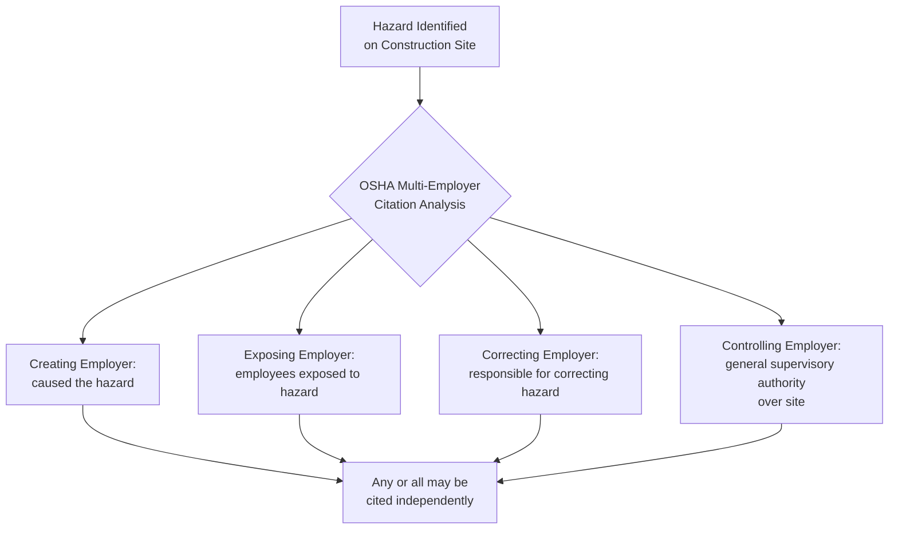

## OSHA Construction Industry Standards 29 CFR 1926

### Overview

29 CFR 1926 is OSHA's regulatory body governing occupational safety and health specifically for construction work — defined broadly as construction, alteration, and/or repair, including painting and decorating. It applies distinctly from 29 CFR 1910 (general industry), reflecting the unique, transient, multi-employer, and rapidly changing hazard profile of construction worksites. Within process safety contexts, 1926 becomes directly relevant during plant construction, major turnarounds, and capital projects where construction contractors work on or adjacent to operating process units.

### Scope and Applicability Determination

**Key Points**

- Applies when work meets OSHA's definition of "construction work" — a functional test based on the nature of the activity, not merely the industry classification of the employer performing it.
- A key practical distinction from general industry: multi-employer worksite doctrine applies extensively in construction, where OSHA can cite the **creating employer**, **exposing employer**, **correcting employer**, and **controlling employer** independently for the same hazard, even if the cited employer did not directly employ the affected worker.
- Determining whether 1910 or 1926 applies to work performed at a PSM-covered process facility depends on the nature of the specific task (e.g., routine maintenance = 1910; new unit construction or major modification = 1926), a distinction that has significant implications for contractor safety program design during turnarounds and capital projects.

### Structure of 29 CFR 1926

| Subpart | Title | Focus Area |
| --- | --- | --- |
| C | General Safety and Health Provisions | Competent person requirements, general provisions |
| D | Occupational Health and Environmental Controls | Ventilation, noise, hazardous substances |
| E | Personal Protective and Life Saving Equipment | PPE, fall protection equipment |
| F | Fire Protection and Prevention | Fire suppression on construction sites |
| G | Signs, Signals, and Barricades | Traffic control, warning signage |
| H | Materials Handling, Storage, Use, and Disposal | Rigging, material storage |
| I | Tools – Hand and Power | Power tool safety |
| J | Welding and Cutting | Hot work in construction |
| K | Electrical | Construction electrical safety |
| L | Scaffolds | Scaffold erection, use, inspection |
| M | Fall Protection | Fall protection systems and criteria |
| N | Cranes, Derricks, Hoists, Elevators, and Conveyors | Crane operations |
| O | Motor Vehicles, Mechanized Equipment | Heavy equipment operation |
| P | Excavations | Trenching and excavation safety |
| Q | Concrete and Masonry Construction | Formwork, rebar hazards |
| R | Steel Erection | Structural steel work |
| S | Underground Construction, Caissons, Cofferdams, Compressed Air | Tunneling |
| T | Demolition | Demolition-specific hazards |
| V | Power Transmission and Distribution | Electrical utility construction |
| W | Rollover Protective Structures | Equipment ROPS requirements |
| X | Stairways and Ladders | Access equipment |
| Z | Toxic and Hazardous Substances | Construction-specific exposure limits |
| AA | Confined Spaces in Construction | Construction-specific confined space rule |
| CC | Cranes and Derricks in Construction | Comprehensive crane standard (superseded older N provisions) |

### Fall Protection — Subpart M

**Key Points**

- Widely regarded as OSHA's most frequently cited standard across all industries; fall protection (1926.501) has topped OSHA's annual "Top 10 Most Cited" list for over a decade running. [Inference] Current-year rankings should be verified against OSHA's latest published statistics, as exact figures shift annually.
- Requires fall protection systems (guardrails, safety net systems, personal fall arrest systems) at unprotected edges 6 feet or more above a lower level for most construction work.
- Requires a documented fall protection plan for specific circumstances where conventional fall protection is infeasible, developed by a qualified person.

### Excavations — Subpart P

**Key Points**

- Requires protective systems (sloping, benching, shoring, shielding) for excavations 5 feet or deeper, unless the excavation is entirely in stable rock, based on a **competent person's** classification of soil type (Type A, B, or C per Appendix A).
- Requires daily inspections by a competent person, particularly after rainfall or other events that could affect stability.
- Historically one of the highest-fatality-rate construction activities due to cave-in/engulfment hazards, given the rapid, often-unrecoverable nature of soil collapse.

### Scaffolds — Subpart L

**Key Points**

- Requires scaffold erection under the supervision of a qualified person, capacity ratings (4x intended load), guardrail systems above specified heights, and access provisions (ladders, stair towers).
- Frequently cited alongside fall protection violations, given the direct overlap between scaffold work and fall hazard exposure.

### Cranes and Derricks in Construction — Subpart CC

**Key Points**

- Comprehensive standard covering crane assembly/disassembly, operator qualification and certification, ground conditions assessment, and signal person qualifications.
- Requires documented crane operator certification (accredited testing organization or employer-audited program) — a significant shift from earlier, less prescriptive crane safety requirements.

### Confined Spaces in Construction — Subpart AA

**Key Points**

- A construction-specific confined space standard, issued in 2015, distinct from and more detailed than the general industry confined space standard (1910.146) — reflecting the more dynamic, multi-employer nature of construction confined space work (e.g., a space's hazard classification may change as work progresses).
- Requires a designated **"competent person"** to evaluate the site and identify confined spaces before work begins, and continuous coordination among multiple employers who may have workers in or near the same space.

### The Competent Person / Qualified Person Framework

**Key Points**

- **Competent person**: defined under 1926.32(f) as one capable of identifying existing and predictable hazards and who has authorization to take prompt corrective measures to eliminate them.
- **Qualified person**: one who, by possession of a recognized degree, certificate, or professional standing, or extensive knowledge/training/experience, has successfully demonstrated the ability to solve problems relating to the subject matter.
- This framework recurs throughout 1926 (excavations, scaffolds, fall protection, cranes) as the mechanism by which OSHA delegates specific hazard-judgment authority to a designated, accountable individual on site, rather than relying solely on prescriptive rules.

### Multi-Employer Worksite Doctrine

**Key Points**

- This doctrine allows OSHA to hold a general contractor (controlling employer) accountable for hazards created by a subcontractor, even without direct employment relationship, provided the controlling employer had the authority to prevent or correct the hazard.
- Significant implications for capital projects and turnarounds at PSM-covered facilities, where the host facility, EPC (engineering, procurement, construction) contractor, and multiple subcontractors may simultaneously bear overlapping safety obligations.

### 1926 vs. 1910: Key Structural Differences

| Dimension | 29 CFR 1926 (Construction) | 29 CFR 1910 (General Industry) |
| --- | --- | --- |
| Worksite character | Transient, evolving, multi-employer | Fixed, established, typically single employer |
| Employer citation model | Multi-employer doctrine (4 employer types) | Primarily direct employer liability |
| Fall protection threshold | 6 feet | 4 feet (general industry) |
| Confined space standard | Subpart AA (2015, construction-specific) | 1910.146 |
| Crane standard | Subpart CC (comprehensive, 2010) | Less comprehensive general provisions |
| Competent/qualified person framework | Extensively embedded throughout | Present but less centrally structural |

### Intersection with Process Safety During Capital Projects and Turnarounds

**Key Points**

- Major turnarounds and capital projects at PSM-covered facilities frequently involve construction-classified work (new unit erection, major structural modification) occurring simultaneously with ongoing 1910.119-covered operations in adjacent units.
- This creates a compliance overlay requiring coordination between: construction contractor safety programs (1926-based), host facility contractor safety element requirements (1910.119(h)), and, where applicable, Pre-Startup Safety Review (1910.119(i)) before the new or modified process is introduced to hazardous materials.
- [Inference] Industry guidance commonly recommends integrated permit-to-work systems spanning both construction and operations personnel during such overlapping-scope periods, though specific implementation approaches vary significantly by organization and are not standardized in regulation.

**Conclusion**

29 CFR 1926 provides the regulatory framework specifically tailored to construction's transient, multi-employer, rapidly evolving hazard environment — distinct in structure and enforcement philosophy from general industry's 1910. Its extensive reliance on the competent person/qualified person framework, combined with the multi-employer citation doctrine, reflects the practical reality that construction safety accountability is distributed across contractors in ways general industry regulation does not typically require. For process safety practitioners, understanding 1926's applicability is essential during capital projects, plant expansions, and major turnarounds, where construction-classified activity intersects directly with PSM program obligations (contractor safety, PSSR) at the boundary between new construction and operating process units.

**Related Topics**

- Multi-Employer Worksite Doctrine: Citation Strategy and Case Law
- Fall Protection Systems: Guardrails, Nets, and Personal Fall Arrest
- Competent Person vs. Qualified Person: Regulatory Distinctions
- Confined Spaces in Construction (Subpart AA) vs. General Industry (1910.146)
- Turnaround and Capital Project Safety Integration with PSM Contractor Requirements
- Cranes and Derricks in Construction: Operator Certification Requirements