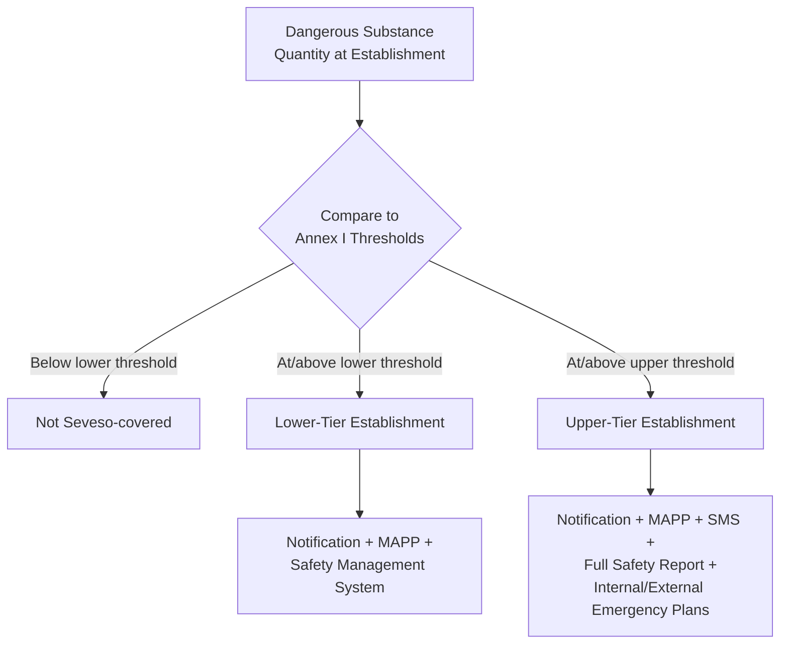

## Seveso III Directive and European Regulations

### Overview

The Seveso III Directive (2012/18/EU) is the current iteration of the European Union's principal legislative framework for the control of major-accident hazards involving dangerous substances. Named after the 1976 Seveso, Italy dioxin release that catalyzed its original 1982 predecessor, the Directive represents the EU's central regulatory response to catastrophic process safety events, functioning as a rough structural counterpart to the US's combined OSHA PSM / EPA RMP framework, though with a distinctly EU-specific tiered, substance-classification-driven architecture.

### Legislative Lineage

| Directive | Year | Key Development |
| --- | --- | --- |
| Seveso I (82/501/EEC) | 1982 | First EU major-accident hazard framework, direct response to the 1976 Seveso release |
| Seveso II (96/82/EC) | 1996 | Expanded scope, introduced Safety Management System requirement, land-use planning provisions |
| Seveso II Amendment | 2003 | Post-Toulouse (AZF plant explosion, 2001) and post-Baia Mare amendments, expanded substance scope |
| Seveso III (2012/18/EU) | 2012 | Current version; aligned classification system with EU CLP Regulation (GHS-based), enhanced public information and inspection requirements |

**Key Points**

- Seveso III entered into force on June 1, 2015, replacing Seveso II.
- The core driver for the Seveso III revision was the need to align dangerous substance classification with the EU's **CLP Regulation (Classification, Labelling and Packaging, EC 1272/2008)**, itself based on the UN Globally Harmonized System (GHS) — the same international classification framework underlying OSHA's post-2012 Hazard Communication Standard.

### Tiered Establishment Classification

Seveso III classifies covered establishments into two tiers based on the quantity of dangerous substances present, analogous in concept (though not identical in criteria) to EPA RMP's Program tiering:

**Lower-Tier Establishments**

- Hold dangerous substances at or above lower threshold quantities specified in Annex I.
- Subject to baseline obligations: notification to competent authority, Major Accident Prevention Policy (MAPP), and safety management system.

**Upper-Tier Establishments**

- Hold dangerous substances at or above higher threshold quantities specified in Annex I.
- Subject to more extensive obligations: full Safety Report, internal emergency plan, external emergency plan (prepared by public authorities), and more frequent inspection.

### Core Obligations

#### Major Accident Prevention Policy (MAPP)

Required of all Seveso-covered establishments (both tiers). A documented statement of the operator's overall policy and approach to controlling major-accident hazards, proportionate to the hazards presented.

#### Safety Management System (SMS)

Required alongside the MAPP; must address organizational structure, roles and responsibilities, procedures, processes, and resources for implementing the MAPP. Seveso III's SMS requirements are conceptually similar to CCPS's Risk Based Process Safety framework, though the Directive specifies the requirement rather than a detailed methodology.

#### Safety Report (Upper-Tier Only)

A comprehensive document demonstrating:

- A MAPP and SMS are implemented.
- Major-accident hazards have been identified and necessary measures taken to prevent and limit their consequences.
- Adequate safety and reliability has been incorporated into design, construction, operation, and maintenance.
- Internal emergency plans exist and information for the external emergency plan has been supplied.

#### Internal and External Emergency Plans

- **Internal Emergency Plan** — prepared by the operator (upper-tier establishments), covering on-site response.
- **External Emergency Plan** — prepared by designated public authorities using information supplied by the operator, covering off-site response, coordinated with local emergency services.

#### Domino Effect Provisions

**Key Points**

- Requires Member States to identify groups of establishments where the likelihood and consequences of a major accident may be increased due to geographic proximity and inventory of dangerous substances at neighboring sites ("domino groups").
- Establishments within an identified domino group must exchange relevant information and cooperate on informing the public and supplying information to external emergency planning authorities.
- [Inference] This provision reflects lessons broadly associated with industrial accidents where proximity between facilities amplified consequences, though the Directive itself frames the requirement generally rather than citing a single triggering incident.

#### Land-Use Planning

**Key Points**

- Member States must ensure that the objectives of preventing major accidents and limiting their consequences are taken into account in land-use policies, including siting of new establishments, modifications to existing establishments, and siting of developments (e.g., residential areas, public buildings) near existing establishments.
- This provision addresses a distinct dimension absent from OSHA PSM: Seveso III directly regulates the interaction between industrial siting and surrounding community development, reflecting the EU's more centralized approach to land-use governance in this domain.

#### Public Information and Participation

**Key Points**

- Requires public access to safety information for establishments, including for lower-tier establishments (expanded from Seveso II).
- Requires public consultation on specific decisions (e.g., new establishment siting, significant modifications).
- Requires provision of information to the public likely to be affected by a major accident, without their needing to request it — a more proactive disclosure requirement than the EPA RMP's post-2024 request-based 6-mile radius provision.

#### Inspections

**Key Points**

- Requires a system of inspections appropriate to the type of establishment, with upper-tier establishments subject to at least annual on-site inspection (or a documented inspection program covering multiple hazard types over a defined period) and a requirement for follow-up on any significant non-compliance identified.

### Comparison: Seveso III vs. US Frameworks

| Dimension | Seveso III (EU) | OSHA PSM (US) | EPA RMP (US) |
| --- | --- | --- | --- |
| Classification basis | Quantity thresholds per Annex I, aligned to CLP/GHS | Appendix A chemical list + flammables threshold | 40 CFR 68.130 substance list |
| Tiering | Lower-tier / Upper-tier | Single uniform standard | Program 1/2/3 |
| Land-use planning | Explicitly mandated | Not addressed | Not directly addressed |
| Public information | Proactive disclosure required | Not required | Request-based (post-2024, 6-mile radius) |
| Domino effect provisions | Explicit requirement | Not directly addressed | Not directly addressed |
| Emergency planning structure | Internal (operator) + External (authorities) | Emergency Action Plan (1910.38 cross-reference) | Emergency Response Program |
| Primary protection focus | Public, environment, and worker safety combined | Onsite workers | Offsite public/environment |

### Member State Implementation

**Key Points**

- Seveso III is a Directive, not a Regulation, meaning it sets binding objectives that each EU Member State must transpose into national law, with some flexibility in implementation mechanics — resulting in variation in specific procedural requirements (e.g., permitting processes, inspection frequency details) across Member States, even though the core substantive obligations are harmonized.
- Competent authorities designated at the national or regional level (varying by Member State) administer notification, safety report review, and inspection functions.
- Post-Brexit, the United Kingdom's domestic equivalent (Control of Major Accident Hazards Regulations, COMAH) continues to closely mirror Seveso III's structure, having originated as the UK's transposition of the Seveso framework prior to EU exit, though it now operates as independent UK regulation.

### Landmark Incidents Influencing Seveso Evolution

**Key Points**

- **Seveso disaster (1976)** — direct catalyst for Seveso I.
- **Toulouse AZF plant explosion (2001)** — an ammonium nitrate explosion at a fertilizer plant in France that killed 31 people; contributed to the 2003 amendment expanding Seveso II's substance scope and reinforcing land-use planning provisions.
- **Baia Mare cyanide spill (2000, Romania)** — a tailings dam failure releasing cyanide-contaminated water into the Danube river system; though not a classic Seveso-covered "establishment" event in the traditional chemical-plant sense, it contributed to broader EU environmental-industrial regulatory scrutiny during the same period as the 2003 Seveso II amendments.

**Conclusion**

Seveso III represents the EU's mature, harmonized approach to major-accident hazard prevention, distinguished from US frameworks by its explicit integration of land-use planning, proactive public information disclosure, and domino-effect coordination between neighboring facilities — reflecting a more centralized, community-integrated regulatory philosophy than the more narrowly worker-focused (PSM) or request-based community-disclosure (RMP) US approach. Its tiered lower/upper establishment structure and GHS-aligned substance classification provide a risk-proportionate framework that, while directive-based and subject to Member State transposition variation, has produced broadly consistent major-accident hazard management practice across the European Union.

**Related Topics**

- Major Accident Prevention Policy (MAPP) and Safety Management System Content Requirements
- Domino Effect Analysis Between Neighboring Establishments
- Land-Use Planning Integration with Major Hazard Siting
- UK COMAH Regulations: Post-Brexit Relationship to Seveso III
- CLP Regulation and GHS-Aligned Substance Classification
- Comparative Analysis: Seveso III, OSHA PSM, and EPA RMP Frameworks