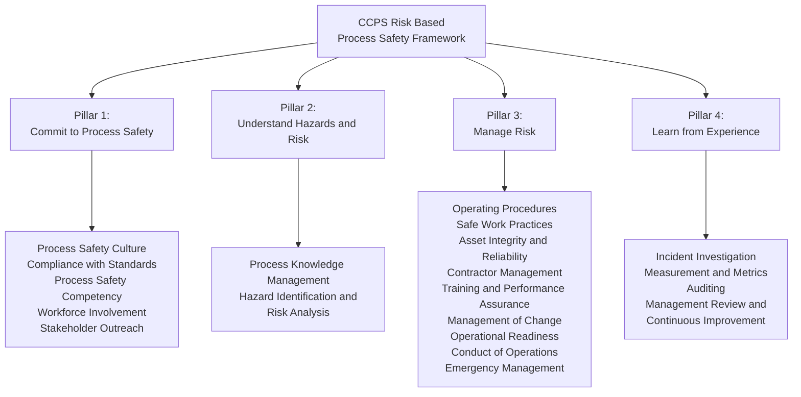

## CCPS Risk Based Process Safety Framework

### Overview

Risk Based Process Safety (RBPS) is a voluntary, non-regulatory process safety management framework developed by the Center for Chemical Process Safety (CCPS), first published in 2007. It reorganizes process safety management around 20 elements grouped into four foundational pillars, explicitly designed to extend beyond regulatory compliance minimums (such as OSHA PSM's 14 elements) toward a risk-prioritized, culture-integrated approach to process safety.

### Origins and Purpose

**Key Points**

- Developed by CCPS, itself founded by AIChE in 1985 directly in response to the Bhopal disaster (1984).
- RBPS emerged from industry recognition that regulatory compliance with prescriptive standards (like OSHA PSM) does not by itself guarantee effective risk management — an organization can be fully compliant on paper while still experiencing catastrophic process safety failures, as illustrated by BP Texas City (2005), which had passed various compliance audits prior to the incident.
- The framework's central innovation is explicitly prioritizing safety management effort and resources according to the magnitude of risk, rather than applying uniform rigor across all processes and hazards regardless of actual risk level.

### The Four Pillars and 20 Elements

#### Pillar 1: Commit to Process Safety

Establishes the organizational and cultural foundation without which technical elements cannot function effectively.

**Elements**

1. **Process Safety Culture** — the shared organizational values, beliefs, and behaviors that determine the priority given to process safety relative to other business objectives, particularly under production pressure.
2. **Compliance with Standards** — ensures applicable regulations, internal standards, and industry codes are identified and met, forming the regulatory floor upon which RBPS builds.
3. **Process Safety Competency** — ensures the organization builds and maintains the knowledge and capabilities needed to manage process safety, both at individual and organizational levels.
4. **Workforce Involvement** — engages the workforce (not just management) in process safety activities, recognizing frontline operational knowledge as a critical input.
5. **Stakeholder Outreach** — engages external parties (communities, regulators, contractors) in understanding and supporting the facility's process safety performance — an element with no direct OSHA PSM equivalent.

#### Pillar 2: Understand Hazards and Risk

**Elements**

6. **Process Knowledge Management** — ensures process safety information (chemical hazards, technology, equipment) is captured, current, and accessible — extends beyond PSM's Process Safety Information element to emphasize ongoing knowledge management as a continuous discipline.

7. **Hazard Identification and Risk Analysis (HIRA)** — encompasses PHA methodologies (HAZOP, What-If, LOPA) but frames them within a broader risk analysis discipline, including risk ranking and prioritization across the facility's full process portfolio.

#### Pillar 3: Manage Risk

The largest pillar, encompassing the operational discipline elements most directly comparable to OSHA PSM's core requirements.

**Elements**

8. **Operating Procedures**

9. **Safe Work Practices** — includes permit-to-work systems (hot work, confined space, LOTO), extending PSM's narrower hot work permit element into a comprehensive safe work practice discipline.

10. **Asset Integrity and Reliability** — RBPS's expanded framing of PSM's Mechanical Integrity element, explicitly incorporating reliability engineering principles rather than solely inspection/testing compliance.

11. **Contractor Management**

12. **Training and Performance Assurance** — extends PSM's Training element to include ongoing performance verification, not just initial/refresher training completion.

13. **Management of Change (MOC)**

14. **Operational Readiness** — verification that a process is ready to start up or resume operation, extending PSM's Pre-Startup Safety Review concept to a broader readiness assurance discipline applicable at multiple points (not just initial startup).

15. **Conduct of Operations** — a distinct RBPS element with no direct PSM equivalent; addresses the systematic execution of operational tasks with discipline and rigor, addressing human performance and operational discipline as an explicit management system component.

16. **Emergency Management**

#### Pillar 4: Learn from Experience

**Elements**

17. **Incident Investigation**

18. **Measurement and Metrics** — directly informed by, and largely implemented via, API RP 754's Tier 1–4 process safety performance indicator framework.

19. **Auditing**

20. **Management Review and Continuous Improvement** — a distinct capstone element ensuring that lessons from investigation, metrics, and auditing feed back into organizational decision-making at the leadership level, closing the management system loop.

### RBPS vs. OSHA PSM: Structural Comparison

| Dimension | CCPS RBPS | OSHA PSM (1910.119) |
| --- | --- | --- |
| Legal status | Voluntary industry framework | Mandatory federal regulation |
| Number of elements | 20 | 14 |
| Organizing structure | 4 pillars (Commit, Understand, Manage, Learn) | Flat list of 14 elements |
| Culture element | Explicit standalone element | Not directly addressed |
| Stakeholder outreach | Explicit standalone element | Not addressed |
| Conduct of Operations | Explicit standalone element | Not directly addressed |
| Risk prioritization philosophy | Central organizing principle | Uniform requirement across all covered processes |
| Metrics/KPI element | Explicit (aligned with API RP 754) | Not directly specified |

**Key Points**

- Every OSHA PSM element maps to an RBPS element, but RBPS is not merely PSM "plus extras" — its pillar structure fundamentally reorganizes process safety around risk-based prioritization rather than uniform compliance, and adds elements (Process Safety Culture, Stakeholder Outreach, Conduct of Operations, Management Review) addressing organizational and cultural dimensions absent from the regulatory text.
- RBPS is explicitly designed to be scalable: a small, lower-hazard facility may implement each element with proportionately less rigor than a large, high-hazard complex facility, whereas OSHA PSM applies uniform requirements to any covered process regardless of relative risk within a facility's portfolio.

### Risk-Based Prioritization Concept

**Key Points**

- Central premise: not all process safety elements warrant equal resource investment at every facility or for every process — RBPS explicitly directs organizations to allocate effort according to hazard severity and risk magnitude.
- This differs philosophically from PSM's largely uniform application: a covered process handling a moderate quantity of a listed HHC is subject to the same 14 PSM elements, with the same rigor expectations, as a process handling a catastrophic quantity — RBPS explicitly permits calibrating program rigor to actual risk level within a facility's process portfolio.
- [Inference] This risk-based philosophy is broadly considered RBPS's most significant conceptual departure from prescriptive regulatory frameworks, though implementing true risk-based calibration in practice requires mature risk assessment capability that not all organizations possess uniformly.

### Adoption and Use

**Key Points**

- RBPS is used industry-wide as a self-assessment and program design framework, including by CCPS member companies across chemical manufacturing, refining, and related process industries.
- CCPS publishes detailed guideline documents for each of the 20 elements, providing implementation guidance beyond what the framework's high-level structure alone conveys.
- Many organizations use RBPS as the organizing structure for internal process safety management system documentation, even while maintaining separate compliance tracking against OSHA PSM's regulatory text for audit purposes.
- RBPS self-assessment tools allow organizations to benchmark current program maturity against each of the 20 elements, supporting continuous improvement planning (directly connecting to the Pillar 4 "Management Review and Continuous Improvement" element).

**Conclusion**

The CCPS Risk Based Process Safety framework represents the process safety industry's most comprehensive voluntary management system standard, extending well beyond OSHA PSM's 14-element regulatory floor through its four-pillar structure and 20 elements. Its explicit incorporation of culture, stakeholder outreach, conduct of operations, and risk-based resource prioritization reflects lessons drawn from incidents — like BP Texas City — where regulatory compliance alone proved insufficient to prevent catastrophic failure. RBPS is widely used as the organizing framework for mature process safety management systems across the global chemical and process industries, functioning as both a design template and a self-assessment benchmark for continuous improvement.

**Related Topics**

- Process Safety Culture: Definition, Assessment, and Improvement
- Conduct of Operations as a Distinct Management System Element
- API RP 754 Metrics Integration with RBPS Pillar 4
- RBPS Self-Assessment Tools and Maturity Benchmarking
- Asset Integrity and Reliability vs. Traditional Mechanical Integrity
- Comparative Mapping: RBPS 20 Elements to OSHA PSM 14 Elements