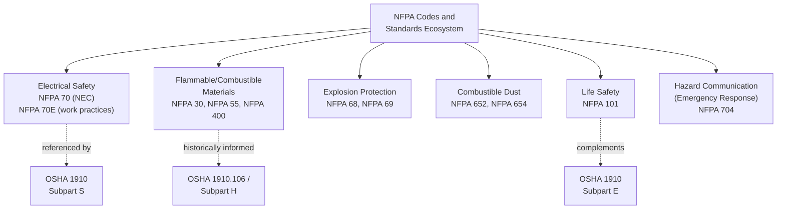

## NFPA Codes and Standards Relevant to Safety

### Overview

The National Fire Protection Association (NFPA) publishes over 300 consensus codes and standards addressing fire, electrical, and life safety hazards. While NFPA is a private, non-governmental standards-development organization rather than a regulatory body, its codes are extensively incorporated by reference into federal, state, and local regulations — including OSHA standards — making NFPA compliance a de facto legal requirement in many contexts despite NFPA's technical status as a voluntary consensus standard.

### Regulatory Status and Adoption Mechanism

**Key Points**

- NFPA standards are developed through a consensus process involving technical committees representing manufacturers, insurers, fire service, labor, and other stakeholders, following American National Standards Institute (ANSI)-accredited procedures.
- NFPA codes become legally binding in three primary ways: (1) direct incorporation by reference into OSHA regulations, (2) adoption by state/local jurisdictions as part of building and fire codes, and (3) incorporation into insurance underwriting requirements, which functions as a strong de facto compliance driver even absent direct legal mandate.
- OSHA has directly incorporated specific NFPA standards by reference in various 1910 provisions (e.g., NFPA 30 for flammable liquids historically informed OSHA's own flammable liquids standard structure), while other NFPA standards (like NFPA 70E) are referenced as recognized industry practice without being directly codified as an OSHA requirement itself.

### NFPA 70: National Electrical Code (NEC)

**Key Points**

- Governs electrical installation design and construction requirements — wiring methods, overcurrent protection, grounding, equipment installation.
- Widely adopted by state and local jurisdictions as the basis for electrical building codes across the United States.
- Distinct from NFPA 70E (below), which addresses safe work practices rather than installation design.

### NFPA 70E: Standard for Electrical Safety in the Workplace

**Key Points**

- Addresses electrical safety-related work practices, including arc flash and shock hazard analysis, personal protective equipment selection, and energized work permit requirements.
- Provides the detailed technical methodology (incident energy analysis, arc flash boundary calculation, PPE category tables) that OSHA's Subpart S electrical safety-related work practices (1910.331–.335) references conceptually but does not itself prescribe in comparable technical detail.
- Requires an **Electrical Hazard Analysis** and **Arc Flash Risk Assessment** for energized electrical work, along with labeling of electrical equipment with arc flash hazard information.

### NFPA 30: Flammable and Combustible Liquids Code

**Key Points**

- Governs storage, handling, and use of flammable and combustible liquids, including tank design, secondary containment, ventilation, and separation distances.
- Historically influential on OSHA's own flammable liquids provisions (1910.106, now largely integrated into Subpart H).
- Directly relevant to process safety facilities storing bulk flammable liquid inventories outside of process piping (e.g., tank farms).

### NFPA 68 and NFPA 69: Explosion Protection

**NFPA 68 — Standard on Explosion Protection by Deflagration Venting**

- Provides design requirements for venting systems that relieve pressure from a deflagration (rapid combustion) event before catastrophic vessel or building failure occurs.

**NFPA 69 — Standard on Explosion Prevention Systems**

- Addresses explosion prevention (rather than post-ignition venting) through methods including inerting, deflagration suppression, and combustible concentration reduction.

**Key Points**

- Both standards are directly relevant to process safety facilities handling combustible dusts or flammable vapors in enclosed equipment (dryers, mills, dust collection systems), where explosion protection design is a core mechanical integrity and inherently safer design consideration.

### NFPA 654 and NFPA 652: Combustible Dust

**Key Points**

- **NFPA 652 (Standard on the Fundamentals of Combustible Dust)** establishes overarching requirements for conducting a **Dust Hazard Analysis (DHA)**, applicable across industries handling combustible dust.
- **NFPA 654** provides industry-specific requirements for manufacturing, processing, and handling combustible particulate solids.
- Combustible dust explosions (e.g., the 2008 Imperial Sugar refinery explosion) drove significant regulatory and standards attention to this hazard category; OSHA has pursued combustible dust hazards under the General Duty Clause in the absence of a comprehensive OSHA-specific combustible dust standard. [Inference] OSHA has periodically signaled intent to develop a dedicated combustible dust standard through rulemaking activity, though the current regulatory status of any such standard should be verified against OSHA's current rulemaking agenda.

### NFPA 55 and NFPA 400: Hazardous Materials

**Key Points**

- **NFPA 55 (Compressed Gases and Cryogenic Fluids Code)** governs storage, use, and handling of compressed and cryogenic gases.
- **NFPA 400 (Hazardous Materials Code)** provides general requirements for hazardous materials storage and use not otherwise addressed by material-specific codes.

### NFPA 101: Life Safety Code

**Key Points**

- Addresses life safety requirements for building design and operation, including means of egress, fire alarm and detection systems, and occupancy-specific requirements.
- Complements OSHA's Means of Egress provisions (1910 Subpart E), often serving as the more detailed technical basis referenced by state/local building codes.

### NFPA 704: Standard System for the Identification of the Hazards of Materials for Emergency Response

**Key Points**

- Establishes the familiar diamond-shaped hazard placard system (blue = health, red = flammability, yellow = instability/reactivity, white = special hazards), rated 0–4 in severity.
- Widely used for emergency responder hazard communication at fixed facilities, distinct from GHS/Hazard Communication labeling (which addresses workplace chemical hazard communication for employees rather than emergency response).

### Relationship to Process Safety Management

**Key Points**

- NFPA standards frequently serve as the "Recognized and Generally Accepted Good Engineering Practices" (RAGAGEP) referenced within OSHA PSM's Mechanical Integrity element (1910.119(j)) and EPA RMP's analogous requirements — facilities cite specific NFPA codes as the engineering basis for equipment design, inspection, and maintenance practices.
- Unlike OSHA PSM's chemical-list-based applicability, most NFPA standards apply based on the presence of a specific hazard type (flammable liquids, combustible dust, electrical energization) regardless of whether the facility meets PSM's threshold quantity triggers — meaning NFPA compliance obligations can apply more broadly than PSM coverage itself.
- Facilities are typically subject to multiple overlapping NFPA standards simultaneously (e.g., a facility with both a flammable liquid tank farm and electrical switchgear is subject to NFPA 30 and NFPA 70E concurrently), requiring coordinated compliance management alongside PSM/RMP obligations.

### NFPA vs. Regulatory Standards: Key Distinction

| Dimension | NFPA Codes/Standards | OSHA/EPA Regulations |
| --- | --- | --- |
| Legal status | Private consensus standard | Federal law |
| Development process | ANSI-accredited technical committee consensus | Federal rulemaking (notice and comment) |
| Direct enforceability | Only where adopted/incorporated by reference | Directly enforceable by regulatory agency |
| Update cycle | Typically revised every 3-5 years per standard | Varies, often slower, subject to political/administrative factors |
| Technical specificity | Highly detailed engineering criteria | Often more general, referencing RAGAGEP for specifics |

**Conclusion**

NFPA codes and standards form an essential technical layer beneath and alongside formal OSHA and EPA regulation, providing the detailed engineering criteria (arc flash calculation methods, explosion venting design, dust hazard analysis procedures) that regulatory text often references but does not itself specify in comparable depth. Their consensus-based development and more frequent revision cycle allow NFPA standards to incorporate current engineering practice more readily than statutory regulation, making them a critical RAGAGEP reference point for process safety mechanical integrity and asset design decisions, even though their legal enforceability depends on the specific incorporation mechanism (direct OSHA reference, jurisdictional adoption, or insurance requirement) applicable in a given context.

**Related Topics**

- NFPA 70E Arc Flash Risk Assessment Methodology
- Dust Hazard Analysis (DHA) Under NFPA 652
- RAGAGEP: How Consensus Standards Satisfy Regulatory Mechanical Integrity Requirements
- Explosion Protection Design: Venting (NFPA 68) vs. Prevention (NFPA 69)
- NFPA 704 vs. GHS Hazard Communication Labeling Systems
- Insurance Underwriting Requirements as a De Facto NFPA Compliance Driver